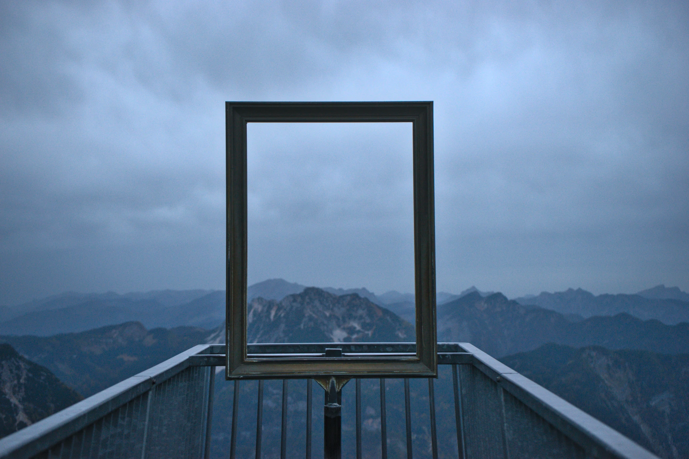
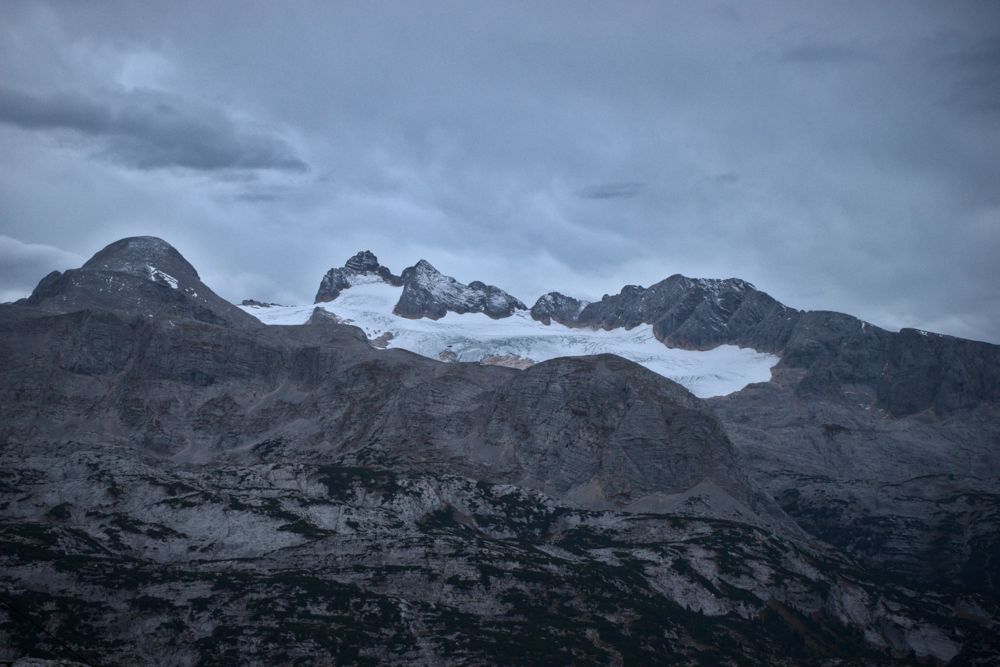
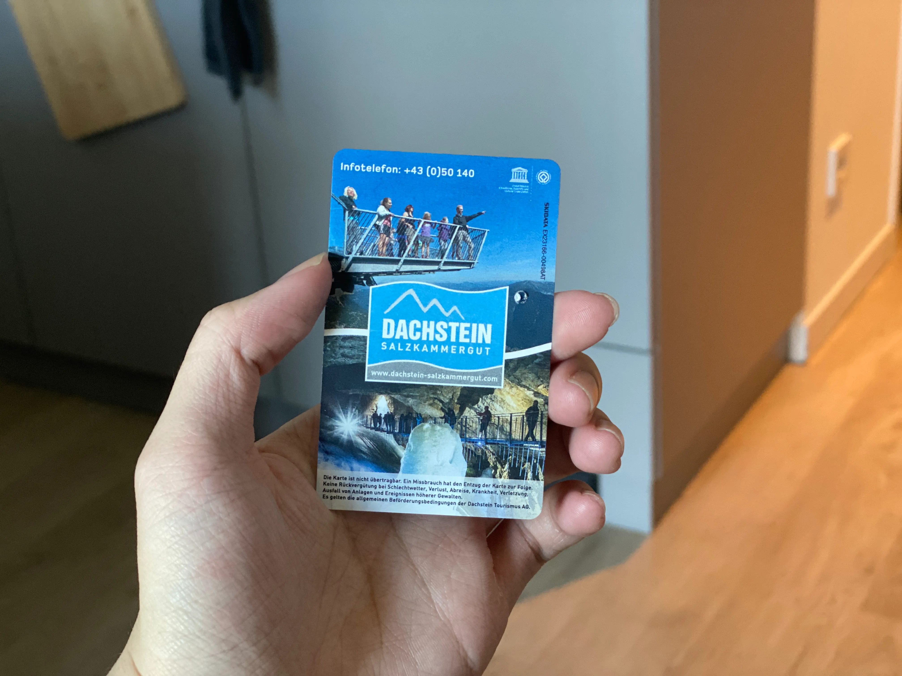
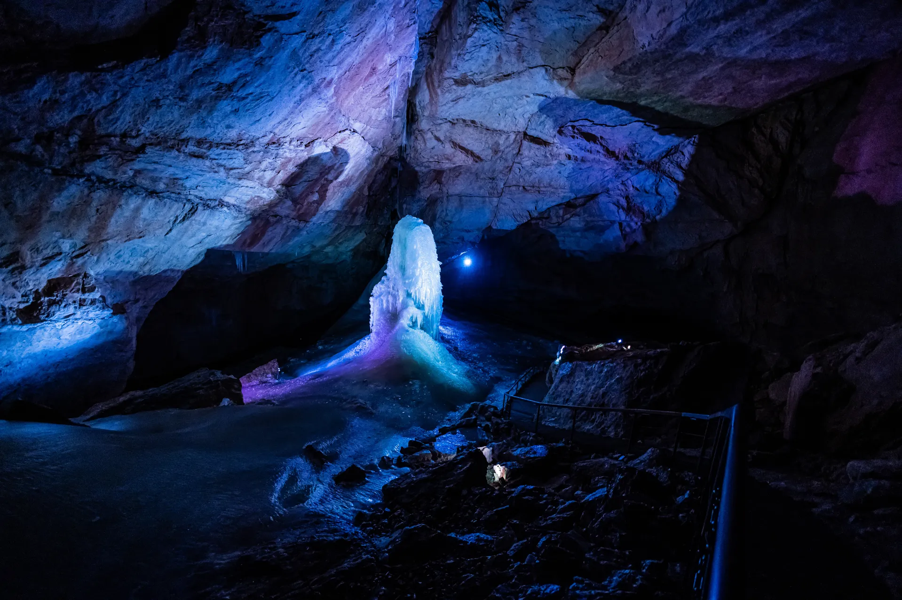
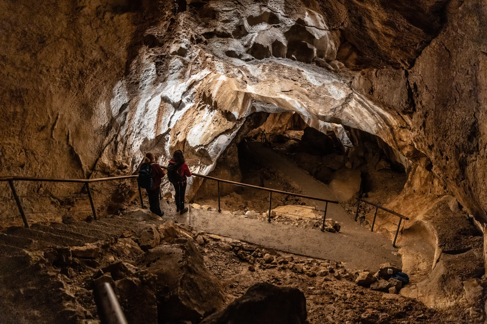
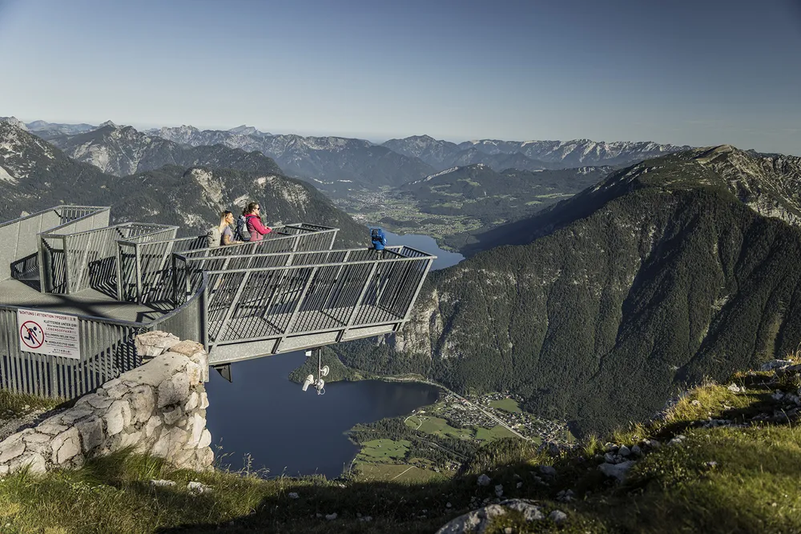
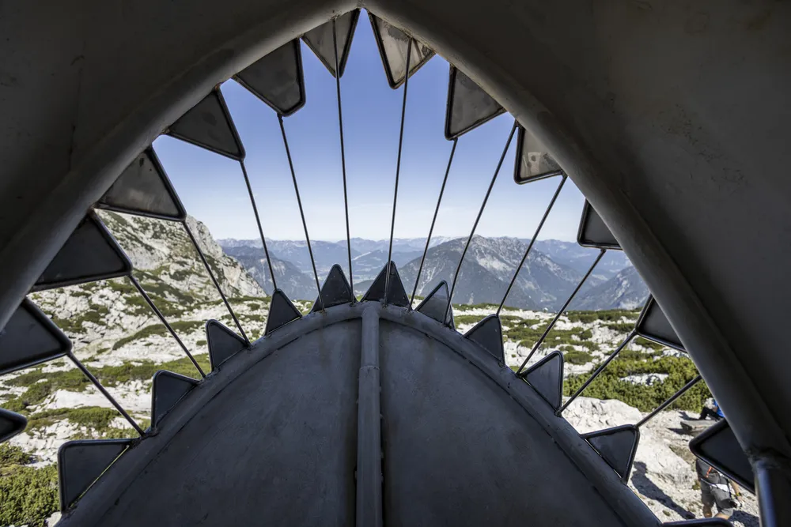
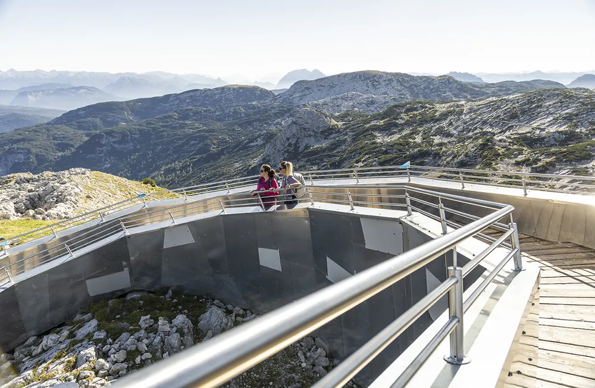
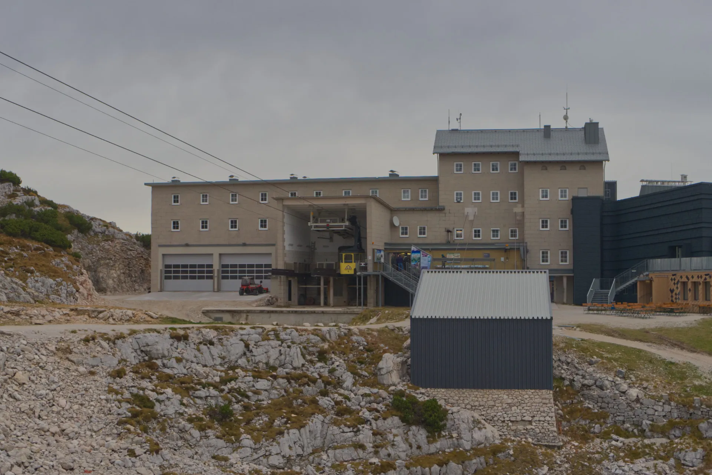

在網路上查詢哈修塔特自由行旅遊景點時，「**五指山**」是不時會出現的名詞。其實，**在哈修塔特並沒有五指「山」，而是只有「五指觀景台（英文：Five Fingers）」**。

五指觀景台是位於哈修塔特上特勞恩（德文：Obertraun）區域的達克斯坦山上（德文：Dachstein）最知名的觀景平台。

> 想要把圖片存下來嗎？**[免費下載哈修塔特地圖＋路線圖](https://exittaiwan.gumroad.com/l/hallstatt)**

因為天晴時視野良好、可以眺望整個哈修塔特湖區、壯闊的阿爾卑斯山脈而聞名。其特殊的設計，往五個角度延伸出去的觀景台就像人的手指而得名。

許多網路上的文章，沒有特別註記的一點是，**會到五指觀景台一遊的人，行程中幾乎一定包含了冰洞和（或）長毛象洞**。

因為要到達達克斯坦山上的五指觀景台，就要[搭乘達克斯坦山的纜車](https://exittaiwan.com/posts/%E9%81%94%E5%85%8B%E6%96%AF%E5%9D%A6%E5%B1%B1%E7%BA%9C%E8%BB%8A%E4%B9%98%E5%9D%90%E6%95%99%E5%AD%B8/)，在纜車第一站轉乘，才能到達纜車第二站，並從第二站健行約 15 分鐘抵達五指觀景台。也就是說，**要到五指觀景台一定會經過纜車第一站，纜車第一站就是冰洞和長毛象洞的所在之處**。

都大費昭彰來到[哈修塔特旅遊](https://exittaiwan.com/posts/%E5%93%88%E4%BF%AE%E5%A1%94%E7%89%B9%E6%97%85%E9%81%8A%E5%85%A8%E6%94%BB%E7%95%A5/)了，建議搭纜車上山的旅客可以選擇至少一個洞穴參加導覽（年紀較大、行動不便的旅客就很可惜不適合了）。

## 五指觀景台開放時間

哈修塔特的五指觀景台幾乎全年開放，不過冬天時可能因為氣候不佳而關閉。

冬季時為確保旅客安全，冰洞和長毛象洞也會在約十一月底至隔年四月底暫停開放導覽，因此春、夏、秋季對於台灣人來說還是最適合到哈修塔特達克斯坦山旅遊的時間。

如果你對於滑雪相當有熱忱，也可以在冬季時到這裡享受阿爾卑斯山的各種滑雪路線。

詳細的全年度開放時間，可以參考達克斯坦山官網的[這個頁面](https://www.dachstein-salzkammergut.com/en/summer/operation-times-summer)。

## 2024 最新版達克斯坦山門票價格和種類

達克斯坦山的門票共有五種，資訊蠻雜亂的，而且又在 2024 做了一些更新，以下詳細為大家介紹，也可以配合[官方網站的購票系統](https://shop.dachstein-salzkammergut.com/en/#type=day-ticket&date=tomorrow&hasPackages=false&hasTickets=true&keyword=adults)一起參考。

<!-- 

推薦在春夏秋季前往的旅客，安排一天的時間，購買第四種「Dachstein Salzkammergut Ticket（兩段纜車＋冰洞**或**長毛象洞＋三項戶外景觀，已包含五指觀景台）」

其實要理解你的門票種類包含什麼，只要看圖示就行：

- 綠色纜車圖案：第一段纜車

- 藍色纜車圖案：第二段纜車

- 橘色纜車圖案：第三段纜車

- 橘色的、三個併排的圖案：三項戶外景觀

- 藍色的、以冰柱或長毛象表示的圖案：冰洞和長毛象洞

-->

### 1：Panorama Ticket（全景票）

Panorama Ticket 顧名思義就是全景（或環景）票。

此票種包含全部三段纜車（**每段路線單次來回搭乘**）、和位於纜車第二站的三個戶外景觀，但**不包含洞穴的參觀票**。

票價約 45 歐元。

### 2：Eis- / Mammuthöhle Ticket（一段纜車＋冰洞**或**長毛象洞票）

**此票卷自 2024 夏季起已停售**。

### 3：Höhlen Kombiticket（一段纜車＋冰洞**和**長毛象洞票）

英文叫 Dachstein Cave Ticket，包含第一段纜車和兩個洞穴門票，**不包含五指觀景台**。

票價約 50 歐元。

### 4：Dachstein Salzkammergut Ticket（兩段纜車＋冰洞**或**長毛象洞票＋三項戶外景觀）

**此票卷自 2024 夏季起已停售**。

### 5：All Inclusive Ticket（全包套票，當天無限次搭乘纜車）

自 2024 起，這種票卷叫 Dachstein All-in-One Ticket。

此票種包含全部三段纜車（**無限次搭乘**）、位於纜車第二站的三個戶外景觀，以及兩個洞穴的參觀票。

票價約 65 歐元。

### 2024 最新票種：Dachstein All in One Ticket Afternoon

自 2024 起推出和 Dachstein All-in-One Ticket 相似的票卷，唯一的不同是 Afternoon Ticket 只能從每日下午 1 點起購買，並且要在下午 2:30 前上山。

票價約 60 歐元。

> **✓ 特別門票折價優惠**\
\
網路上購票達克斯坦山的門票比現場購票會便宜大概一歐元左右，不過現場購買實體票可能會遇到像彩蛋般不定時出現的優惠，所以建議可以直接現場購票，碰碰運氣。\
\
這些優惠都蠻隨機出現的，也有可能購票的當下這些優惠都不適用喔！
> 1. 歐洲各國近年環保意識漸高，在 2023 年造訪達克斯坦山時出示當天購買的公車票（搭乘當地大眾運輸交通工具）有些許折扣。
> 2. 根據網路上其他旅客的經驗，有人曾經出示在哈修塔特的住宿證明，獲取折扣優惠。
<!-- 纜車怎麼搭？這裡有達克斯坦山纜車乘坐教學｜來到哈修塔特旅遊前就摸熟纜車路線！-->

## 和「五指觀景台」一起玩

2024 年前，最受歡迎的票卷是 Dachstein Salzkammergut Ticket，可惜現在已經不再販售。

根據現在的票種，會到五指觀景台的人大部分都會到冰洞和長毛象洞的導覽行程。推薦走得動的人可以直接買整天的 Dachstein All-in-One Ticket，安排一整天的時間將達克斯坦山的戶外景點和兩個洞穴都看完。

至於應該安排先前往洞穴導覽，再到纜車第二站的五指觀景台，還是先到纜車第二站的五指觀景台和其他戶外景觀，再回到纜車第一站的洞穴導覽，每個旅人都有各自的行程考量。

但是因為五指觀景台和其他兩個位在纜車第二站的景觀都是戶外的健行活動，又考量阿爾卑斯山區天氣變化莫測，建議可以參考當天天氣狀況來安排，趁天氣好的時候進行戶外活動。

年紀較長或不喜歡溼冷洞穴的旅客，推薦購買 Panorama Ticket 到山上看一看、輕鬆健行享受慢遊步調。

### 冰洞

冰洞可以說是達克斯坦山除了五指觀景台以外最出名的景點，除了自然形成的奇形怪狀的冰柱外，冰洞中的燈光秀配上音樂也算蠻有趣的。

冰洞全年保持極低的溫度（-2°C），不管外面天氣有多熱，準備要前往的旅客一定要記得帶一件厚外套，洞穴內行程約一小時。

整個行程步調偏快、且有連續的上下樓梯、地面溼滑，請大家要考量自身身體狀況決定是否參加。

### 長毛象洞

很可惜，長毛象洞會叫做長毛象洞的原因並不是這裡曾經挖出長毛象，而是因為這個洞穴巨大的尺寸和多到令人驚豔的地下通道讓人感覺「像長毛象般的令人震驚」。

現今的長毛象洞已有約 70 公里被人類探索，在導覽中我們可以看到其中的 1 公里。

和冰洞一樣，長毛象洞終年保持低溫（3°C），請務必記得帶外套前往造訪，洞穴內總行程約一小時。

### 五指觀景台

五指觀景台是達克斯坦山上最知名的觀景台，用鐵欄杆建造而成，怕高的人鐵定會腳軟，在這裡你可以將阿爾卑斯山脈和湖區景色盡收眼底。

最左邊的平台，還有彷彿畫框的設計，拍照起來有實實在在「風景如畫」的效果。

### 達克斯坦鯊魚

幾百萬年前，達克斯坦山巒曾經在海平面之下，而一種遠古鯊魚——「冰鯊（德文：Eis-Hai）」（並不是冰沙，謝謝。）曾經生活在這裡。

達克斯坦鯊魚的這個觀景台長達八公尺，可以讓旅客走到鯊魚裡面，並從鯊魚的下巴處觀賞達克斯坦山巒一景。

此路線由纜車第二站出發，步行約 40 \~ 50 分鐘可抵達，天氣好時難度低，但有部分需攀爬路段，天氣不好時不建議前往。

### 世界文化遺產螺旋景觀台

世界文化遺產螺旋景觀台，提供絕佳的全景視野，讓旅客一覽世界文化遺產達克斯坦山的風光。

從第二站纜車站走到這裡約 15 \~ 20 分鐘，有時間的旅客可以前往拍個照作紀念。

## 達克斯坦山餐廳

在達克斯坦山上的餐廳選擇少，雖然在山上的纜車站內有時候會有營業中的咖啡廳或是小吃店，但是建議有充足預算和時間的旅客可以在纜車第二站的 [Bergrestaurant Dachstein Krippenstein](https://www.dachstein-salzkammergut.com/en/gastronomy-stay-booking/mountain-restaurant-dachstein-krippenstein) 和 [Lodge am Krippenstein](https://www.lodge.at/restaurant/) 這兩間餐廳做選擇。

當然，你也可以在上山前，先在哈修塔特鎮上的麵包店或是超市先採買糧食。

