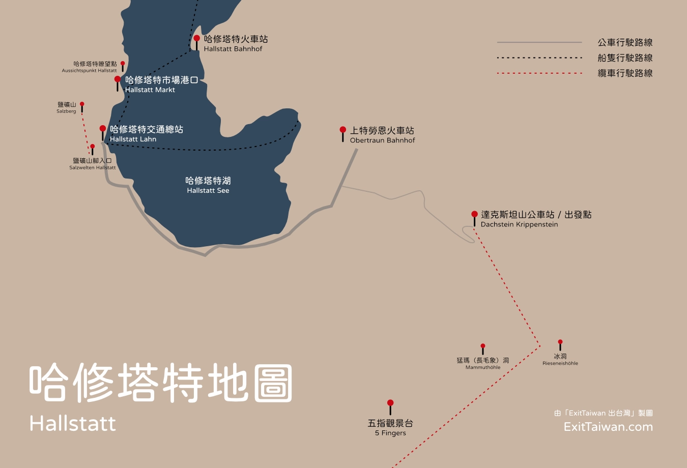

[**Haus Salzberg**](https://www.booking.com/hotel/at/ferienhaus-salzberg.xt.html?aid=7956794&no_rooms=1&group_adults=2)（意譯：鹽礦山旁的房子）是一間位在[**奧地利哈修塔特**](https://exittaiwan.com/posts/%E5%93%88%E4%BF%AE%E5%A1%94%E7%89%B9%E6%97%85%E9%81%8A%E5%85%A8%E6%94%BB%E7%95%A5/)的獨棟民宿，位於哈修塔特鹽礦山旁絕佳的地點、寬敞的室內空間、合理的價位，這間住宿對於要在哈修塔特過夜、深度旅遊的你，是個很不錯的選擇。

小提醒：在 [**Booking.com**](https://www.booking.com/hotel/at/ferienhaus-salzberg.xt.html?aid=7956794&no_rooms=1&group_adults=2) 上，這間住宿叫做 Haus Salzberg，但是在 Googla Maps 上它是標註為 Ferienhaus Salzberg 喔。

## 哈修塔特自由行住宿 Haus Salzberg（Ferienhaus Salzberg）基本資訊

- 地址：Lahnstraße 105, 4830 Hallstatt（[Google Maps](https://maps.app.goo.gl/Kjx9VZepwX9ujWnb9)）
- 交通：從交通總站（Hallstatt Lahn）走路五分鐘可以抵達
- 是否含早餐：無
- 設施：廚房、陽台、基本備品
- 獨立公寓平均**兩晚**價格：約台幣 17,000 元
- 查看即時房價：**[點我前往](https://www.booking.com/hotel/at/ferienhaus-salzberg.xt.html?aid=7956794&no_rooms=1&group_adults=2)**

## Haus Salzberg 實際入住體驗

### 客廳

在哈修塔特的 Haus Salzberg 這間獨棟民宿，裡面有兩個獨立的出租單位：
- 位於地面層的公寓，是一間是單層、可以提供兩人入住的雙人公寓；
- 近鄰在隔壁的則是有三層樓、共有兩間雙人房、可以提供四人入住的公寓。

地面層的單層公寓空間配置和一般的單層公寓沒有太大的差別，因此今天主要就分享多層公寓的入住體驗囉。

進入多層的公寓，一樓空間不大，主要就是讓旅客可以拖鞋、掛外套的玄關，

### 廚房

Haus Salzberg 的兩個出租單位裡面都有提供廚房以及完善的設備。對於想要自己購買食材烹煮的旅客來說非常方便。

要是在哈修塔特的餐廳吃飯發現份量太大，也可以用自己帶的外帶容器打包吃不完的食物，在肚子餓的時候，會到廚房再加熱食用，避免浪費食物喔。

### 房間

多人可入住的這個多層出租單位，裡面有兩間空間都不小的雙人房，兩間房間都位在三樓，窗外的景色很好，住起來相當舒服。

### 廁浴

在多層出租單位的公寓裡，廁浴和客廳、廚房同樣位在二樓，廁浴的空間非常大，裡面也附有洗衣機。另外，廁所和浴室是分開的獨立兩個空間。

除了二樓分開的廁所和浴室之外，在三樓兩個客房中間也有一間小廁所，半夜的時候就不用爬樓梯下去二樓囉。

## 哈修塔特住宿 Haus Salzberg 整體評價

整體來說，Haus Salzberg 是一間在哈修塔特 CP 值還不錯的住宿，整體外觀、設備並不像五星級酒店那樣奢華高貴，反而大量使用木頭的室內裝潢，給人更多的是家庭式溫馨的感覺。

### 哈修塔特住宿 Haus Salzberg 優點

入住 Haus Salzberg，感受到這間住宿最大的優點之一就是空間有夠大！不管是客廳、廚房、臥室、廁浴，都有寬敞舒適的空間活動。其中廚房的設備器具齊全、整潔乾淨，以及廁所是和浴室完全分開的獨立廁所是特別加分的地方。

### 哈修塔特住宿 Haus Salzberg 缺點

Haus Salzberg 最明顯的缺點應該就是熱水的問題了。因為房子歷史久遠，控制水溫的加熱設備需要一段時間才能完成加熱熱水，且儲存量也不是太大，入住時一定要記得在洗澡時盡量節約用水，讓每個同行旅伴都有熱水可以洗澡喔。

另外一個不太算缺點的缺點，是對於搭船來到哈修塔特的人來說，要從下船的市場港口（Hallstatt Markt）到 Haus Salzberg 住宿的位置需要走較長的一段距離，所以入住時的第一趟路和最後一趟路程拖著行李，會感覺距離稍遠。

> 想要把圖片存下來嗎？**[免費下載哈修塔特地圖＋路線圖](https://exittaiwan.gumroad.com/l/hallstatt)**

會說也不太算缺點的原因是，它其實和交通總站（Hallstatt Lahn）距離走路只有三到五分鐘而已，所以有排行程要前往上特勞恩（Obertraun），也就是達克斯坦山（Dachstein）的所在地，健行觀光冰洞、長毛象洞、五指觀景台等，其實是相當方便走到交通總站搭乘 543 號公車。

### 哈修塔特住宿 Haus Salzberg 評價

整體來說，我會給 [**Haus Salzberg**](https://www.booking.com/hotel/at/ferienhaus-salzberg.xt.html?aid=7956794&no_rooms=1&group_adults=2) 滿分 10 分中 8 分的分數，除了房子太老舊偶爾會沒熱水、還有要爬一點樓梯比較不方便以外，我會推薦 Haus Salzberg 給預算中上的旅客。

如果是和家中行動較不方便的長輩兩人一起出來遊玩，別忘了在訂房時要選擇地面層的雙人公寓，才不需要爬樓梯喔。

### 入住哈修塔特 Haus Salzberg 小提醒

沒意外的話，入住 Haus Salzberg 時應該是自助 check-in。在入住日期接近時，房子的主人會透過 Booking.com 傳送入住相關訊息，裡面包含了當天可以開啟門口鑰匙密碼箱的密碼，把密碼轉正確了之後，應該就可以打開密碼箱，拿取鑰匙囉。

另外在 check-out 之後這邊沒有提供室內寄放行李的服務，不過房子主人告訴我們，可以直接把大件行李放在後門有遮棚的室外區域，也沒有人會來偷，只要記得貴重物品還是隨身帶著就行！

