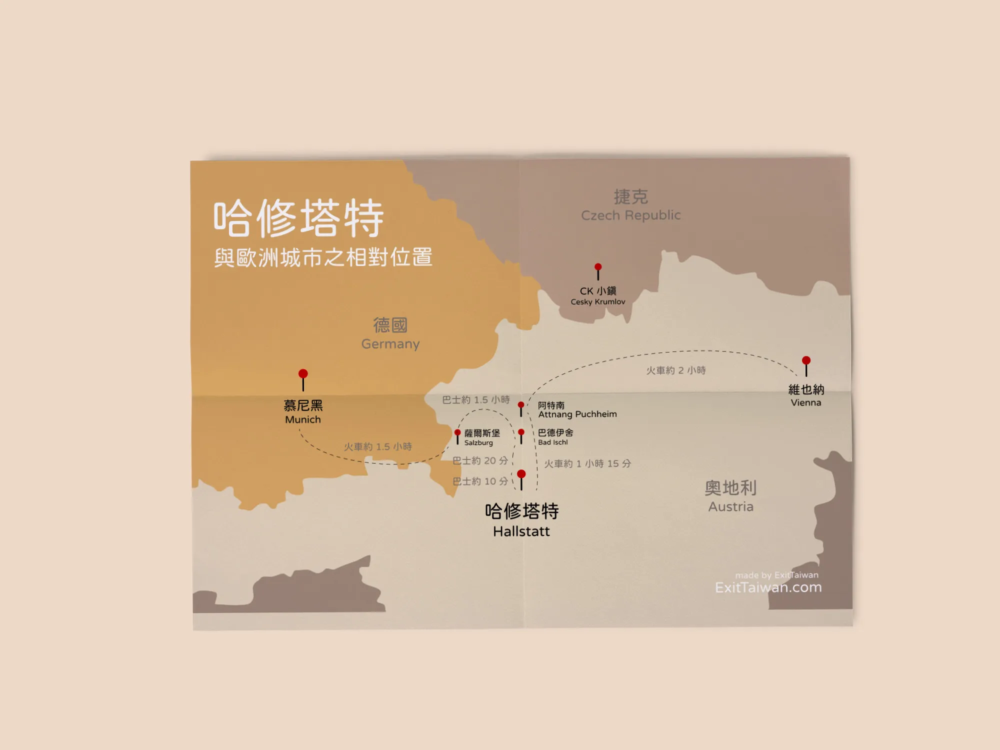
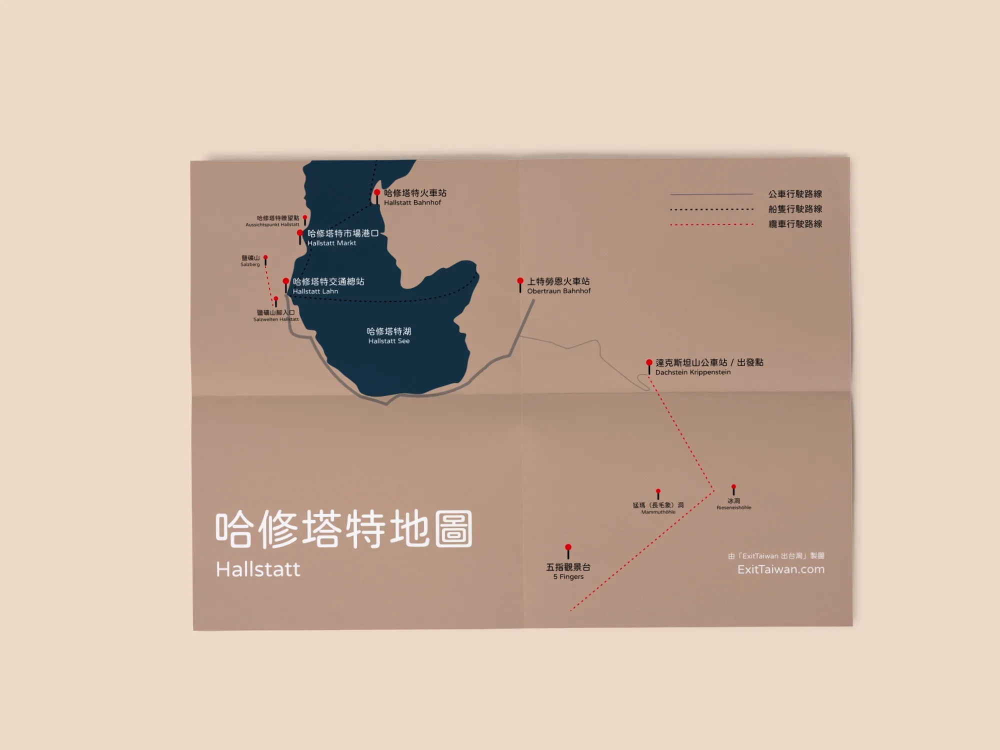
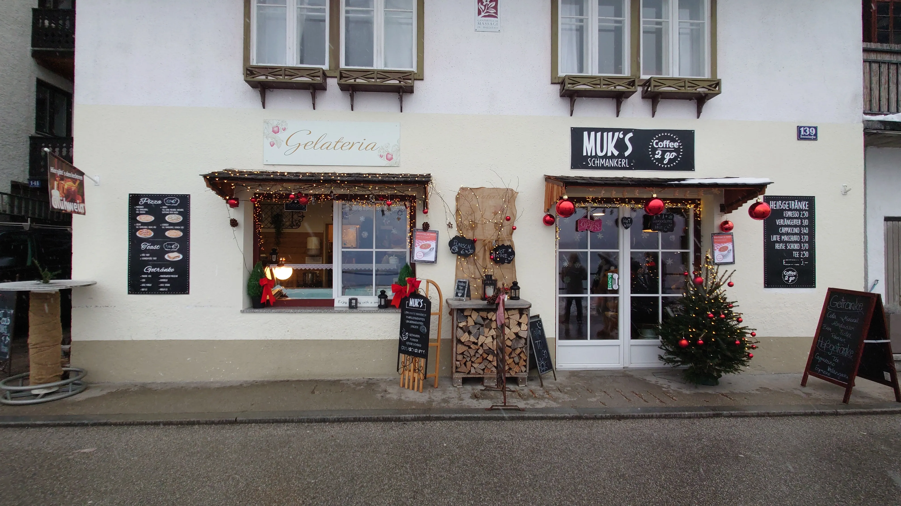

如果要說歐洲哪些旅遊景點「風景如畫」，答案肯定少不了哈修塔特了！

哈修塔特（Hallstatt）是一個位在奧地利中部的小鎮。它在 1997 年被聯合國列入世界文化遺產，其中達克斯坦山（德文：Dachstein）和鹽礦區（德文：Salzkammergut）更是[在 UNESCO 的介紹中](https://whc.unesco.org/en/list/806)被特別點名。

身為世界上最多人造訪的城市之一，要怎麼玩的過癮可是一門學問，事前先做好功課，才不會好不容易千里迢迢到了這座美麗的小鎮，卻玩得不盡興啊！

在這篇文章，你會了解怎麼從其他歐洲城市到哈修塔特的交通方式、哈修塔特的住宿、還有一些景點和餐廳。

**文章目錄**：
- [**哈修塔特自由行怎麼玩**](#哈修塔特自由行怎麼玩)
- [**哈修塔特自由行交通**](#哈修塔特自由行交通)
- [**哈修塔特自由行景點**](#哈修塔特自由行景點)
- [**哈修塔特自由行住宿**](#哈修塔特自由行住宿)
- [**哈修塔特自由行餐廳**](#哈修塔特自由行餐廳)

## 哈修塔特自由行怎麼玩？

### 哈修塔特自由行旅遊季節

夏天是歐洲的旅遊旺季，如要避免過多人潮，可以照著[國家地理雜誌](https://www.nationalgeographic.com/travel/article/a-weekend-in-hallstatt-fairy-tale-town)的推薦，在十月時來到這裡觀光，這時候的氣溫也算舒適宜人。

有些人選擇在冬天時來賞雪景，雖然冷，但觀光客少，旅遊品質較高。如果怕冷可以在 4 ~ 5 月時前往，這時可說是人不會到太多、氣溫也剛剛好的天氣。

### 哈修塔特自由行停留天數

要安排來到哈修塔特自由行旅遊的人，強烈建議在這裡住宿兩晚以上。如果你只是想走馬看花、跑越多景點越好，那你當然可以參加從薩爾斯堡出發的一日遊旅行團、或是從維也納出發的一日遊旅行團。

如果你想要好好的享受這個美麗的小鎮和其自然風光，打算去鹽礦洞、冰洞、五指觀景台等一探究竟，那麼一天的時間是不可能足夠的！**停留三到五天大概會是最適合的安排**。

## 哈修塔特自由行交通

要到哈修塔特除了自駕和跟旅行團之外，還有兩種交通方式：火車和巴士。

在詳細了解怎麼搭乘火車或巴士到哈修塔特之前，先看看這張圖來大致瞭解一下哈修塔特的地理位置，以及哈修塔特和車站、城市間的相對位置，可以幫助你之後快速對照，並在旅程中減少迷失方向的機會！

> 想要把圖片存下來嗎？**[免費下載哈修塔特地圖＋路線圖](https://exittaiwan.gumroad.com/l/hallstatt)**

### 火車

不論你是從[**奧地利首都維也納**](https://exittaiwan.com/posts/%E7%B6%AD%E4%B9%9F%E7%B4%8D%E8%87%AA%E7%94%B1%E8%A1%8C%E6%97%85%E9%81%8A%E5%85%A8%E6%94%BB%E7%95%A5/)、莫札特的故鄉薩爾斯堡、或是德國的大城市慕尼黑，只要你是搭乘火車前往，並且購買目的地是哈修塔特的車票，八九成你都會在一個叫做 Attnang Puchheim（阿特南）的車站轉車。

從阿特南（Attnang Puchheim）到哈修塔特火車站（Hallstatt Bahnhof）車程大約是一小時四十五分鐘。

到了哈修塔特火車站後，要到哈修塔特鎮上，只要順著人潮走路三分鐘到港口，用**歐元現金購買來回船票**就可以搭船抵達囉，來回票價於 2024 年時為 €7。

這邊的來回火車和船班都有特別配合，所以只要提前算好搭船或是搭火車的時間，都能銜接的上，不太需要擔心會錯過班次。

**搭火車前往哈修塔特總車程時間**

- 從薩爾斯堡出發：兩個半小時
- 從維也納出發：四小時
- 從慕尼黑出發：四小時

### 巴士

要搭乘巴士前往哈修塔特的話，最常見的路線是**從薩爾斯堡出發**。

搭乘巴士從薩爾斯堡到哈修塔特要**轉乘兩次巴士，總共三趟車才會抵達**，總車程（含轉車時間）約兩個小時十五分鐘，以下是詳細說明：

#### 一、首先，搭乘 150 號巴士到 Bad Ischl

在薩爾斯堡主火車站的公車站，找到 150 號巴士的月台，巴士螢幕顯示前往 Bad Ischl （巴德伊舍）站，車程約一個半小時。

#### 二、接著，轉乘 542 號巴士到 Gosaumühle

在 Bad Ischl 車站，大概有 20 分鐘的時間轉乘 542 號巴士。

尋找**終點站為 Gosausee** 的 542 號巴士，並搭乘該巴士到 Gosaumühle，車程約 20 分鐘。

注意！在 Gosaumühle 這站要跟著大部分的人下車（大部分搭這班車的人都是要去哈修塔特的），不要搭到終點站 Gosausee 去了！

#### 三、最後，轉乘 543 號巴士前往哈修塔特交通總站

在 Gosaumühle，你有大約 5 分鐘的轉車時間搭乘隔壁的 543 號巴士。

車程約十分鐘後，你就會抵達哈修塔特的交通總站（Hallstatt Lahn）了！

> **[點我免費下載 150、542、543 號巴士時間路線表](https://exittaiwan.gumroad.com/l/hallstatt)**

如果你是走這個路線的話，可以在薩爾斯堡火車站 / 公車站直接跟司機購買車票，**單程車票是 15€，現金支付，來回的話就是 30€**，不過隨著歐洲經濟變動，票價也有可能上漲、或是偶爾有優惠票可以購買，旅客在這方面要保持一些彈性。

更詳細的資訊可以參考這個英文網站：[BigBoyTravel](https://www.bigboytravel.com/europe/austria/hallstatt/gettingtohallstatt/)。

## 哈修塔特自由行景點

1. 教堂瞭望點
2. 世界上最古老鹽礦坑 Salzberg
3. 達克斯坦山（纜車、冰洞、長毛象洞、五指觀景
台）Dachstein

來到哈修塔特，除了在小鎮以及湖畔漫步，有寬裕時間的旅客通常都會安排更多行程，像是到世界上最古老的鹽礦坑探險、或是到達克斯坦山上登山、冰洞探險、或是一探究竟長毛洞穴。

網路上對於哈修塔特小鎮內的交通資訊繁雜不完整，這邊特別做一張地圖讓大家可以了解一些重要的地點和地點之間的相對方位。

> 想要把圖片存下來嗎？**[免費下載哈修塔特地圖＋路線圖](https://exittaiwan.gumroad.com/l/hallstatt)**

從地圖中可以看到，如果是**坐火車到哈修塔特火車站（Hallstatt Bahnhof），一定要搭船才會抵達小鎮**。

不過如果你是**住在達克斯坦山附近（上特勞恩地區）的住宿，你就應該搭火車到上特勞恩火車站**（Obertraun Dachsteinhöhlen Bahnhof）再下車。

從哈修塔特鎮上要到達克斯坦山的話，可以在 Hallstatt Lahn（哈修塔特交通總站）搭 543 號公車；從上特勞恩過去達克斯坦山也是搭 543 號公車可以抵達。

而從上特勞恩要到哈修塔特鎮上的話，可以在 Obertraun Bahnhof（上特勞恩火車站）搭乘 544 號公車，十分鐘內就會到達哈修塔特交通總站。

543 和 544 號公車都可以上車和司機買票，成人的一日票是 5€，現金付款。

### 教堂瞭望點

到了哈修塔特，當然不能錯過這個機會，自己來拍下一張跟最有名的明信片一模一樣的照片啦！

只要天還是亮的時候，通常都蠻多人會在這裡攝影拍照，想要避開人潮，最好的方式就是企個大早來這裡拍照順便看日出。

畫面中的路德教堂坐落在下船後的港口旁邊，如果路過時剛好有開放，也可以進去參觀看看喔！

- 瞭望點地址：Gosaumühlstraße 67, 4830 Hallstatt（[Google Maps](https://www.google.com/maps/place/Panoramic+Viewpoint+-+Hallstatt/@47.564563,13.648385,17.63z/data=!4m6!3m5!1s0x47713612846fe77d:0xde080447d6d64c5d!8m2!3d47.5645953!4d13.6499746!16s%2Fg%2F11b7fy75jx?authuser=0&entry=ttu)）
- 路德教堂地址：Landungspl. 101, 4830 Hallstatt（[Google Maps](https://www.google.com/maps/place/Evangelische+Pfarrkirche+Hallstatt/@47.5626924,13.6486115,18.14z/data=!3m1!5s0x47713612aee8d927:0x2b6a4c8df864336a!4m6!3m5!1s0x4771366d4f25b527:0xdf07f8a849ea4dc1!8m2!3d47.5627745!4d13.6494778!16s%2Fg%2F1hc0gyzz1?authuser=0&entry=ttu)）
- 交通：從市場港口步行五分鐘可以抵達瞭望點

備註：拍完了幾張滿意的相片，也別忘了繼續往深處走、往上走、往下走，其實到處都可以找到很棒的角度來拍攝哈修塔特的風光！

### 世界上最古老鹽礦坑 Salzberg

哈修塔特擁有世界上最古老鹽礦坑，**[Salzwelten](https://www.salzwelten.at/en)** （意譯：鹽的世界）是提供鹽礦導覽的公司。在哈修塔特時間充足的人，可以參加這個鹽礦導覽，體驗換工裝、溜礦坑滑梯、搭礦車（視情況），同時了解鹽礦的歷史等等。

Salzwelten 這間導覽公司在薩爾斯堡、哈修塔特、Altaussee 都有，不過目前看起來哈修塔特還是最熱門的據點。

- 地址：Salzbergstraße 21, 4830 Hallstatt（[Google Maps](https://www.google.com/maps/place/Salzwelten+Hallstatt/@47.5560491,13.6350214,15z/data=!3m1!4b1!4m6!3m5!1s0x477137920f69d83f:0x829468b9c34ece69!8m2!3d47.5560496!4d13.6453211!16s%2Fg%2F11gy9t8x1p?authuser=0&entry=ttu)）
- 交通：從哈修塔特交通總站（Hallstatt Lahn）步行五分鐘可以抵達山腳售票處
- 開放時間：早上 9 : 30 至下午，根據季節有所變動
- 票價（包含上下山纜車，以及鹽礦洞導覽）：成人（16 歲以上）：€40｜兒童（4 到 15 歲）：€20

備註：
1. 更多不同票價組合（如不包含纜車、只有上下山纜車無導覽等）可以參考[官方網站的票價頁面](https://www.salzwelten.at/en/hallstatt/prices-opening-hours#CoronaLockdownInfoEN)。你可以在網站上購票，也可直接在現場購票，如果怕售完建議可以先在線上購買。
2. 搭纜車上山之後只有一間餐廳，叫做 [Rudolfsturm](https://www.google.com/maps/place/Rudolfsturm/@47.5603351,13.6416652,16z/data=!4m6!3m5!1s0x47713673092d05dd:0x4bdb1683723b246d!8m2!3d47.5611321!4d13.6431646!16s%2Fg%2F122r2h6d?entry=ttu)，食物尚可。餐廳旁邊有隨時都大排長龍的[拍照點](https://www.google.com/maps/place/Panoramic+Viewpoint+-+Hallstatt+Skywalk/@47.5603351,13.6416652,16z/data=!4m6!3m5!1s0x47713750cd22baab:0x498d659cb5eb2ae2!8m2!3d47.5613198!4d13.6436144!16s%2Fg%2F11fj8f6105?entry=ttu)。
3. 參加導覽的人，進入洞穴後溫度較低，建議穿著羽絨衣。

### 達克斯坦山 Dachstein

對於登山、健行、洞穴探險的愛好者來說，位在 Obertran（上特勞恩）的 Dachstein（達克斯坦山）幾乎是天堂。

從山腳的 [Dachstein Krippenstein](https://www.google.com/maps/place/Dachstein+Krippenstein/@47.5401418,13.7025419,14.75z/data=!4m6!3m5!1s0x477137bcff895a83:0xc4f0af0d1f6f88e!8m2!3d47.548288!4d13.705221!16s%2Fg%2F120zztrg?entry=ttu) 達克斯坦山出發點可以購票，並決定當天的行程。

這裡有分不同的纜車票、和不同的景點票。

達克斯坦山共有三段纜車，**上山的第一個纜車站是冰洞或是長毛象洞（Mammut 猛瑪象，又稱長毛象）的所在地**。

你可以...
1. 從出發點搭乘一段纜車
2. 或是搭到第二站結束五指觀景台的行程後，從第二站往下搭乘一段纜車到第一站

從第一站纜車走路約 20 ~ 30 分鐘抵達冰洞或是長毛象洞（Mammut 猛瑪象，又稱長毛象）。

搭兩段纜車到第二站纜車站，可以健行約半小時到達 [5 Fingers](https://www.google.com/maps/place/5+Fingers/@47.528612,13.6920417,14z/data=!4m6!3m5!1s0x477137130be183b5:0xde697ea5a3c25143!8m2!3d47.528612!4d13.6920417!16s%2Fm%2F06zjqsc?entry=ttu)，也就是五指觀景台。

**票價和行程種類：**

1. ~~**第一種**：三段纜車 + 3 項戶外免費景觀（包含五指觀景台）~~
2. ~~**第二種**：一段纜車 + 冰洞**或**猛瑪洞~~
3. ~~**第三種**：二段纜車 + 冰洞 + 猛瑪洞~~
4. ~~**第四種**：二段纜車 + 冰洞**或**猛瑪洞 + 3 項戶外免費景觀（包含五指觀景台）~~
5. ~~**第五種**：三段纜車 + 冰洞 + 猛瑪洞 + 3 項戶外免費景觀（包含五指觀景台）~~

自 2024 夏季起，票卷種類已更新，以下簡單介紹，更詳細的資訊可以到[**哈修塔特五指觀景台旅遊全攻略**](https://exittaiwan.com/posts/哈修塔特五指觀景台旅遊全攻略/)這篇文章內看喔。

1. Panorama Ticket（全景票）：三段纜車＋3 項戶外免費景觀（包含五指觀景台）
2. Höhlen Kombiticket：第一段纜車和兩個洞穴門票，**不包含五指觀景台**。
3. All Inclusive Ticket：三段纜車（**無限次搭乘**）、位於纜車第二站的三個戶外景觀，以及兩個洞穴的參觀票
4. Dachstein All in One Ticket Afternoon：和 Dachstein All-in-One Ticket 相似的票卷，唯一的不同是 Afternoon Ticket 只能從每日下午 1 點起購買，並且要在下午 2:30 前上山。

對於登山愛好者，可以搭乘三段纜車認真爬山，走難度更高的路線。

為了確保旅客安全，冰洞和猛瑪洞每年只在 5 月到 11 月，開放，如果你是在冬天來到達克斯坦山，洞穴應該是關閉的狀態，但是取而代之的活動是滑雪！

- 出發點地址：Winkl 34, 4831 Obertraun（[Google Maps](https://www.google.com/maps/place/Dachstein+Krippenstein/@47.5461168,13.6609864,13.89z/data=!4m14!1m7!3m6!1s0x477137bcff895a83:0xc4f0af0d1f6f88e!2sDachstein+Krippenstein!8m2!3d47.548288!4d13.705221!16s%2Fg%2F120zztrg!3m5!1s0x477137bcff895a83:0xc4f0af0d1f6f88e!8m2!3d47.548288!4d13.705221!16s%2Fg%2F120zztrg?entry=ttu)）
- 交通：從 Hallstatt Lahn（哈修塔特交通總站）搭乘 543 號公車，約半小時會抵達；從 Obertran（上特勞恩）搭乘 544 號公車約十分鐘可以抵達
- 開放時間：第一趟上山纜車約在早上 9：00，最後下山纜車時間根據季節有所變動，更多資訊請見[官方網站](https://www.dachstein-salzkammergut.com/en)
- 票價：根據不同行程，成人票價每人從 40€ ~ 65€ 左右

備註：
1. 請自行留意上下山纜車時間。
2. 達克斯坦山天候不穩定，請依照自身狀況彈性調整安排旅程。
3. 參加冰洞及長毛象洞導覽，會在第一段纜車站進行導覽時間預約。行動比較緩慢的人可以預留多一點（半小時以上）時間。
4. 冰洞以及長毛象洞的洞穴內溫度較低，尤其冰洞可低到零下，務必要帶足保暖衣服。
5. 洞穴內需要爬很多階梯，來之前可以先多走路練好體力。

<!-- link to Dachstein 遊記（詳細說明） -->

## 哈修塔特自由行住宿

說到[**哈修塔特的住宿**](https://www.booking.com/searchresults.xt.html?city=-1979686&aid=7956794&no_rooms=1&group_adults=2)，只有一個建議：**能儘早訂就儘早訂**。因為大量的觀光客，哈修塔特的住宿價格非常之高，也不用期望離旅遊越近可能會有空房，所以房價會下跌這種狀況發生，跟你說，就是不會，別再等了！

挑選哈修塔特的住宿時，主要可以考量兩件事：

1. **要住在哈修塔特小鎮裡，還是湖的對岸（達克斯坦山腳）？**
2. **如果住在小鎮裡，可以接受離港口多遠的距離？**

住在哈修塔特小鎮裡，可以輕易的搭乘公車到各個景點，也離餐廳、麵包店等店舖距離較近，但同時住宿價格比起湖的對岸高出許多。

住在湖的對岸雖然行動和覓食上的自由少了一點，但是根據網路上有經驗的人表示，反而可以看到整個小鎮的樣貌。除此之外，這邊不只人潮較少因此更幽靜，住宿的價位上也比起小鎮便宜許多。

以下是精心挑選後，推薦你幾間評價最高的哈修塔特住宿選擇。第一到第七間都是為在哈修塔特小鎮中心或附近；最後三間則是為在達克斯坦山腳附近。

如果你不想自己煩惱，也可以[**花三分鐘填寫表單**](https://l.exittaiwan.com/hallstatt)，讓我們**免費**根據你的行程時間和預算，推薦最適合你的哈修塔特住宿。

> 以下房價皆是哈修塔特春季時房價，可能因季節而上升或下降。

### 哈修塔特推薦住宿一｜Fenix Hall Hallstatt

**[Fenix Hall Hallstatt](https://www.booking.com/hotel/at/fenix-hall.xt.html?aid=7956794&no_rooms=1&group_adults=2)** 位在礦坑景點附近，距離交通總站也只需走路五分鐘。旅館員工親切、並且房價包括評價很好的早餐，非常適合夫妻、情侶兩人一同前往入住。

#### Fenix Hall Hallstatt 基本資訊

- 地址：Lahnstraße 41-42, 4830 Hallstatt（[Google Maps](https://www.google.com/maps/place/Fenix+Hall+Hallstatt/@47.5543267,13.6474267,17z/data=!4m21!1m11!3m10!1s0x4771366fa65542fb:0xa195b52448fa258e!2sFenix+Hall+Hallstatt!5m2!4m1!1i2!8m2!3d47.5543587!4d13.6475351!10e5!16s%2Fg%2F11c1tjsn8k!3m8!1s0x4771366fa65542fb:0xa195b52448fa258e!5m2!4m1!1i2!8m2!3d47.5543587!4d13.6475351!16s%2Fg%2F11c1tjsn8k?authuser=2&entry=ttu)）
- 交通：從交通總站（Hallstatt Lahn）走路五分鐘可以抵達
- 是否含早餐：含有評價高的早餐
- 設施：基本備品
- 雙人房平均每晚價格：約台幣 9,000 元
- 查看即時房價：**[點我前往](https://www.booking.com/hotel/at/fenix-hall.xt.html?aid=7956794&no_rooms=1&group_adults=2)**

<!-- <https://www.booking.com/hotel/at/fenix-hall.xt.html?aid=7956794&no_rooms=1&group_adults=2> -->

### 哈修塔特推薦住宿二｜Lakeside Apartments Hallstatt

[**Lakeside Apartments Hallstatt**](https://www.booking.com/hotel/at/hallstatt-lakeside-top-5.xt.html?aid=7956794&no_rooms=1&group_adults=2) 就位於湖邊，距離交通總站（Hallstatt Lahn）走路不用三分鐘，地理位置非常方便。

這裡的房間附有陽台，從陽台看出去，湖景一覽無遺。浪漫的氛圍很適合兩人旅遊的情侶、夫妻入住。

#### Lakeside Apartments Hallstatt 基本資訊

- 地址：Seelände 173, 4830 Hallstatt（[Google Maps](https://www.google.com/maps/place/Lakeside+Apartments+Hallstatt/@47.5556654,13.6468009,17.43z/data=!4m6!3m5!1s0x477137692b33b063:0xc31b69120de804f4!8m2!3d47.5562902!4d13.6481876!16s%2Fg%2F11h1kk2ndw?authuser=2&entry=ttu)）
- 交通：從交通總站（Hallstatt Lahn）走路三分鐘可以抵達
- 是否含早餐：無
- 設施：陽台、基本備品
- 雙人房平均每晚價格：約台幣 8,000 元
- 查看即時房價：**[點我前往](https://www.booking.com/hotel/at/hallstatt-lakeside-top-5.xt.html?aid=7956794&no_rooms=1&group_adults=2)**

<!-- <https://www.booking.com/hotel/at/hallstatt-lakeside-top-5.xt.html?aid=7956794&no_rooms=1&group_adults=2> -->

### 哈修塔特推薦住宿三｜Ferienhaus Salzberg

在 **[Booking.com](https://www.booking.com/hotel/at/ferienhaus-salzberg.xt.html?aid=7956794&no_rooms=1&group_adults=2)** 上 Ferienhaus Salzberg 的物件名稱叫做 Haus Salzberg。

**[Ferienhaus Salzberg](https://www.booking.com/hotel/at/ferienhaus-salzberg.xt.html?aid=7956794&no_rooms=1&group_adults=2)** 位在礦坑景點附近，距離交通總站同樣是走路五分鐘的距離。這棟小屋裡面有兩套獨立的出租公寓，如果有四人以上的團體、或是兩個家庭一起同行旅遊，非常適合入住這間住宿。

雖然 Haus Salzberg 並沒有供應早餐，不過有廚房和完備的器具可以住客供烹飪下廚。唯一的缺點可能是房子屋齡較老，所以使用熱水洗澡時要盡量節約用水，或是一天中不同時間洗澡，以免洗到冷水澡囉。這是親身住過才知道的體驗，也許其他住宿也都是老房子也都有這個問題。

另外，要訂購這間住宿必須要至少入住兩晚才能預訂，如果只待一晚的旅客，只能跟這間評價接近滿分的住宿說再見了！

#### Ferienhaus Salzberg 基本資訊

- 地址：Lahnstraße 105, 4830 Hallstatt（[Google Maps](https://www.google.com/maps/place/Haus+Salzberg/@47.5536107,13.6448565,17z/data=!3m1!4b1!4m6!3m5!1s0x4771366f763faaab:0x6daca6cecbd49cd1!8m2!3d47.5536107!4d13.6474314!16s%2Fg%2F11c1v1cfld?entry=ttu)）
- 交通：從交通總站（Hallstatt Lahn）走路五分鐘可以抵達
- 是否含早餐：無
- 設施：廚房、陽台、基本備品
- 獨立公寓平均**兩晚**價格：約台幣 17,000 元
- 查看即時房價：**[點我前往](https://www.booking.com/hotel/at/ferienhaus-salzberg.xt.html?aid=7956794&no_rooms=1&group_adults=2)**

想看 Haus Salzberg 更詳細的介紹，可以[**點我查看遊記 →**](https://exittaiwan.com/posts/%E5%93%88%E4%BF%AE%E5%A1%94%E7%89%B9%E4%BD%8F%E5%AE%BF%E6%8E%A8%E8%96%A6-haus-salzberg/)

<!-- <https://www.booking.com/hotel/at/ferienhaus-salzberg.xt.html?aid=7956794&no_rooms=1&group_adults=2> -->

### 哈修塔特推薦住宿四｜**Pension Cafe zum Mühlbach**

**[Pension Cafe zum Mühlbach](https://www.booking.com/hotel/at/cafe-restaurant-zum-muhlbach.xt.html?aid=7956794&no_rooms=1&group_adults=2)** 位於哈修塔特小鎮的中心地帶，從市場港口下船後走路五分鐘就能抵達，非常方便。比較特別的是這間住宿除了雙人房，也有提供單人房的選擇，對於有預算的背包客、獨旅旅行者來說也蠻方便的。

需要特別注意的是，這間住宿在 **[Booking.com](https://www.booking.com/hotel/at/cafe-restaurant-zum-muhlbach.xt.html?aid=7956794&no_rooms=1&group_adults=2)** 上有接近一千則、總分十分有高達 9.1 分的高評價，但是在 Google Maps 上總分 5 分只有不到 4 分的分數，不過大多數的負評似乎是針對咖啡廳，而非住宿本身，可以斟酌看看。

#### Pension Cafe zum Mühlbach 基本資訊

- 地址：Oberer Marktpl. 53, 4830 Hallstatt（[Google Maps](https://www.google.com/maps/place/Cafe+Restaurant+zum+M%C3%BChlbach/@47.5622275,13.6480198,18z/data=!3m1!4b1!4m10!3m9!1s0x4771366d5108c88b:0xb52b926b16046fb1!5m3!1s2024-02-21!4m1!1i2!8m2!3d47.5622275!4d13.6487687!16s%2Fg%2F11b6dcx6v4?authuser=2&entry=ttu)）
- 交通：從市場港口（Hallstatt Markt）走路五分鐘可以抵達
- 是否含早餐：無，可詢問加購
- 設施：基本備品
- 雙人房平均每晚價格：約台幣 8,000 元
- 查看即時房價：**[點我前往](https://www.booking.com/hotel/at/cafe-restaurant-zum-muhlbach.xt.html?aid=7956794&no_rooms=1&group_adults=2)**

<!-- <https://www.booking.com/hotel/at/cafe-restaurant-zum-muhlbach.xt.html?aid=7956794&no_rooms=1&group_adults=2> -->

### 哈修塔特推薦住宿五｜I da Mitt

[**I da Mitt**](https://www.booking.com/hotel/at/i-da-mitt.xt.html?aid=7956794&no_rooms=1&group_adults=2) 是一間具有超過百年歷史的房子。原本是屋主父母留下的老房子，在 2021 年經過八個月的翻修後，化身成為哈修塔特廣場上一間有故事的住宿。

從市場港口（Hallstatt Markt）走到這裡只要三分鐘，就位在哈修塔特小鎮的中心。位置方便、房價包含評價很高的早餐、房內空間寬大、以及房子本身的故事都讓 I da Mitt 成為一間哈修塔特首選的住宿。

#### I da Mitt 基本資訊

- 地址：Marktpl. 45, 4830 Hallstatt（[Google Maps](https://www.google.com/maps/place/I+da+Mitt/@47.5624794,13.6388307,15z/data=!3m2!4b1!5s0x4771366d4ec85c6f:0xe8f0d05ee35ff7c6!4m10!3m9!1s0x4771366d4dab3597:0x894cdeff44717571!5m3!1s2024-02-21!4m1!1i2!8m2!3d47.5624799!4d13.6491304!16s%2Fg%2F11llb7lh_5?authuser=2&entry=ttu)）
- 交通：從市場港口（Hallstatt Markt）走路三分鐘可以抵達
- 是否含早餐：含有評價高的早餐
- 設施：基本備品
- 雙人房平均每晚價格：約台幣 8,000 元
- 查看即時房價：**[點我前往](https://www.booking.com/hotel/at/i-da-mitt.xt.html?aid=7956794&no_rooms=1&group_adults=2)**

<!-- <https://www.booking.com/hotel/at/i-da-mitt.xt.html?aid=7956794&no_rooms=1&group_adults=2> -->

### 哈修塔特推薦住宿六｜**Seehotel Grüner Baum**

**[Seehotel Grüner Baum](https://www.booking.com/hotel/at/seehotel-gruner-baum.xt.html?aid=7956794&no_rooms=1&group_adults=2)** 位於哈修塔特鎮中心，倚靠在湖岸旁，是一間已經有三百多年歷史的四星級飯店。

附設有陽台的房間看出去就是湖景，住在湖景第一排，價格自然稍高，因此適合預算充足的旅客入住。

#### Seehotel Grüner Baum 基本資訊

- 地址：Marktpl. 104, 4830 Hallstatt（[Google Maps](https://www.google.com/maps/place/Seehotel+Gr%C3%BCner+Baum/@47.5623686,13.6485592,18.2z/data=!4m10!3m9!1s0x4771366d4b03438b:0x26aa9009ab6f5a23!5m3!1s2024-02-21!4m1!1i2!8m2!3d47.5624666!4d13.6496423!16s%2Fg%2F1tj4xj71?authuser=2&entry=ttu)）
- 交通：從市場港口（Hallstatt Markt）走路三分鐘可以抵達
- 是否含早餐：含有評價不錯的早餐
- 設施：附有湖景的陽台、基本備品
- 雙人房平均每晚價格：約台幣 16,000 元
- 查看即時房價：**[點我前往](https://www.booking.com/hotel/at/seehotel-gruner-baum.xt.html?aid=7956794&no_rooms=1&group_adults=2)**

<!-- <https://www.booking.com/hotel/at/seehotel-gruner-baum.xt.html?aid=7956794&no_rooms=1&group_adults=2> -->

### 哈修塔特推薦住宿七｜Living History（限已成年之旅客入住）

**[Living History](https://www.booking.com/hotel/at/living-in-museum.xt.html?aid=7956794&no_rooms=1&group_adults=2)** 位在哈修塔特鎮中心的廣場上，建築具有歐洲中古世紀時期的特色，入住這間就像是活在歷史中，因此取其名。

為了確保住宿品質，這間住宿**只接待成人旅客**。

另外，從過往評論來看，老闆似乎蠻有個性，沒有提供行李寄放的服務，也針對 check-in 和 check-out 時間比較沒有彈性，因此會建議如果行程常有變動的旅客，可以選擇其他間住宿喔。

#### Living History 基本資訊

- 地址：Gemeindestiege 49, 4830 Hallstatt（[Google Maps](https://www.google.com/maps/place/Gemeindestiege+49,+4830+Hallstatt/@47.5622636,13.6491183,19z/data=!3m1!4b1!4m6!3m5!1s0x4771366d4e0a4cfd:0x6e35262b9abf0f62!8m2!3d47.5622636!4d13.6491183!16s%2Fg%2F11c5dr5spr?authuser=2&entry=ttu)）
- 交通：從市場港口（Hallstatt Markt）走路三分鐘可以抵達
- 是否含早餐：含有評價不錯的早餐
- 設施：附有湖景的陽台、基本備品
- 雙人房平均每晚價格：約台幣 16,000 元
- 查看即時房價：**[點我前往](https://www.booking.com/hotel/at/living-in-museum.xt.html?aid=7956794&no_rooms=1&group_adults=2)**

<!-- <https://www.booking.com/hotel/at/living-in-museum.xt.html?aid=7956794&no_rooms=1&group_adults=2> -->

### 哈修塔特推薦住宿八｜**B&B Simmer**

**[B&B Simmer](https://www.booking.com/hotel/at/b-amp-b-simmer.xt.html?aid=7956794&no_rooms=1&group_adults=2)** 位在上特勞恩火車站（Obertraun Bahnhof）旁邊，對於要前往達克斯坦山的旅客來說，交通很方便。

住宿房價包含評價很高的早餐，是上特勞恩區域評價最高之一的住宿。

#### B&B Simmer 基本資訊

- 地址：Seestraße 315, 4831 Obertraun（[Google Maps](https://www.google.com/maps/place/B%26B+Simmer/@47.5587889,13.680469,17z/data=!3m1!4b1!4m10!3m9!1s0x4771375cc0734929:0xb0f3e1ef0488b163!5m3!1s2024-02-21!4m1!1i2!8m2!3d47.5587889!4d13.6830439!16s%2Fg%2F11fl410s2p?authuser=2&entry=ttu)）
- 交通：從上特勞恩火車站（Obertraun Bahnhof）走路三分鐘可以抵達
- 是否含早餐：含有評價高的早餐
- 設施：陽台、基本備品
- 雙人房平均每晚價格：約台幣 7,000 元
- 查看即時房價：**[點我前往](https://www.booking.com/hotel/at/b-amp-b-simmer.xt.html?aid=7956794&no_rooms=1&group_adults=2)**

<!-- <https://www.booking.com/hotel/at/b-amp-b-simmer.xt.html?aid=7956794&no_rooms=1&group_adults=2> -->

### 哈修塔特推薦住宿九｜**Dormio Hotel Obertraun**

**[Dormio Hotel Obertraun](https://www.booking.com/hotel/at/obertraun-obertraun2.xt.html?aid=7956794&no_rooms=1&group_adults=2)** 位在距離上特勞恩火車站（Obertraun Bahnhof）走路七分鐘左右的位置，房價含有評價高的早餐，且飯店設有室內泳池以及健身房供住客使用。

#### Dormio Hotel Obertraun 基本資訊

- 地址：Obertraun 302, 4831 Obertraun（[Google Maps](https://www.google.com/maps/place/Dormio+Resort+Obertraun/@47.5585445,13.671632,15z/data=!4m10!3m9!1s0x477137b4347b18c5:0x7cc0879ae2a1ee69!5m3!1s2024-02-21!4m1!1i2!8m2!3d47.5578602!4d13.6790528!16s%2Fg%2F11xfm32jn?authuser=2&entry=ttu)）
- 交通：從上特勞恩火車站（Obertraun Bahnhof）走路七分鐘可以抵達
- 是否含早餐：含有評價高的早餐
- 設施：室內泳池、健身房、基本備品
- 雙人房平均每晚價格：約台幣 7,000 元
- 查看即時房價：**[點我前往](https://www.booking.com/hotel/at/obertraun-obertraun2.xt.html?aid=7956794&no_rooms=1&group_adults=2)**

<!-- <https://www.booking.com/hotel/at/obertraun-obertraun2.xt.html?aid=7956794&no_rooms=1&group_adults=2> -->

### 哈修塔特推薦住宿十｜Chalet am Sonnenhang

**[Chalet am Sonnenhang](https://www.booking.com/hotel/at/jagdhutte-obertraun.xt.html?aid=7956794&no_rooms=1&group_adults=2)** 有兩百年的歷史，是上特勞恩最熱門的住宿之一。

需要特別注意的是，根據前往旅遊的時間，你可能需要至少過夜兩晚或三晚才能預訂這間住宿。另外，此間住宿距離上特勞恩火車站（Obertraun Bahnhof）較遠，**[Booking.com](https://www.booking.com/hotel/at/jagdhutte-obertraun.xt.html?aid=7956794&no_rooms=1&group_adults=2)** 網站上顯示此住宿有提供接駁服務，建議有大件行李的旅客可以出發前詢問看看能否使用該服務。

- 地址：Obertraun 31, 4831 Obertraun（[Google Maps](https://www.google.com/maps/place/Chalet+am+Sonnenhang/@47.5565407,13.6598365,13.64z/data=!4m6!3m5!1s0x477137b63dfdf42b:0xe2401fdde542249a!8m2!3d47.556228!4d13.6941227!16s%2Fg%2F11gc6wyzdx?authuser=2&entry=ttu)）
- 交通：從上特勞恩火車站（Obertraun Bahnhof）走路約十五分鐘可以抵達
- 是否含早餐：否
- 設施：廚房、基本備品
- 雙人房平均每晚價格：約台幣 8,000 元
- 查看即時房價：**[點我前往](https://www.booking.com/hotel/at/jagdhutte-obertraun.xt.html?aid=7956794&no_rooms=1&group_adults=2)**

<!-- <https://www.booking.com/hotel/at/jagdhutte-obertraun.xt.html?aid=7956794&no_rooms=1&group_adults=2> -->

## 哈修塔特餐廳

哈修塔特鎮上沒什麼超市，唯一一間比較顯眼的是在交通總站（Hallstatt Lahn）對面的超市，不過畢竟地理位置特殊，所以價格大概是一般超市的 2 ~ 3 倍左右。

除非行李有空間、住宿的地方有廚房，那可以從大城市稍微帶一些方便的食材過來自己下廚，不然建議可以直接在鎮上選一些餐廳吃，或是找幾間麵包店吃吃當地口味也不錯。

### 哈修塔特推薦餐廳一｜Restaurant am See

[Restaurant am See](https://www.google.com/maps/place/Restaurant+am+See/@47.5623474,13.6496374,19.34z/data=!3m1!5s0x4771366d4bdb5af1:0xb26d5b839801668a!4m20!1m9!3m8!1s0x47713750c12a59cf:0x754b7cf545c68252!2sZum+Bader+Gastwirtschaft!8m2!3d47.5620505!4d13.6493855!9m1!1b1!16s%2Fg%2F11kqx7qvhk!3m9!1s0x4771366d3584e94b:0x48dcb39f9192f7a2!5m3!1s2024-02-21!4m1!1i2!8m2!3d47.5623222!4d13.6497111!16s%2Fg%2F11g9q0l0ft?authuser=2&entry=ttu) 其實就是前面介紹的其中一間住宿，Seehotel Grüner Baum 的餐廳。這間餐廳擁有數量不少的室外座位，就在湖岸旁，常常可見天鵝緩緩游過，氛圍非常好。餐點的選擇大部分是德奧當地料理、當然哈修塔特常見的鱸魚和鮭魚料理在這裡也能品嚐到囉。

### 哈修塔特餐廳二｜Muk’s Schmankerl

這間 [Muk’s Schmankerl](https://www.google.com/maps/place/Muk%C2%B4s+Schmankerl/@47.5593849,13.6474274,19.28z/data=!3m1!5s0x4771366d8ee49aeb:0x1a7773414eb9e10!4m17!1m10!3m9!1s0x477137e548d44489:0xf0074c66a5f1a8d5!2sMuk%C2%B4s+Schmankerl!8m2!3d47.5595131!4d13.6473988!10e5!14m1!1BCgIgAQ!16s%2Fg%2F11gmtkl_3j!3m5!1s0x477137e548d44489:0xf0074c66a5f1a8d5!8m2!3d47.5595131!4d13.6473988!16s%2Fg%2F11gmtkl_3j?authuser=2&entry=ttu) 位在湖岸旁邊，每天早上 11 點營業到下午 5 點，小小的店舖提供披薩、烤魚、濃湯、麵包、冰淇淋等平價的美食。

### 哈修塔特餐廳三｜Zum Bader Gastwirtschaft

[Zum Bader Gastwirtschaft](https://www.google.com/maps/place/Zum+Bader+Gastwirtschaft/@47.5620505,13.648098,18z/data=!4m16!1m9!3m8!1s0x47713750c12a59cf:0x754b7cf545c68252!2sZum+Bader+Gastwirtschaft!8m2!3d47.5620505!4d13.6493855!9m1!1b1!16s%2Fg%2F11kqx7qvhk!3m5!1s0x47713750c12a59cf:0x754b7cf545c68252!8m2!3d47.5620505!4d13.6493855!16s%2Fg%2F11kqx7qvhk?authuser=2&entry=ttu) 的位置在小鎮的中心，從市場港口（Hallstatt Markt）下船後走路三分鐘就會抵達，老闆使用最新鮮的食材來提供料理，因此菜單時常更換、有時選擇也不多，不過仍然是一間熱門的餐廳，能不能吃到還得看當天的運氣了！

## 出發吧！前往哈修塔特自由行旅遊

有些人說哈修塔特因為過多的觀光客，已經失去它原有的樣貌，甚至當地居民時常不堪其擾，用各種方式表達他們的不滿；有些人在這個觀光名勝，找到自己的步調，避開人潮，將絕美的景色盡收眼底，烙印在自己的腦海，把哈修塔特的旅程變成美好的回憶。

一個地方，每個拜訪的人都會有不同的感受，能夠確定的是，哈修塔特是一生一定要去一次的地方。

