你即將前往奧地利留學、打工度假、學德文、或是工作？不論你是什麼原因即將前往奧地利，找到一個舒服的住處絕對是最重要的事情之一。

<!-- 在挑選租屋網站、尋找下個住處之前，記得搭配[[歐洲租屋全攻略]]閱讀，了解在歐洲租屋要注意的事情，如果時間不夠，請一定要看完如何[[預防租屋詐騙]]，並在選擇租屋處時把防詐守則銘記在心！-->

針對在奧地利租屋，要特別注意的有幾點：
1. 是否可以入籍（Anmeldung），中文有人會說**可 an / 不可 an**
2. 租金是冷租或暖租（暖租租金包含附加費 Nebenkosten）
3. 房租通常都是透過 SEPA （歐洲的約定轉帳帳戶）每月扣款，了解如何[**快速開一個 Wise 歐洲帳戶**](https://exittaiwan.com/posts/給台灣人的-wise-網銀全攻略/)
4. 租屋類型（Wohnung、Studio、還是 WG？）
5. 額外費用（平台服務費、仲介費等）

以下來了解各個不同的屋型 / 房型、還有奧地利租屋網站、平台的整理比較。

## 奧地利租屋類型

同位於德語區，[**奧地利**](https://exittaiwan.com/posts/%E7%B6%AD%E4%B9%9F%E7%B4%8D%E8%87%AA%E7%94%B1%E8%A1%8C%E6%97%85%E9%81%8A%E5%85%A8%E6%94%BB%E7%95%A5/)和德國有很相似的租屋類型和用語，九成以上的時間你租到的房屋會是以下類型其中之一：

- 公寓（Wohnung）
- 套房公寓（Studio）
- 分租公寓（WG）
- 獨棟（Haus）
- 學生宿舍（Studentenwohnheim）

### 公寓 Wohnung

公寓（Wohnung）就像是你把台灣的公寓大樓整層租下來，所以一般都會包含客廳、寢室、廚房、浴室。

在查看公寓租屋的時候可以特別注意到寢室（Schlafzimmer）有幾間，因為有時候網站上寫有兩個房間，但一個房間是寢室（Schlafzimmer）、另一個房間其實是客廳（Wohnzimmer）。

公寓的空間通常都很大，常常會允許兩個人以上入戶籍，當然價格也比起單房間的公寓或分租公寓高出不少，比較適合全職工作者或是財力豐厚的朋友們。

### 套房公寓 Studio

Studio 其實是公寓的其中一種房型，他和公寓最大的[差別在於空間的大小和運用](https://thecontentauthority.com/blog/studio-vs-apartment)。

Studio 空間通常比較小，而且不會有獨立的臥房、客廳，而是全部都包含在一個空間裡面，所以整個房間除了基本家具（桌椅、床鋪、櫃子），通常包含小小的廚房和浴室。

大部分的 Studio 都是給一個人住、允許一個人入戶籍，也有少數價格較高、空間較大的 Studio 會允許雙人入住。

### 分租公寓 WG - Wohngemeinschaft

WG 的全名是 Wohngemeinschaft，租 WG 時也很像把公寓大樓整層租下來，但不是只有你一個人，還會有其他室友分租各個房間。

WG 基本上不會有私人廚房、衛浴，都會是共用的，而在分租房間有時候又分成私人房（private room）和共享房（shared room），私人房就是只有你自己一個人，共享房是在**同房間有室友**的，一定要分清楚才能選擇自己最適合的房型喔！

WG 是很多留學生、交換學生的第一選擇，因為價格最便宜，甚至有可能比學生宿舍還要便宜，不過會不會遇到好室友（或是雷室友）就只能碰碰運氣了。

### 獨棟 Haus

在奧地利各大城市的市中心很難遇到標註為 Haus 的房源，這種房子大部分會看到都是在比較郊區的地方，交通也相對的會不方便一些。

有些 Haus 是單層、有些有好幾層樓、有些有地下室，租金不見得會比市中心的公寓（Wohnung）貴太多，但如果本身在奧地利沒有車子、房源又離大眾運輸有一段距離的話，必定會犧牲掉一些便利性。

### 學生宿舍 Studentenwohnheim

奧地利的學生宿舍不像是台灣的學生宿舍都是由學校管理、位置都位在校園附近或裡面。因為奧地利重視學生權益，所以會有特定的組織、公司提供學生宿舍專門給具有學生身份的租客租屋。

學生宿舍其實是一個「**主要房客是學生的房子**」的統稱，房型有機會涵蓋前面提到的公寓（Wohnung）、套房公寓（Studio）、分租公寓（WG），在各大學生宿舍的網站上都會明確的標示房型和價格。

## 奧地利租屋網站＆平台整理

奧地利租屋網站和平台可說是五花八門，有專門提供學生住處的團體組織、有為了改善居住環境的慈善組織、也有民營的公司、企業，本文參考了網路上各論壇、社群、頁面搜尋結果的資料並結合自身經驗，整理奧地利租屋網路平台的優劣比較，順序根據英文字母排列（從 A 到 Z）：

- Akademikerhilfe
- Dorms.com
- Facebook
- home4student
- Housing Anywhere
- Immobilien Der Standard
- milestone
- OeAD
- ÖJAB
- Studium.at
- STUWO
- WG-gesucht
- wihast
- Willhaben

> 此文中的內容僅供參考，房源詳細的身份要求、可否入籍、費用等⋯依各官方網站、各房源為準。

### Akademikerhilfe

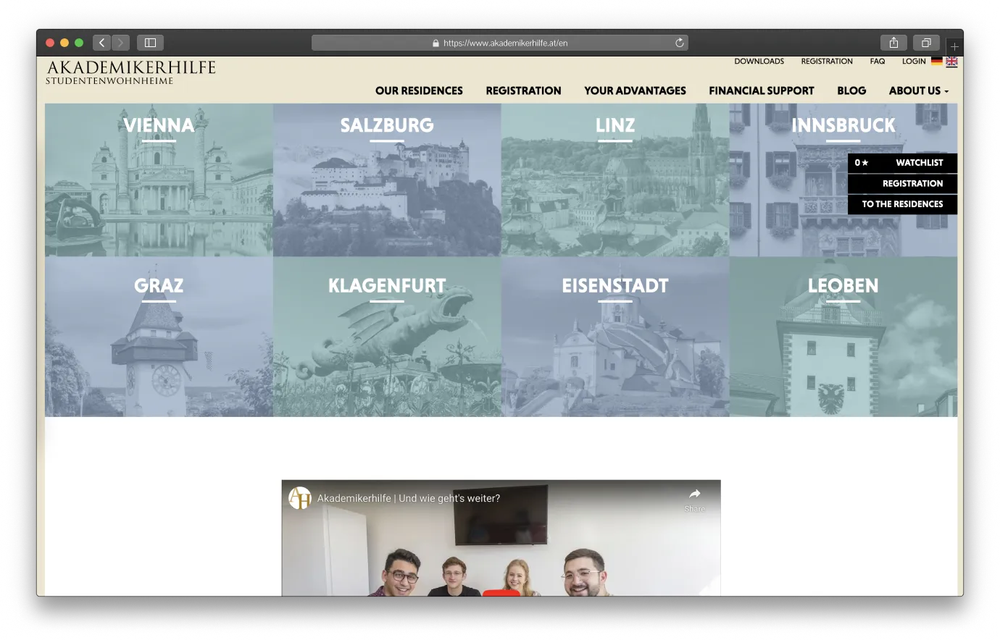

Akademikerhilfe 是專門提供學生宿舍房源的慈善組織，平台房源包含奧地利各城市的學生宿舍，介面直覺簡單好用，價格也公開透明。

#### Akademikerhilfe 基本資訊

- Akademikerhilfe [官方網站](https://www.akademikerhilfe.at/en)
- 身份要求：學生
- 可否入籍：可
- 平台語言：德文 / 英文
- 其他費用：單次註冊費 20 歐元（不可退還）＋簽約服務費 30 歐元

#### 優點
- 平台介面設計容易使用
- 包含奧地利各個城市房源
- 支援英德雙語

#### 缺點
- 申請人需有奧地利大學預科或是學生身份
- 申請人需在 28 歲以下
- 僅提供學生宿舍
- 需註冊費和簽約服務費

### Dorms.com

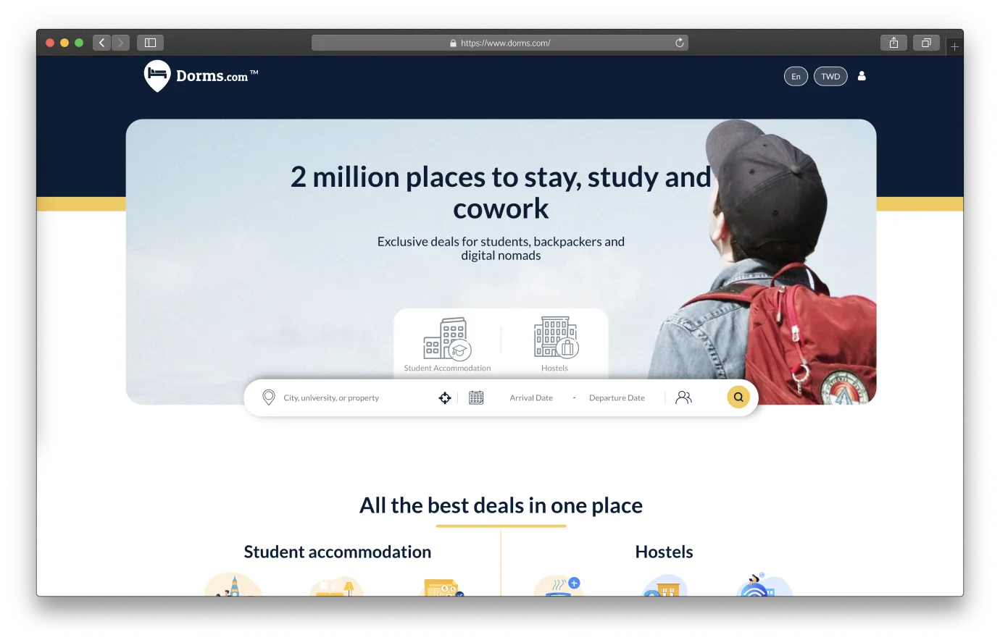

Dorms.com 是一個提供全球各城市學生宿舍、青年旅館、共享空間租賃的整合平台，不管是短期住宿或是長期居住，都可以到平台上逛逛參考房源和價格。

#### Dorms.com 基本資訊
- Dorms.com [官方網站](https://www.dorms.com/)
- 身份要求：需各別詢問
- 可否入籍：需各別詢問
- 平台語言：多國語言
- 其他費用：價格較不透明，需各別詢問

#### 優點
- 多國語言支援
- 多國貨幣顯示
- 提供全球多樣性質房源

#### 缺點
- 提供較多大城市的房源
- 價格較不透明，需各別詢問

### Facebook

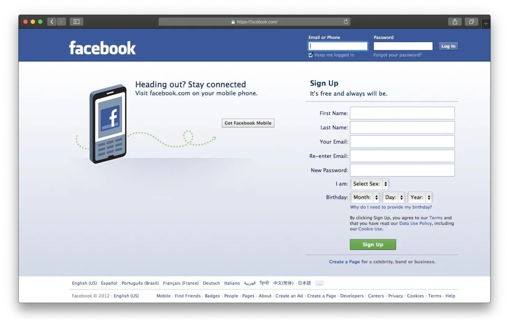

Facebook 有許多社團專門提供租屋方面的訊息，可以透過關鍵字像是 Wohnung、Studio、WG 等等進行搜尋好尋找自己偏好的房型。

> 小心詐騙：Facebook 一直以來存在的問題就是**詐騙猖獗**，在租屋社團裡也不例外！如果是在國外被騙，求償報警更是難如登天，所以建議你把 Facebook 社團當作租屋價格的參考，**不要全盤相信 Facebook 上面的訊息**。

### home4students

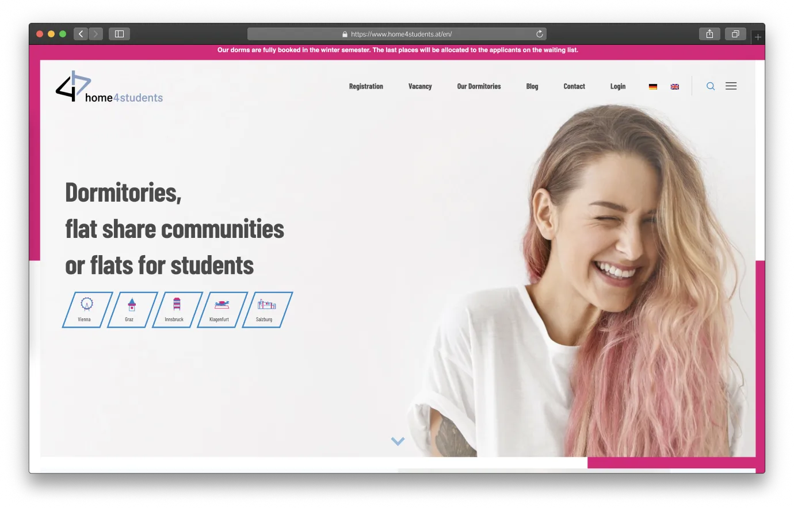

home4students 是一個奧地利的非營利組織，旨在提供在奧地利讀書的學生良好的居住環境。不過雖然主要客群是學生，在註冊時似乎也可以使用非學生的身份尋找、申請房源唷～

#### home4students 基本資訊
- home4students [官方網站](https://www.home4students.at/en/)
- 身份要求：無
- 可否入籍：可
- 平台語言：德文 / 英文
- 其他費用：無

#### 優點
- 平台介面設計容易使用
- 包含奧地利各個城市房源
- 支援英德雙語
- 無其他費用

#### 缺點
- 房源熱門，競爭激烈，最好提前至出發前一年預訂

### HousingAnywhere

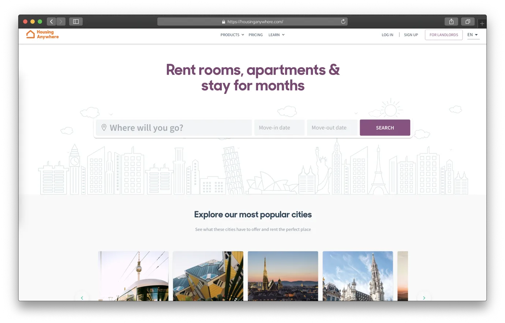

HousingAnywhere 是一個提供全球租屋房源的平台，可以根據租期選擇短租或長租，價格算蠻透明，租屋的資訊也都很完整，且因為房源單純，都是房源出租，沒有青旅、飯店等，比起 Dorms.com，在找中長期的住處時，我會更偏好 HousingAnywhere 這個平台。

#### HousingAnywhere 基本資訊
- HousingAnywhere [官方網站](https://housinganywhere.com/)
- 身份要求：需各別查看，通常無
- 可否入籍：需各別查看
- 平台語言：多國語言
- 其他費用：平台服務費、部分房源需仲介費

#### 優點
- 平台介面設計容易使用
- 包含奧地利各個城市房源
- 支援英德雙語

#### 缺點
- 有平台服務費、部分房源需仲介費

### Immobilien Der Standard

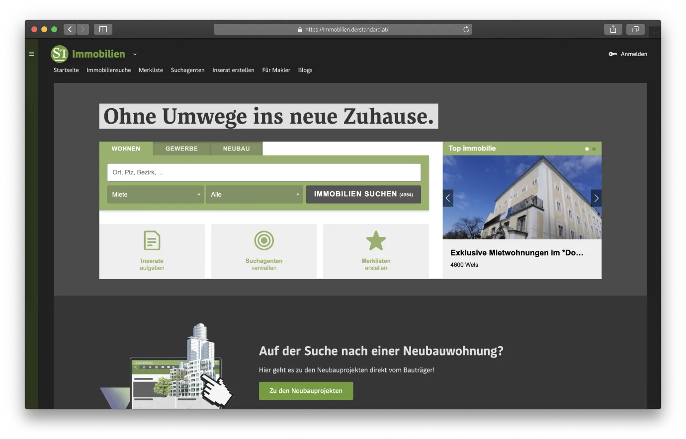

Immobilien Der Standard 是德國和奧地利每日報紙 Der Standard 旗下產品之一，提供在德語區生活的人進行租屋、買賣房屋。

#### Immobilien Der Standard 基本資訊
- Immobilien Der Standard [官方網站](https://immobilien.derstandard.at/)
- 身份要求：需各別詢問
- 可否入籍：需各別詢問
- 平台語言：德文
- 其他費用：部分房源需仲介費

#### 優點
- 包含奧地利各個城市房源
- 可用郵遞區號尋找房源

#### 缺點
- 部分房源資訊參差不齊
- 僅支援德文

<!--
### Immoscout24

![screenshot]

Immoscout24 是提供德國、奧地利、和西班牙房源的房屋買賣、出租平台，但是目前奧地利僅有開放買賣房源，尚未無提供租屋功能。

#### Immoscout24 基本資訊
- Immoscout24 [官方網站](https://www.immobilienscout24.at/)
- 身份要求：需各別詢問
- 可否入籍：需各別詢問
- 平台語言：德文
- 其他費用：部分房源需仲介費

#### 優點
- 包含奧地利各個城市房源
- 可用郵遞區號尋找房源

#### 缺點
- 部分房源資訊參差不齊
- 僅支援德文

note: https://www.immobilienscout24.at/??

-->

### milestone

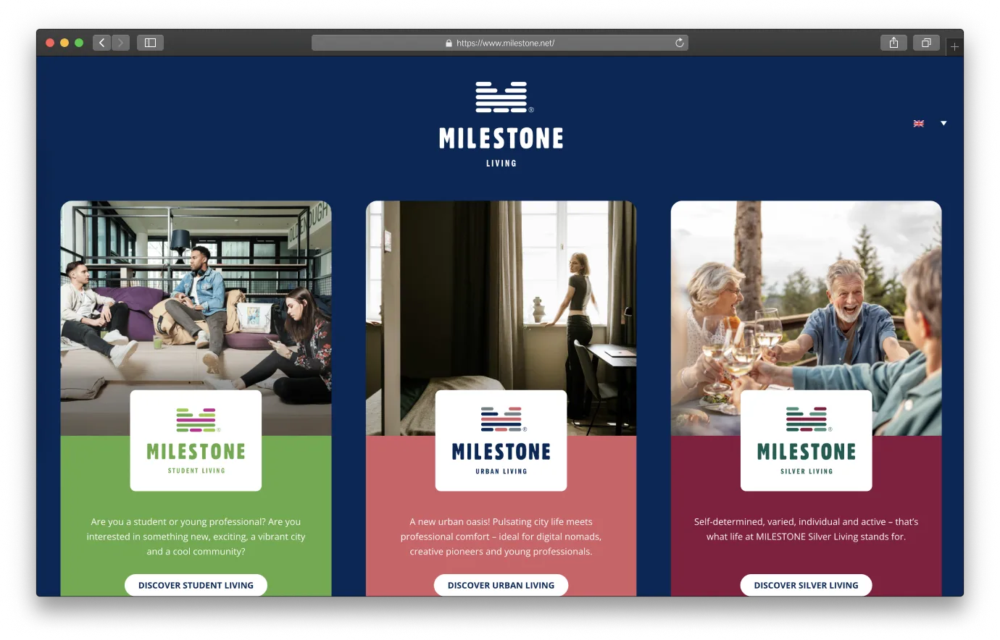

milestone 是一間提供學生和年輕上班族租屋房源的公司，目前在奧地利的房源僅在[維也納](https://www.milestone.net/location/milestone-vienna-campus/)、[林茨](https://www.milestone.net/location/milestone-linz-brucknerstudios/)、[萊奧本](https://www.milestone.net/location/milestone-leoben-montan/)、和[格拉茨](https://www.milestone.net/location/milestone-graz-lend/)。

#### milestone 基本資訊
- milestone [官方網站](https://www.milestone.net/)
- 身份要求：學生或上班族
- 可否入籍：可 an
- 平台語言：德文 / 英文
- 其他費用：無

#### 優點
- 平台介面設計容易使用
- 價格透明
- 支援英德雙語

#### 缺點
- 僅提供奧地利大城市房源

### OeAD

OeAD 是提供學生房源的非營利組織，是最熱門的房源網站之一，提供奧地利各城市房源，並可透過多項篩選去選擇出自己理想中的房型，網站有提供 360° 實景互動式相片，讓租客租屋前能夠線上看房。

#### OeAD 基本資訊
- OeAD [官方網站](https://www.oeadstudenthousing.at/en/)
- 身份要求：學生
- 可否入籍：可 an
- 平台語言：德文 / 英文
- 其他費用：申請費 35 歐元、月費 18 歐元（每個月）、搬出清潔費 69 歐元

#### 優點
- 包含奧地利各個城市房源
- 360° 實景互動式相片線上看房
- 支援英德雙語

#### 缺點
- 其他費用較高、成為額外支出
- 房源熱門，競爭激烈

### ÖJAB

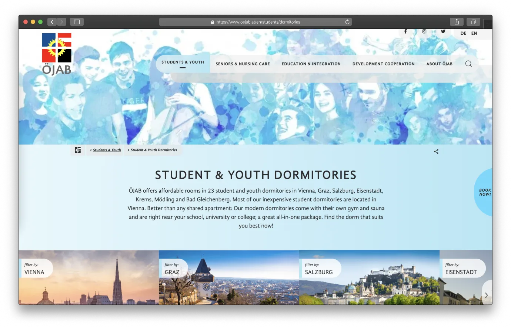

ÖJAB 是提供學生房源的非營利組織，是最熱門的房源網站之一，提供奧地利維也納、格拉茨、薩爾斯堡、等大小城市房源，網站有提供 360° 實景互動式相片，讓租客租屋前能夠線上看房。

#### ÖJAB 基本資訊
- ÖJAB [官方網站](https://www.oejab.at/en/students/dormitories)
- 身份要求：學生
- 可否入籍：可 an
- 平台語言：德文 / 英文
- 其他費用：無

#### 優點
- 包含奧地利各個城市房源
- 360° 實景互動式相片線上看房
- 無其他費用

#### 缺點
- 房源熱門，競爭激烈

### Studium.at

Studium.at 是一個專門提供學術相關的網站，也包含了工作機會、租屋房源、大學新聞等。

#### Studium.at 基本資訊
- Studium.at 官方網站
    - [學生宿舍](https://www.studium.at/studentenheime)
    - [一般租屋](https://www.studium.at/wohnen)
- 身份要求：無
- 可否入籍：需各別查看
- 平台語言：德文
- 其他費用：無

#### 優點
- 包含奧地利各個城市房源

#### 缺點
- 僅支援德文

### STUWO

STUWO 是提供學生房源的奧地利公司，是最熱門的房源網站之一，房源常常供不應求，這是我最喜歡的其中一個租房網站。

#### STUWO 基本資訊
- STUWO [官方網站](https://www.stuwo.at/en/)
- 身份要求：學生
- 可否入籍：可 an
- 平台語言：德文 / 英文
- 其他費用：無

#### 優點
- 包含奧地利各個城市房源
- 包含許多房源圖片
- 支援英德雙語

#### 缺點
- 房源熱門，競爭激烈

### WG-gesucht

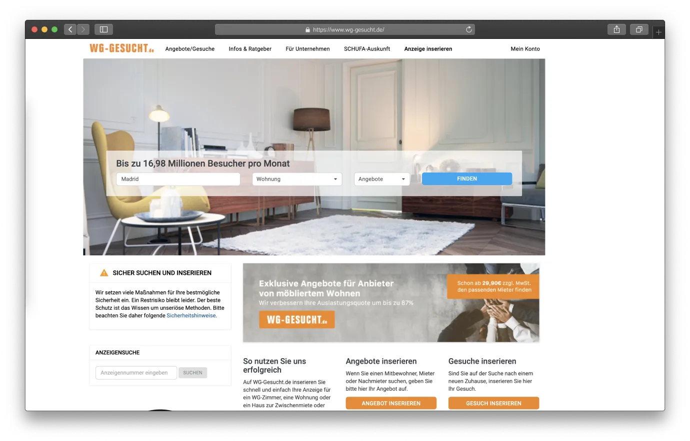

WG-gesucht 是一個提供德國、奧地利、和西班牙房源的租屋平台，大多數房源為屋主或仲介出租，有些房源資訊較不完整，整體房源價位偏高。

#### WG-gesucht 基本資訊
- WG-gesucht [官方網站](https://www.wg-gesucht.de/)
- 身份要求：無
- 可否入籍：需各別詢問
- 平台語言：德文 / 英文 / 西班牙文
- 其他費用：待確

#### 優點
- 包含奧地利各個城市房源
- 支援西英德三語

#### 缺點
- 部分房源資訊參差不齊

### wilhast
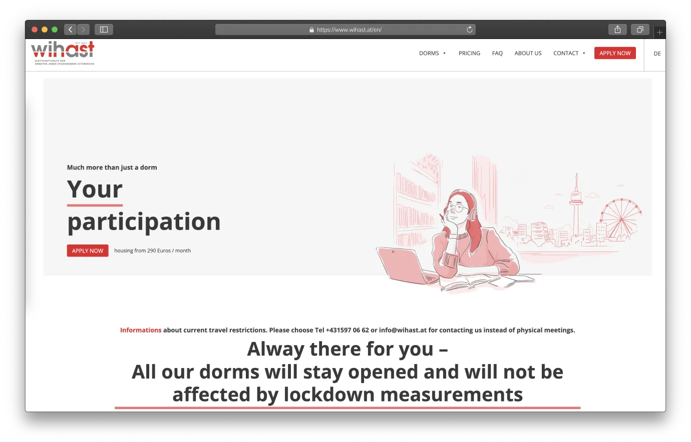

wilhast 是在一次世界大戰後，於 1923 年成立的租屋組織，來幫助學生找到適合的居所，現在在維也納周遭共有 16 個宿舍、提供超過 3200 個床位，非常適合預算較低的學生！

#### wilhast 基本資訊
- wilhast [官方網站](https://www.wihast.at/en/)
- 身份要求：學生
- 可否入籍：可 an
- 平台語言：德文 / 英文
- 其他費用：搬出清潔費 69 歐元

#### 優點
- 平價、易負擔
- 支援英德雙語

#### 缺點
- 僅有維也納周遭房源
- 搬出清潔費 69 歐元

### Willhaben

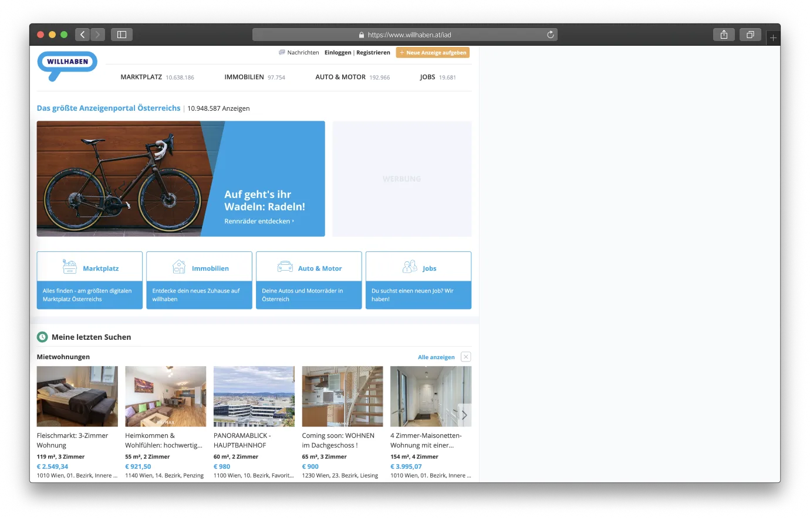

根據部落客[無糖綠](https://vocus.cc/user/@cestlawien)的經驗，Willhaben 是最多奧地利當地人會使用的租屋平台，該平台也提供買賣二手用品（家具、汽車）、找工作等等的服務，是一個會讓你感覺相見恨晚的平台！

#### Willhaben 基本資訊
- Willhaben [官方網站](https://www.willhaben.at/iad)
- 身份要求：無
- 可否入籍：需各別詢問
- 平台語言：德文
- 其他費用：無

#### 優點
- 包含奧地利各個城市房源
- 房源多、可撿到寶

#### 缺點
- 僅支援德文

## 祝你好運！

要租到滿意的房子本來就不易，這篇文章存在的目的就是為了幫助所有即將前往奧地利停留中長期的你找到住的舒服、又符合預算的地方！

以上這零零總總加起來十幾個租屋網站，就是目前國內外網路上最常出現的奧地利租屋平台，不管你是要前往奧地利留學、交換學生、[**打工度假**](https://docs.exittaiwan.com/%E9%81%B8%E6%93%87%E5%9C%8B%E5%AE%B6/%E5%A5%A7%E5%9C%B0%E5%88%A9/%E5%A5%A7%E5%9C%B0%E5%88%A9%E6%89%93%E5%B7%A5%E5%BA%A6%E5%81%87/%EF%BC%91%E7%94%B3%E8%AB%8B%E6%89%93%E5%B7%A5%E5%BA%A6%E5%81%87%E7%B0%BD%E8%AD%89/%E5%9F%BA%E6%9C%AC%E8%B3%87%E8%A8%8A%EF%BC%86%E6%BA%96%E5%82%99%E8%B3%87%E6%96%99)、工作、長期旅遊，應該都能找到適合自己的房源，如果逛完了所有平台還找不到合適的住所，我建議你先去改運再重新出發 😎。

<!-- - 訂閱免費電子報收取更新：[**前往追蹤**](https://newsletter.xdavidchen.com/zh-tw)-->

<!--

## 奧地利租屋平台比較

| 1 | 2 | 3 | 4 |
| --- | --- | --- | --- |
| 1 | 2 | 3 | 4 |
| 1 | 2 | 3 | 4 |
| 1 | 2 | 3 | 4 |

## 租屋用詞中英德對照表

> organize and paraphrase

- Provision 傭金，通常是收2個月租金+20%稅
- Kaution 押金，通常是3個月租金，退租時應退還(但在這裡被扣也是很常見的)

| 中文 | English | Deutsch |
| --- | --- | --- |
| 1 | 2 | 3 | 
| 1 | 2 | 3 |
| 1 | 2 | 3 |
-->

<!--

> - Altbau 老建築(多為1950年前建造的)，判別方式很簡單，天花板有3米以上基本上都是Altbau 
> - Neubau 新建築，天花板通常有只有2.5m
> - Wohnfläche 居住平方米數(實坪)，和台灣的坪數不一樣喔
> - Heizung 暖氣類型 
> 最省錢為 Fernwärme (焚化爐燒的熱發電) 
> 其次為 Zentralheizung或是Gasetagenheizung (可能燒瓦斯也可能燒油)
> 再來有Gasheizung (在家裡面燒瓦斯的，我覺得超危險，常常擔心瓦斯外洩or燃燒不完全XD)
> 最差的就是Elektroheizung (吃電的，看到帳單會嚇死人的)

> - Betriebskosten 管理費 (物業公司收的管理費)
> - Mehrwertsteuer、Umsatzsteuer (MWst or USt) 增值稅
> - Ablöse 家具轉讓費，小從幾百塊的家具到幾萬塊的整間廚房設備都有可能要轉手!?

> Gemeindewohnung 社會住宅的概念，通常屋齡比較老些，租金會超級便宜，但是要符合一定資格才能入住(一般來說我們是用不到的)

> Genossenschaftswohnung "合作社住宅(?)"，中文不太會翻XD
> 通常要繳很大一筆Genossenschaftanteil，可能需要符合某些資格才能申請，租金也會相對便宜...(這個也是用不到的)
-->