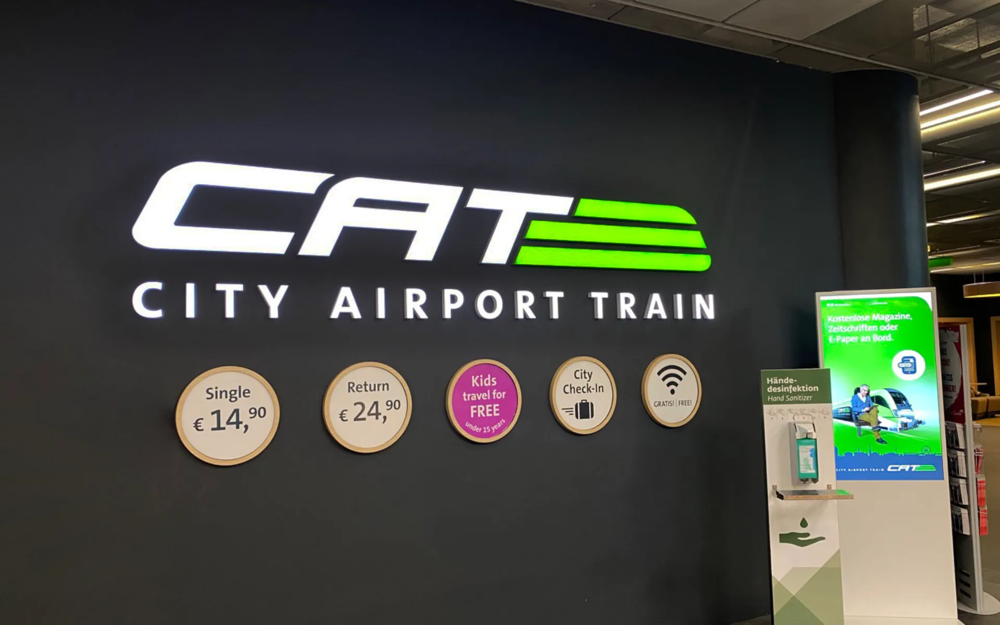
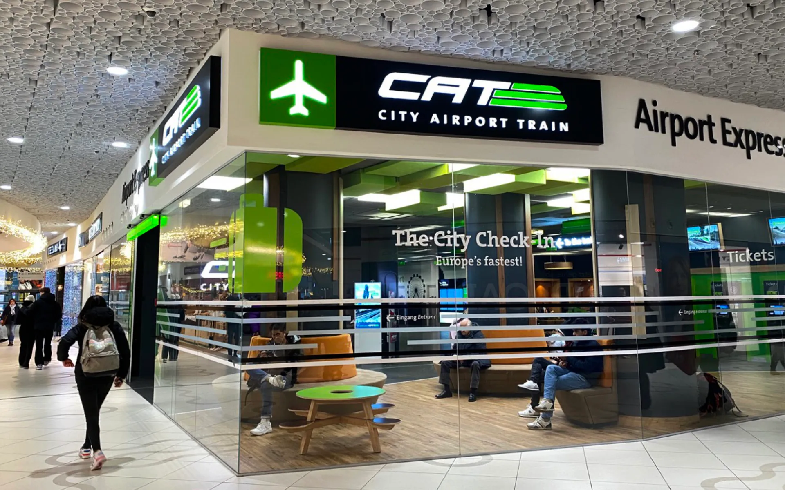
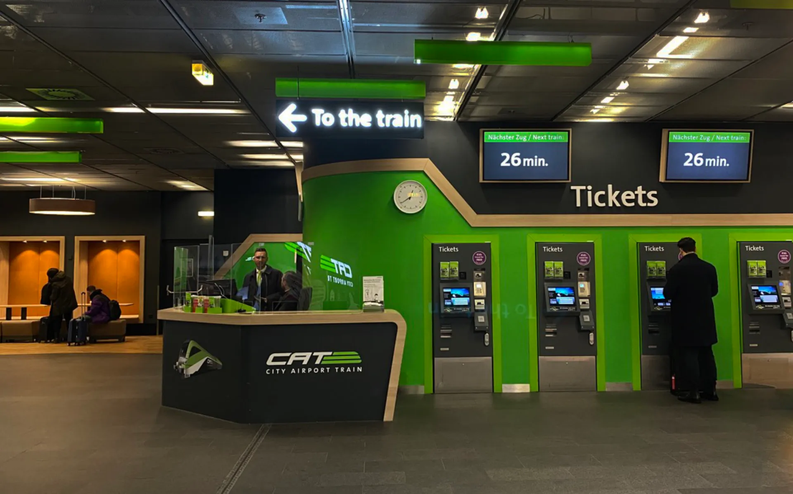
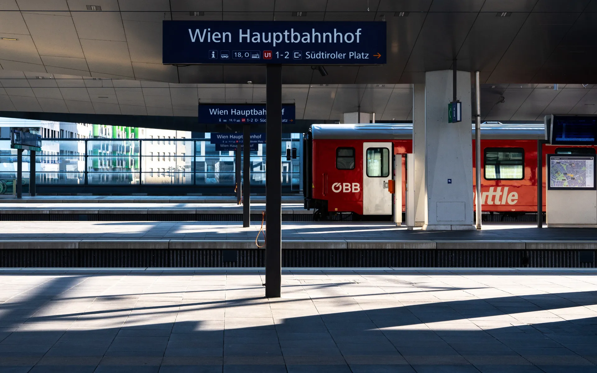
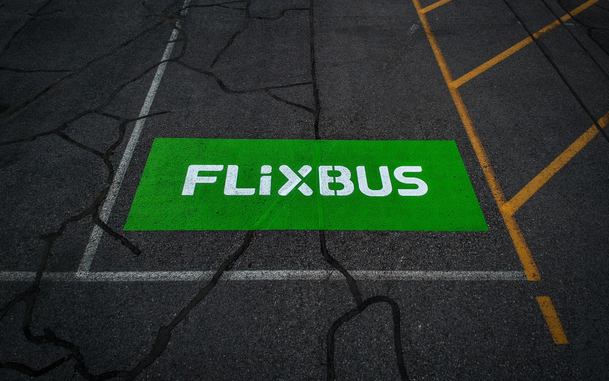

[**奧地利的首都維也納**](https://exittaiwan.com/posts/%E7%B6%AD%E4%B9%9F%E7%B4%8D%E8%87%AA%E7%94%B1%E8%A1%8C%E6%97%85%E9%81%8A%E5%85%A8%E6%94%BB%E7%95%A5/)位於歐洲大陸的中心點，對於從亞洲飛過來的台灣自由行旅客來說，不管是要在奧地利深度旅遊、或是短暫停留後前往下一個旅遊地點，維也納都是一個很棒的中繼點。

> ✔️ 越早訂越便宜：[**現在查詢維也納房價**](https://www.booking.com/city/at/vienna.en.html?aid=7956794&no_rooms=1&group_adults=2)

維也納只有一個國際機場，也就是[維也納機場](https://www.viennaairport.com/en/passengers)（Vienna Airport，VIE）。不論你是搭乘直飛的中華航空、長榮航空，或是轉機的班機來到維也納，你都會降落在這裡。

> 想要把圖片存下來嗎？[**免費下載維也納景點地圖和高清地鐵路線圖**](https://exittaiwan.gumroad.com/l/wien)

從維也納機場和市中心的距離其實只有不到 20 公里。除了自行租車之外，你有四種方式可以在機場和市中心來回通勤，包括搭乘機場快線火車（City Airport Train，CAT）、搭乘一般火車、搭乘 Uber、以及搭乘 FlixBus 跨國巴士。

- 機場快線 CAT
- 一般火車
- Uber
- FlixBus 跨國巴士

## 機場快線 City Airport Train，CAT

[維也納的機場快線（City Airport Train，CAT）](https://affiliate.klook.com/redirect?aid=41451&aff_adid=1011857&k_site=https%3A%2F%2Fwww.klook.com%2Fzh-TW%2Factivity%2F8895-vienna-city-airport-train-ticket-vienna%2F%3Fspm%3DActivity.TopNavigation.SelectCurrency%26clickId%3D160621ce0b)是來回維也納市區和機場最快速的選擇。

機場快線是維也納機場站和 Wien Mitte（英文：Vienna Center；暫譯：維也納中心）兩站的直達車，行程總時間只要 16 分鐘。

班次則是每天從早上五點半開始一直到晚上十一點，每半小時都有各別從市中心和機場發車，實際發車時間可以[到這個頁面查看](https://www.cityairporttrain.com/en/info-service/timetable/)。

- **價格**：單程 €14.90；來回 €24.90，14 歲以下免費
- **時間**：16 分鐘
- **優點**：快速、點到點移動直達、上下車容易
- **缺點**：價格較高

機場快線 CAT 的淺綠色標示非常顯眼，從出境後的行李托盤區就可以看到廣告，到機場大廳跟著火車的指標走，也會很快就看到一區綠色的櫃檯購票區，只要和櫃檯人員或是透過自動售票機買單程或是來回票就可以囉！

當然，你也可以在 [Klook 購買電子車票](https://affiliate.klook.com/redirect?aid=41451&aff_adid=1011857&k_site=https%3A%2F%2Fwww.klook.com%2Fzh-TW%2Factivity%2F8895-vienna-city-airport-train-ticket-vienna%2F%3Fspm%3DActivity.TopNavigation.SelectCurrency%26clickId%3D160621ce0b)。 <!-- https://www.cityairporttrain.com/en/partner-->

如果你是在市中心要前往機場的話，CAT 的現場購票地點在 Wien Mitte The Mall（維也納中心購物商場）裡面。

*CAT 的單程和回程車票必須在購票後的六個月內使用完畢。

如果你時間很緊湊，不想要列車行徑中途有停靠，或是你搬不太動行李，又或是不太在意預算，那麼 CAT 對你來說是一個好選擇。

## 一般火車 S-Bahn、REX

一般火車指的是 S-Bahn（市區快車）和區域快線列車（像是路線由 ÖBB 奧地利國鐵營運的 Regionalexpress，REX）。

S-Bahn 市區快車就是在維也納市區內營運的快速火車，而區域快線列車 REX 則有可能是來自或是前往鄰近國家、中間過站剛好有停維也納機場站和維也納市中心火車站的火車。

除了機場快線 CAT 火車以外的一般火車，買的車票都是一樣的。單程成人票價 €4，除了 CAT 以外的所有車子都可以搭乘，行程時間約是 20 \~ 30 分鐘。

一般火車和 CAT 火車最大不同的點是維也納市中心的車站地點。機場快線一律都是停靠 Wien Mitte（維也納中心站），而一般火車有可能停靠的市中心車站有 Wien Mitte（維也納中心站）、Wien Hbf（維也納主火車站）、Wien Westbahnhof（維也納西站）。根據你的行程，你可以看看搭到哪個站最方便。

- **價格**：單程成人 €4
- **時間**：20 ~ 30 分鐘
- **優點**：快速、價格便宜、點到點移動、市中心有多個火車站可以作為目的地
- **缺點**：上下車可能要搬行李

> ✔️ 越早訂越便宜：[**現在查詢維也納房價**](https://www.booking.com/city/at/vienna.en.html?aid=7956794&no_rooms=1&group_adults=2)

### 一般火車 S-Bahn、REX 購票教學

在維也納機場，一般火車的車票就是透過紅色的 ÖBB 奧地利國鐵櫃檯或是自動售票機購買。從市中心往機場的方向購票步驟相同，唯一差別在目的地選在 Vienna Airport。

1. 第一步：根據行車方向，用 [DB Navigator 這個網站](https://int.bahn.de/en)或是直接在車票的自動販賣機來查看哪些班次有到達機場站或是市中心的目的地車站。
2. 第二步：選擇語言：英文
3. 第三步：選擇目的地
4. 第四步：選擇時間車次
5. 第五步：付款
6. 第六步：拿取列印好的車票

這張火車票在你選取車次時間開始的兩小時內都有效，所以真的不小心錯過了也可以搭兩小時內的任何一班車。

一般火車 S-Bahn、REX 搭車月台的位置和機場快線 CAT 一樣，不過列車停在幾號月台就不一定了。一定要記得根據你前往維也納市中心的目的地（維也納中心站、維也納主火車站、維也納西站、或是其他車站），確認時間和車次之後，到正確的月台搭乘。

搭乘一般火車是我最推薦你來回維也納機場和市區的方式。它最大的缺點可能是因為來的火車型號不一定，有些車子上下車和月台不是同一個平面，所以有大型行李箱的人就會比較辛苦一點。

## Uber

根據時段、當下有叫車需求的用戶數量、以及實際前往的確切地點，**[Uber](https://referrals.uber.com/refer?id=uf3rqv9dyawj)** 系統顯示的車資大約會落在 €25 ~ €40。

- **價格**：€25 ~ €40
- **時間**：20 ~ 30 分鐘
- **優點**：免搬行李、點到點移動直達目的地、多人可平分費用、全天營運
- **缺點**：價格較高、價格浮動大、偶爾有可能塞車

如果你抵達維也納或是要出發到機場的時間剛好是半夜時刻、或是同行旅客比較多、行李不容易搬，那我最推薦你搭 Uber！

## FlixBus 跨國巴士

[FlixBus](https://www.flixbus.com/)是歐美一種非常熱門、價格低廉的交通方式。

如果要搭乘 FlixBus 跨國巴士在維也納機場和市中心之間移動，你需要買的票是**從斯洛伐克首都布拉提斯拉瓦（Bratislava）發車，前往維也納的班次**（如果是往機場的話，就是維也納發車，前往 Bratislava 的班次）。這個路線的中間會停靠維也納機場，所以旅客可以透過這樣的方式來回維也納機場和市區。

要特別注意的是，FlixBux 跨國巴士在維也納市區的停靠站並不是在火車站，而是稍微偏遠一點的 **Erdberg 維也納國際巴士車站**。從這個 Erdberg 維也納國際巴士車站到維也納最市中心的地方搭乘地鐵還要大約 20 分鐘才會抵達。

- **價格**：€6 ~ €16
- **時間**：20 ~ 30 分鐘（維也納國際巴士站到維也納機場之間）
- **優點**：點到點移動、班次多
- **缺點**：下車地點離市中心需轉乘地鐵、價格浮動大、偶爾有可能塞車

除非你剛好住在 Erdberg 附近，應該沒什麼人會搭 FlixBus 來回維也納市區和機場。不過凡事都是避免個萬一，FlixBus 每天的班次都非常多，如果你剛好別無選擇了，它可能是你的最後希望！

## **維也納機場往返市區交通方式比較表**

| **交通方式**              | **單程行車時間**  | **起迄站**                                            | **單程價格（合計，歐元）** |
| --------------------- | ------------- | -------------------------------------------------- | ---------------------- |
| 機場快線 CAT          | 16 分鐘       | 維也納機場、Wien Mitte                             | €14.90                 |
| 一般火車 S-Bahn & REX | 20 ~ 30 分鐘 | 維也納機場、Wien Mitte、Wien Hbf、Wien Westbahnhof | €4                     |
| Uber                  | 20 ~ 30 分鐘 | 維也納機場、市中心任意點                           | €25 ~ €40             |
| FlixBus 跨國巴士      | 20 ~ 30 分鐘 | 維也納機場、Erdberg                                | €6 ~ €16              |

把維也納機場和市區交通的方式都看懂了嗎？那你可能也會想知道[**維也納交通核心區的交通和購票方式**](https://exittaiwan.com/posts/%E7%B6%AD%E4%B9%9F%E7%B4%8D%E5%B8%82%E5%8D%80%E4%BA%A4%E9%80%9A%E6%94%BB%E7%95%A5/)！