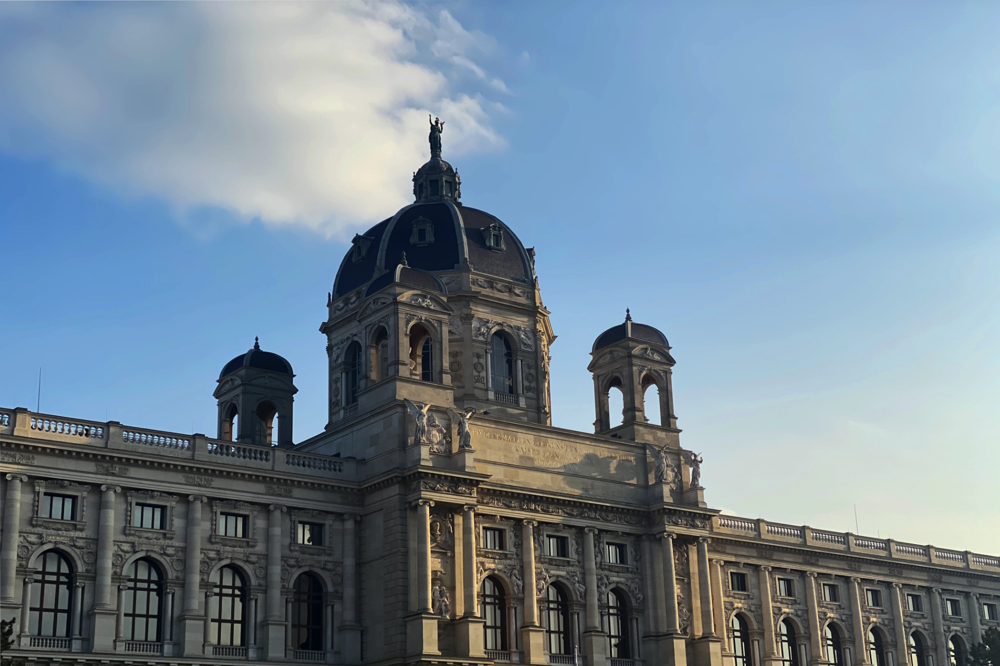

你是美術愛好者，喜歡看展覽，但覺得維也納博物館和美術館的票全部分開買太貴嗎？那麼就讓這張維也納博物館 / 美術館通票滿足你所有逛展的需求！

## 什麼是維也納博物館 / 美術館通票？

在我們的文章「[**維也納自由行旅遊全攻略｜維也納旅遊景點、交通、住宿懶人包**](https://exittaiwan.com/posts/%E7%B6%AD%E4%B9%9F%E7%B4%8D%E8%87%AA%E7%94%B1%E8%A1%8C%E6%97%85%E9%81%8A%E5%85%A8%E6%94%BB%E7%95%A5/)」裡面的最後，我們曾經提到過當你來到維也納旅遊可以購買的兩種優惠票卷：「[**維也納通行證 Vienna Pass**](https://affiliate.klook.com/redirect?aid=41451&aff_adid=1004215&k_site=https%3A%2F%2Fwww.klook.com%2Factivity%2F105133-vienna-attractions-pass%2F%3Fspm%3DSearchResult.SearchResult_LIST%26clickId%3D3b93d25d1e)」和「[**維也納博物館 / 美術館通票**](https://www.bundesmuseencard.at/)」。

對於大部分旅客來說，「維也納通行證 Vienna Pass」可能更吸引人也更符合自由行旅客的需求，畢竟包含了知名的茜茜公主博物館和熱門景點美泉宮（德文：Schönbrunn）的入場門票。

不過，如果你對於太 touristy 的行程景點沒興趣，或是你之前來到維也納已經去過那些景點，這次只想逛逛藝術博物館和美術館的話，那「維也納博物館 / 美術館通票」就是一個更好的選擇。

「維也納博物館 / 美術館通票（德文：Bundes Museen Card）」讓你在購買日起 365 天內，無限次進出維也納的八個博物館和美術館，總共 25 個展區。這八個博物館包含了以下：

- 阿爾貝蒂娜（德文：Albertina）
- 美景宮（德文：Belvedere）
- 藝術史博物館（德文：Kunsthistorisches Museum Wien）
- 應用藝術美術館（德文：Museum für Angewandte Kunst, MAK）
- 現代藝術美術館（德文：Museum Moderner Kunst Stiftung Ludwig Wien, MUMOK）
- 自然史博物館（德文：Naturhistorisches Museum Wien）
- 奧地利國家圖書館（德文：Österreichische Nationalbibliothek）
- 科學博物館（德文：Technisches Museum Wien）

> 想要把圖片存下來嗎？[**免費下載維也納景點地圖和高清地鐵路線圖**](https://exittaiwan.gumroad.com/l/wien)

## 維也納博物館 / 美術館通票值得買嗎？

你可能會覺得只是在維也納待一個禮拜，有需要買有效期限一年的通票嗎？

對於大部分來到維也納短期旅遊的人來說，這的確有點反直覺。不過，如果你很確定你來維也納就是要逛展逛得夠，把這些博物館和美術館都走透透，那你可以簡單地算一下單買的票價。

以 2025 年的票價為參考，阿爾貝蒂娜的門票 €19.90＋上美景宮的門票 €17.50＋藝術史博物館的門票 €21＋應用藝術美術館的門票 €15.5＋現代藝術美術館的門票 €13＋自然史博物館的門票 €18＋奧地利國家圖書館的門票 €11＋科學博物館的門票 €18 = €134。

這個數字還不包含另外單買「皇家珍寶館（德文：Kaiserliche Schatzkammer）」、「民族（世界）博物館（德文：Weltmuseum Wien）」、「奧地利歷史博物館（德文：Haus der Geschichte Österreich）」等等景點的門票。這些也都包含在「維也納博物館 / 美術館通票」的 25 個展區裡面，而「維也納博物館 / 美術館」的售價則是 €99。

因此，不論你是美術 / 歷史愛好者來到維也納短期旅遊、或是長居在歐洲，蠻多機會可以來維也納的學生或是上班族，其實都可以買這張一年有效期限的「維也納博物館 / 美術館」，省下不少門票錢喔！

## 維也納博物館 / 美術館通票怎麼購買？

因為提倡環保，最推薦的方式是直接到「維也納博物館 / 美術館通票（德文：Bundes Museen Card）」的[**官方網站上**](https://shop.khm.at/en/tickets/detail?shop%5BshowItem%5D=200000000009281-T404-0&cHash=0c775cac87f42ca2c56ad456c7148516)購買，只要幾分鐘的時間，電子版的「維也納博物館 / 美術館通票」就會寄到你的電子信箱，供你做使用。

想要實體卡的話，就需要到八個博物館 / 美術館的其中一個售票櫃台告知館員做購買了。

## 維也納博物館 / 美術館通票怎麼使用？

只要持有效的「維也納博物館 / 美術館通票」，並且搭配你的證件，就可以直接入場囉！

> 推薦閱讀：
>
> ✔️ [**維也納市區自由行交通攻略｜維也納交通核心區在哪裡？這篇文章告訴你**](https://exittaiwan.com/posts/維也納市區交通攻略/)
>
> ✔️ [**維也納自由行旅遊全攻略｜維也納旅遊景點、交通、住宿懶人包**](https://exittaiwan.com/posts/%E7%B6%AD%E4%B9%9F%E7%B4%8D%E8%87%AA%E7%94%B1%E8%A1%8C%E6%97%85%E9%81%8A%E5%85%A8%E6%94%BB%E7%95%A5/)

> 想要把圖片存下來嗎？[**免費下載維也納景點地圖和高清地鐵路線圖**](https://exittaiwan.gumroad.com/l/wien)