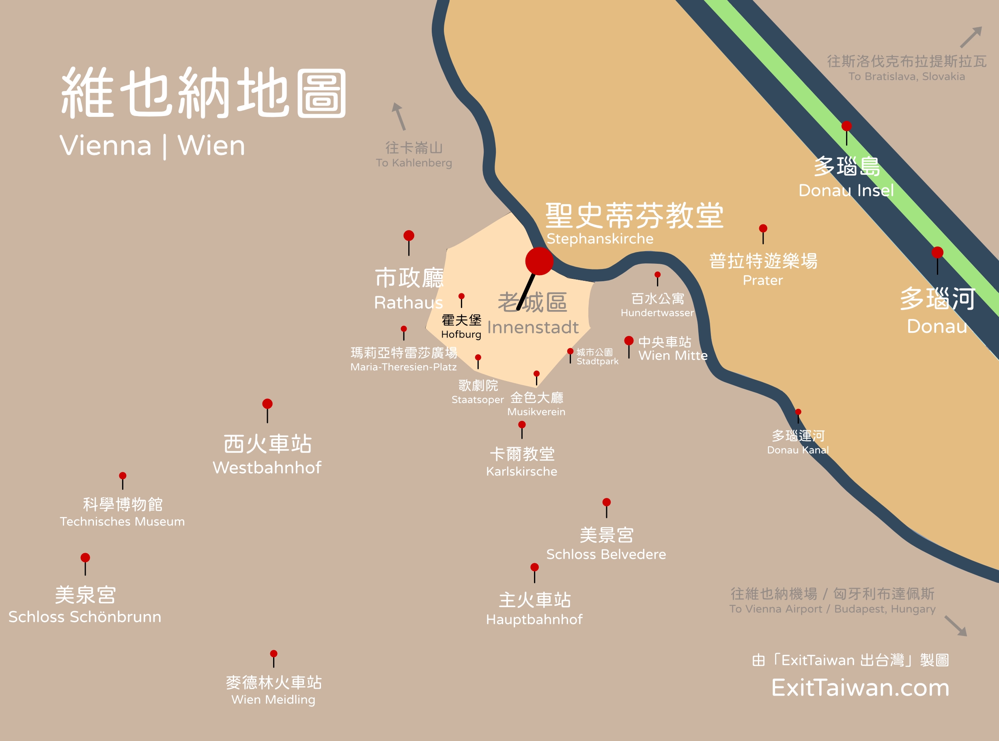
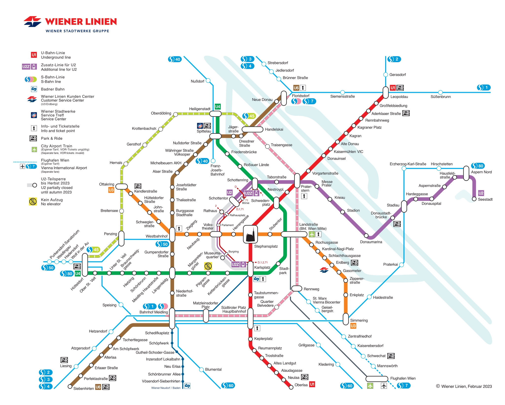
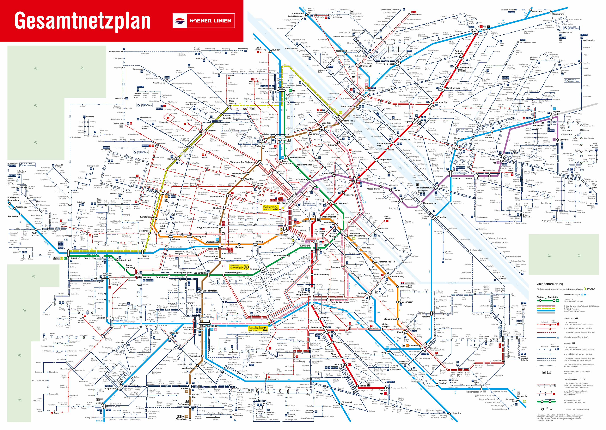
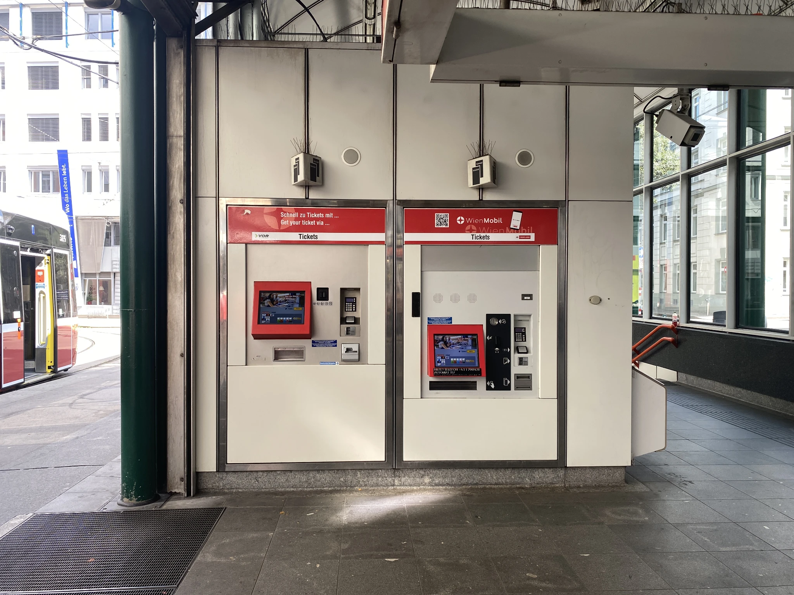
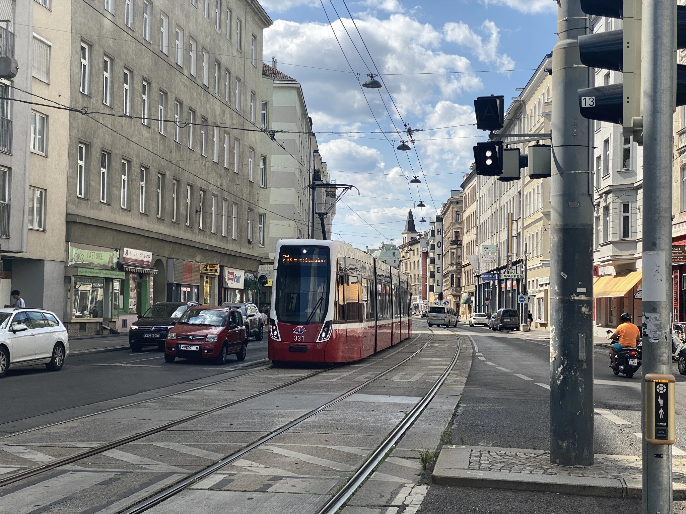

[**維也納**](https://exittaiwan.com/posts/%E7%B6%AD%E4%B9%9F%E7%B4%8D%E8%87%AA%E7%94%B1%E8%A1%8C%E6%97%85%E9%81%8A%E5%85%A8%E6%94%BB%E7%95%A5/)作為奧地利的首都，是台灣人最適合入門自由行旅遊的歐洲城市之一。

維也納的大眾交通工具便捷，從機場到市中心只需要約三十分鐘，還不知道怎麼從維也納機場到市區來回的人，快打開這篇「**[維也納機場市區來回交通自由行全攻略](https://exittaiwan.com/posts/%E7%B6%AD%E4%B9%9F%E7%B4%8D%E6%A9%9F%E5%A0%B4%E5%88%B0%E5%B8%82%E5%8D%80%E4%BA%A4%E9%80%9A%E5%85%A8%E6%94%BB%E7%95%A5/)**」快速了解所有維也納機場的交通方式！

而在維也納市中心，要去任何景點、飯店更是方便，合理的票價、多種交通工具選擇、都是讓[維也納成為世界最宜居城市](https://www.economist.com/graphic-detail/2024/06/26/the-worlds-most-liveable-cities-in-2024)的原因。

> 想要把圖片存下來嗎？[**免費下載維也納景點地圖和高清地鐵路線圖**](https://exittaiwan.gumroad.com/l/wien)

## 核心區 Core Zone

要理解維也納的市區交通，最先要基本知道維也納的城市規劃。

在歐洲許多城市，城市規劃都是圍繞著該城市的主要火車站，並以火車站為中心，以同心圓的方式規劃設計。

**在維也納，同樣是同心圓的規劃**，差別在於中心點不是主要火車站，而是聖史蒂芬大教堂（德文：Stephanskirche）。

**從聖史蒂芬大教堂為中心，往各個方位延伸不同的距離，就成為了維也納交通意義上的核心區**（英文：Core Zone；德文：Kernzone，以前叫做 Zone 100）。

Core zone 包括了維也納市區的所有大眾交通工具，街道電車、地鐵、公車、輕軌火車等。

### 維也納交通核心區有多大？

在維也納大眾交通局的網站上，有列出核心區往各個方向延伸後的[臨界點分別是哪些車站](https://www.wienerlinien.at/web/wl-en/tickets/core-zone-of-vienna)。超過了該車站之後就是超出了維也納交通核心區，需要另外再購票了。

不過這些在核心區邊界的站名大部分的旅客應該也認不出來。所以當你在維也納旅遊時，覺得你要前往的目的地好像有點遠，**最方便的分辨法是直接看這張交通地圖**。

透過方位、結合 Google Maps 來對應站名，只要你在這張地圖上找得到、**且不是在虛線上**的站，都屬於維也納交通的核心區。

> 想要把圖片存下來嗎？[**免費下載維也納地圖**](https://exittaiwan.gumroad.com/l/wien)

*備註：以下幾個是你有可能聽過的、但**不在維也納交通核心區的景點**

- 地底湖 Seegrotte Hinterbrühl
- 購物中心 Parndorf Outlet
- 瓦豪河谷 Wachau（梅爾克修道院 Stift Melk、杜倫施坦 Dürnstein）

## 維也納市區交通及購票方式

> 想要把圖片存下來嗎？[**免費下載維也納地圖**](https://exittaiwan.gumroad.com/l/wien)

維也納市中心交通非常方便且多元，買了一張票，不論是地鐵、街道電車、公車、市區內快速鐵路，只要在交通核心區內都能夠搭乘。

### 維也納交通車票

維也納市區交通票**成人單程票價為 2.4 歐元**。一張單程票可以前往一個目的地，包含無限次數的轉乘、搭乘不同的交通工具，有效時間為八十分鐘。

除了單程票之外，在地鐵站的自動售票機也可以購買 24 / 48 / 72 小時和七日票。

### 購票方式

維也納交通的實體票卷可以在各個地鐵站的自動售票機和街道電車上購買。

- 街道電車：在街道電車上，在車頭的車廂有車票的自動販賣機，歐元現金和信用卡都可以使用。
- 公車：可以上車使用歐元現金和司機買票。
- 地鐵：每個地鐵站入口處都有自動售票機。
- 市區內慢速火車：每個火車站皆有自動售票機。

如果想要購買電子車票，則可以下載 WienMobil 應用程式綁定信用卡進行購買。

在維也納搭乘大眾交通工具，要**特別注意的事項**：

1. 維也納的車站沒有出入口閘門，隨時可以持有效票自由進出。
2. 在各地鐵站自動售票機購買的**實體票卷，需要在入口處進行打票**的動作才算是有效票；沒打過票的車票，在公車上也需要使用打票機進行打票。
3. 查票員穿著便服，會不定時在各種交通工具中出現，他們會出示他們的證件並進行查票，如果被查到無票或持無效票搭乘，須繳納罰金 100 歐元。

## 維也納市區其他交通方式

### 步行

其實在市中心的老城區，只有少數幾條公車路線有在裡面通行，再來就是在老城區外圍的街道電車可以搭乘。走得動的年輕人們建議在逛老城區時可以直接步行，這裡也算是維也納最精華的觀光區域了。

### 腳踏車

就像台灣的大城市一樣，維也納也有提供租借腳踏車的服務。價格是每 30 分鐘 0.75 歐元，每 24 小時最高收取 19 歐元。

維也納大眾腳踏車的租借方式：
1. 下載 nextbike App：[Google Play Store](https://play.google.com/store/apps/details?id=de.nextbike&gl=AT)｜[Apple App Store](https://apps.apple.com/at/app/nextbike/id504288371)
2. 使用應用程式掃描腳踏車上的 QR Code
3. 開始騎乘，騎乘時請注意安全和當地交通規則。

