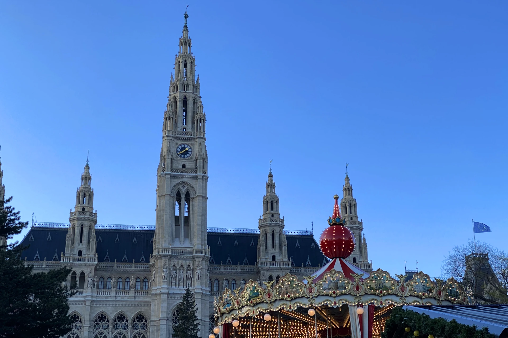

[**維也納**](https://exittaiwan.com/posts/%E7%B6%AD%E4%B9%9F%E7%B4%8D%E8%87%AA%E7%94%B1%E8%A1%8C%E6%97%85%E9%81%8A%E5%85%A8%E6%94%BB%E7%95%A5/)市政廳的聖誕市集是歐洲最有名的聖誕市集之一，每年冬天 11 月到 12 月都吸引維也納當地和世界各地的遊客前來歡慶聖誕節。市政廳的聖誕市集不只攤位數量多，甚至還有提供各項老少咸宜的娛樂設施，讓每個來到這裡的人有得吃、有得喝、也有得玩！

市政廳聖誕市集交通很方便，地鐵和電車都在下車後步行距離可以抵達，它也和位在[**史蒂芬廣場的聖誕市集**](https://exittaiwan.com/posts/%E7%B6%AD%E4%B9%9F%E7%B4%8D%E5%8F%B2%E8%92%82%E8%8A%AC%E5%BB%A3%E5%A0%B4%E8%81%96%E8%AA%95%E5%B8%82%E9%9B%86/)不遠，如果是到維也納自由行、行程安排在一起的話，一天逛三到四個市集都沒問題喔！

## 市政廳前廣場聖誕市集基本資訊

- 日期：11 月 15 日 ~ 12 月 26 日（2024 年）
- 開放時間：每天早上 10：00 ~ 晚上 10：00（12 月 24 日只到晚上 6：30）
- 地址：Rathausplatz, 1010 Wien（[Google Maps](https://www.google.com/maps/place/Rathausplatz/@48.2106456,16.3561805,17z/data=!3m1!4b1!4m6!3m5!1s0x476d07966dc3b145:0x1e7a761d819e68fa!8m2!3d48.2106456!4d16.3587554!16s%2Fg%2F12345hdy?authuser=1&entry=ttu)）
- 交通：地鐵 U3 到 Volkstheater（人民劇院） 站後走路約 10 分鐘；路面電車 1 號、71 號、或路線 D 到 Rathausplatz（市政廳前廣場）站

*假日人潮太多時市政廳門口的路面電車 Rathausplatz（市政廳前廣場）站會暫停上下客，要提前在 Schottentor 站或延後在 Parlament 站下車，再步行到聖誕市集。

> 推薦閱讀：[**維也納自由行市區交通攻略｜維也納交通核心區在哪裡？這篇文章告訴你**](https://exittaiwan.com/posts/%E7%B6%AD%E4%B9%9F%E7%B4%8D%E5%B8%82%E5%8D%80%E4%BA%A4%E9%80%9A%E6%94%BB%E7%95%A5/)

## 市政廳前廣場聖誕市集特色

被稱為是歐洲最有名的聖誕市集之一，市政廳前廣場的聖誕市集當然不太一般囉！相比其他在維也納的聖誕市集，這裡不只攤位數量多、聖誕裝飾更浮誇、甚至還有提供大人和小孩娛樂的設施。

### 旋轉木馬

一走到市政廳附近，馬上映入眼簾的除了聖誕拱門，你一定不會錯過閃閃發光的旋轉木馬！2023 年票價為小孩 5 歐元，成人 7 歐元。

### 溜冰場

也許你在走過來的路上已經看到了，面對市集的左手邊，一整片區域都是溜冰場喔！想要溜冰的話，可以在現場租借溜冰鞋，直接購票入場溜冰。

不過一眼望去，大部分在裡面溜冰的好多人可能都從小開始就溜冰，溜的速度很快，所以進去好玩體驗的同時，也別忘了要注意安全。

現場售票亭，人潮不太多，可能入夜後人會比較多。

返還租借溜冰鞋的地方。

### 特色攤位

市政廳聖誕市集有不少蠻有特色的攤位，像是木製的各式廚房器具、各種造型的巧克力、經典的熱紅酒、等等。

木製廚具的攤位是家庭主婦主夫們的天堂！

也有攤位販賣木製裝飾品。

熱紅酒是不會缺席聖誕市集的！

這些竟然都是巧克力做成的！第一眼看到還以為是在賣工具的攤位。

直到看到滑鼠才覺得不太對勁，好像不是賣鐵器的⋯⋯

各式各樣的麵包、甜點、點心！

看到這裡你是不是也心動了呢？趁著冬天聖誕季節，來一場歐洲的聖誕市集之旅吧！