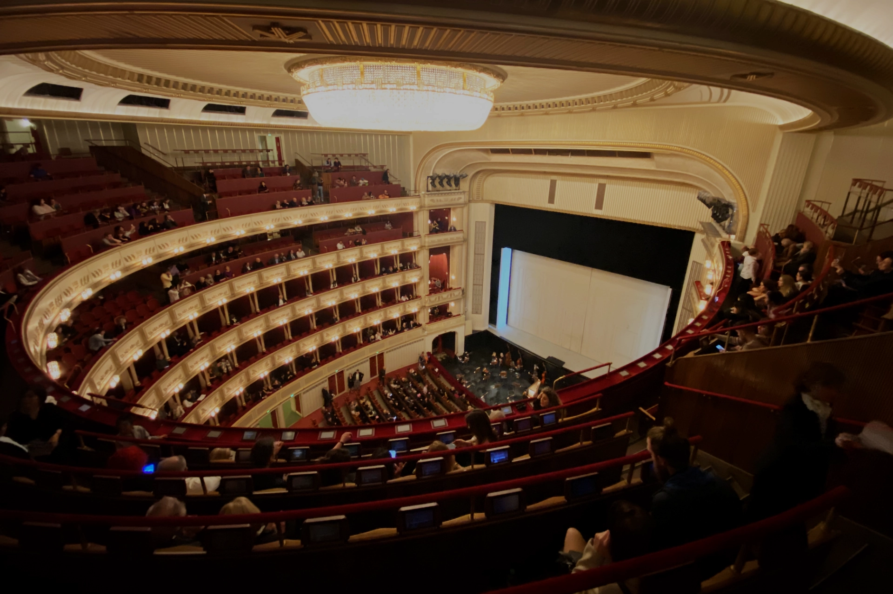
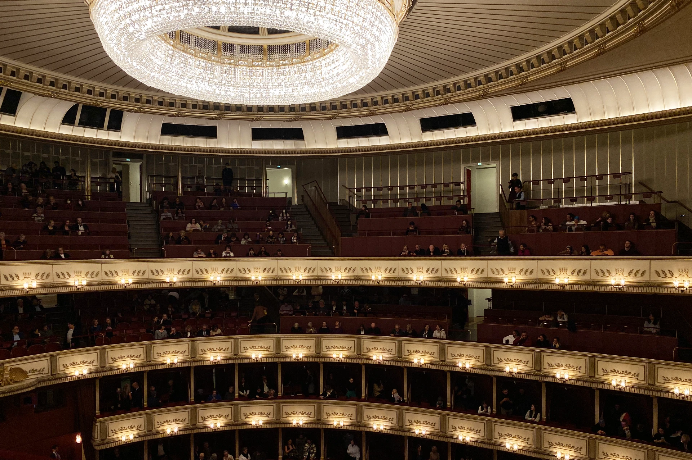
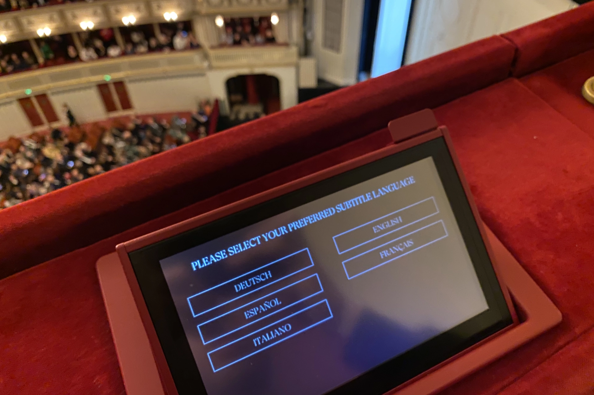
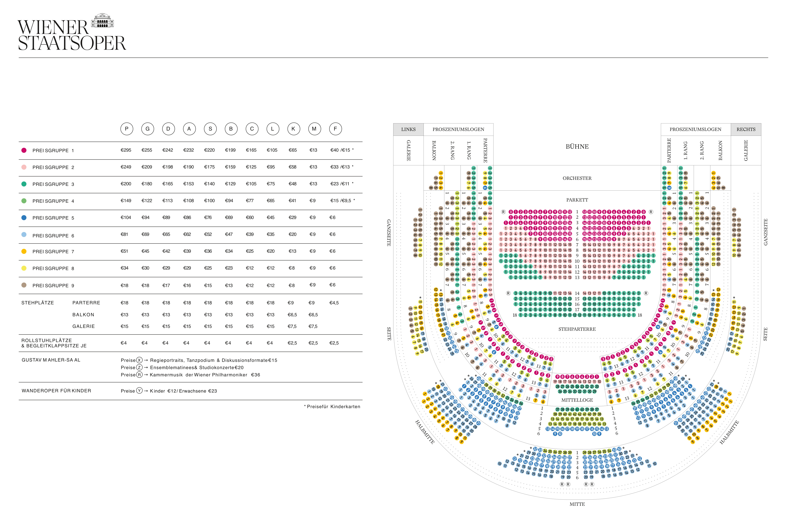
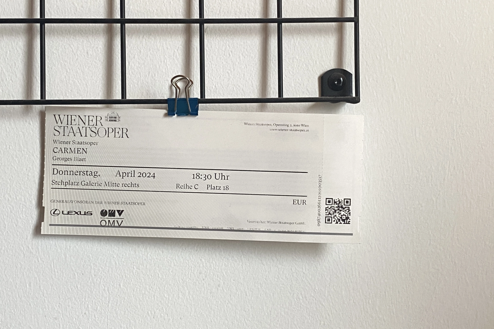
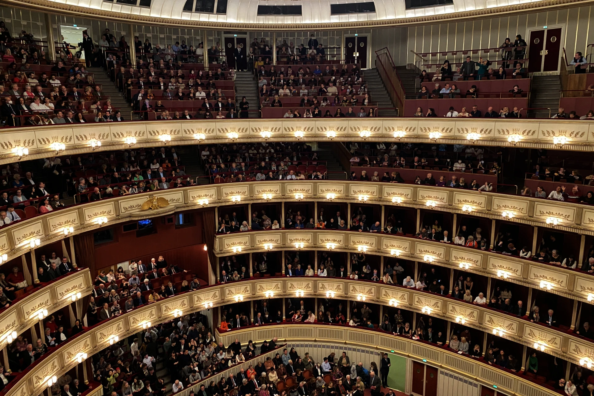

到了[**維也納**](https://exittaiwan.com/posts/%E7%B6%AD%E4%B9%9F%E7%B4%8D%E8%87%AA%E7%94%B1%E8%A1%8C%E6%97%85%E9%81%8A%E5%85%A8%E6%94%BB%E7%95%A5/)，你一定不會錯過的建築就是維也納國家（立）歌劇院了！19 世紀中建成的維也納國立歌劇院（德文：Wiener Staatsoper）是文藝復興風格的建築，有超過一千七百個座位，並座落在主要道路環城大道（德文：Ring）上。

> ✔️ 越早訂越便宜：[**現在查詢維也納房價**](https://www.booking.com/city/at/vienna.en.html?aid=7956794&no_rooms=1&group_adults=2)

維也納歌劇院由奧地利皇帝法蘭茲・約瑟夫一世（德語：Franz Josef I；匈牙利語：I. Ferenc József）和茜茜皇后（德語：Elisabeth Amalie Eugenie）命名為維也納宮廷歌劇院，在 1921 年才改名為國立歌劇院，現在是維也納愛樂樂團和維也納國家芭蕾舞團的所在地，且每年會盛大舉辦維也納歌劇院舞會。

## 維也納國家歌劇院基本資訊

- 地址：Opernring 2, 1010 Wien ([Google Maps](https://maps.app.goo.gl/ktk45RvvSCCr2pLh7))
- 交通：地鐵 U1 或 U4 線搭到卡爾廣場（Karlsplatz）站，步行約五分鐘；路面電車 71 號搭到 Schwarzenbergplatz 站；公車 59A 搭到歌劇院，卡爾廣場（Oper, Karlsplatz）站或是 4A 搭到卡爾廣場（Karlsplatz）站
- 演出門票價格：€10 ~ €250+

> 推薦閱讀：
>
> ✔️ [**維也納市區自由行交通攻略｜維也納交通核心區在哪裡？這篇文章告訴你**](https://exittaiwan.com/posts/維也納市區交通攻略/)
>
> ✔️ [**維也納自由行旅遊全攻略｜維也納旅遊景點、交通、住宿懶人包**](https://exittaiwan.com/posts/%E7%B6%AD%E4%B9%9F%E7%B4%8D%E8%87%AA%E7%94%B1%E8%A1%8C%E6%97%85%E9%81%8A%E5%85%A8%E6%94%BB%E7%95%A5/)

## 維也納國家歌劇院演出節目

維也納國家歌劇院一年算一季，從每年的九月開始，一直到隔年的六月底幾乎每天都有演出。夏天七、八月則是休季時間。和地理位置相距不遠的[金色大廳](https://exittaiwan.com/posts/%E7%B6%AD%E4%B9%9F%E7%B4%8D%E9%87%91%E8%89%B2%E5%A4%A7%E5%BB%B3%E5%AE%8C%E5%85%A8%E6%8C%87%E5%8D%97/)一樣，維也納國立歌劇院就算在休季期間也有[付費導覽服務](https://www.wiener-staatsoper.at/en/guided-tours/)。

許多有名的芭雷舞演出和歌劇表演都可以在這裡欣賞到，像是天鵝湖《[Schwanensee](https://www.wiener-staatsoper.at/en/calendar/detail/schwanensee/)》、羅密歐與茱麗葉《[Roméo et Juliette](https://www.wiener-staatsoper.at/en/calendar/detail/romeo-et-juliette/)》、費加洛的婚禮《[Le nozze di Figaro](https://www.wiener-staatsoper.at/en/calendar/detail/le-nozze-di-figaro/)》、卡門《[Carmen](https://www.wiener-staatsoper.at/en/calendar/detail/carmen/)》、和魔笛《[Die Zauber­flöte](https://www.wiener-staatsoper.at/en/calendar/detail/die-zauberfloete/)》等等。

更詳細的節目表可以到[維也納國立歌劇院的官方網站上查看](https://www.wiener-staatsoper.at/en/calendar/)。

歌劇院的演出在每個位子前都有一個小螢幕，可以選擇各國語言的翻譯（德文、西班牙語、義大利文、英文、法文），英文好一點的人就可以知道對話的內容，英文能力不夠好的人也可以在欣賞演出之前先上網查劇情大綱，就很容易知道現在在演什麼劇情了。

## 維也納國家歌劇院座位分佈

雖然這張座位圖是德文的，不過你只要知道左邊是各個區域和演出類型（P、G、D、A 等等）的票價、右邊則是座位表，稍微對照就可以大概知道座位和票價分佈了。

### **地面座位區 Parkett**

維也納國立歌劇院的 **Parkett** 就是舞台正前方的是**地面座位區**，也就是靠近舞台的主要座位區域，這裡的座位價格較高，因為視野好且音效佳。

### **平面座位區 Parterre**

在法語系國家，**Parterre** 是**平面座位區**的意思，跟 **Parkett** 相似。

### 樓層座位區 Rang

**Rang** 是位於 **Parterre** 上方的第一層，視野很好，尤其是中間的位置，票價通常也偏高，

維也納國立歌劇院的 Rang 有第二層，位置更高，視野也相對較遠，價格比第一層略低。

### 陽台包廂區 Balkon

Balkon 是比 Rang 又更高的樓層，票價通常較便宜，適合預算有限但仍想體驗歌劇的人。

### 三樓座位 Galerie

Galerie 是離舞台最遠、最高的位置，視野偏遠，俯視角度很大，但能完整看到整個舞台和場地的佈局。這裡的票價是最便宜的，和 Balkon 一樣適合預算有限但仍希望進入劇院觀看表演的觀眾。

> ⚠️ **特別注意** ⚠️
> 
> 如果是坐在**和交響樂團平行的陽台席位**，不論是 Parterre、Rang、Balkon、或是 Galerie，為了演出者的安全，**手機是完全禁止的**，連演出前後要拍照、或是演出進行中拿出來想要滑都會被工作人員警告制止，演出前後要拍照的話一定要走到劇院其他地方才可以喔！

### 站位 Stehplatz

在座位圖上，站票的顏色是淺淺、小小的灰色。維也納國立歌劇院的站票根據演出種類，從 €13 到 €18 都有，整個場地共有 435 個站位。

不像[金色大廳的站位](https://exittaiwan.com/posts/%E7%B6%AD%E4%B9%9F%E7%B4%8D%E9%87%91%E8%89%B2%E5%A4%A7%E5%BB%B3%E5%AE%8C%E5%85%A8%E6%8C%87%E5%8D%97/)是先入場先卡位，維也納國立歌劇院的站位是要對號入「站」的。站票在演出當天的上午十點可以線上或是現場到售票處購買，如果演出開始前 80 分鐘還有站位，這些站位會被釋出，並且只能在售票處現場購買。

> ✔️ 越早訂越便宜：[**現在查詢維也納房價**](https://www.booking.com/city/at/vienna.en.html?aid=7956794&no_rooms=1&group_adults=2)

## 維也納國家歌劇院購票教學

1. 在維也納國立歌劇院的官網上查看[**當月節目表**](https://www.wiener-staatsoper.at/en/calendar/)，選擇日期時間場次。
2. 根據自身喜好和預算選擇座位。
3. 演出進場開始前，用手機下載電子票卷，或是至維也納國家歌劇院櫃檯兌換實體門票即可。

## 觀賞維也納國家歌劇院演出注意事項

1. 雖然沒有硬性規定，不過聽歌劇演出是一項優雅、端莊的活動，所以最好避免穿著拖鞋、短褲短裙、運動衫等等太過休閒的服裝。那要穿什麼？就把去歌劇演出當作是去一場約會吧！
2. 因安全考量，大衣、大型包包、雨傘等需寄放於衣物間，不需額外付費。
3. 演出有中間有 10 ~ 20 分鐘的中場休息，時間到前會響鈴提醒觀眾回到座位。
4. 演出前請記得將電子產品關機或調成靜音。
5. 演出進行中，禁止拍照和錄影。
6. 演出開始後，遲到的觀眾無法入場，僅允許中場休息期間再入座，敬請提前抵達歌劇院。