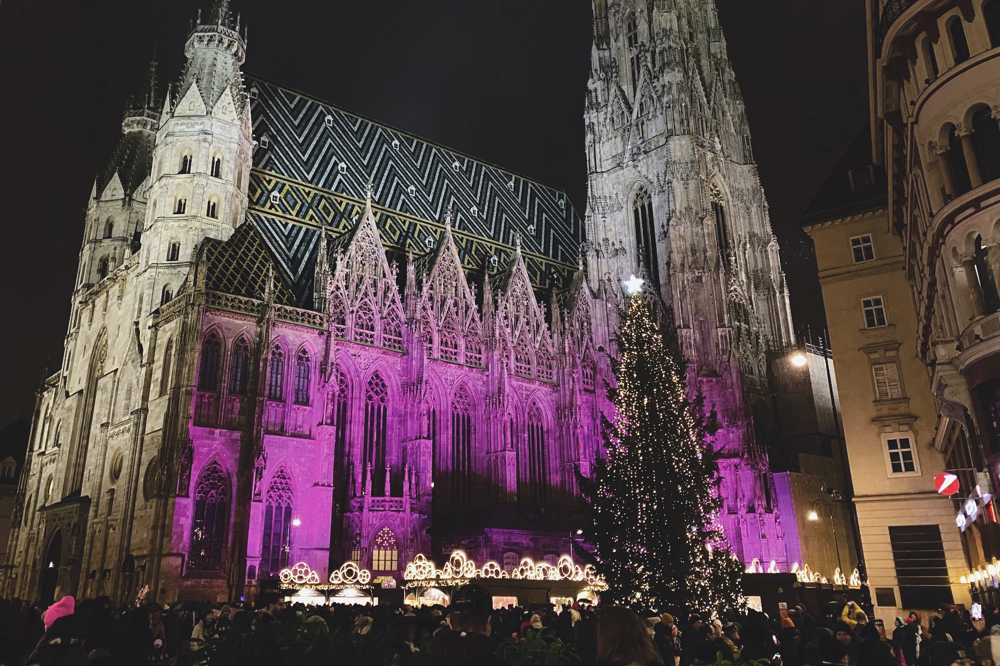
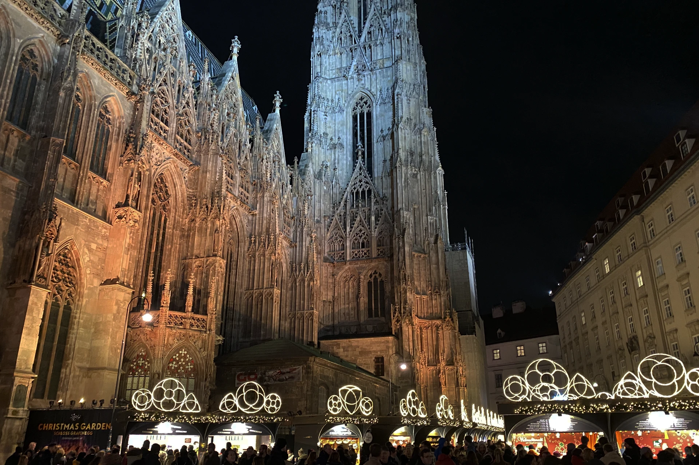
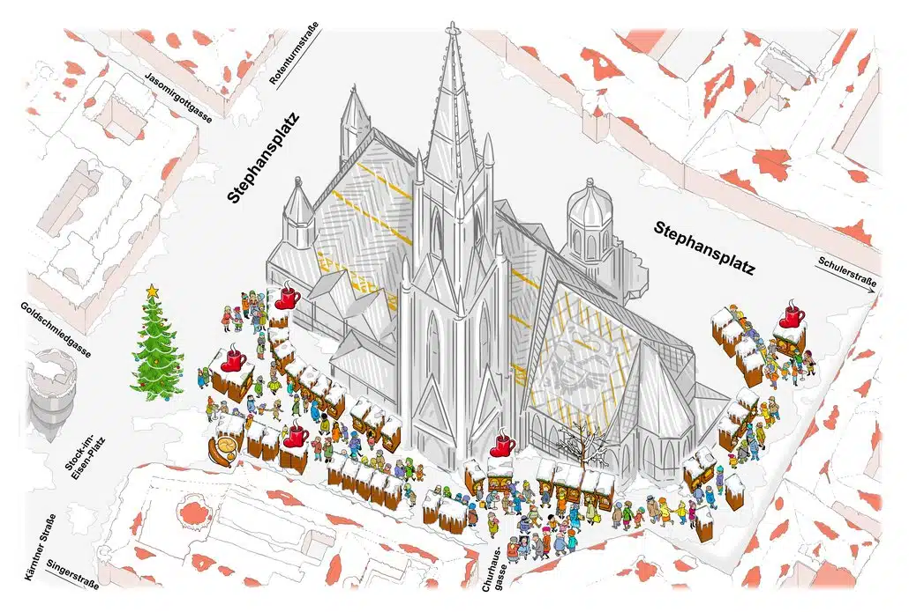
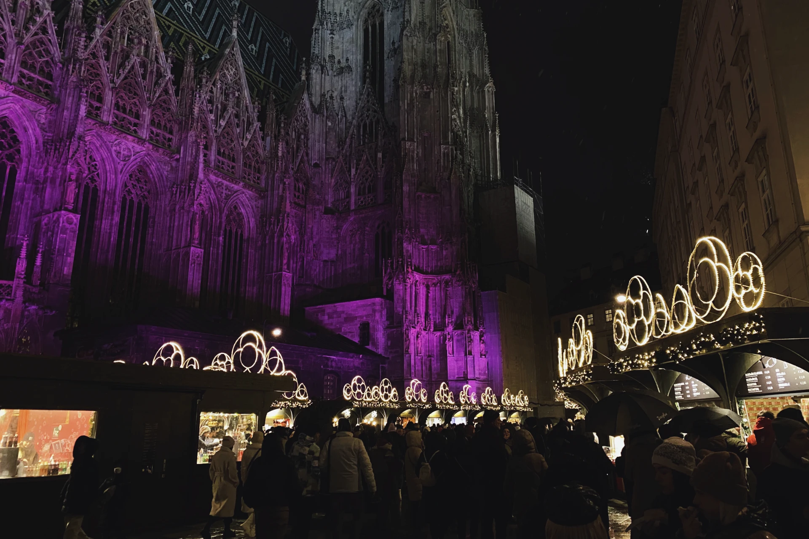
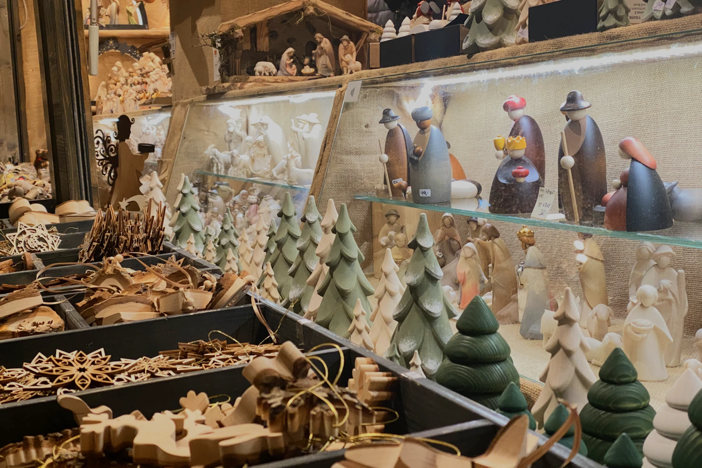
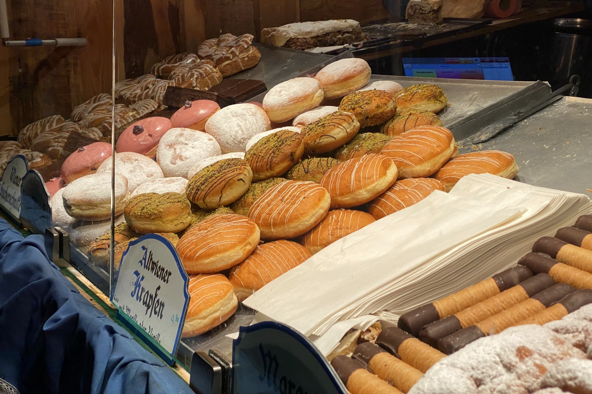
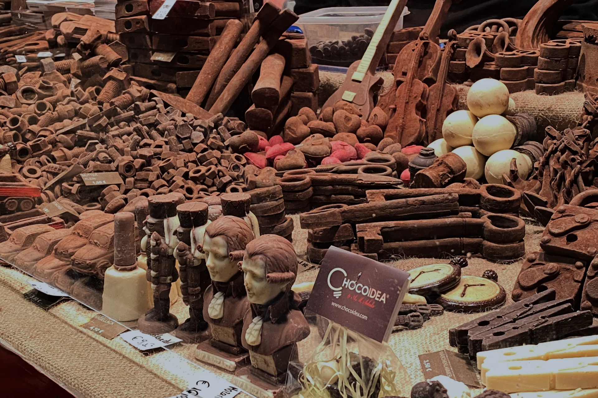
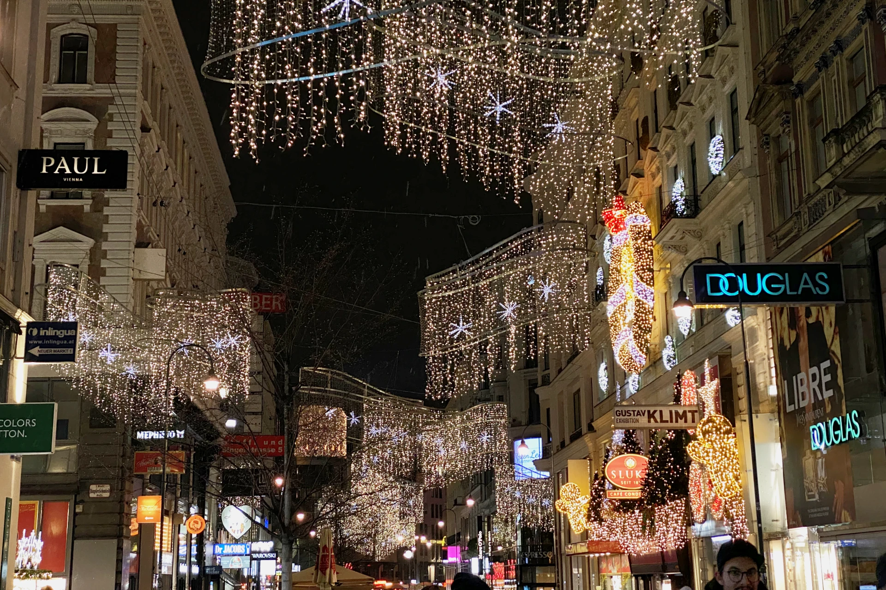

沈浸在世界文化遺產的薰陶中，在聖誕時節來浪漫的史蒂芬廣場（德文：Stephansplatz）聖誕市集一遊吧！

環繞著聖史蒂芬教堂（德文：Stephanskirche），每年底的聖誕市集都吸引來自各國的遊客前來拜訪。

史蒂芬廣場的聖誕市集交通方便、鄰近購物街、觀光景點如維也納歌劇院、三位一體黑死病紀念柱、城市公園等、附近也有不少美食餐廳選擇。

自由行的旅客行程彈性，也可以在逛完史蒂芬廣場聖誕市集之後，步行 15 ~ 20 分鐘到規模最大的[市政廳廣場聖誕市集](https://exittaiwan.com/posts/%E7%B6%AD%E4%B9%9F%E7%B4%8D%E5%B8%82%E6%94%BF%E5%BB%B3%E5%BB%A3%E5%A0%B4%E8%81%96%E8%AA%95%E5%B8%82%E9%9B%86/)湊熱鬧喔！

<!-- 維也納自由行攻略 -->

## 史蒂芬廣場聖誕市集基本資訊

- 日期：11 月 8 日 ~ 12 月 26 日（2024 年）
- 開放時間：每天早上 11：00 ~ 晚上 9：00（12 月 24 日只到下午 4：00；12 月 25 和 26 日到晚上 7：00）
- 地址：Stephansplatz, 1010 Vienna（[Google Maps](https://www.google.com/maps/place/Stephansplatz,+1010+Wien/@48.2087472,16.3633768,15z/data=!3m1!4b1!4m6!3m5!1s0x476d079f3e69c281:0x20563c156aa1fde!8m2!3d48.2087334!4d16.3736765!16s%2Fm%2F025wfts?authuser=1&entry=ttu)）
- 交通：地鐵 U1 或 U3 到 Stephansplatz（史蒂芬廣場） 站；公車路線 1A、2A、3A 到 Stephansplatz（史蒂芬廣場） 站

> 推薦閱讀：[**維也納自由行市區交通攻略｜維也納交通核心區在哪裡？這篇文章告訴你**](https://exittaiwan.com/posts/%E7%B6%AD%E4%B9%9F%E7%B4%8D%E5%B8%82%E5%8D%80%E4%BA%A4%E9%80%9A%E6%94%BB%E7%95%A5/)

## 史蒂芬廣場聖誕市集特色

### 聖史蒂芬教堂 Stephanskirche

史蒂芬廣場可以說是[**維也納市區**](https://exittaiwan.com/posts/%E7%B6%AD%E4%B9%9F%E7%B4%8D%E8%87%AA%E7%94%B1%E8%A1%8C%E6%97%85%E9%81%8A%E5%85%A8%E6%94%BB%E7%95%A5/)的中心點，而最有代表性的建築物當然就是聖史蒂芬教堂了。聖誕市集期間，天黑後會有各種色彩的燈光打在教堂的外牆，配上教堂前方一顆大大的聖誕樹和圍繞在教堂周圍、金光閃閃的聖誕市集，充滿了過節的氣氛！

很多攤賣有賣可愛的木頭雕塑品。

各種烘焙類的食物當然也會在聖誕市集出現！

各種造型、很可愛的巧克力。

### 史蒂芬廣場購物商圈 Stephansplatz

史蒂芬廣場除了教堂外，以教堂為中心的圓周都是徒步購物街。

這一區購物街有精品百貨 Steffel、各精品品牌獨立門市（Chanel、LV、Fendi、Hermès）、還有像是 Rolex、施華洛世奇水晶旗艦店、瑞士維氏（Victorinox）也都在這裡，根本是精品人的購物天堂！

趁著聖誕時節，快安排一場到史蒂芬廣場聖誕市集的旅行吧！

<!-- 維也納機場退稅攻略 -->

<!-- 逛完了史蒂芬廣場聖誕市集還意猶未盡嗎？還是對逛街沒什麼興趣，想要找點樂子？那你一定要去離史蒂芬廣場不遠的市政廳！市政廳前廣場聖誕市集是維也納最有名的聖誕市集。不僅攤位數量多，甚至還有溜冰場可以玩！看看這篇市政廳前廣場聖誕市集攻略了解更多吧！-->