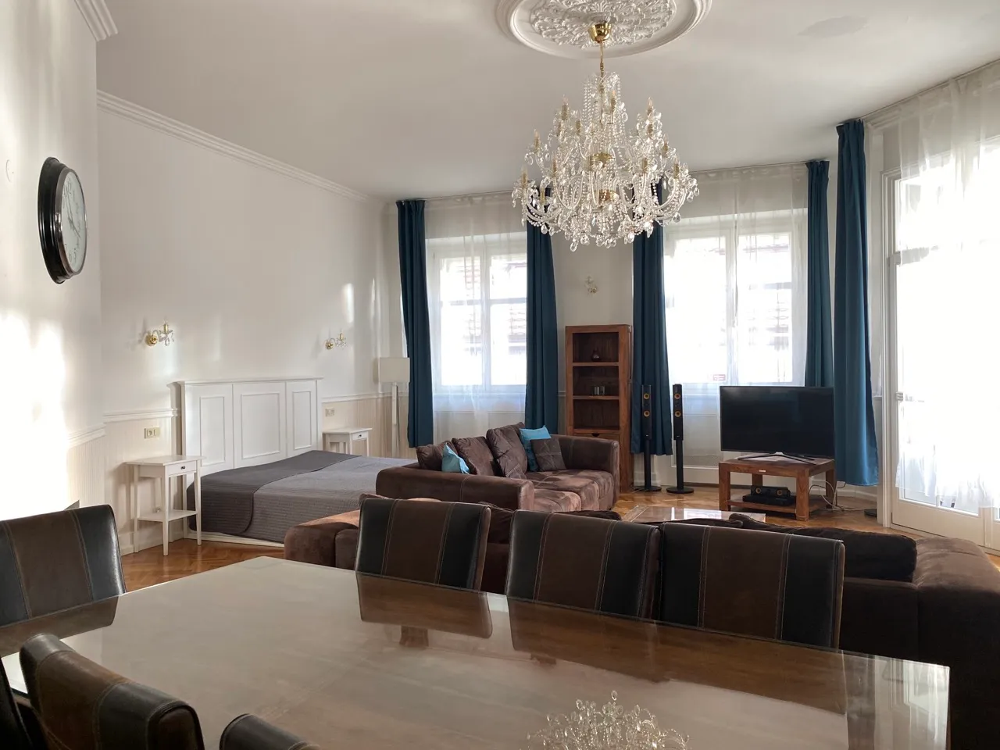
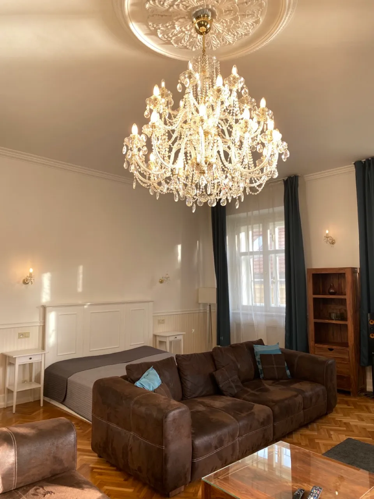
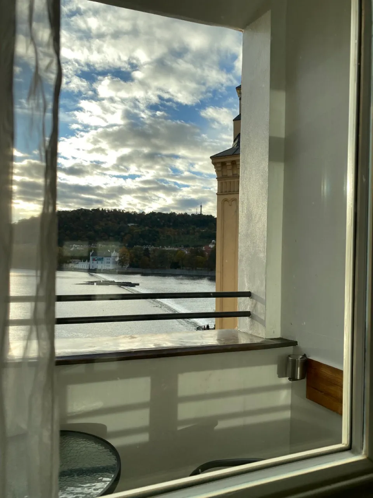
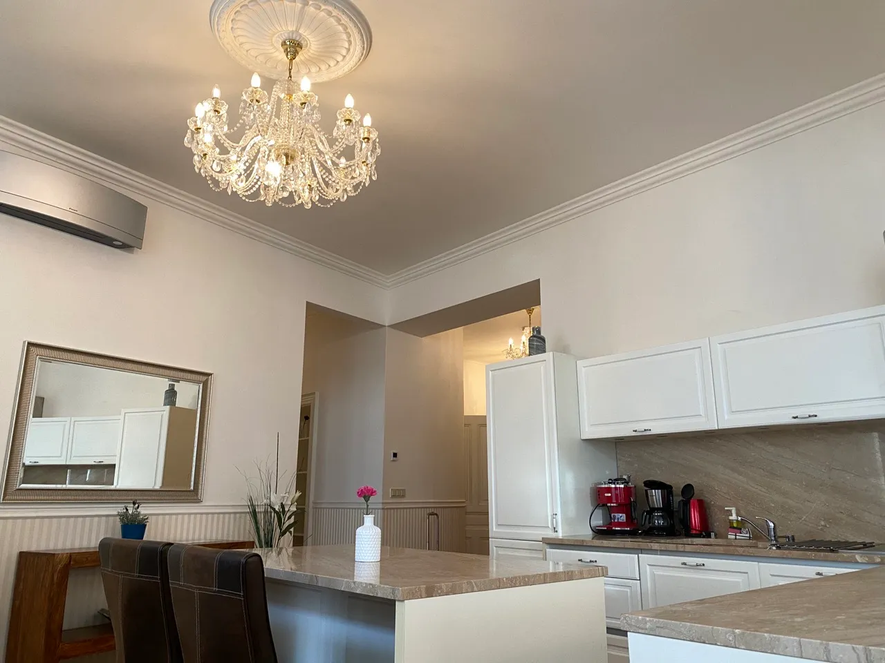
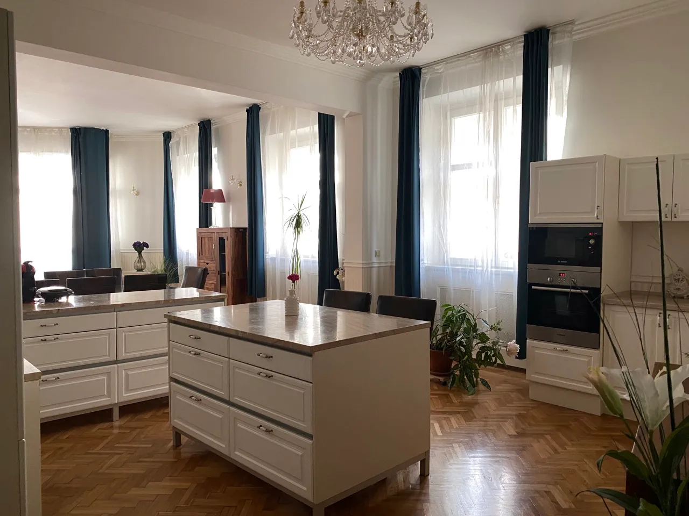
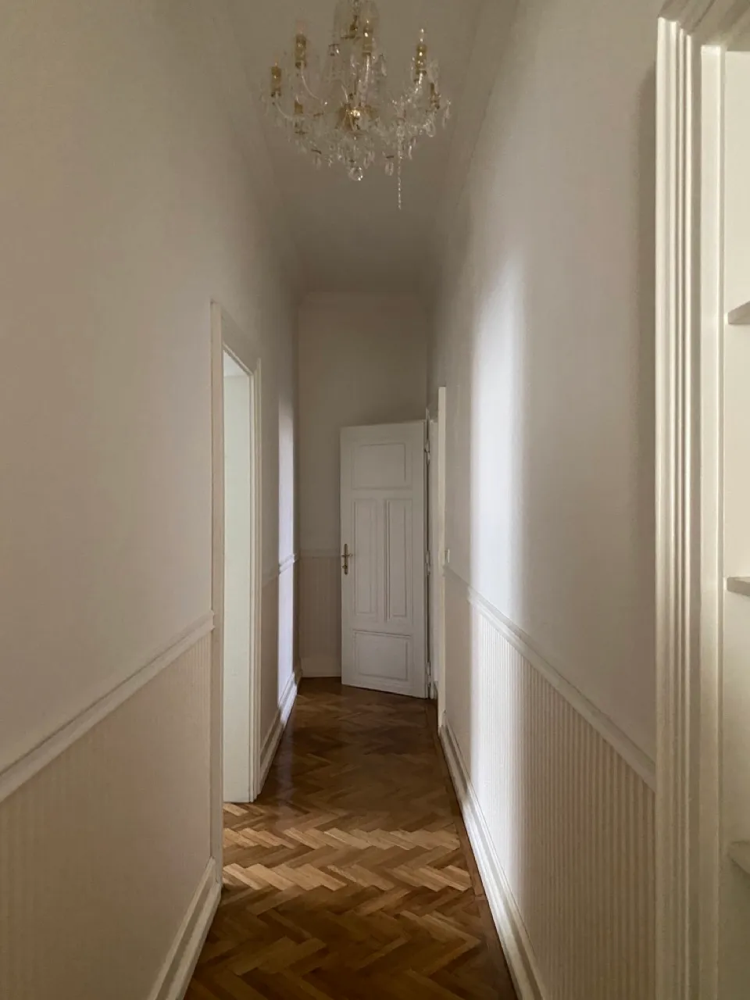
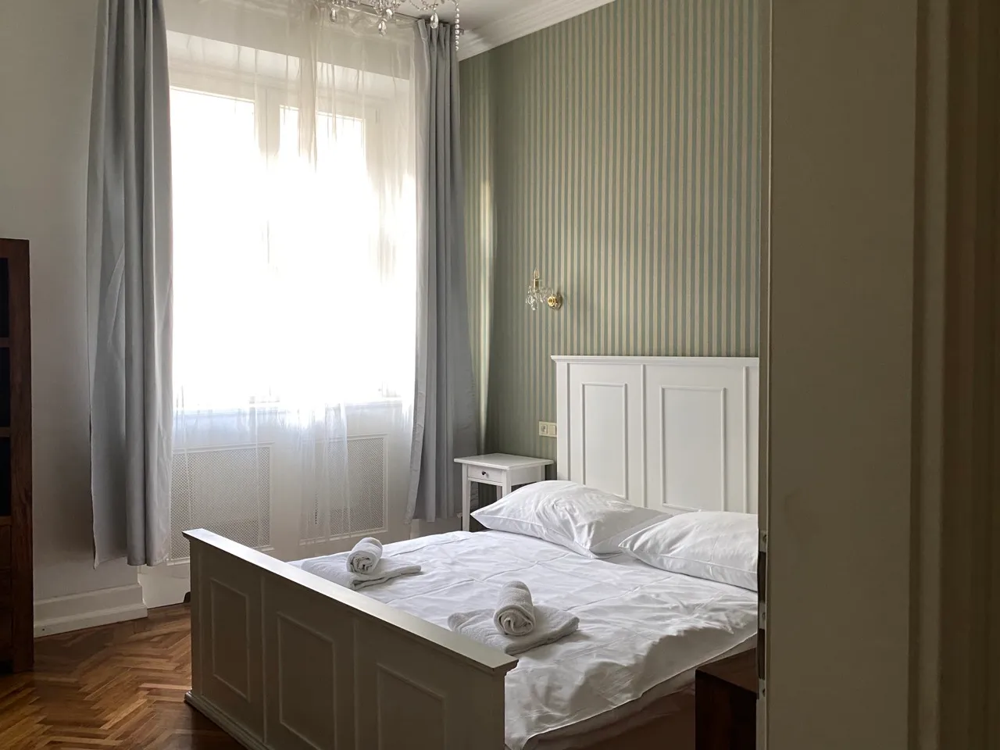
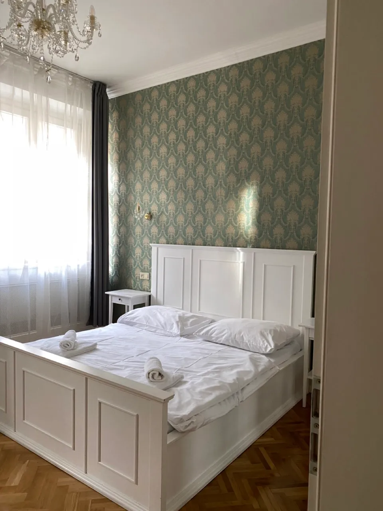
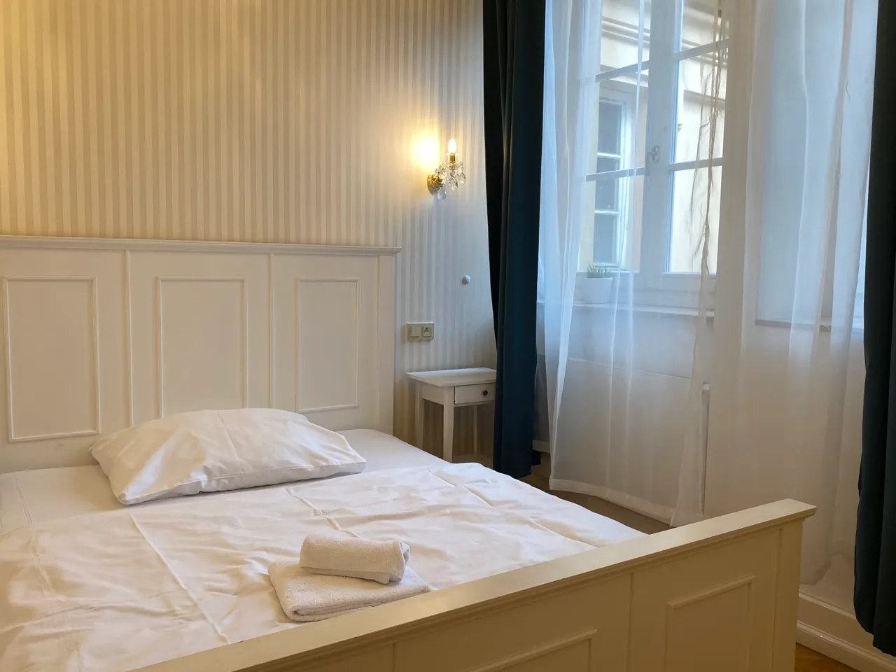
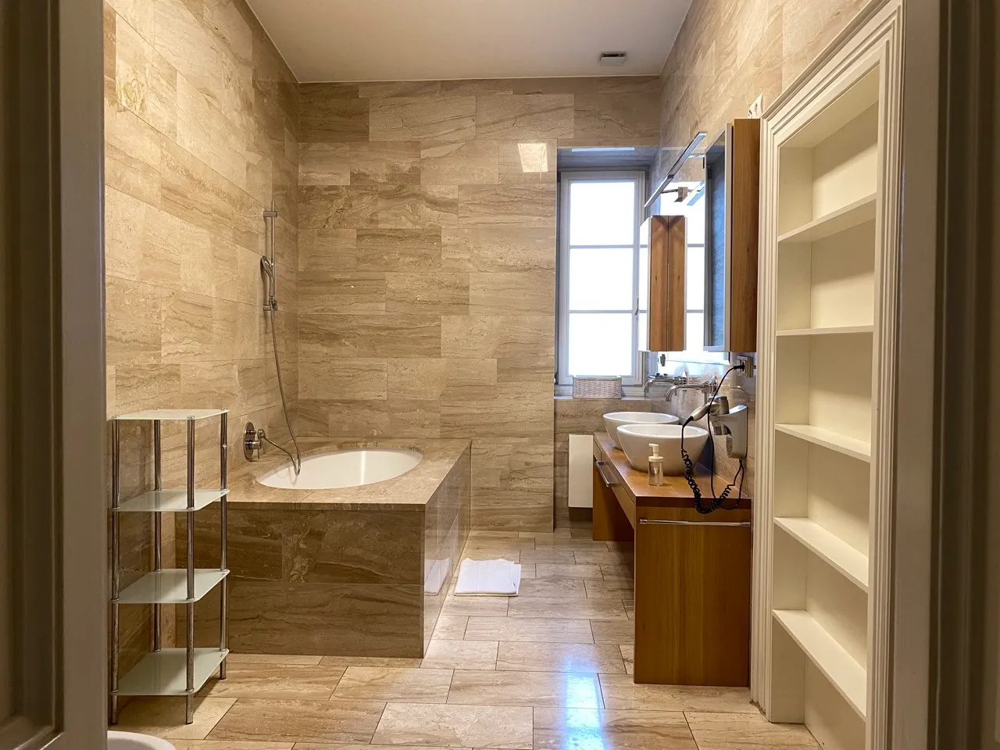

只要安排在捷克布拉格自由行旅遊，每個人都不會錯過的景點就是在十五世紀初（西元 1406 年）完工的查理大橋（捷克語：Karlův most），以這裡為中心，旅客可以輕鬆的前往老城區的天文鐘、城堡區的教堂、或是高堡區的猶太景點。

今天要介紹的這間 [**Smetanovo nábřeží 26 - Riverview Old Town Apartment 公寓式飯店**](https://www.booking.com/hotel/cz/riverview-old-town-apartment.xt.html?aid=7956794&no_rooms=1&group_adults=2)（以下簡稱老城河景公寓），正好就位在查理大橋旁，擁有絕佳的地點和景色，且公寓空間非常大又氣派，不管是家族旅行、或是一群朋友自由行，只要是團體一起行動，這就是一個方便又划算的布拉格住宿選擇。

## Smetanovo nábřeží 26 - Riverview Old Town Apartment 捷克布拉格老城河景公寓基本資訊

- 地址：Smetanovo nábřeží 26, Prague, 110 00（[Google Maps](https://www.google.com/maps/place/Smetanovo+n%C3%A1b%C5%99.+197%2F26,+110+00+Star%C3%A9+M%C4%9Bsto,+%E6%8D%B7%E5%85%8B/@50.0855374,14.4115792,17z/data=!3m1!4b1!4m6!3m5!1s0x470b94e58c0f2bef:0x80101d266595b34d!8m2!3d50.0855374!4d14.4141541!16s%2Fg%2F11jv73x1_y?entry=ttu)）
- 接待處地址：Masná 686/20, 110 00 Staré Město（[Google Maps](https://www.google.com/maps/place/Masn%C3%A1+686%2F20,+110+00+Star%C3%A9+M%C4%9Bsto,+%E6%8D%B7%E5%85%8B/@50.0896109,14.4232176,17z/data=!3m1!4b1!4m6!3m5!1s0x470b94ea150d48ed:0xb0a7b4d3c6817320!8m2!3d50.0896109!4d14.4257925!16s%2Fg%2F11csjhm6m7?authuser=1&entry=ttu)）*地鐵 Náměstí Republiky（共和廣場）站步行約五分鐘
- 交通：路面電車 Karlovy lázně 站步行一分鐘
- 是否含早餐：無
- 平均每晚價格：台幣 5,000 ~ 13,000 ($$)
- 查看即時房價：[**點我前往**](https://www.booking.com/hotel/cz/riverview-old-town-apartment.xt.html?aid=7956794&no_rooms=1&group_adults=2)

## 老城河景公寓實際入住體驗

在接待處領完鑰匙之後，不論你透過什麼方式前往查理大橋，只要從查理大橋老城端走路不用一分鐘，就會到達這間 Smetanovo nábřeží 26 - Riverview Old Town Apartment 老城河景公寓的門口囉。

大門可以透過電子密碼鎖或是鑰匙開門，因為是公寓式飯店，所以不論是建築的外觀和內部就像一般民宅一樣，搭乘庭院裡面的老舊電梯前往三樓的房間，也是很有趣的體驗。

### 客廳

老城河景公寓的客廳空間寬敞、日照明亮。

客廳附有電視、環繞音響、兩張大沙發和客廳桌、一張雙人床，如果同行人數超過 6 人（三間雙人房），也可以選擇睡在客廳的床和沙發上。

客廳旁還連接著一個小陽台，有著這整層公寓最好的景觀。

雖然沒有辦法直接看到查理大橋本人，不過能看到伏爾塔瓦（捷克語：Vltava）河景和日落時的光線，有閒情逸致的人絕對要在這邊享受早餐或下午茶。

### 廚房

老城河景公寓的廚房器具非常齊全，烤土司機、咖啡機、烤箱、微波爐、大冰箱、洗碗機應有盡有。

怕在歐洲旅行時吃外面太貴，可以買回來自己煮，也可以外帶回來避免每次餐廳吃飯都要付酒水費和服務費。

### 房間

在老城河景公寓裡面，包含客廳的床算一間房間的話，總共有四間房間。

撇除客廳房，這三間房間都是簡單傳統的雙人房。

### 廁浴

老城河景公寓共有三間獨立的廁浴：一間附有浴缸和廁所的全套衛浴、一間只有淋浴和化妝台的浴室、還有一間單獨的廁所。

飯店提供每位房客大毛巾和小毛巾各一條，有洗手乳和吹風機、衛生紙備品也足夠，但是沫浴乳、洗髮乳等其他個人衛生備品需要自行準備。

## 老城河景公寓整體評價

這次和家人朋友總共五個人入住布拉格的 [**Smetanovo nábřeží 26 - Riverview Old Town Apartment**](https://www.booking.com/hotel/cz/riverview-old-town-apartment.xt.html?aid=7956794&no_rooms=1&group_adults=2) 老城河景公寓式飯店。住了四天三個晚上，整個體驗還算不錯，用親身經驗分享幾個優缺點。

### 老城河景公寓優點

公寓式飯店最常見的優點就是空間大，這間老城河景公寓也不例外，非常適合多人或團體旅行安排住宿。除非是在旺季或是節日旅遊，住宿價格飆升，不然多人平分下來之後的價格是相當划算。

不過這間公寓飯店最大的優點在於它極佳的地點和優美的景色。從查理大橋為中心，去布拉格的任何觀光景點都相當方便。

### 老城河景公寓缺點

老城河景公寓有些缺點是飯店的評論區就有住客已經提過，有些是這次親身體驗之後發現的缺點。

最多人抱怨的就是這間公寓式飯店的接待處和飯店本身的位置不在旁邊，所以辦理入住領完鑰匙之後還需要搬行李跋涉。

走路來說從接待處到飯店大概 15 分鐘可以抵達，如果扛著大包小包的行李，建議搭乘 3 號電車到 Karlovy lázně 站，路程大約 20 分鐘左右，會比走路輕鬆很多。

<!-- 連結布拉格市區交通 -->

以服務來說，接待人員的態度跟效率絕對都「不是最好」的，入住前需要透過手機支付 200 歐元押金（信用卡付款），不確定 check-out 後幾天才會退款；且客服回訊息很慢，就算加了他們的 WhatsApp 也一樣要等很久才會等到回覆。

像是這次在 check-in 時，服務人員曾經說退房時鑰匙放在房間內即可，但為了保險我們在退房前一晚又問了客服確認一次，結果一直到隔天退房時間要到了都沒有人回覆，最後還是拿著鑰匙回到接待處還給他們，讓人感受不太好。

以公寓本身來說，雖然設備很齊全，但還是有不少可以挑惕的點。首先，鑰匙只有一串，所以要回公寓時同行的人要互相協調一下使用鑰匙才能開門回公寓；另外在歐洲的老公寓熱水系統可能都是儲水式，所以六人以上同住時使用熱水可能不夠連續洗澡使用，要稍微分配一下時間和注意熱水用量；最後是衛生上，其中一間房間有霉味，不知道是因為下雨或是什麼原因，以及廚房的洗碗機不太乾淨，所以有使用碗盤的話建議洗碗槽手洗。

### 老城河景公寓評價

總體來說，雖然有些缺點，但都不算太致命的缺點，再考量它的價錢、地點和景色，總分 10 分的話會給他 7 分，推薦 [**Smetanovo nábřeží 26 - Riverview Old Town Apartment 公寓式飯店**](https://www.booking.com/hotel/cz/riverview-old-town-apartment.xt.html?aid=7956794&no_rooms=1&group_adults=2)給即將到捷克布拉格旅行的你。