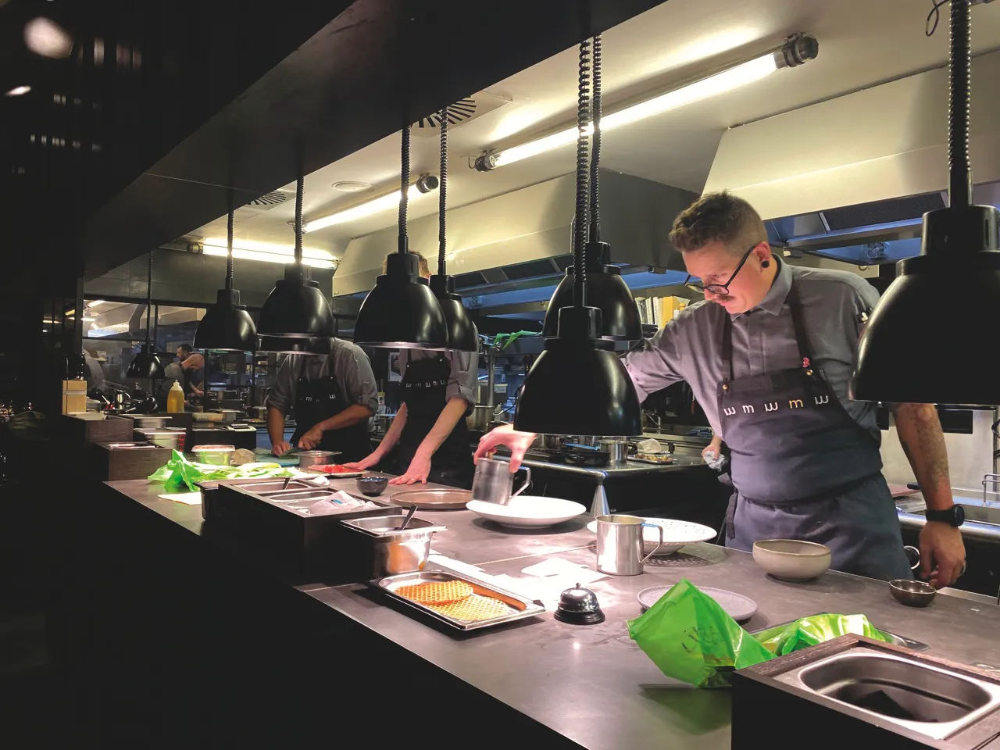
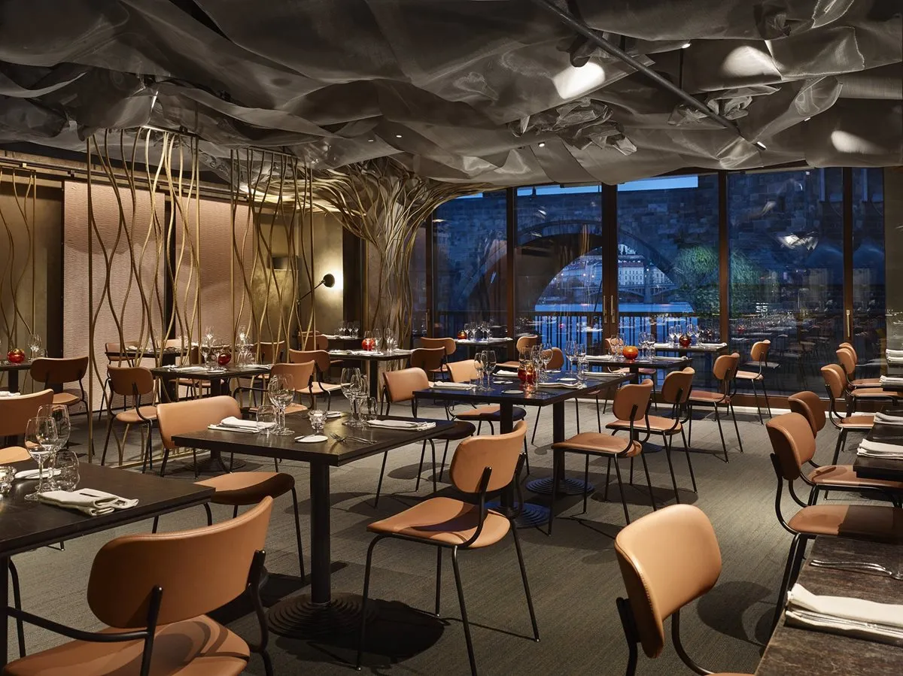
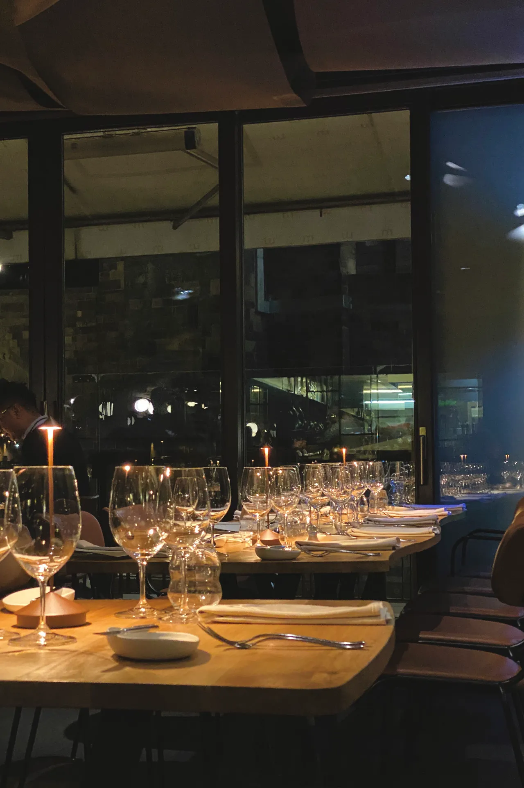
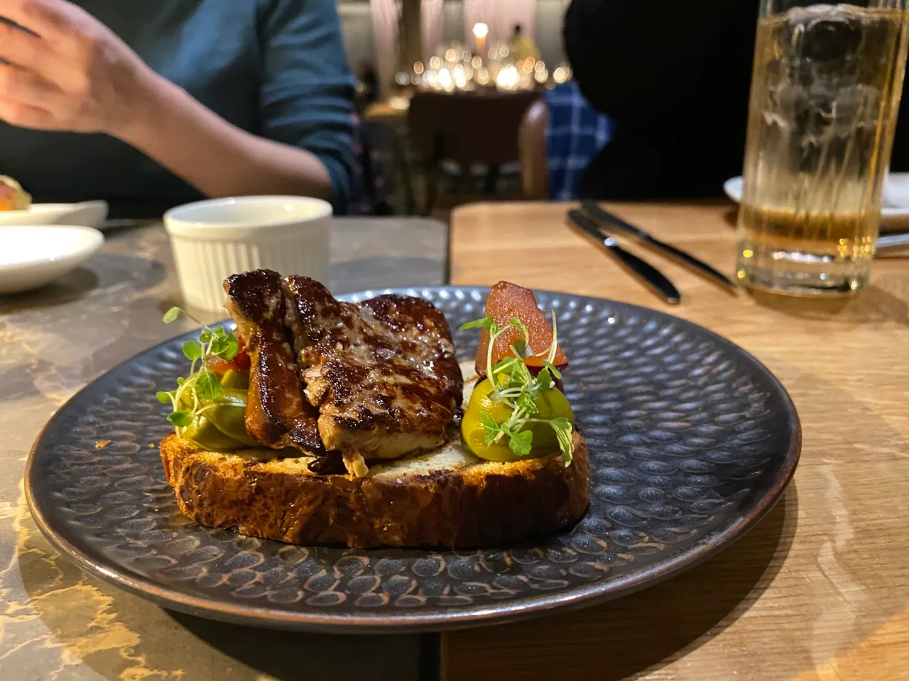
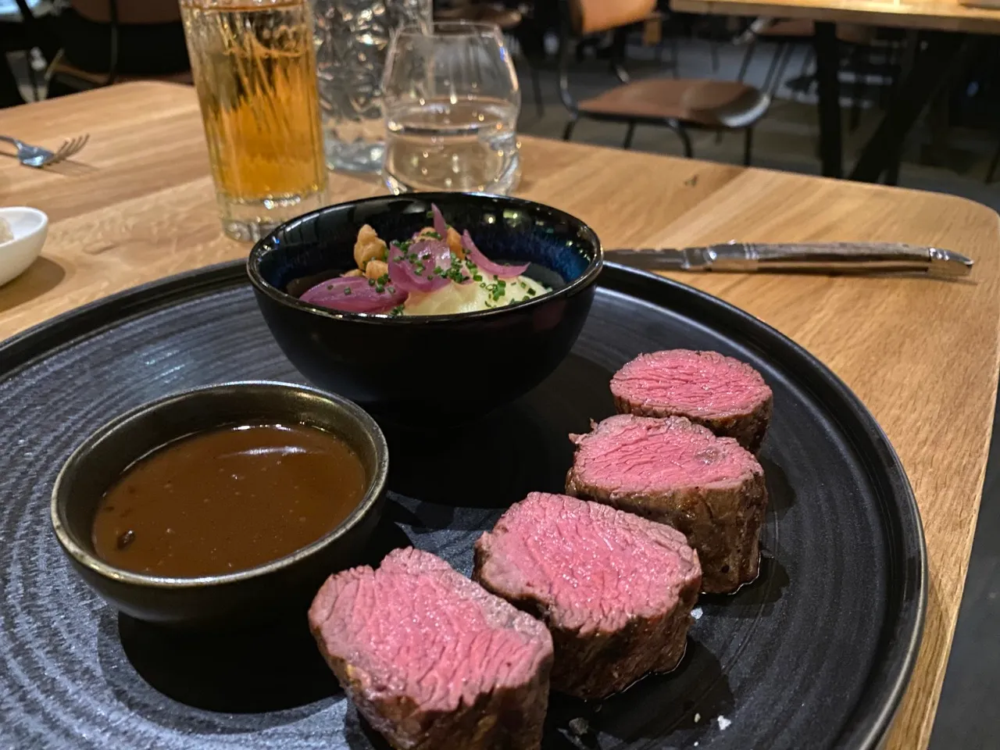
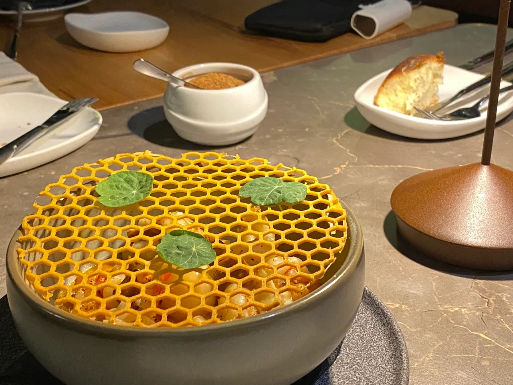
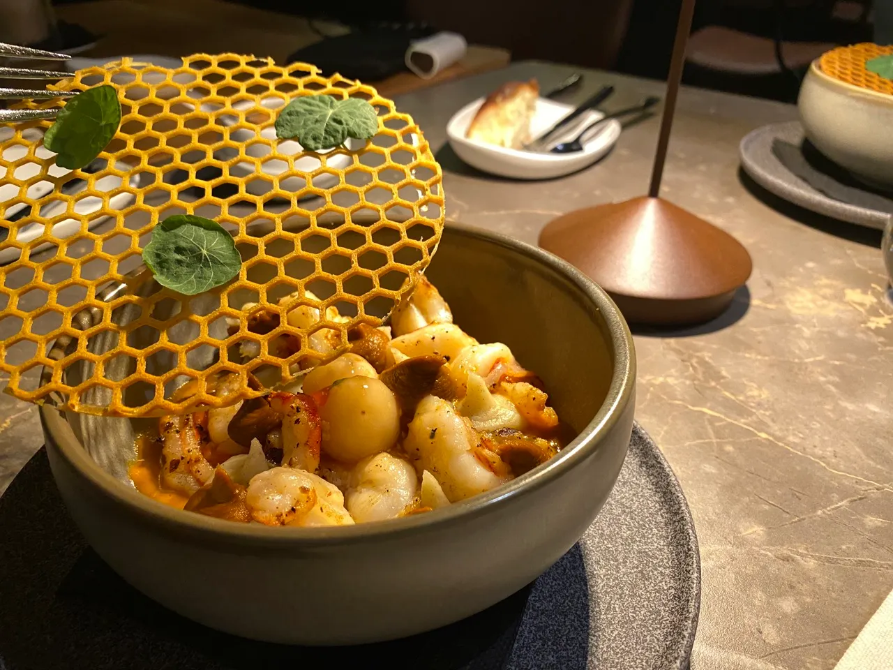
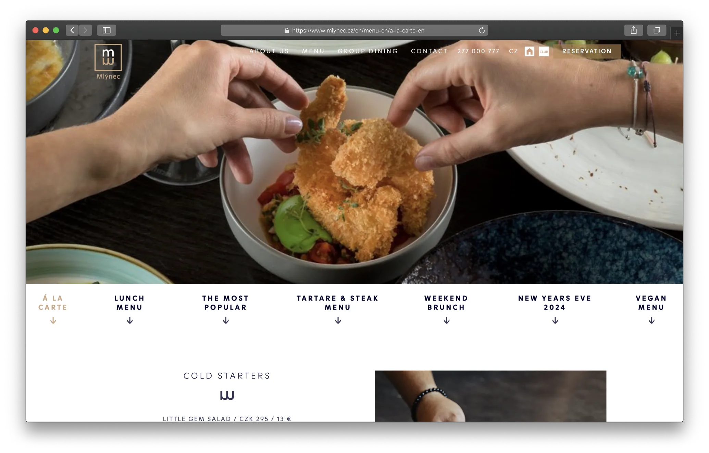

Restaurant Mlýnec 依著伏爾塔瓦（捷克語：Vltava）河畔，從整片的落地窗看出去就是查理大橋，擁有絕佳的景色。

餐廳內的裝潢典雅、室內設計看得出別有用心，搭配開放式的廚房，如果你是剛看完《大熊餐廳》（The Bear）第二季的人，來到這間餐廳一定心中一陣澎湃。

Restaurant Mlýnec 的餐點相比於世界級的景色和裝潢，也毫不遜色。從前菜、主菜、到甜點的擺盤和調味都恰到好處。配上一流的服務團隊，在 Restaurant Mlýnec 用餐可說是一場視覺、味覺、和嗅覺的饗宴。

# Restaurant Mlýnec 餐廳基本資訊

- 營業時間：每日 11:30 ~ 15:00、17:00 ~ 22:00，六日白天時段提供早午餐
- 地址：Novotného lávka 5, 110 00 Staré Město（[Google Maps](https://www.google.com/maps/place/Restaurant+Ml%C3%BDnec/@50.0854324,14.403024,15z/data=!3m1!4b1!4m6!3m5!1s0x470b94e593aac2ab:0xce5781b01698a2d6!8m2!3d50.0854191!4d14.4133023!16s%2Fg%2F1vvr4ysq?authuser=1&entry=ttu)）
- 交通：路面電車 2、13、17、18、93 號搭到 Karlovy lázně 站步行一分鐘
- 訂位：電話 +420277000777；[線上訂位](https://mlynec.apetee.com/en/)
- 付款方式：可刷卡
- 平均消費：每人 1,000 Kč，約台幣 1,400 元

## Restaurant Mlýnec 用餐環境

用餐當天一進門確認有位子後，接待人員就幫我們把大衣拿到衣帽間掛著，從一開始的服務就能感受到這肯定不是間普通的平價餐廳。

往餐廳深處走，開放式廚房就赤裸裸的在你眼前。

用餐區位子很多，但不會有讓人過於擁擠的感覺。

## Restaurant Mlýnec 餐點

用餐當天我們點了一道鵝肝大家分著吃，鵝肝和下面的麵包、水果醬搭配的味道很平衡、也不會太油膩。

主食我們點了牛排、鹿排、和蝦子料理。

搭配牛排的馬鈴薯泥、洋蔥、和醬汁融合在一起，人間美味！

蝦子這道菜的擺盤很有特色，不過口味上對於台灣人來說稍微鹹了一點，應該非常合歐洲人的胃口。

## Restaurant Mlýnec 菜單

Restaurant Mlýnec 的菜單常常做更動，所以建議你[到官網查看當季菜單](https://www.mlynec.cz/en/menu-en/a-la-carte-en)，獲得最即時最新的資訊。

## Restaurant Mlýnec 推薦指數 8／10

滿分十分的話，我會給這間布拉格餐廳 Restaurant Mlýnec 8 分高分！缺點大概是幾樣菜味道太重鹹、價位較高，不過這都是很主觀的感受。再考量到他的位置就在伏爾塔瓦河畔、查理大橋旁，如果你剛好[住在查理大橋附近](https://exittaiwan.com/posts/%E5%B8%83%E6%8B%89%E6%A0%BC%E4%BD%8F%E5%AE%BF-old-town-apartment/)、有安排一餐高檔晚餐在布拉格，那 Restaurant Mlýnec 非常值得你一試。

想要吃到這間餐廳的人一定要提前訂位，而且越早訂位越好，這是一間很熱門的餐廳喔！

<!--czech republic hotel banner—->