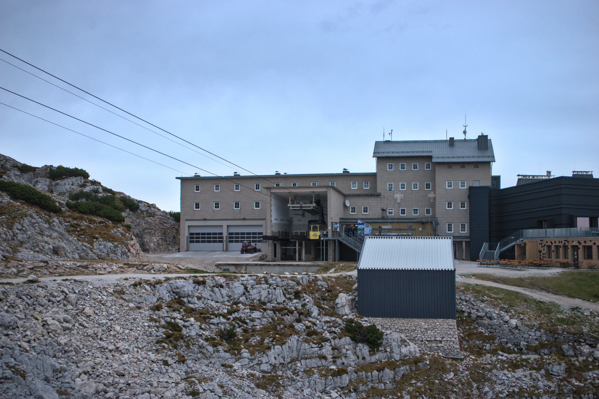
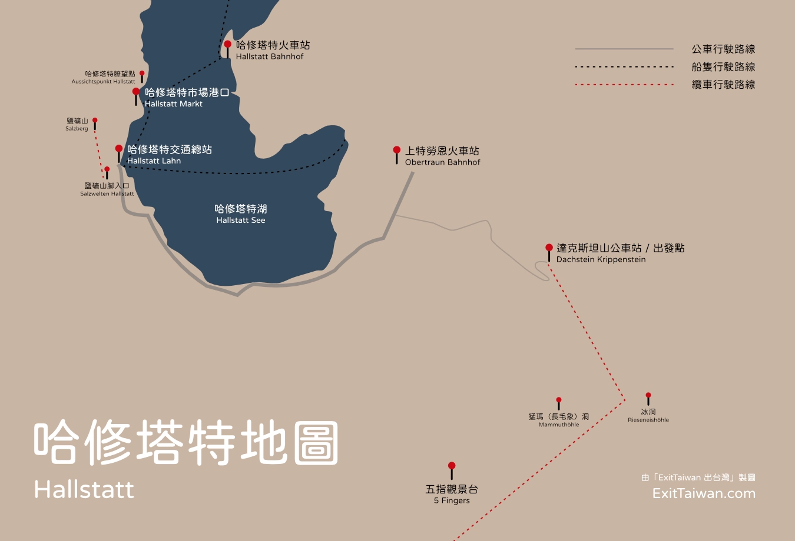
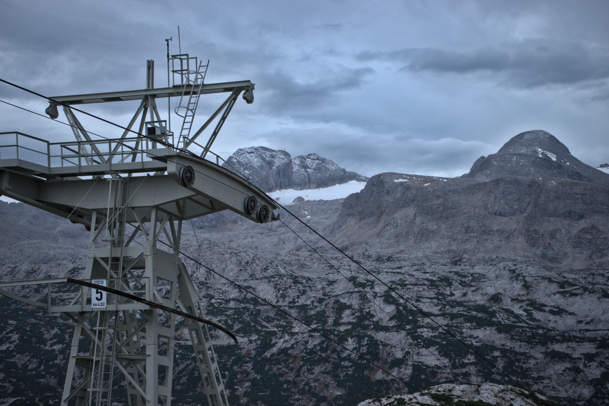
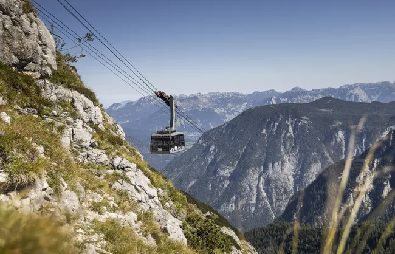
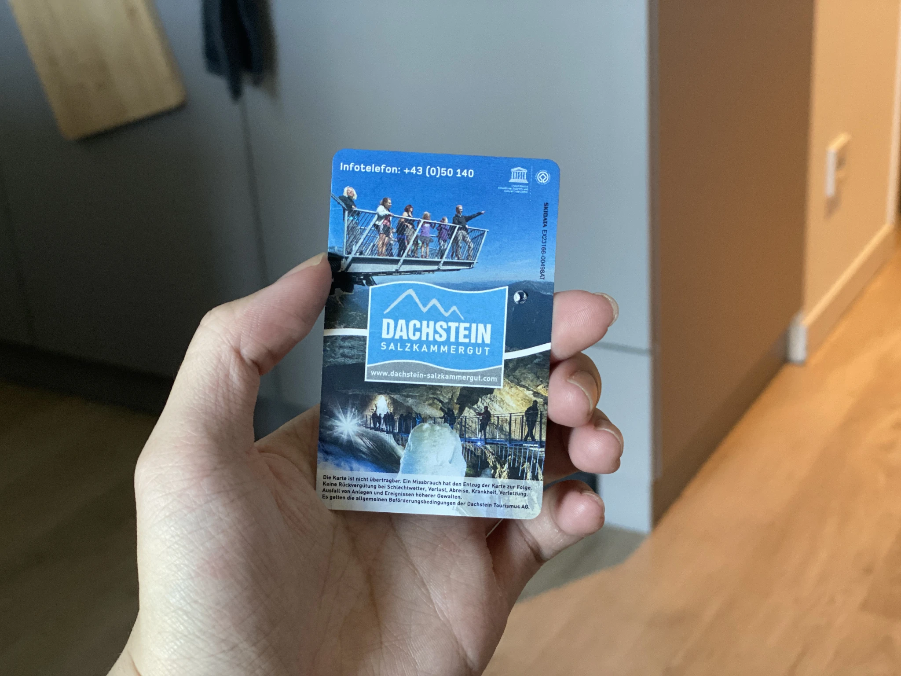
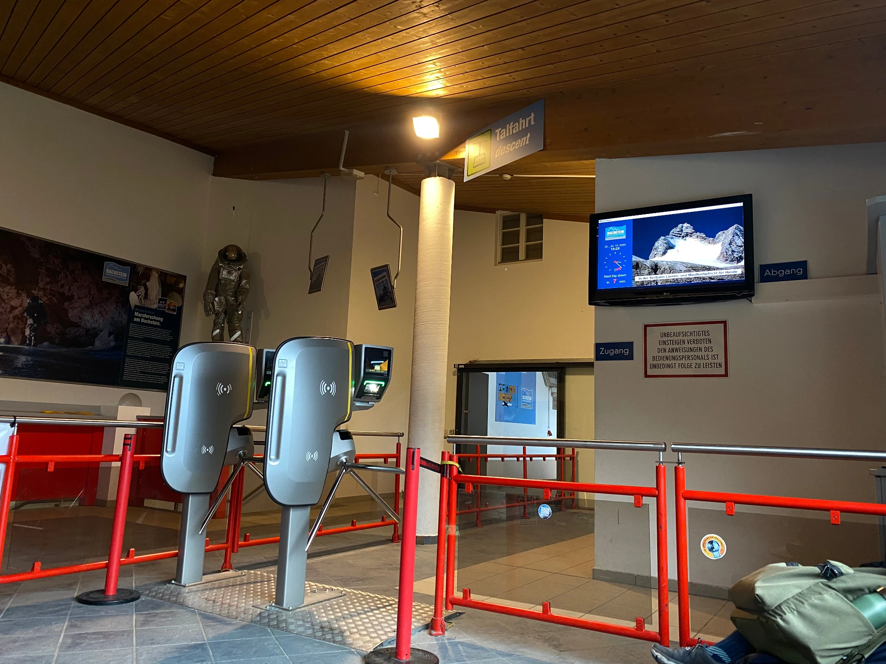
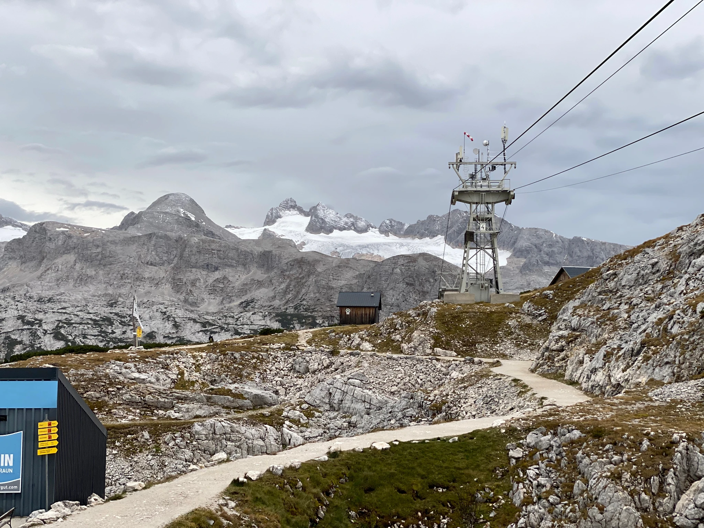
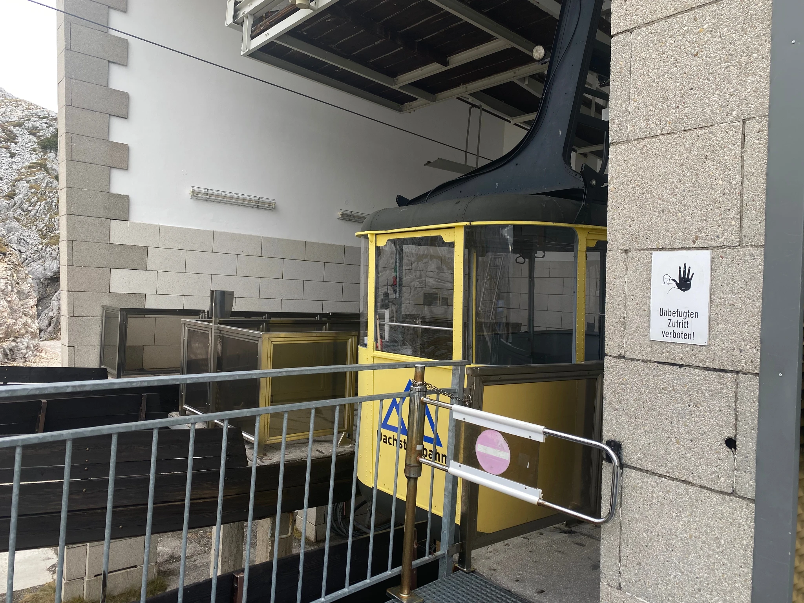

達克斯坦山（德文：Dachstein）位於哈修塔特湖的東南方，是奧地利阿爾卑斯山脈的一部份，因為山上的豐富自然景觀、絕佳視野、且遊客可以從事各種休閒活動而富盛名。

沒來過哈修塔特的人可能會搞錯，在哈修塔特最知名的有兩種纜車，一個是達克斯坦山的纜車，上下山總共有三段、包含出發站共四個纜車站；另外一個是鹽礦山的纜車，搭乘地點就在哈修塔特小鎮附近，行程比較短，只有一段上下山在鹽礦世界售票處和鹽礦山之間運作。

這篇文章是在講達克斯坦山的纜車乘坐教學，如果你對於哈修塔特的交通還不清楚，建議你可以先到「**[哈修塔特自由行全攻略](https://exittaiwan.com/posts/%E5%93%88%E4%BF%AE%E5%A1%94%E7%89%B9%E6%97%85%E9%81%8A%E5%85%A8%E6%94%BB%E7%95%A5/)**」這篇文章稍微過目交通的部分，就可以清楚知道怎麼從小鎮搭公車來到這囉！

> 想要把圖片存下來嗎？**[免費下載哈修塔特地圖＋路線圖](https://exittaiwan.gumroad.com/l/hallstatt)**

達克斯坦山的纜車根據季節會有不同的開放時間，因此要自己注意當天的最末班下山纜車時間，老實說，我們也不確定錯過了末班下山纜車會怎麼樣，但應該不會有人想嘗試看看⋯⋯。

因為要造訪達克斯坦山通常只少要半天以上的時間，所以旅客不可能安排一天內遊玩哈修塔特和達克斯坦山，而是選擇至少在哈修塔特小鎮上或是鄰近達克斯坦山的上特勞恩區下榻一至兩晚，才會有稍微充裕的行程安排喔。

## 達克斯坦山纜車出發站

不論你是**住在上特勞恩（德文：Obertraun）或是哈修塔特小鎮附近，你都可以搭乘 543 號公車到達克斯坦山**。

公車在達克斯坦山的停靠站（德文：Dachstein Krippenstein），下車後直接就是售票處，有了票之後就可以搭乘纜車上山囉。

這裡的票有分蠻多不同的種類，建議你參考「[**哈修塔特五指觀景台旅遊全攻略**](https://exittaiwan.com/posts/哈修塔特五指觀景台旅遊全攻略/)」來決定你想要購買哪一種票，最適合自身的體力、行程時間安排、預算等。

由於阿爾卑斯山區天氣多變，在售票處旁邊就有一個大大的看板，顯示當前的天氣狀況資訊，並標示山區是否有不開放的區域，相同的這些資訊也可以在網路上看到，可以在上山前當作一個參考。

通常大部分旅客會去的，都是難度較低的健行路線，除非氣象狀況真的非常差，大部分時間都是開放的。

## 如何搭乘達克斯坦山纜車

在售票處購票完成後，你會拿到實體的票卷，之後每次搭乘纜車都需要使用此票卷感應進站，所以千萬不要弄丟囉。

包含出發站在內，達克斯坦山纜車共有四站，每站距離約需耗時 5 ~ 10 分鐘，纜車行駛速度和爬升都蠻快的，車廂內有少許座位。

## 上山纜車第一站

來到達克斯坦山纜車的第一站，這裡最著名的就是冰洞和長毛象（Mammut 猛瑪象，又稱長毛象）洞了。

不過，並不是下了纜車出了站就可以直接進洞穴參觀。

如果要前往冰洞或是長毛象洞，你**必須先到纜車站內的服務櫃檯，和工作人員確認導覽時間**。

從纜車站走到洞穴的入口大約要 15 分鐘到半小時，除非體力很好，不然**建議大家都抓個半小時**，畢竟全程都是上坡的健行路段，平常沒有運動的人可能會有點吃力，進了洞穴之後又是不斷的爬鐵樓梯，所以來的人自己要衡量一下體力。

另外，為了確保旅客安全，**冰洞和長毛象洞只在每年 5 月到 11 月開放，冬季是沒有開放的喔**。

## 上山纜車第二站

第二站纜車站這裡，旅客可以享受達克斯坦山的戶外景觀，也就是有「3 項戶外免費景觀」票卷上包含的「達克斯坦鯊魚」、「世界文化遺產螺旋觀景台」、和最知名的「五指觀景台」。

從纜車站為原點，出發前往三個戶外景觀的所需時間分別是：

- 「達克斯坦鯊魚（Dachstein Shark）」：40 ~ 50 分鐘
- 「世界文化遺產螺旋景觀台（World Heritage spiral）」：15 ~ 20 分鐘
- 「五指觀景台（5 Fingers）」：20 ~ 30 分鐘

其中「世界文化遺產螺旋觀景台」和「五指觀景台」的路線都算簡單，健行時只要不是氣候過於糟糕，如下大雨大雪、強風等，一般人要抵達都不成問題。
而「達克斯坦鯊魚（Dachstein Shark）」的路線對於平常沒有登山健行習慣的人來說可能不太容易，請針對自身狀況斟酌。

## 上山纜車第三站

除非你是專業的登山客，不然會上到纜車第三站的一般遊客不太常見。

這裡有達克斯坦山區[**最壯麗的幾條健行路線**](https://freewalkingtoursalzburg.com/dachstein-krippenstein#3-cable-car-station-vintage--hiking)，不過光單程大概都要兩個小時起跳，有興趣挑戰的登山愛好者再另外多多爬文囉。

## 達克斯坦山纜車注意事項

除了全包的套票 [All Inclusive Ticket](https://exittaiwan.com/posts/%E5%93%88%E4%BF%AE%E5%A1%94%E7%89%B9%E4%BA%94%E6%8C%87%E8%A7%80%E6%99%AF%E5%8F%B0%E6%97%85%E9%81%8A%E5%85%A8%E6%94%BB%E7%95%A5/) 可以當天內不限次數搭乘上下山纜車，其他的票每一段纜車只能乘坐一次。

所以如果你打算先上到第二站，前往五指觀景台，那麼之後下去到第一站，就沒有辦法再次乘坐纜車上山了。不過也不建議大部分的旅客這樣安排，畢竟在哈修塔特的時間寶貴，沒有需要走當天重複走過的路。

