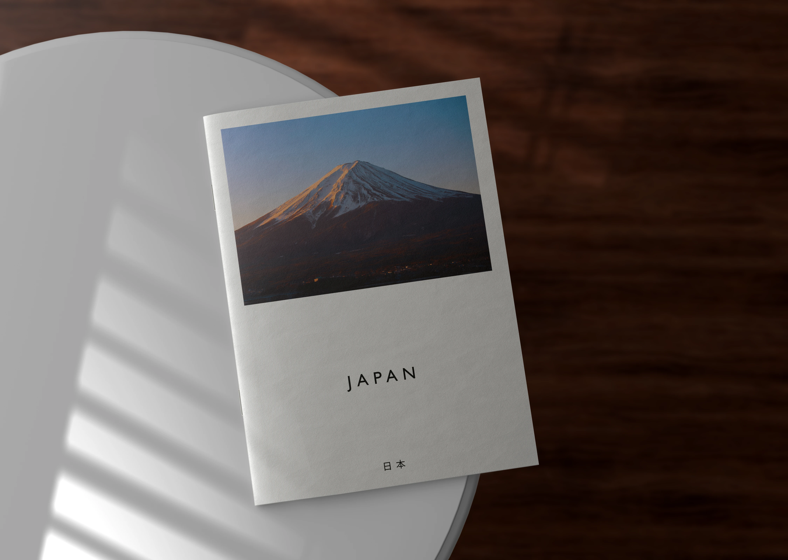
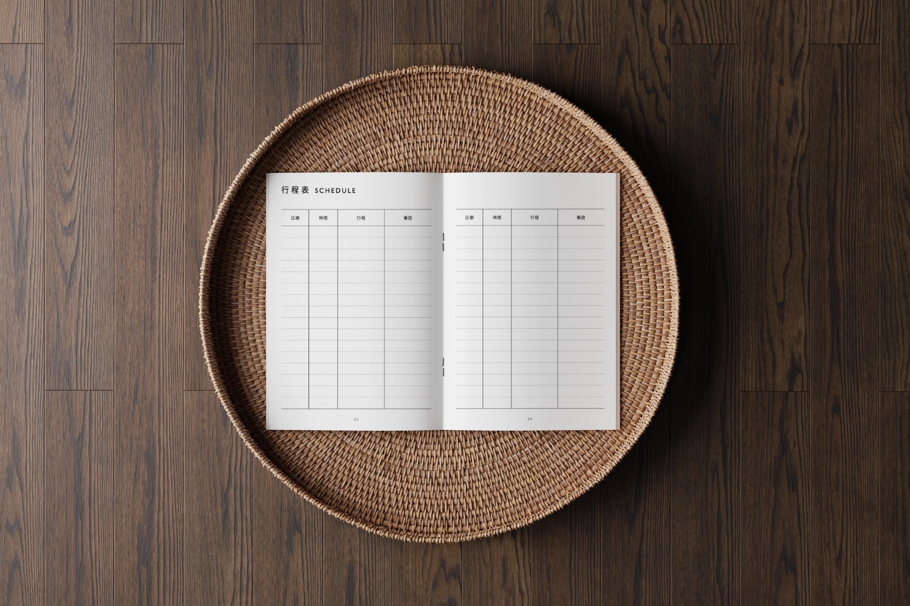
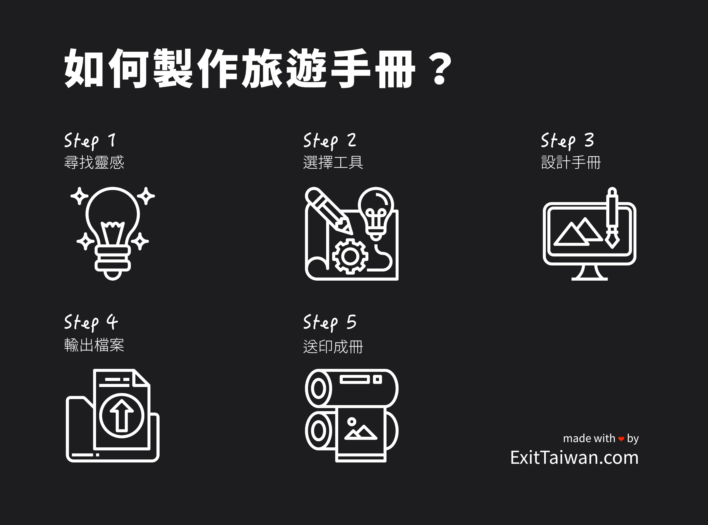
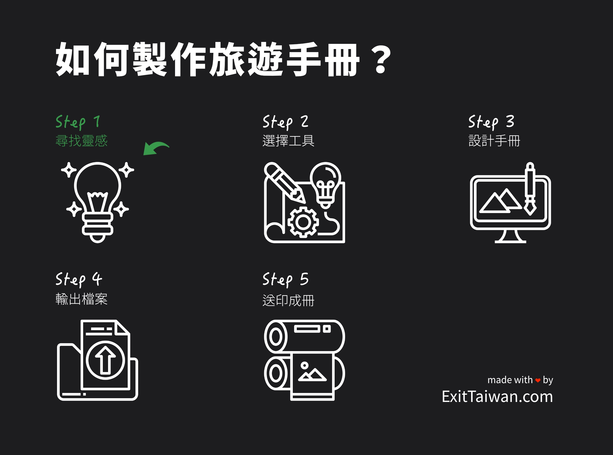
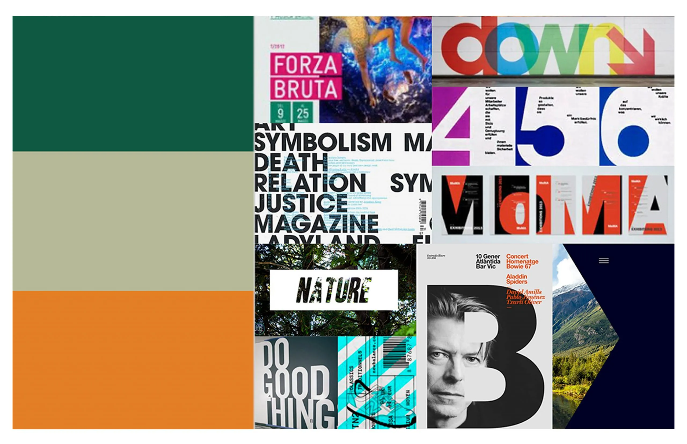
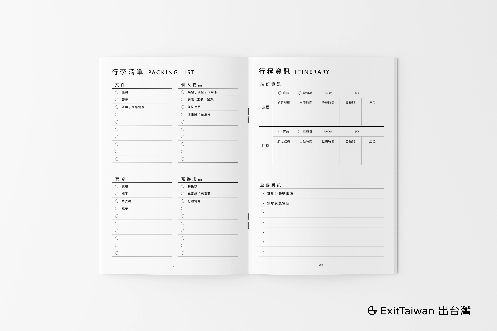
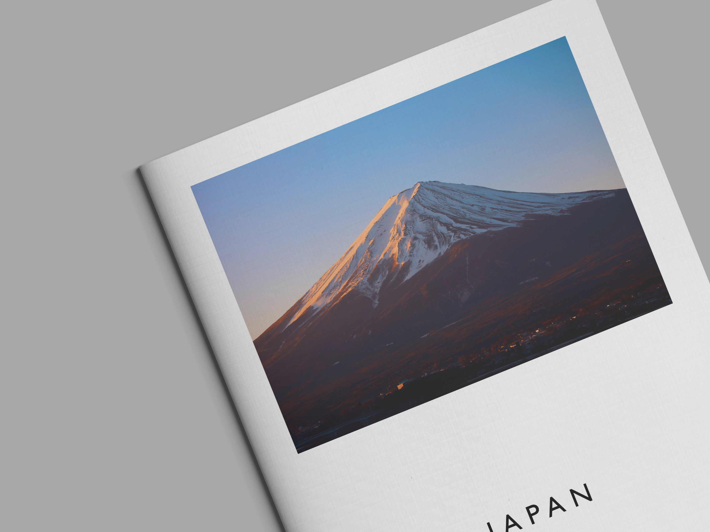

    

你正[**準備出國**](https://exittaiwan.com/posts/%E5%87%BA%E5%9C%8B%E8%A1%8C%E6%9D%8E%E6%89%93%E5%8C%85/)嗎？不管你是即將要前往日本進行五天四夜的家族小旅行、兩個禮拜的美國東岸巡禮、或是一個月的歐洲多國獨旅，一本實體的旅遊手冊都將陪伴你這趟旅程，成為你一輩子的回憶。  

## 旅遊手冊將成為你的回憶寶物   

    

在決定了國外旅遊目的地之後，就是開始緊鑼密鼓規劃行程的時候了！   

這時，旅遊手冊是你規劃行程的最好幫手。把這趟旅程所有的資訊紀錄在同一本小冊裡，不但可以減少因為資訊四散而找不到資訊的困擾，也能明確看出行程時間上是否安排合理，甚至幫你找出你之前沒有想到的疏漏。   

在旅程途中，你可以一邊查看行程，也能紀錄旅程。旅程結束後更是可以把拍立得、票卷等等一起貼到小冊子中，這本旅遊小冊就成為這趟難忘旅程中，你的專屬回憶錄了。   

## 如何製作旅遊手冊   

    

根據你想像中旅行手冊的複雜和精美程度，製作旅行手冊可以是短至一個小時，長至一個禮拜的事。   

「ExitTaiwan 出台灣」團隊根據自身的旅遊經驗，花費了大量的心血討論、設計出符合大部分旅人需求的旅行手冊，如果你願意親自到家裡附近的影印店一趟，印製出自己的旅遊手冊，現在你只需要用銅板價，就能下載這些可以迅速在影印店輕鬆印製的旅遊小書，省下寶貴的時間，獲得一本高質感的旅遊回憶錄。   

<!-- 想要躺在家裡沙發上就收到一本旅遊手冊？那也沒問題！**ExitTaiwan 出台灣**為你省去所有步驟，只要到旅遊手冊的頁面下單，一個禮拜內就快遞送到家囉！   
對於有時間、心力的人，可以自己為每趟旅程都製作一本獨一無二的旅行手冊。不論你是製作簡單或是複雜的旅遊小書，步驟其實大同小異，在這篇文章，我們就來分享我們是如何一步步製作出旅遊手冊的。   -->

製作旅遊手冊可以大致分成以下五個步驟： 

1. 尋找靈感   
2. 選擇工具   
3. 設計手冊   
4. 輸出檔案   
5. 送印成冊   
   
### 第一步：尋找靈感   

    

在設計的領域，尋找靈感的這個步驟最終的目的是為了創造一個 **[mood board](https://medium.com/d-d-mag/%E5%A6%82%E4%BD%95%E4%BD%BF%E7%94%A8%E6%83%85%E7%B7%92%E6%9D%BF-mood-board-2ea1178dac5b)**（心情版，或情緒版），簡單來說， mood board 就是設計的整體主視覺。   

每個設計師在每個不同的設計專案，都會在 mood board 裡面蒐集不同的素材。擁有一個 mood board 可以確保旅遊手冊的設計成品是符合你想要的風格。  

如果你打算製作一個旅遊手冊模板在日後可以重複修改使用，那麼在 mood board 裡面擁有一個顏色和諧的調色盤（英文：color palette）和你個人喜歡的設計風格、元素等會很有幫助。   
一般來說，建立一個 mood board 的方法有很多種，但大致分為實體和數位，現在大部分的設計師都使用數位軟體工具來建立 mood board。   

建立 mood board 可以很簡單，開設一個 [**Pinterest**](https://pinterest.com/) 帳號就可以用關鍵字找尋你喜歡的設計風格、色系，並且將這些視覺元素「釘（pin）」起來。如果你會其他更專業的設計軟體，那當然更好。實體的 mood board 可以是透過便利貼、各式各樣的照片、剪裁下的字型等等來製作。   

### 第二步：選擇工具   

    

首先，你需要一台筆電或是桌機，如果你以上兩個都沒有的話，推薦你直接[訂購由「ExitTaiwan 出台灣」設計的旅遊手冊](https://exittaiwan.com/shop/)，這個你可以用手機就完成。硬體設備準備好了，現在就來看看要用哪個軟體吧。   

用來製作旅遊手冊的軟體很多元，就像打一篇文章，你可以用 Microsoft Word、記事本、等等不同的寫作軟體，重點是你會使用那個軟體，並且可以達到你想要的成果。   

如果你對於電腦操作並不是非常熟悉，最入門的工具有 Microsoft PowerPoint、也有人用 Excel 和 Word 來編輯簡單扼要的行程。稍微有設計概念、背景的人可以選擇 [**Canva**](https://www.canva.com/)，這可能是最適合大部分人的線上設計工具。

對於很熟悉設計軟體、擁有平面設計知識的人來說，Adobe Suite 和 [**Affinity Suite**](https://affinity.serif.com/en-us/) 裡面的各個設計軟體結合起來可以設計出最符合想像的旅遊手冊。   

在上一步驟透過各個來源搜集的素材，也是透過你選擇的軟體來製作成 mood board。當你把所有素材都加進來，整理製作好了 mood board，你就準備好可以到下一步驟了：開始設計旅遊手冊！   

### 第三步：設計手冊   

    

你已經把你的靈感都蒐集到 mood board 了嗎？現在就打開你選擇的軟體工具，開始設計專屬於你的旅遊手冊。在軟體工具裡設計一本旅遊手冊有不少詳細的步驟，包括以下這些：  

1. 決定成品尺寸   
2. 決定內容大架構   
3. 決定內容複雜程度   
4. 加入個人設計元素（如貼圖、插畫）   
5. 決定旅遊手冊排版   
6. 套入主要字型和色彩   
7. 填入所有旅程資訊   
8. 旅遊手冊設計完成！   
   
### 決定成品尺寸   

你想像中的旅遊手冊是什麼大小？大部分的人腦海中應該都是一個 A5 大小（A4 的一半）的小手冊吧？在開啟設計軟體後，第一件要做的事就是選擇你理想中旅遊手冊的大小。 

同時，如果軟體有此設定供調整的話，別忘了把分辨率（DPI，每英吋像素）設定至至少 300，這些[印刷上的小細節](https://www.inprint123.com/news_detail.php?&mlevel1=28&NewsId=QD48PyomJTc4QCgrIyVeKw==)都將會影響最後印製成品的品質好壞，千萬要注意喔！   

### 決定內容大架構   

設計旅遊手冊是為了下一趟旅程，所以在埋頭執著於設計的小細節之前，決定哪些是你平時出國旅遊時會用到的資訊、以及想想自己會如何紀錄旅程，有助於幫助你決定旅遊手冊的大架構。   

通常，一本旅遊小冊的內容會包含目錄、行李清單、目的地國家基本資訊、旅遊行程表、記帳頁、以及旅程的紀錄頁面等。   

### 決定內容複雜程度   

有了大致的架構之後，可以開始思考各個頁面涵蓋的資訊需要多複雜。   

舉例來說，目的地國家的基本資訊需要哪些？當地電壓 / 插頭、緊急電話、天氣氣溫預測、幣值⋯⋯等等。   

又例如在旅遊行程表內，你是喜歡按表操課，還是保持大量彈性的旅人？   

內容複雜的程度影響著每一個頁面的設計。   

### 加入個人設計元素   

還記得在第一步「尋找靈感」時創造的 mood board 嗎？這正是它派上用場的時候！把 mood board 裡的設計元素直接拉進設計軟體，或是用 mood board 裡的設計元素，到一些攝影素材、設計素材的網站找到喜歡的圖示，下載並加入到你的設計軟體。   

推薦圖素網站資源：   

- [Unsplash](https://unsplash.com/)   
- [Pexels](https://www.pexels.com/)   
- [Pixabay](https://pixabay.com/)   
- [Flaticon](https://www.flaticon.com/)   
- [icons8](https://icons8.com/icons)   
- [iconfinder](https://www.iconfinder.com/)   
   
也許你的旅遊手冊設計檔案現在看起來一團亂，該是時候變些魔法了。   

### 決定旅遊手冊排版   

當你知道了大架構、也知道在這些架構內有什麼內容、並且把所有曾經蒐集到 mood board 的設計元素加入設計軟體後，就是時候來幫你的旅遊手冊排版了！   

台灣人在美感的訓練是客觀上的不足，別擔心，有一個方式可以讓你快速提升你的平面設計審美觀。只要在排版時謹記這四大設計原則，你就會發現很多人的設計是「CRAP」，而你是用著「CRAP」當作設計準則，設計出頗有質感的旅遊手冊成品。   

> 什麼⋯⋯你說要用「CRAP（垃圾）」當設計準則？！   

別誤會，雖然很多人的設計真的很 crap，但設計準則的 CRAP 是 Contrast（對比）、Repetition（重複）、Alignment（對齊）、和 Proximity（鄰近）的縮寫。   

注意物件大小的對比、色彩的對比、設計元素的重複（一致）性、各個元素是否靠左、置中、或靠右對齊、以及各個元素間互相的空間距離關係是否合理，這篇文章「 [C.R.A.P 如何增強使用者體驗（How the 4 C.R.A.P. Design Principles enhance User Experience）](https://clueify.com/blog/crap-design-principles/)」雖然是在講 App 的設計，但文章內的圖示很有助於你了解這些設計準則。   

在設計旅遊手冊中的所有步驟裡面，這很有可能是最花時間的一個步驟，但也會帶給你最多樂趣，慢慢地看著自己設計的旅遊小冊即將成形。   

經過不斷的微調、替換元素，在你終於決定你已經完成旅遊手冊的排版之後，這個手冊應該已經有八成接近你理想中的樣子。如果沒有？要馬打掉重練，要馬就繼續調整下去囉⋯⋯。   

### 套入主要字型和色彩  

讓我們最後一次回到 mood board，首先找到你創造的調色盤。將你曾經加入到調色盤中的顏色轉換到設計軟體中的調色盤。接著，把你喜歡的字體套用到旅遊手冊檔案中的文字。   

覺得顏色不和諧嗎？[這裡有一些最流行的色彩組合](https://coolors.co/palettes/trending)，也許你會在這裡找到你喜歡的組合。  

<!-- **AFFILIATE**   -->

覺得字體看起來怪怪的？這篇由 Janie Kliever 在 Canva 的 Design School 關於[文字排版的文章](https://www.canva.com/learn/typography-guide/)（也有[中文版](https://transbiz.com.tw/typography-design)），可以幫助你解決字體看起來怪怪的問題。   

### 填入所有旅程資訊   

該有的表格都有了、喜歡的字型色彩也有了、手冊整體看起來超漂亮（就跟 [ExitTaiwan 出台灣設計的旅遊手冊](https://exittaiwan.com/shop/)一樣漂亮），別忘了在最後填入你的旅程資訊！   

不管是你的旅行行程（時間、地點、交通等等）、飯店資訊、出國行李準備清單、同行友人家人的聯絡方式，根據你設計完成的旅遊手冊，填入所有關於該趟旅程的資訊吧！   

### 旅遊手冊設計完成！   

恭喜你，你親自設計的旅遊手冊完成了！   

### 第四步：輸出檔案   

    

花了好多時間設計好了旅遊手冊，在輸出檔案的時候千萬不要忘記確認輸出的設定，否則最後印製出來成品不好看，小則浪費了印製的金錢需要重新印製，大則浪費了時間和心血！ 

最重要的兩件事情：   

1. 300 DPI 有設定對了嗎？   
2. 設計檔案的尺寸與印刷尺寸一致嗎？實體印刷出來的旅遊手冊是 A5 尺寸，那麼設計檔案輸出時的尺寸也應該設置為 A5。   
   
### 第五步：送印成冊   

    

恭喜你！距離拿到實體的旅遊手冊，你只剩下送印這個步驟了！   

前往影印店印製成冊，你只需要最少 5 ~ 10 分鐘就可以將此電子檔案化為精緻、專屬於你的旅遊手冊，分成下面三個步驟：   

1. 將檔案攜帶至附近任一影印店。   
2. 影印店印製、並把實體旅遊手冊裝訂成冊。   
3. 裝訂完成，把它變成專屬於你、獨一無二的旅遊手冊！   
   
### 將檔案攜帶至附近任一影印店   

你有兩種方式可以將此電子檔案攜帶到影印店：使用隨身碟或使用電子郵件。   

**如果你使用隨身碟，請依照以下步驟：**   

1. 將此封信件內的旅遊手冊電子檔案下載自個人家用電腦 / 筆電。   
2. 將隨身碟插入個人家用電腦 / 筆電，並在畫面中將隨身碟打開。   
3. 把旅遊手冊電子檔案複製、貼上（或直接拖曳）到隨身碟裡面。   
4. 將隨身碟攜帶至影印店，影印店店員就能夠透過店內的電腦連接影表機等設備協助操作印製。   
   
**如果你使用電子郵件，請依照以下步驟：**   

1. 直接到影印店使用影印店的電腦，登入購買旅遊手冊使用的電子郵件信箱（建議開啟無痕模式）。   
2. 開啟此封電子郵件，並點擊打開信件中的旅遊手冊電子檔案。   
3. 告知影印店店員要將檔案印製成冊，影印店店員將協助後續操作。   
   
### 影印店印製、裝訂成冊   

到達影印店後，和店員告知你要將這個 PDF 檔案列印裝訂成一個旅遊小書。   

除了旅遊小書的尺寸最好是 A5 之外，你可以根據自身喜好選擇印刷色彩（彩色或黑白）、紙質（封面和內頁紙質）、以及[裝訂方式（膠裝、騎馬釘、線裝）](https://www.jcolor.com.tw/blog_post/58254546a6adc68b63b809c4)等等細節。   

「ExitTaiwan 出台灣」自己設計的旅遊小書在送印的時候，是使用以下的印刷需求說明，供你參考使用喔！   

- **印刷尺寸**：A5。   
- **總頁數**：24 頁，小冊子形式，雙面印刷。   
- **封面和封底**：   
    - 電子檔內第 1 & 2 頁：封面頁的正反面，彩色單面印刷，使用雪銅紙並上霧膜。   
    - 電子檔內第 23 & 24 頁：封底頁的正反面，彩色單面印刷，使用雪銅紙並上霧膜。   
- **內頁**：   
    - 電子檔內第 3 頁至第 22 頁（共 20 頁）：黑白印刷，小冊子形式，使用道林紙。   
- **裝訂方式**：騎馬釘。   
   
## 現在就動手

你說你把文章看到這裡還沒有開始動手製作自己的旅遊手冊？現在就是開始的時候！

你說你沒有這個時間來自己製作一本旅行手冊？那也可以[直接購買「ExitTaiwan 出台灣」設計的旅行手冊](https://exittaiwan.com/shop/)！