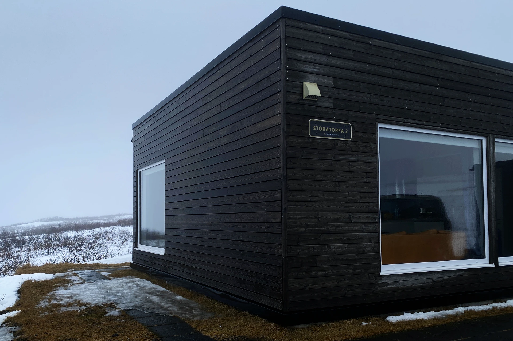

一生至少要看到一次極光是很多人的夢想吧？如果，你可以**擁有整座山脈，獨享一晚欣賞極光的機會**，你要不要來？

[**Hrifunes Nature Park（中文：呂福恩斯自然公園度假屋）**](https://www.booking.com/hotel/is/hrifunes-park-cabins.xt.html?aid=7956794)是一間位在冰島中南部，呂福恩斯（冰島語：Hrífunes）山上的高級度假屋。

它的地點剛好位在冰島首都雷克雅維克（冰島語：Reykjavík）和很多人會去的、號稱「龍蝦鎮」的赫本（冰島語：Höfn，或霍芬）小鎮中間。不想要一次拉車六個小時從雷克雅維克到赫本的話，可以考慮在這裡搭上一到兩晚，順便把冰島中南部附近的景點跑一跑。

彩虹瀑布（冰島語：Skógafoss）、黑沙灘（冰島語：Reynisfjara Beach）、還有歐洲最大的冰川[瓦特納（冰島語：Vatnajökull）冰川健行](https://affiliate.klook.com/redirect?aid=41451&aff_adid=1007721&k_site=https%3A%2F%2Fwww.klook.com%2Factivity%2F117124-blue-ice-cave-and-glacier-hiking-tour-from-skaftafell%2F%3Fspm%3DSearchResult.SearchSuggest_LIST%26clickId%3D9b0fa81895)都在距離呂福恩斯自然公園度假屋開車一個半小時內可以抵達的位置。

入住這裡，你會享受超幽靜的環境、典雅的裝潢、完善的度假設備，天氣好無雲的話還有高機率可以欣賞到極光，只能說價格高有價格高的理由，錢沒有不見，只是變成了奢華體驗的樣子⋯⋯。

## 冰島呂福恩斯自然公園度假屋基本資訊

- 地址：Hrífunesvegur 209, 880 Hrífunes, Iceland ([Google Maps](https://maps.app.goo.gl/VDRwJTgysmR2PG6K6))
- 交通：需自行開車前往
- 是否含早餐：無
- 平均每晚價格：約台幣 15,000 ~ 30,000（四到六人入住）
- 查看即時房價：[**點我前往**](https://www.booking.com/hotel/is/hrifunes-park-cabins.xt.html?aid=7956794)

<!-- TODO: link to 推薦閱讀：飛冰島最便宜的機票怎麼買？ -->

## 冰島呂福恩斯自然公園度假屋實際入住體驗

這次一行人來到冰島自駕旅遊入住呂福恩斯自然公園度假屋，根據自身的入住體驗來分享心得。

### 接待入住

要 check-in 入住呂福恩斯自然公園度假屋，需要事先告訴服務人員大概會到達的時間，因為呂福恩斯自然公園度假屋的位置隱密，需要服務人員開車在前面，客人跟車在後面才會知道度假屋的實際位置。

到了之後，服務人員會把整間度假屋簡單的導覽一遍，在導覽的時候，你就會等不及要開始享受度假屋的各種設施、和好好享受這裡的美景了！

### 客廳 / 廚房

呂福恩斯自然公園度假屋的客廳非常寬敞舒適，有很大的沙發區。此外落地窗環繞著客廳，外面絕美的景觀看的一清二楚。

沙發區的另一側就是開放式的廚房。

廚房有很大的中島、齊全的廚房用具和設備。因為在山中，完全沒有店家，所以入住這裡應該至少會用到一到兩次的廚房。

### 房間

這次入住的三臥室度假屋，每個房間都是雙人床，從房間的窗戶看出去一樣的享受外面的景觀，完全沒什麼好挑惕的。

### 廁浴

呂福恩斯自然公園度假屋總共有兩間廁浴，還附有洗衣乾衣機，就算多人入住也蠻夠用的。當然，整體衛生乾淨是無庸置疑的。

### 桑拿 / 柴燒溫泉

嗯⋯⋯你沒看錯，除了兩間廁浴之外，呂福恩斯自然公園度假屋還有一間獨立的桑拿房，附有自己的淋浴間。而桑拿房外面就是陽台，陽台旁邊就是柴燒溫泉。

聽起來真的很美好、很浪漫，但是如果要使用柴燒溫泉是真的要自己燒（還好木柴不用自己砍），把水加熱會需要花一點時間，所以建議在天氣好時、比較早入房時、或是有住兩晚以上的狀況下再使用，不然可能會累死自己。

## 冰島呂福恩斯自然公園度假屋整體評價

這次入住呂福恩斯自然公園度假屋一個晚上，旅程結束後，在文章的最後分享一些優缺點。

### 呂福恩斯自然公園度假屋優點

呂福恩斯自然公園度假屋的優點應該列不完吧？只要天氣好沒什麼雲，晚上看到極光的機率就超高，度假屋外面的山景一覽無遺，基本上在這裡就是享受與世隔絕的生活。

度假屋內部的住宿體驗更是不用說，配備齊全、空間寬敞又乾淨、再加上桑拿和柴燒溫泉，根本無敵。

### 呂福恩斯自然公園度假屋缺點

很不想抱怨呂福恩斯自然公園度假屋，這些缺點都像是為了所有享受所有優點才衍生出來的沒有辦法避免的缺點。

入住的價格貴是貴，但是多人分下來其實跟住飯店的價格差不了多少、甚至還更便宜。地點比較不容易抵達對有些人來說可能也是缺點，但是已經來到冰島自駕了，開一小段山路應該不爲過吧⋯⋯？

最大最大的缺點大概是附近完全沒有餐廳，所以上山之前，一定要先在超市買些東西上來煮，或是外帶餐廳的食物上來加熱。超市的話建議可以在雷克雅維克的「小豬超市（冰島語：Bónus）」，或是在呂福恩斯自然公園度假屋附近小鎮維克（冰島語：Vik）的唯一一間超市 Krónan Vík。要外帶餐廳食物的話大概就是維克（冰島語：Vik）的零星幾間餐廳了。

最後，雖然這裡是觀賞極光的絕佳地點，但是機運還是佔很大的成分。天氣不好、多雲、極光指數極低的狀況下還是看不到極光的，但⋯⋯這應該不算度假屋的缺點吧？

### 冰島呂福恩斯自然公園度假屋評價

滿分十分的話，[**呂福恩斯自然公園度假屋**](https://www.booking.com/hotel/is/hrifunes-park-cabins.xt.html?aid=7956794)一定是滿分！

像上面提到的，缺點有是有沒錯，但是都是為了它的優點而存在的缺點。有朝一日來到冰島自駕旅遊，一定要考慮入住呂福恩斯自然公園度假屋，享受絕佳的冰島住宿體驗。