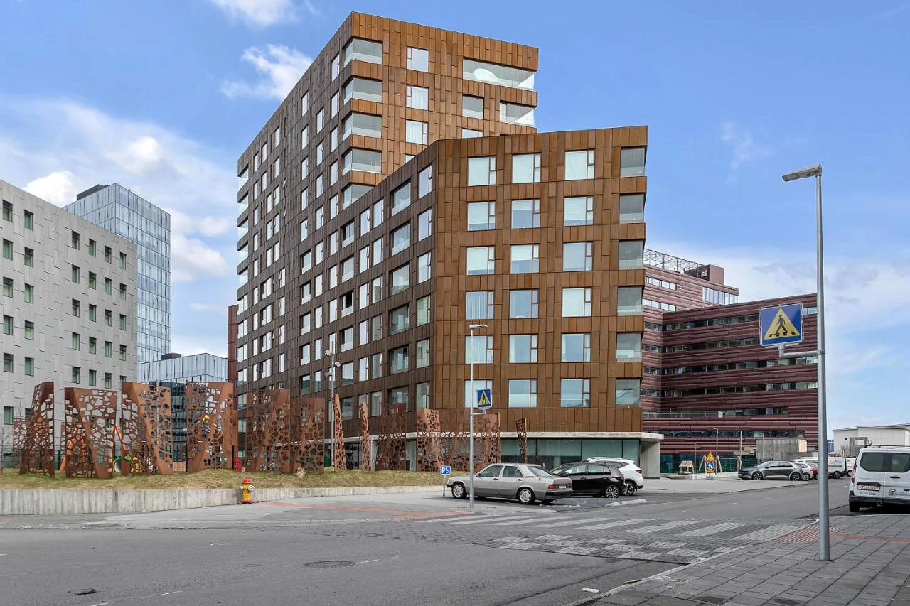

[**Sif Apartments**](https://www.booking.com/hotel/is/sif-apartments-reykjavik.xt.html?aid=7956794) 是一間在冰島首都雷克雅維克市中心的公寓式酒店，距離購物街和餐廳走路只要五分鐘、要走到冰島最有名的教堂哈德格里米爾教堂（冰島語： Hallgrímskirkj）也只要 15 分鐘。

公寓的設備齊全，裝潢明亮又舒適，附近停車也算方便，可以停到冰島夜間免費的停車位，整體來說算是雷克雅維克非常值得入住的公寓式飯店選擇。

## Sif Apartments 雷克雅維克住宿基本資訊

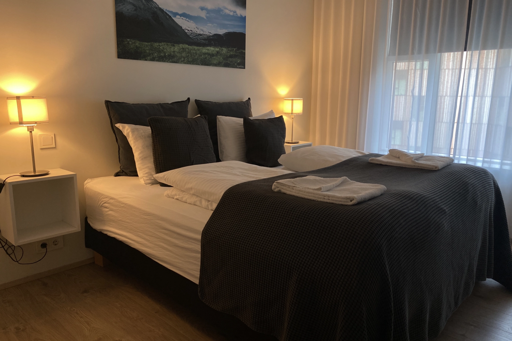

- 地址：Bríetartún 9, 105 Reykjavík（[Google Maps](https://maps.app.goo.gl/WESizr2j6yRRPKTX8)）
- 是否含早餐：否
- 平均每晚價格：台幣 11,000 ~ 35,000 元（根據人數和房型）
- 查看即時房價：[**點我查看**](https://www.booking.com/hotel/is/sif-apartments-reykjavik.xt.html?aid=7956794)

## 實際入住 Sif Apartments

### 入住 check-in

Sif Apartments 入住時是採用全自助的方式，對方會將入住的指示透過訂房平台傳送給客人，第一天入住時，尤其是如果車子停在地下停車場，要找到正確的門搭電梯會需要花一點時間找到正確的門，其餘的話就沒什麼特別要注意的了。

### 客廳 / 廚房

Sif Apartments 六人公寓的廚房是開放式廚房，餐桌、客廳都在旁邊。

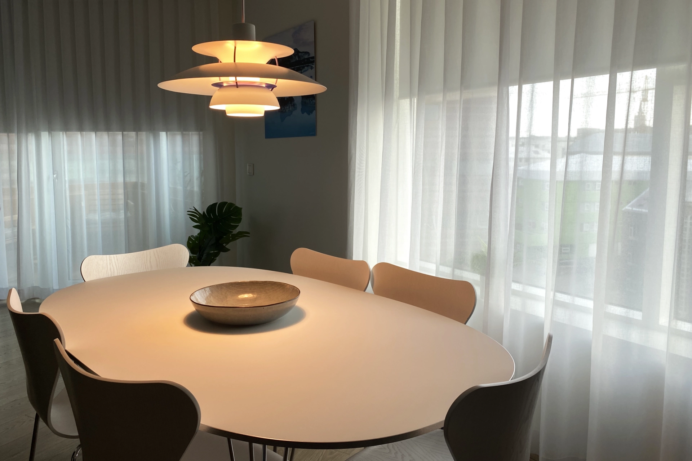

廚房跟另外一間我們介紹過的[呂福恩斯自然公園度假屋 Hrifunes Nature Park](https://exittaiwan.com/posts/%E5%86%B0%E5%B3%B6%E4%BD%8F%E5%AE%BF-hrifunes-nature-park/) 一樣，也有一個很大的中島。

特別的是， Sif Apartments 的電磁爐就設置在中島上，所以是在中島料理。電磁爐旁邊也有空間可以備料、裝盤等等。

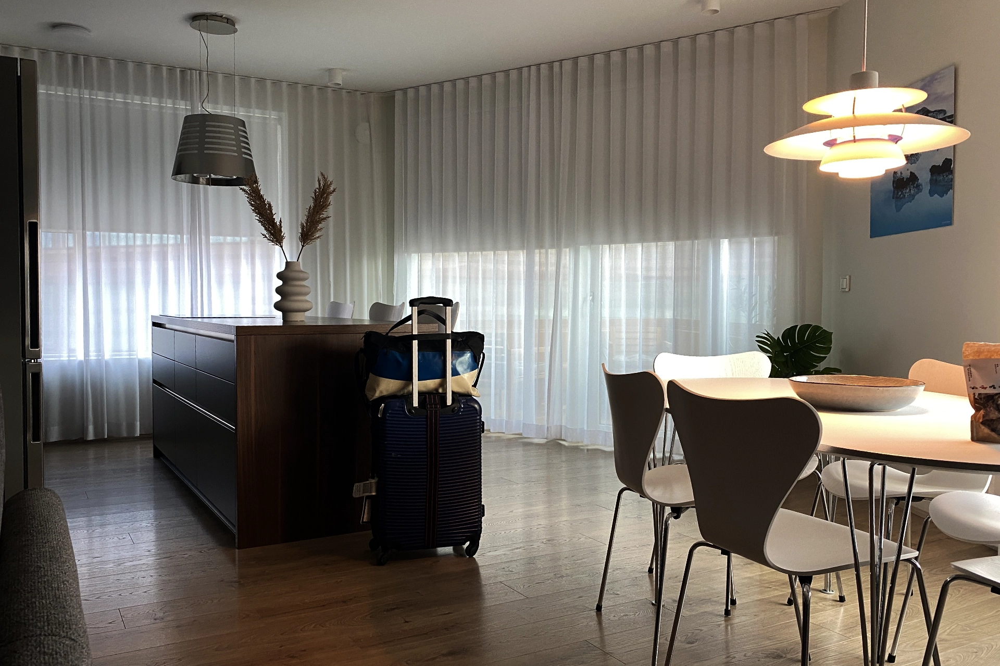

廚房的設備齊全，冰箱、熱水壺、烤箱、烤土司機、餐盤餐具應有盡有。

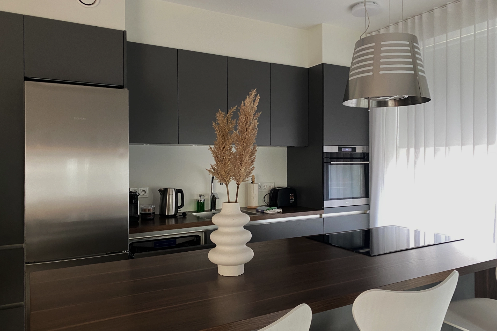

### 陽台

從餐桌旁邊走出去就是陽台了。陽台上有兩張木椅和木桌，在這裡可以看雷克雅維克的夜景，相當悠閒。

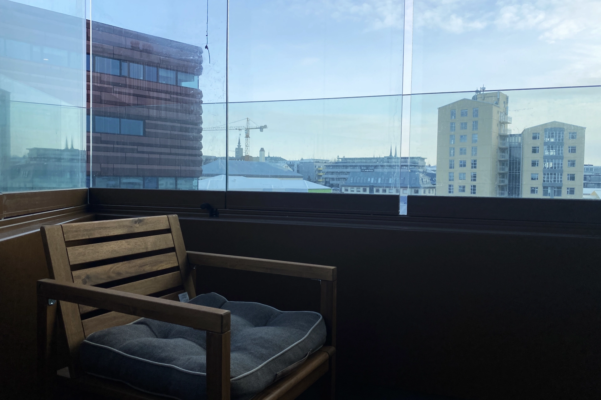

### 房間

六人公寓的第一個房間實際上就是客廳的沙發床。不過別小看這張沙發床，尺寸跟加大雙人床差不多大，躺起來也很舒適，完全沒有在睡沙發床的感覺。

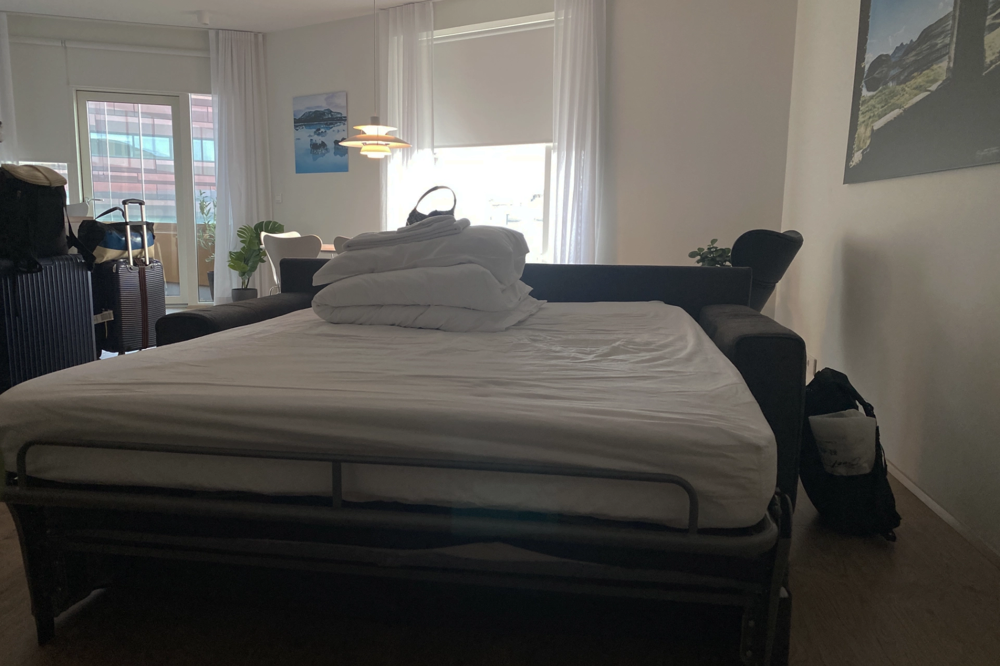

另一間房間是兩張單人床並再一起的雙人房。空間很大、照明充足、住起來很舒服。

還有一間房間也是雙人房，但是是兩張單人床分開的形式。其實這樣的配置也蠻方便的，不想睡在同一張床的兩個人可以住在這間房間。

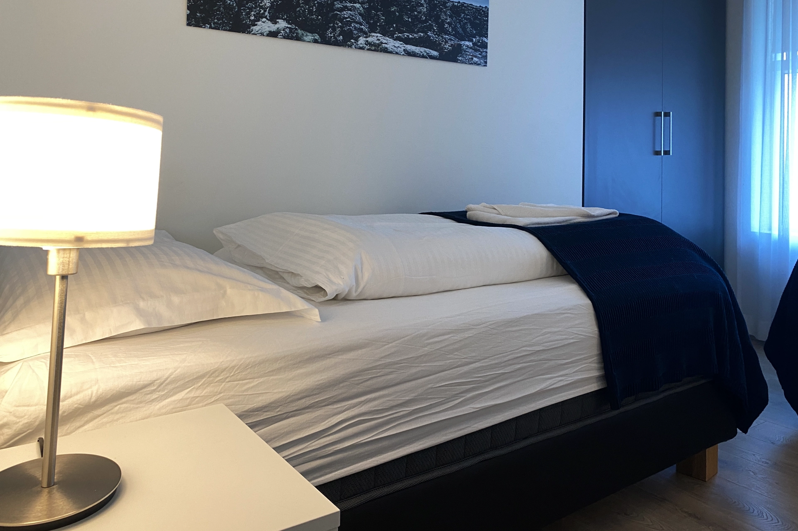

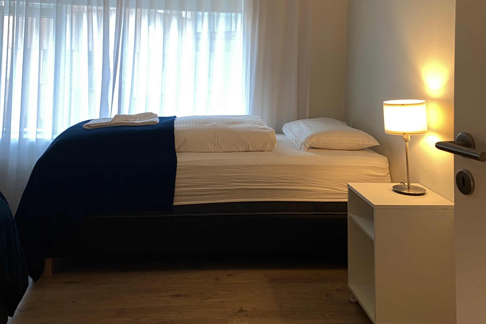

### 廁浴

根據公寓房型，有些有兩間浴室，我們的只有一間。不過這間浴室空間非常寬敞，甚至還有浴缸。要是在冰島走太累的人也可以泡個澡放鬆一下。

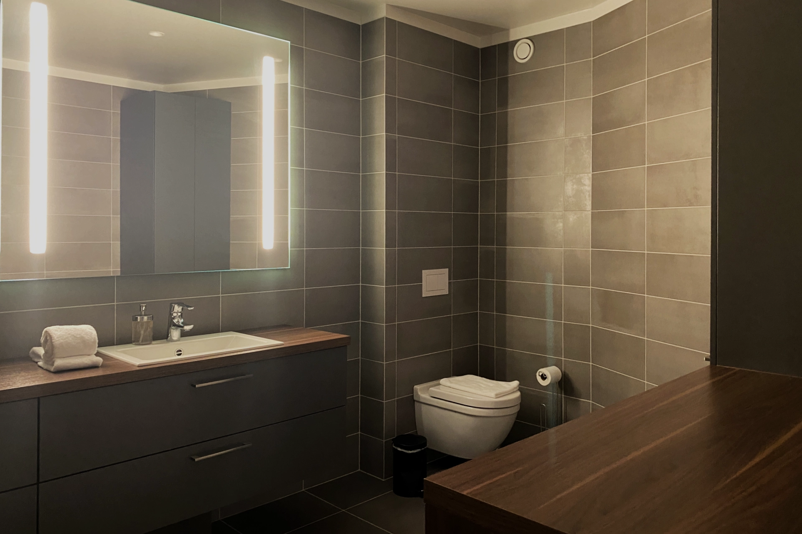

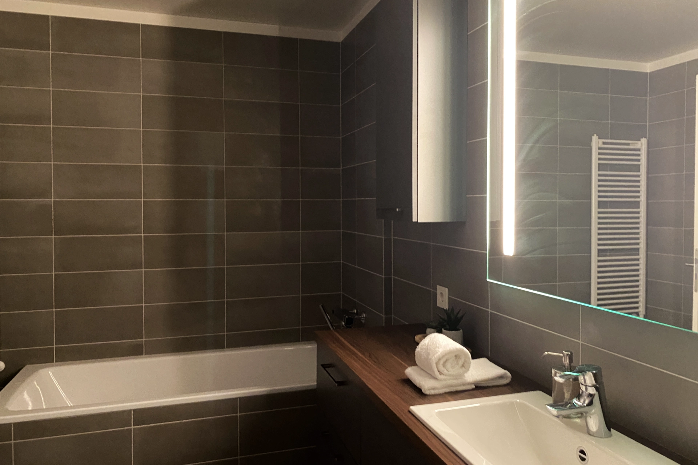

## Sif Apartments 整體評價

入住完 Sif Apartments 後，來跟大家分享親自體驗完後覺得 Sif Apartments 有哪些優缺點。

### 優點

[Sif Apartments 有很多優點](https://www.booking.com/hotel/is/sif-apartments-reykjavik.xt.html?aid=7956794)！從整體極簡風格的設計、設備齊全的廚房和衛浴、到鄰近雷克雅維克市中心的地理位置，都會令住客相當滿意。

要是剛好在淡季來到冰島雷克雅維克旅遊，Sif Apartments 的價格也是相當的有競爭力，是市中心附近最優質的房源之一。

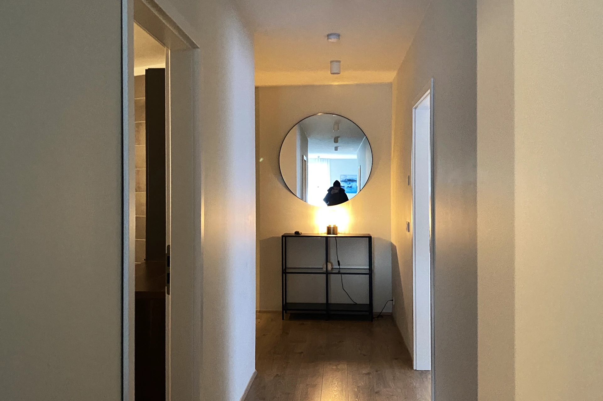

### 缺點

Sif Apartments 唯一可以被挑惕的就是停車問題。因為本身沒有特約停車場，但地下停車塲又要收費，變成如果想要省下停車費的話需要在附近找停車位，而且只有夜間時段是免停車費的。

另外，為了方便 check-in 下行李我們一開始是開車到地下停車場。從停車場要找到正確的門上樓真的要花不少時間，標示應該可以再更清楚一點。

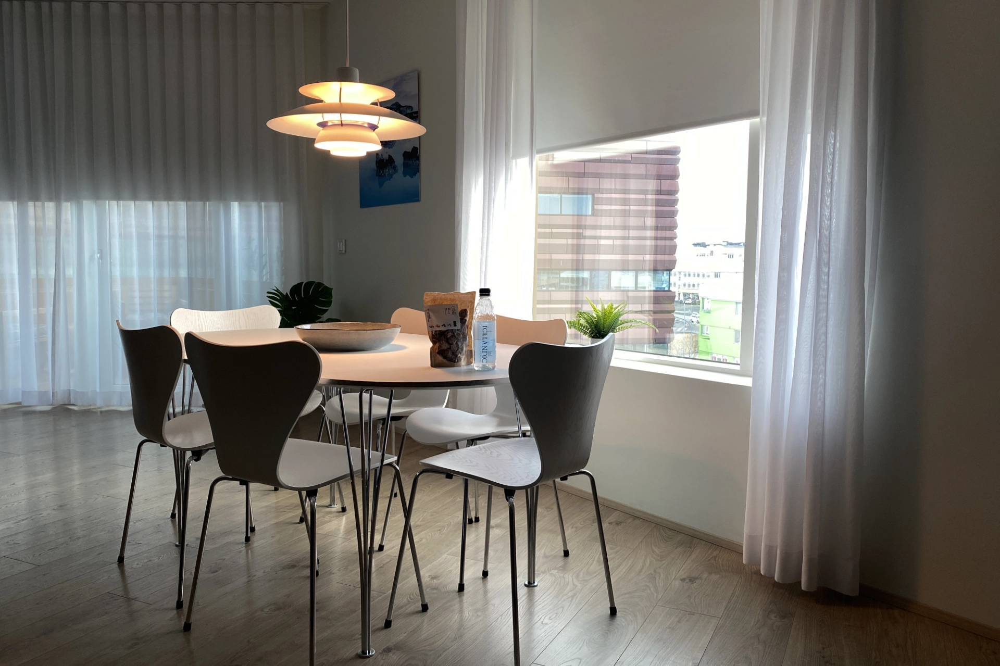

## Sif Apartments 冰島住宿評價

整體來說，Sif Apartments 的住宿評價 10 分裡可以拿到 9.5 分吧！

除了停車的問題需要額外解決之外，這個冰島市中心的房源是幾乎完美了。下次有機會來到雷克雅維克自由行，一定要[**查查價格**](https://www.booking.com/hotel/is/sif-apartments-reykjavik.xt.html?aid=7956794)、考慮看看這間 Sif Apartments！