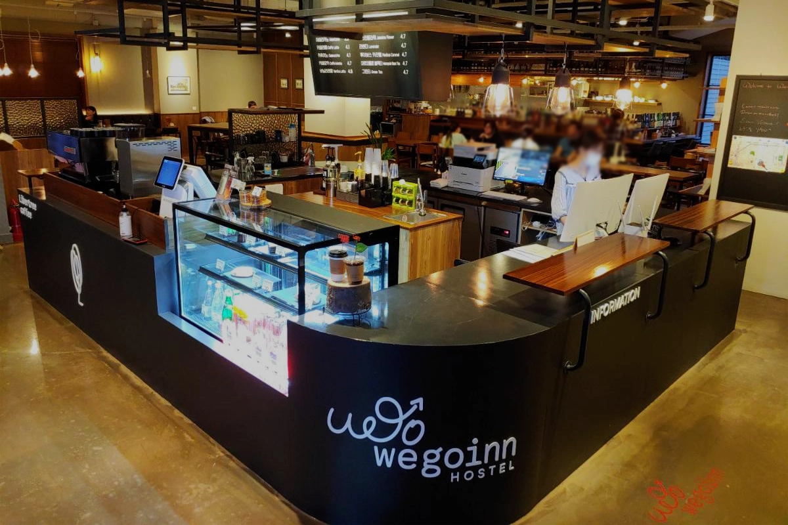
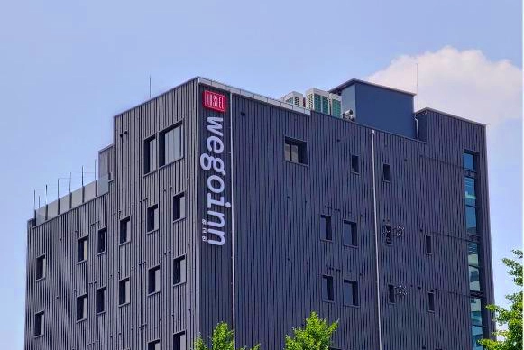
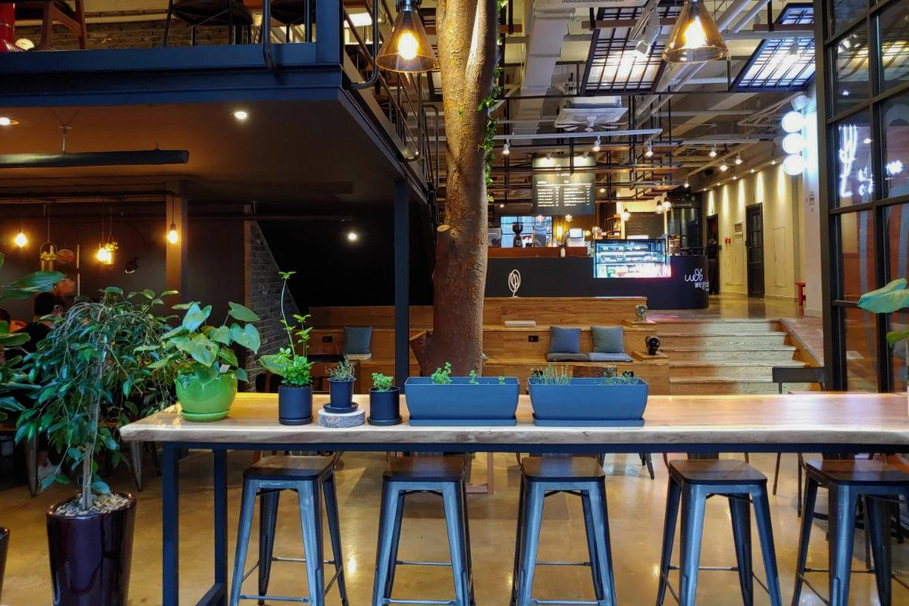
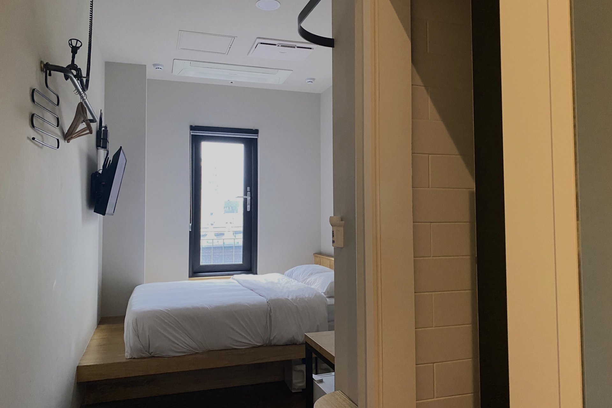
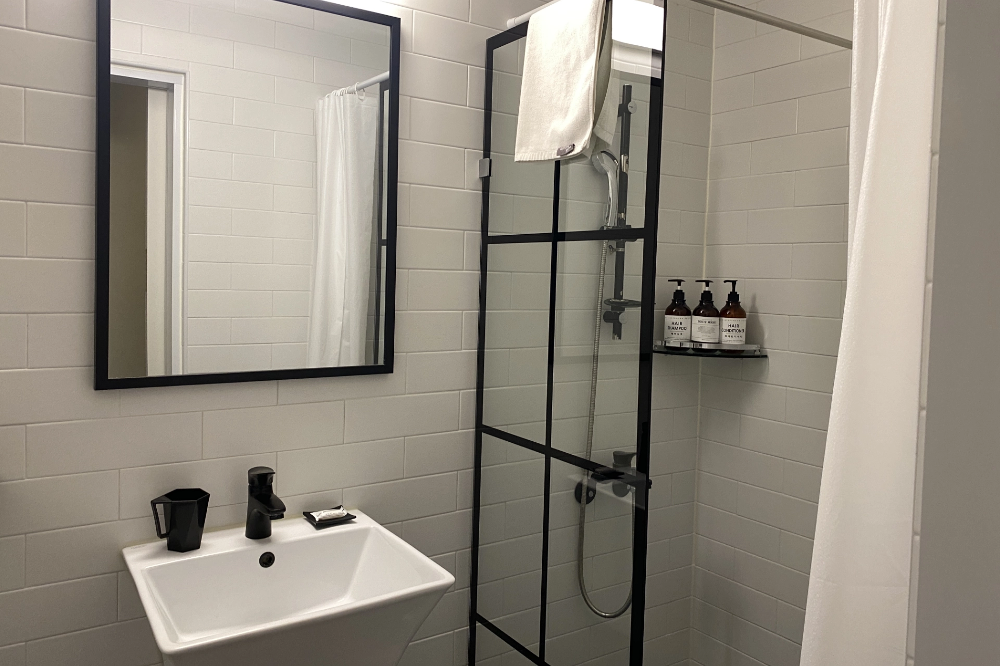
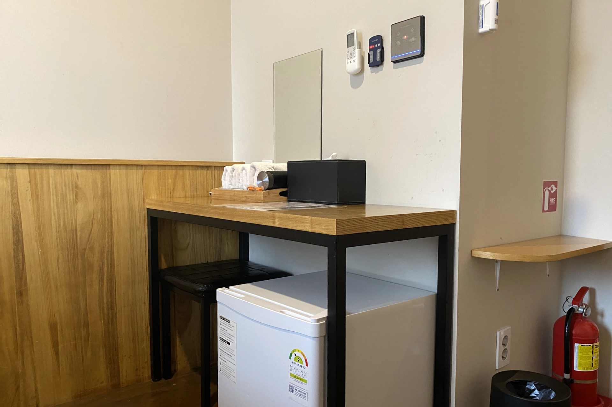

[**Wegoinn Hostel**](https://www.booking.com/hotel/kr/wegoinn-hostel.xt.html?aid=7956794) 是一間價格平價，位在[弘大商圈](https://exittaiwan.com/posts/%E5%BC%98%E5%A4%A7%E5%95%86%E5%9C%88%E6%A2%A8%E5%A4%A7%E5%95%86%E5%9C%88%E6%96%B0%E6%9D%91%E5%95%86%E5%9C%88%E9%A3%AF%E5%BA%97%E4%BD%8F%E5%AE%BF%E6%8E%A8%E8%96%A6/)走路十分鐘的地方，價格平易近人卻提供品質相當不錯的住宿體驗，非常適合年輕旅客、喜歡逛街購物、或是來韓國追星的粉絲們入住！

## Wegoinn Hostel 基本資訊

- 地址：서울 서대문구 신촌로 141 위고인호스텔빌딩 6~8층, RECEPTION 1F ([Naver Map](https://map.naver.com/p/entry/place/1242893814?placePath=%2Fhome))
- 交通：
  - 地鐵 2 號線梨花女字大學（이대）站 1 號出口往斜坡下走，或是
  - 地鐵 2 號線新村（신촌，Sinchon）站 4 號出口往斜坡上走
- 是否含早餐：無
- 平均每晚價格：約台幣 3,000 ~ 8,000（依房型和旅行季節決定，雙人房）
- 查看即時房價：[**點我查價**](https://www.booking.com/hotel/kr/wegoinn-hostel.xt.html?aid=7956794)

<!-- TODO: link to seoul 市區交通 -->

## Wegoinn Hostel 實際入住體驗

### 接待大廳

Wegoinn Hostel 的接待大廳就在一樓，提早到達可以把大型行李寄放在這邊，櫃檯人員都非常親切，check-in 入住的流程都很迅速。

和另一間我們超推薦的首爾飯店 [**Union Hotel**](https://exittaiwan.com/posts/%E9%A6%96%E7%88%BE%E8%87%AA%E7%94%B1%E8%A1%8C%E4%BD%8F%E5%AE%BF-union-hotel/) 一樣，Wegoinn Hostel 的一樓也是咖啡廳，叫做 Cafe_Libertree，每天從早上十點到晚上十點都有營業。

### 房間

Wegoinn Hostel 的房間空間比較小一點，但是行李箱要全開還是沒問題，只是在房間內就比較不容易走動。

### 廁浴

他們的廁所衛浴簡潔乾淨，以一間青年旅館來說，有這樣品質的私人衛浴沒什麼好挑惕的地方。

## Wegoinn Hostel 整體評價

這次入住 Wegoinn Hostel 的雙人房，用自身入住經驗分享一些優缺點。

### Wegoinn Hostel 優點

首先，Wegoinn Hostel 的接待人員親切，房間整體乾淨整潔，地點又離弘大商圈蠻近的，要吃宵夜要逛街都算蠻方便的，樓下也有兩間超商開到很晚。

再來價格方面在首爾市中心也已經算是相當便宜，對於背包客或是預算比較有限的台灣旅客來說，這是一個很好的住宿選擇。

### Wegoinn Hostel 缺點

Wegoinn Hostel 有幾個零星的缺點，像是房間隔音比較不好，所以淺眠的人可能需要自備耳塞。還有，晚上大門關閉後只能從後門出入，後門的照明比較不足，不熟悉環境的人可能會稍微感覺不安全，如果膽量比較小的人可以找伴一起行動。

最後，Wegoinn Hostel 雖然離弘大商圈不遠，不過它剛好在兩個地鐵站的中間點，而且又是在一個斜坡上，所以建議入住時搭到梨花女字大學（이대）站 1 號出口就可以順著斜坡往下走，離開時則可以繼續順著斜坡到地鐵新村（신촌，Sinchon）站 4 號出口或是馬路上的機場巴士站搭乘前往仁川機場的巴士。

### Wegoinn Hostel 評價

在 [**Wegoinn Hostel**](https://www.booking.com/hotel/kr/wegoinn-hostel.xt.html?aid=7956794) 住宿的體驗是相當好的，雖然是寫 Hostel（青年旅館），不過他們所有的房型都是私人房型，不會跟陌生人一起分房間睡覺，而且以他們的住房品質，讓人感覺雖然是打著 Hostel 的名號，卻已經快要有旅館的等級了！

滿分十分的話，[**Wegoinn Hostel**](https://www.booking.com/hotel/kr/wegoinn-hostel.xt.html?aid=7956794) 有 8 分，推薦給台灣來到首爾自由行的旅客！