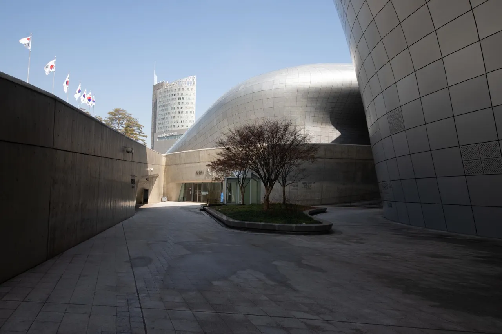

## 首爾東大門商圈

造訪首爾而未踏足東大門商圈猶如來到游泳池卻不沐浴其中一般。在東大門商圈，你能輕鬆找到時尚且價格實惠的韓流服飾和飾品，這裡擁有眾多的批發商場，對於熱愛購物的遊客而言，簡直是一片天堂！不僅如此，附近還有許多知名景點，如清溪川、城郭公園、興仁之門、DDP 東大門設計廣場等等，都值得一遊。

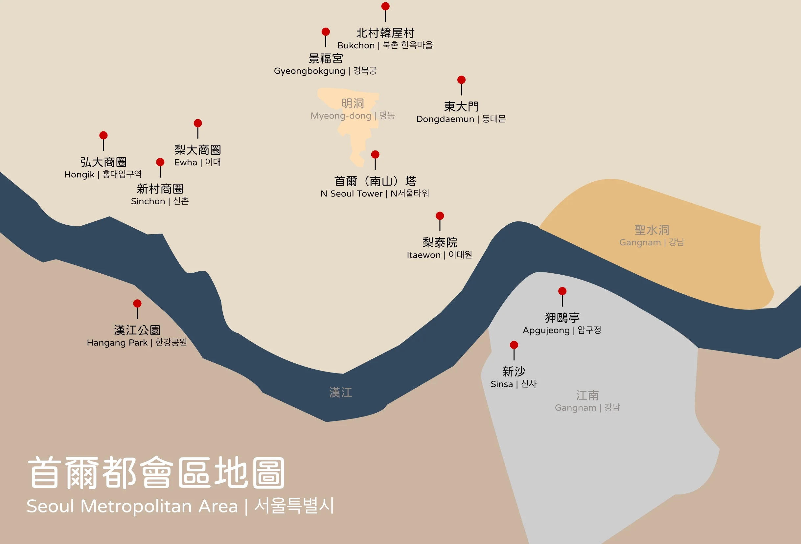

想要在首爾東大門商圈玩得開心、購物滿足、享受美食，首先要找到**適合的住宿**！這篇文章，我整理了十間我最推薦且包含各個價格區間、位在首爾東大門的飯店給前往韓國旅遊的你們，包括：

1. [Hotel DM 東大門飯店](#東大門飯店推薦-1---hotel-dm-東大門飯店)
2. [東大門 IBC 酒店](#東大門飯店推薦-2---東大門-ibc-酒店)
3. [LACOZi STAY](#東大門飯店推薦-3---lacozi-stay)
4. [東大門 K 大旅館](#東大門飯店推薦-4---東大門-k-大旅館)
5. [喜普樂吉酒店](#東大門飯店推薦-5---喜普樂吉酒店)
6. [阿里郎山飯店](#東大門飯店推薦-6---東大門阿里郎山飯店)
7. [空中花園東大門金斯敦酒店](#東大門飯店推薦-7---空中花園東大門金斯敦酒店)
8. [Glue Hotel](#東大門飯店推薦-8---glue-hotel)
9. [科莫明洞旅館](#東大門飯店推薦-9---科莫明洞旅館)
10. [首爾新羅酒店](#東大門飯店推薦-10---首爾新羅酒店)

因為[**在韓國 Google Maps 不太能用**](https://exittaiwan.com/posts/%E7%82%BA%E4%BB%80%E9%BA%BC-google-maps-%E5%9C%A8%E9%9F%93%E5%9C%8B%E4%B8%8D%E8%A1%8C%E7%94%A8%E6%9C%89%E4%BB%80%E9%BA%BC%E6%9B%BF%E4%BB%A3%E6%96%B9%E6%A1%88/)，以下的飯店地址資訊我都直接連接到 Naver Map 和 Kakao Map 囉！

<!--
$ = < 1000
$$ = 1000~4999
$$$ = 5000 ~ 9999
$$$$ = > 10000
-->

## 十間首爾自由行東大門飯店住宿推薦

### 東大門飯店推薦 1 - Hotel DM 東大門飯店 

[Hotel DM 東大門飯店](https://www.booking.com/hotel/kr/dm-seoul.zh-tw.html?aid=7956794&no_rooms=1&group_adults=2)是一家距離東大門商圈一公里左右的 2 星級平價飯店，雖然定位並非高檔酒店，但是房間的空間、設施、人員服務等都相當不錯，甚至有提供免費機場接送服務（請事先和飯店聯繫預約），是我自己非常推薦給年輕朋友、情侶、有預算的家庭到首爾旅遊的住宿選擇！

可以到 [Booking.com](https://www.booking.com/hotel/kr/dm-seoul.zh-tw.html?aid=7956794&no_rooms=1&group_adults=2) 上面看更多 Hotel DM 東大門飯店房間的照片喔！

**Hotel DM 東大門飯店基本資訊**
- 地址：73 Nangye-ro 29-gil, Jongno-gu, Seoul｜韓文：서울특별시 종로구 난계로 29 길 73（숭인동）（[Naver Map](https://naver.me/G0f05W8l)｜[Kakao Map](https://kko.to/LYse_1xLKl)）
- 地鐵：地鐵東廟站三號出口步行約 3 分鐘
- 商圈：距離東大門商圈約 1 公里
- 最近機場：距離金浦國際機場約 22 公里
- 平均每晚雙人房價格：約台幣 2000 元（$$）
- 是否含早餐：有
- 查看即時房價：[**點我前往**](https://www.booking.com/hotel/kr/dm-seoul.zh-tw.html?aid=7956794&no_rooms=1&group_adults=2)

### 東大門飯店推薦 2 - 東大門 IBC 酒店

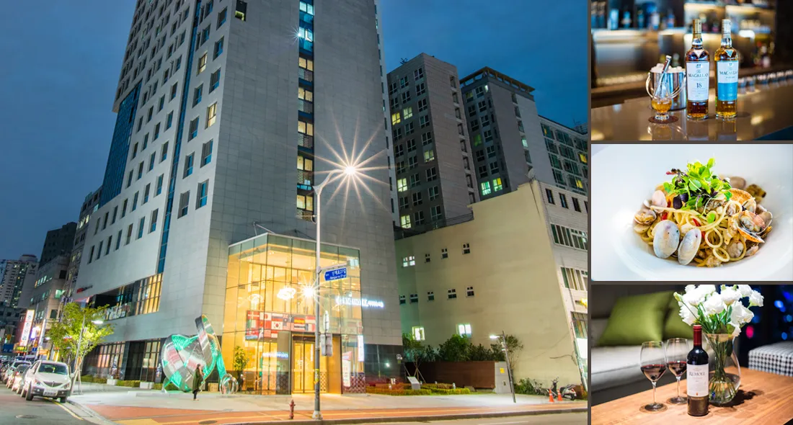

[東大門 IBC 酒店](https://www.booking.com/hotel/kr/ibc.zh-tw.html?aid=7956794&no_rooms=1&group_adults=2)是個方便性極高的酒店，內含酒吧、商店、附設會議室和健身中心。酒店甚至有提供多項服務包括外幣兌換、免費行李寄存和傳真／影印服務。工作人員非常友善並樂於助人，是個有安靜又乾淨的酒店。此外，東大門 IBC 酒店周邊有京東市場以及平和市場。整體來說，非常適合旅遊新手。

可以到 [Booking.com](https://www.booking.com/hotel/kr/ibc.zh-tw.html?aid=7956794&no_rooms=1&group_adults=2) 上面看更多東大門 IBC 酒店房間的照片喔！

**東大門 IBC 酒店基本資訊**
- 地址：241 Nangye-ro, Jongno-gu, Seoul｜韓文：울특별시 종로구 난계로 241（숭인동）（[Naver Map](https://naver.me/GY2YzPAj)｜[Kakao Map](https://kko.to/jgoLlJ84qR)）
- 地鐵：地鐵東廟前站 1、6 號出口以及地鐵新設洞站 1、2號出口步行約 5 分鐘
- 商圈：距離東大門商圈約 1.6 公里
- 最近機場：距離金浦國際機場約 20 公里
- 平均每晚雙人房價格：約台幣 2,500 元 ($$)
- 是否含早餐：有
- 查看即時房價：[**點我前往**](https://www.booking.com/hotel/kr/ibc.zh-tw.html?aid=7956794&no_rooms=1&group_adults=2)

### 東大門飯店推薦 3 - LACOZi STAY

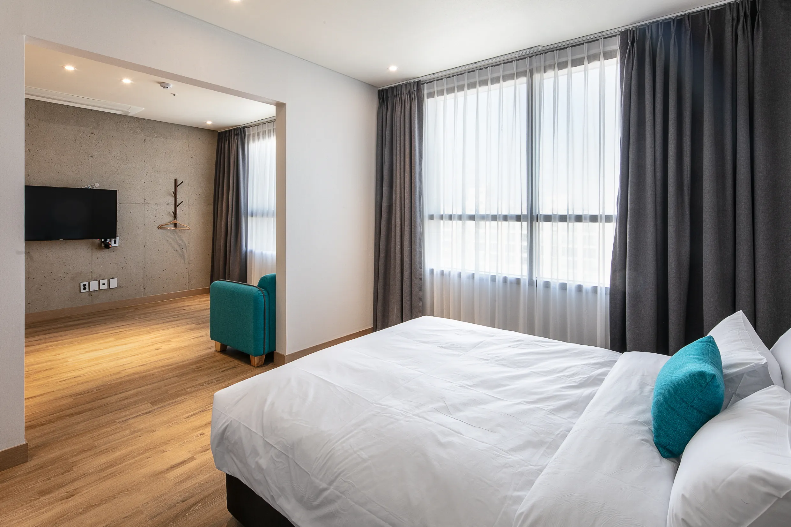

[LACOZi STAY 住宿](https://www.booking.com/hotel/kr/rakojiseutei.zh-tw.html?aid=7956794&no_rooms=1&group_adults=2)的客房均設有私人衛浴，且提供淋浴設施和吹風機。客房為住客設有空調，提供保險箱和平面電視，WiFi 當然也是免費。LACOZi STAY 離 GS25 便利商店走路不到 1 分鐘，房間內的設施完善，是喜歡自己煮東西的人的首選。雖然它距離東大門商圈有一點距離，但只能搭上捷運，都不是問題。總結就是 LACOZi STAY 是一間適合家庭旅遊的住宿，如果你的旅遊風格步調比較輕鬆，可以考慮看看！

可以到 [Booking.com](https://www.booking.com/hotel/kr/rakojiseutei.zh-tw.html?aid=7956794&no_rooms=1&group_adults=2) 上面看更多 LACOZi STAY 房間的照片喔！

**LACOZi STAY 基本資訊**
- 地址：232, Mangu-ro, Jungnang-Gu, Seoul｜韓文：서울특별시 중랑구 망우로 232（상봉동）（[Naver Map](https://naver.me/5KZt56rN)｜[Kakao Map](https://kko.to/S4Pp1_yniz)）
- 地鐵：地鐵中浪站 3 號出口步行約 2 分鐘
- 商圈：距離東大門商圈約 7.6 公里
- 最近機場：距離金浦國際機場約 28 公里
- 平均每晚雙人房價格：約台幣 4,500 元 ($$)
- 是否含早餐：有
- 查看即時房價：[**點我前往**](https://www.booking.com/hotel/kr/rakojiseutei.zh-tw.html?aid=7956794&no_rooms=1&group_adults=2)

### 東大門飯店推薦 4 - 東大門 K 大旅館

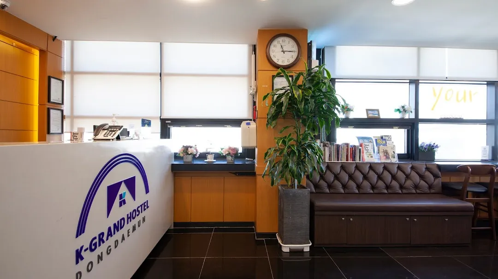

[東大門 K 大旅館](https://www.booking.com/hotel/kr/k-guesthouse-dongdaemun-3.zh-tw.html?aid=7956794&no_rooms=1&group_adults=2)提供多項便利設施，包括觀光旅遊櫃台、全面禁菸客房、共用休息室以及可以看到美麗風景的露台。這家旅館的住宿套餐包含美味早餐，且在房間就能享有美麗的景色！飯店也保持得非常乾淨，設施齊全，而且工作人員態度親切友善，溝通能力出色，非常樂於協助。另外，它除了價格實惠，位置也非常方便，離地鐵站不遠。推薦給獨自旅遊或與親友兩人行的你！

可以到 [Booking.com](https://www.booking.com/hotel/kr/k-guesthouse-dongdaemun-3.zh-tw.html?aid=7956794&no_rooms=1&group_adults=2) 上面看更多東大門 K 大旅館房間的照片喔！

**東大門 K 大旅館基本資訊**
- 地址：339-1 Wangsimni-ro, Seongdong-gu, Seoul｜韓文：서울특별시 성동구 왕십리로 339-1（하왕십리동）（[Naver Map](https://naver.me/FEJds8jM)｜[Kakao Map](https://kko.to/KewGMaD98S)）
- 地鐵：地鐵上往十里站 4 號出口步行約 1 分鐘
- 商圈：距離東大門商圈約 2.6 公里
- 最近機場：距離金浦國際機場約 28 公里
- 平均每晚雙人房價格：約台幣 2,000 元 ($$)
- 是否含早餐：有
- 查看即時房價：[**點我前往**](https://www.booking.com/hotel/kr/k-guesthouse-dongdaemun-3.zh-tw.html?aid=7956794&no_rooms=1&group_adults=2)

### 東大門飯店推薦 5 - 喜普樂吉酒店 

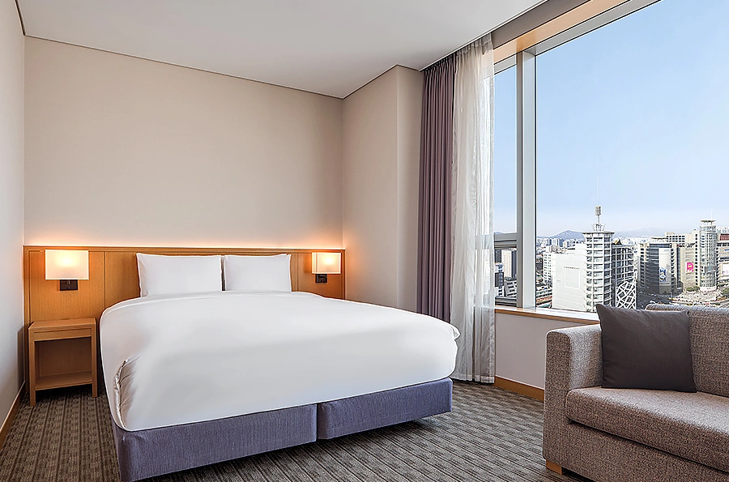

[喜普樂吉酒店](https://www.booking.com/hotel/kr/ky-heritage-dongdaemun.zh-tw.html?aid=7956794&no_rooms=1&group_adults=2)是一間評價超高、地點超優的飯店，步行即可抵達東大門商圈，離地鐵站也只需要走一分鐘、搭地鐵至明洞商圈逛逛也只有 10 分鐘的車程，房間乾淨明亮，服務人員除了韓文和英文外，也會說簡單的中文，對於稍微有點預算的台灣旅客來說，是非常適合情侶、家庭到首爾旅遊的下榻好選擇。

可以到 [Booking.com](https://www.booking.com/hotel/kr/ky-heritage-dongdaemun.zh-tw.html?aid=7956794&no_rooms=1&group_adults=2) 上面看更多喜普樂吉酒店外觀房間的照片喔！

**喜普樂吉酒店外觀基本資訊**
- 地址：226, Jangchungdan-ro, Jung-gu, Seoul｜韓文：서울특별시 중구 장충단로 226（광희동 2 가）（[Naver Map](https://naver.me/5HSiZC3F)｜[Kakao Map](https://kko.to/R9xMRFa_02)）
- 地鐵：東大門歷史文化公園站 9 號出口步行 1 分鐘
- 商圈：位在東大門商圈內
- 最近機場：距離金浦國際機場約 17 公里
- 平均每晚雙人房價格：約台幣 5,000 元 ($$$)
- 是否含早餐：有
- 查看即時房價：[**點我前往**](https://www.booking.com/hotel/kr/ky-heritage-dongdaemun.zh-tw.html?aid=7956794&no_rooms=1&group_adults=2)

### 東大門飯店推薦 6 - 東大門阿里郎山飯店

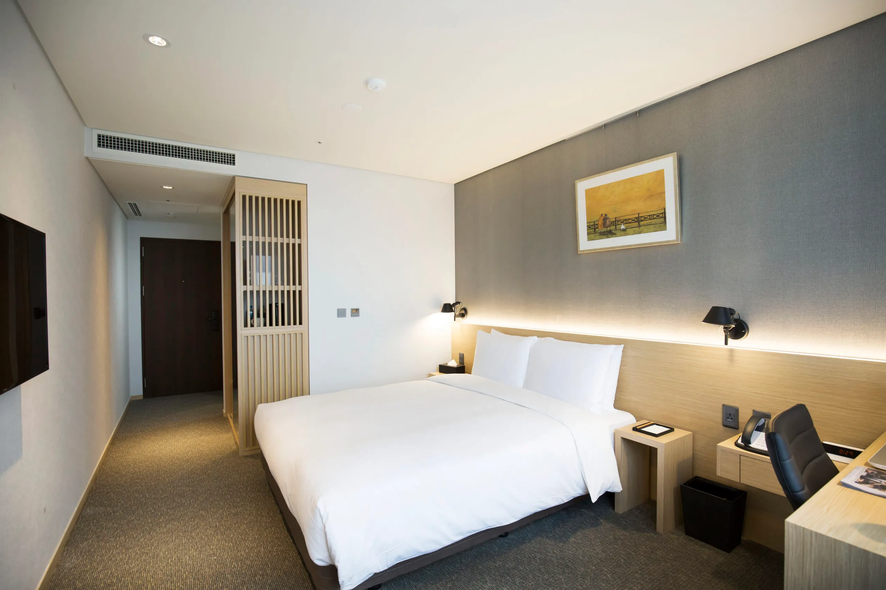

[東大門阿里郎山飯店](https://www.booking.com/hotel/kr/best-western-a-hill-dongdaemun.zh-tw.html?aid=7956794&no_rooms=1&group_adults=2)提供現代化的客房，裝潢以暖色調的木製家具為主，可以感受到溫馨舒適的氛圍。飯店備有一個休息區，裡面有沙發和平面有線電視，是一個很不錯的休息空間。24 小時接待並提供方便快捷的服務，包括外幣兌換和行李寄存。此外，館內的健身中心也供顧客免費使用。飯店的服務人員非常親切和熱情。儘管房型空間相對不大，但環境非常安靜舒適，住在這了真的很愜意。如果你喜歡這種輕輕鬆鬆、自由自在的感覺，勢必要考慮一下東大門阿里郎山飯店！

可以到 [Booking.com](https://www.booking.com/hotel/kr/best-western-a-hill-dongdaemun.zh-tw.html?aid=7956794&no_rooms=1&group_adults=2) 上面看更多東大門阿里郎山飯店房間的照片喔！

**東大門阿里郎山飯店基本資訊**
- 地址：8 Arirang-ro, Seongbuk-gu, Seoul｜韓文：서울특별시 성북구 아리랑로 8（동선동 4 가）（[Naver Map](https://naver.me/FMAd0oZw)｜[Kakao Map](https://kko.to/wMO2JydHjF)）
- 地鐵：地鐵誠信女子大學站 6 號出口步行約 1 分鐘
- 商圈：距離東大門商圈約 1.8 公里
- 最近機場：距離金浦國際機場約 29 公里
- 平均每晚雙人房價格：約台幣 4,000 元 ($$)
- 是否含早餐：有
- 查看即時房價：[**點我前往**](https://www.booking.com/hotel/kr/best-western-a-hill-dongdaemun.zh-tw.html?aid=7956794&no_rooms=1&group_adults=2)

### 東大門飯店推薦 7 - 空中花園東大門金斯敦酒店

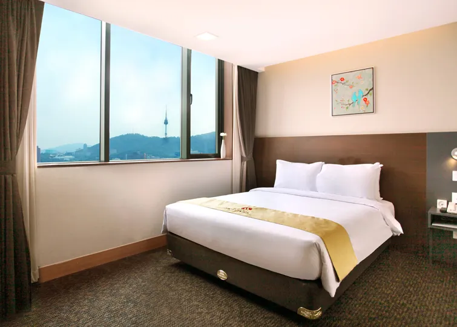

[空中花園東大門金斯敦酒店](https://www.booking.com/hotel/kr/skypark-kingstown-dongdaemun.zh-tw.html?aid=7956794&no_rooms=1&group_adults=2)位於地點極佳的位置，樓下就是進入東大門購物商圈，交通便利，周邊餐飲和便利商店多不勝數。飯店的服務人員極為親切專業，精通多國語言，讓溝通變得無障礙。客房現代化，並且都鋪設了柔軟的地毯，提供了一個舒適的休息空間。此外，飯店的接待櫃檯 24 小時開放，提供禮賓服務、外幣兌換和行李寄存服務。最可愛的是飯店有提供行李磅秤，讓旅客去機場前可以確認自己的行李是否會超重。雖然金斯敦酒店的價位稍微比較高，但 CP 質絕對是數一數二，推薦給單純只想來購物的各位！

可以到 [Booking.com](https://www.booking.com/hotel/kr/skypark-kingstown-dongdaemun.zh-tw.html?aid=7956794&no_rooms=1&group_adults=2) 上面看更多空中花園東大門金斯敦酒店房間的照片喔！

**空中花園東大門金斯敦酒店基本資訊**
- 地址：20 Jangchungdan-ro 13-gil, Jung-gu, Seoul｜韓文：서울특별시 중구 장충단로 13 길 20（을지로6가）（[Naver Map](https://naver.me/5NdMj994)｜[Kakao Map](https://kko.to/yupjFokx8q)）
- 地鐵：地鐵東大門站 1、4 號出口步行約 1 分鐘
- 商圈：距離東大門商圈約 0.3 公里
- 最近機場：距離金浦國際機場約 28 公里
- 平均每晚雙人房價格：約台幣 5,200 元 ($$$)
- 是否含早餐：有
- 查看即時房價：[**點我前往**](https://www.booking.com/hotel/kr/skypark-kingstown-dongdaemun.zh-tw.html?aid=7956794&no_rooms=1&group_adults=2)

### 東大門飯店推薦 8 - Glue Hotel

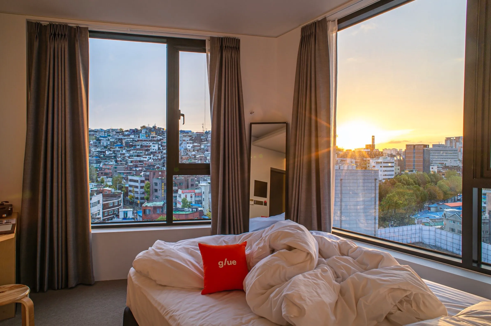

[Glue Hotel](https://www.booking.com/hotel/kr/glue-hotel.zh-tw.html?aid=7956794&no_rooms=1&group_adults=2) 是一間平價 3 星級飯店，飯店提供行李寄放服務，方便你在入住或退房時輕鬆處理行李。櫃台服務人員非常親切，並能以英語、日語和韓語 3 種語言溝通，並且 24 小時服務。房間裝修設備頗新，乾淨且陽光充足，營造出舒適的居住環境。這間飯店的獨特之處在於每間客房都設有一台迷你唱機，並提供一張黑膠唱片，供客人欣賞音樂。這種浪漫的氛圍特別吸引情侶入住，帶著你的另一伴去好好享受吧！

可以到 [Booking.com](https://www.booking.com/hotel/kr/glue-hotel.zh-tw.html?aid=7956794&no_rooms=1&group_adults=2) 上面看更多 Glue Hotel 房間的照片喔！

**Glue Hotel 基本資訊**
- 地址：228 Yulgok-ro, Jongno-gu, Seoul｜韓文：서울특별시 종로구 율곡로 228（이화동）（[Naver Map](https://naver.me/5Gy5wCzf)｜[Kakao Map](https://kko.to/Z6AD0cNwse)）
- 地鐵：地鐵鐘路 5 街站 3、4 號出口步行約 5 分鐘
- 商圈：距離東大門商圈約 0.5 公里
- 最近機場：距離金浦國際機場約 17 公里
- 平均每晚雙人房價格：約台幣 2,800 元 ($$)
- 是否含早餐：無
- 查看即時房價：[**點我前往**](https://www.booking.com/hotel/kr/glue-hotel.zh-tw.html?aid=7956794&no_rooms=1&group_adults=2)

### 東大門飯店推薦 9 - 科莫明洞旅館

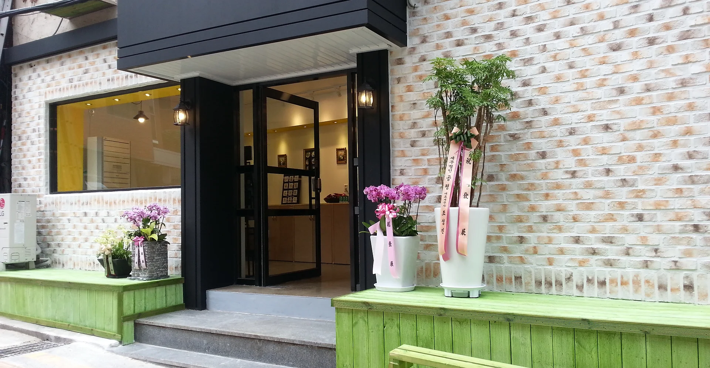

[科莫明洞旅館](https://www.booking.com/hotel/kr/myeongdong-guesthouse-como.zh-tw.html?aid=7956794&no_rooms=1&group_adults=2)位於首爾市中心，地理位置絕佳。飯店的服務人員非常親切，而且能夠流利地用中文溝通。儘管飯店沒有電梯，但入住時可以請櫃檯人員協助搬運行李，甚至要求住在較低樓層的房間(當然最好是能提前溝通)。雖然房間相對較小，但設施應有盡有，甚至還準備了變壓器，確確實實地提供了一個舒適的住宿環境。總之，這家飯店特別適合帶著小孩和長輩入住，推薦給想帶父母來一趟孝親之旅的你！

可以到 [Booking.com](https://www.booking.com/hotel/kr/myeongdong-guesthouse-como.zh-tw.html?aid=7956794&no_rooms=1&group_adults=2) 上面看更多科莫明洞旅館房間的照片喔！

**科莫明洞旅館基本資訊**
- 地址：12 Toegye-ro 24-gil, Jung-gu, Seoul｜韓文：서울특별시 중구 퇴계로 24 길 12（남산동 3 가）（[Naver Map](https://naver.me/xtWaEIzA)｜[Kakao Map](https://kko.to/zr2RxxzTs1)）
- 地鐵：地鐵明洞站 1 號出口步行約 1 分鐘
- 商圈：距離東大門商圈約 1.1 公里
- 最近機場：距離金浦國際機場約 15 公里
- 平均每晚雙人房價格：約台幣 2,100 元 ($$)
- 是否含早餐：無
- 查看即時房價：[**點我前往**](https://www.booking.com/hotel/kr/myeongdong-guesthouse-como.zh-tw.html?aid=7956794&no_rooms=1&group_adults=2)

### 東大門飯店推薦 10 - 首爾新羅酒店

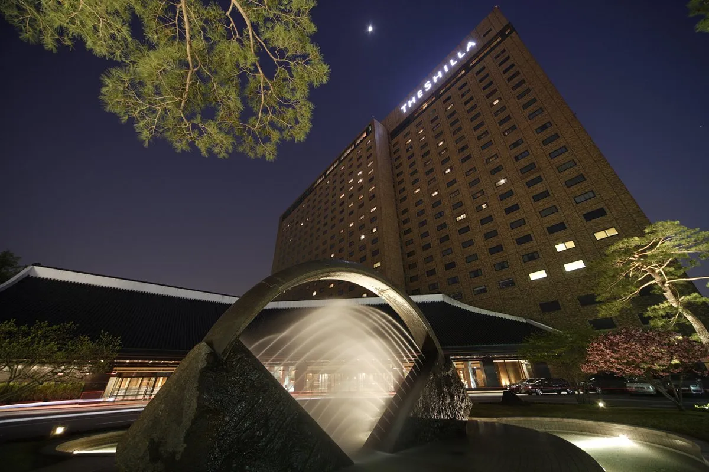

[首爾新羅酒店](https://www.booking.com/hotel/kr/the-shilla.zh-tw.html?aid=7956794&no_rooms=1&group_adults=2)連續四年榮獲《富比士旅遊指南》的五星級殊榮，堪稱卓越的住宿選擇。飯店提供免費接駁巴士前往東國大學地鐵站。飯店更有全方位的服務，包括豪華 SPA 和六間精緻餐廳。此外，飯店設有健身俱樂部，提供健身房、高爾夫練習場和步道，並提供瑜伽課程和有氧運動課程。客房以溫暖的色調裝潢，設備齊全，包括空調和暖氣，最重要的是，飯店的服務人員始終態度只能說是太專業了。此外，飯店大樓內還設有購物中心，不用出門也能輕鬆購物和娛樂。當然。價格方面偏高，如果你也想體驗奢華的生活，可以參考看看！

可以到 [Booking.com](https://www.booking.com/hotel/kr/the-shilla.zh-tw.html?aid=7956794&no_rooms=1&group_adults=2) 上面看更多首爾新羅酒店房間的照片喔！

**首爾新羅酒店基本資訊**
- 地址：249 Dongho-ro, Jung-gu, Seoul｜韓文：서울특별시 중구 동호로 249 （장충동 2 가）（[Naver Map](https://naver.me/5SWSRkDq)｜[Kakao Map](https://kko.to/p31Pps_ink)）
- 地鐵：地鐵東國大學入口站 5 號出口步行約 5 分鐘
- 商圈：距離東大門商圈約 1.2 公里
- 最近機場：距離金浦國際機場約 17 公里
- 平均每晚雙人房價格：約台幣 11,000 元（$$$$）
- 是否含早餐：有
- 查看即時房價：[**點我前往**](https://www.booking.com/hotel/kr/the-shilla.zh-tw.html?aid=7956794&no_rooms=1&group_adults=2)

## 十間首爾自由行東大門飯店推薦比較表格

| 飯店 | 價格 | 距離東大門商圈 | 即時房價 |
| -------- | -------- | -------- | -------- | 
| Hotel DM 東大門  | $$     | 1 公里     | [**前往查價→**](https://www.booking.com/hotel/kr/dm-seoul.zh-tw.html?aid=7956794&no_rooms=1&group_adults=2)     |
| 東大門 IBC 酒店  | $$     |1.6 公里     | [**前往查價→**](https://www.booking.com/hotel/kr/ibc.zh-tw.html?aid=7956794&no_rooms=1&group_adults=2)     |
| LACOZi STAY 飯店 | $$     |7.6 公里     | [**前往查價→**](https://www.booking.com/hotel/kr/rakojiseutei.zh-tw.html?aid=7956794&no_rooms=1&group_adults=2)     |
| 東大門 K 大旅館   | $$     |2.6 公里     | [**前往查價→**](https://www.booking.com/hotel/kr/k-guesthouse-dongdaemun-3.zh-tw.html?aid=7956794&no_rooms=1&group_adults=2) |
| 喜普樂吉酒店  | $$$     | 商圈內    |[**前往查價→**](https://www.booking.com/hotel/kr/ky-heritage-dongdaemun.zh-tw.html?aid=7956794&no_rooms=1&group_adults=2)    |
| 東大門阿里郎山飯店   | $$     | 1.8 公里    | [**前往查價→**](https://www.booking.com/hotel/kr/best-western-a-hill-dongdaemun.zh-tw.html?aid=7956794&no_rooms=1&group_adults=2) |
| 空中花園東大門金斯敦酒店   | $$$     | 0.3 公里     | [**前往查價→**](https://www.booking.com/hotel/kr/skypark-kingstown-dongdaemun.zh-tw.html?aid=7956794&no_rooms=1&group_adults=2) |
| Glue Hotel  | $$    | 0.5 公里    | [**前往查價→**](https://www.booking.com/hotel/kr/glue-hotel.zh-tw.html?aid=7956794&no_rooms=1&group_adults=2) |
| 科莫明洞旅館   | $$     | 1.1 公里     | [**前往查價→**](https://www.booking.com/hotel/kr/myeongdong-guesthouse-como.zh-tw.html?aid=7956794&no_rooms=1&group_adults=2) |
| 首爾新羅酒店  | $$$$   |1.2 公里   | [**前往查價→**](https://www.booking.com/hotel/kr/glue-hotel.zh-tw.html?aid=7956794&no_rooms=1&group_adults=2) |

價格方面都是以住宿日期前約一個月下訂計算，如果你更早決定好要去首爾的東大門商圈附近下榻，提前兩到三個月基本上都可以再省下 30% 花費（旺季除外）。

以上就是十間位在東大門商圈的飯店住宿推薦，希望能夠幫助到想要到韓國首爾旅遊的各位！