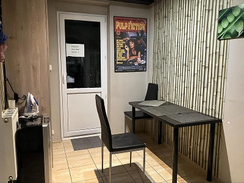

克拉克夫（波蘭語：Kraków）作為波蘭旅遊大城，自然是住宿、餐廳蓬勃發展之地，筆者二度造訪該城，幸運地找到了位在老城區與猶太區間的旅社，價格經濟實惠，地理位置極佳，今天就來推薦給大家！

在筆者住過的歐洲青旅中，許多都是位在公寓的其中一層，招牌不一定很大，但一樓對講機上面會貼個樓層旅社名稱，尋找時要再注意一下。

夢想公寓旅社前即是輕軌和公車站，相當方便。若想步行體會城市風光，古典歐風街景也會是很好的陪伴。筆者本次只待在克拉克夫一個晚上，抵達時櫃檯人員已下班，但自助 check-in 和住宿體驗都令人滿意，便捷的交通也省下許多時間，短短的兩天一夜旅行，便造訪了猶太區和老城區。

## 克拉克夫住宿推薦 - 基本資料

* 名稱：夢想公寓旅社 Dream Hostel
* 地址：Dietla 57/14, Kraków, 31-054, Poland
* 連結：<https://www.booking.com/Share-qKyOM9>
* 價格（新台幣）：

  * 雙人房  1100-1300/晚
  * 背包客（混宿、五床）400-500/晚
* 周邊景點：

  * 老城區（波蘭語：Stare Miasto）步行15分、輕軌10分
  * 瓦維爾城堡（波蘭語：Zamek Królewski na Wawelu ）步行10分
  * 克拉克夫火車站（波蘭語：	Kraków Główny）輕軌15分
  * 辛德勒工廠（波蘭語：Fabryka ‘Emalia’ Oskara Schindlera）公車15
* 交通

  * 電車站：步行1分
  * 公車站：步行2分
  * 地鐵：無
* 設施

  * 客廳：無
  * 交誼廳：有
  * 廚房：有
  * 電梯：無
  * 網路：有
  * 置物櫃：無鑰匙，需自備鎖頭
* 備品

  * 浴巾：無
  * 牙刷：無
  * 吹風機：和櫃檯借，免費
  * 沐浴乳：有
* 服務

  * 早餐
  * 24小時櫃檯

## 夢想公寓旅社實際入住體驗（公區)

### 交誼廳

