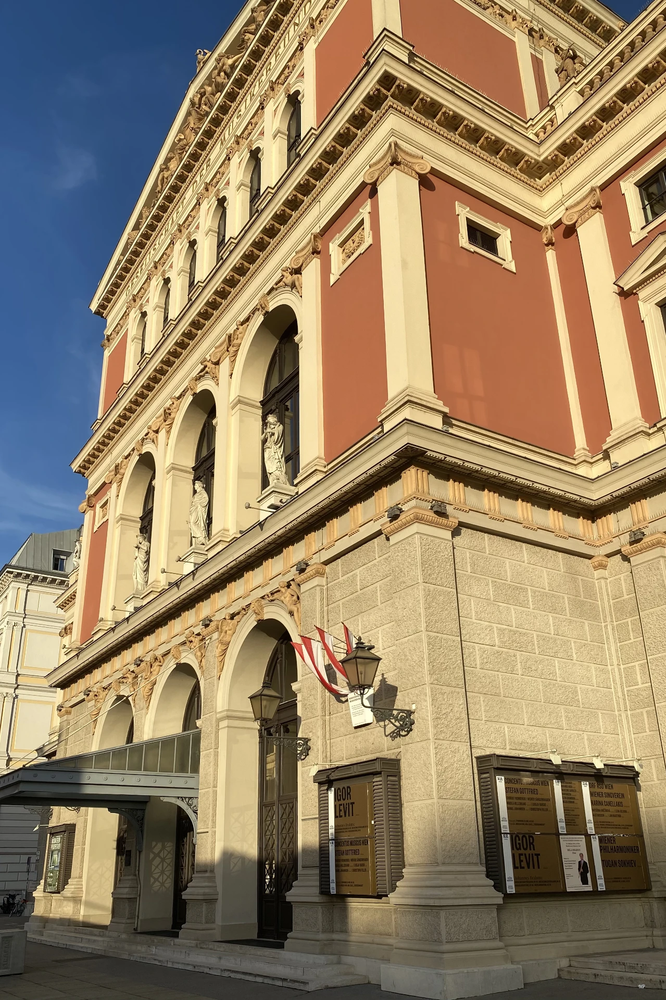
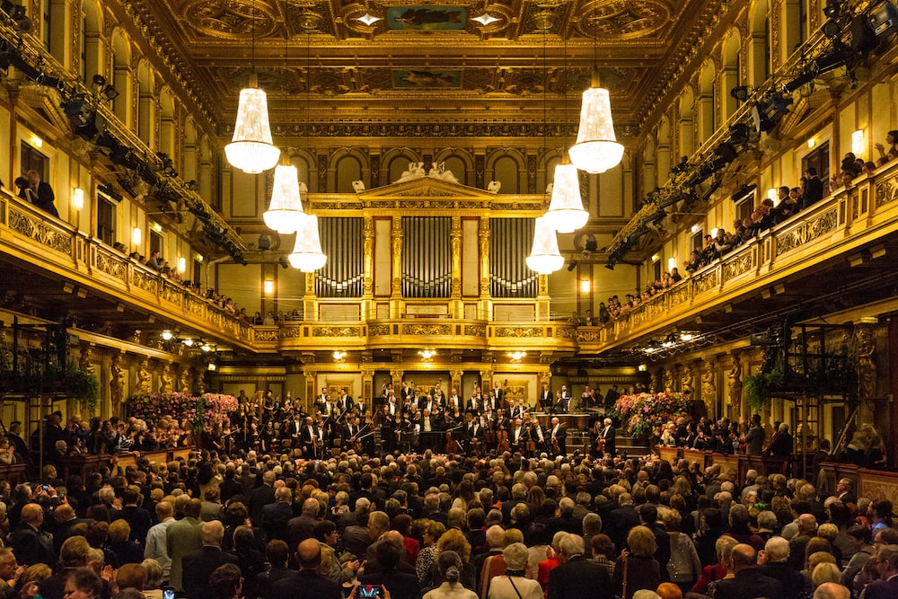
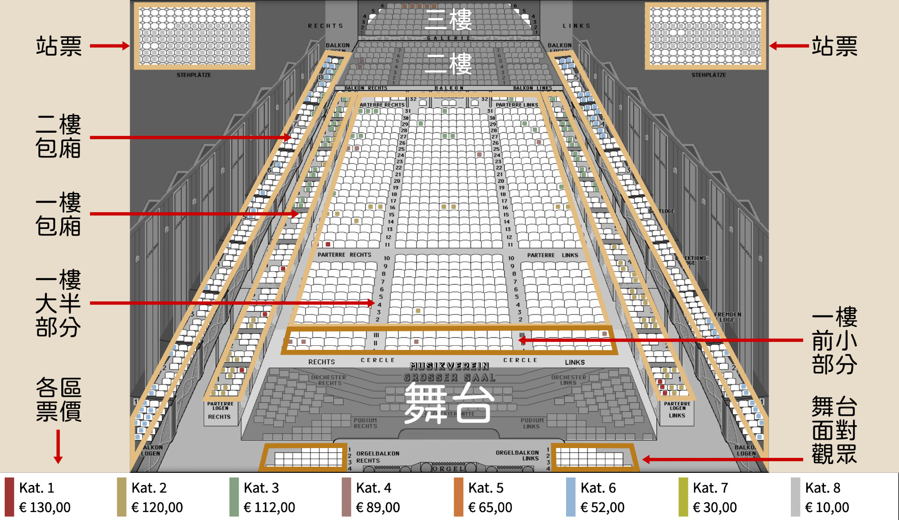
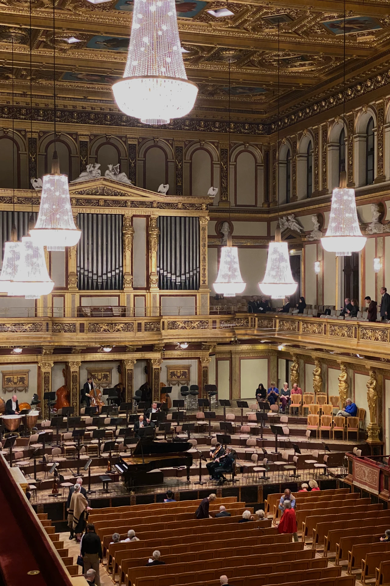
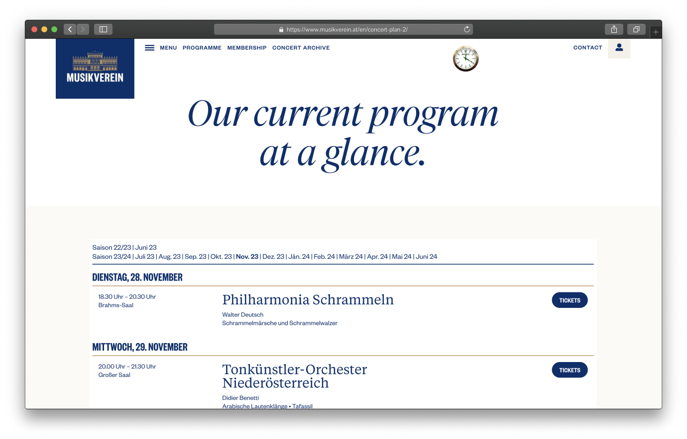
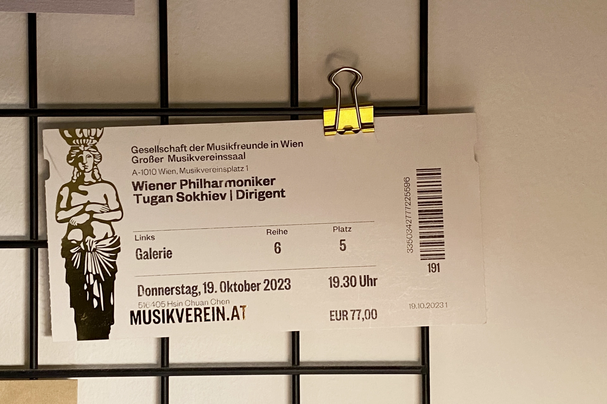
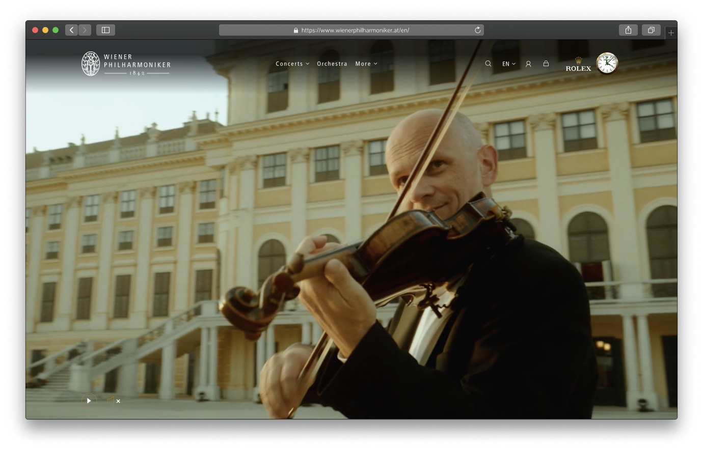

來自蘇格蘭格拉斯哥的衛報（The Guardian）作家湯姆（Tom Service），曾評論這個[演奏廳的聲音是「純金的」](https://www.theguardian.com/music/tomserviceblog/2008/sep/29/classical.music.musikverein)（pure gold）。

和德國柏林愛樂廳（德文：Konzerthaus）、荷蘭阿姆斯特丹大會堂（荷蘭文：Concertgebouw）、美國波士頓交響樂大廳（英文：Symphony Hall）齊名，這是世界上最佳的音樂廳之一[^1]，晚上常常有「**一群莫札特演奏著莫札特的音樂**」——它是**維也納的「金色大廳」**（德文：Goldener Saal）。

維也納的金色大廳已有超過百年歷史，它最為人知曉的特色莫過於每年新年一月一日，都會透過全球電視直播的「**[維也納新年音樂會](https://www.wienerphilharmoniker.at/en/newyearsconcert)**」了。

來到金色大廳的觀光客，可以選擇[參加 45 分鐘的英語導覽](https://www.musikverein.at/en/guided-tours-of-the-vienna-musikverein/)，深入了解這裡的歷史、建築設計等，除了星期日和奧地利國定假日外，每天有兩場付費導覽（一場英文、一場德文）。

有幸停留在維也納幾天，夜晚有閒暇的遊客更應該直該直接找一天購買音樂會門票入場，感受古典音樂的薰陶。不是古典音樂咖，挑選演出需要指路人？「莫札特音樂會」準沒錯。

**你知道嗎？這棟建築本身並不叫金色大廳。**

當我們說金色大廳時，我們在指的是「維也納音樂協會」（德文：Musikverein）這棟大樓裡面的其中一個表演廳，也就是最知名的金色大廳。

金色大廳也不是這個音樂廳的本名，它的本名簡單明瞭，就叫「大廳」。大廳的德文是 Großer Saal，也就是「大的廳」的意思，「金色」想必是因為內部金碧輝煌的裝潢而得名。

因為金色大廳這個名字簡單好記，聽起來又很厲害，現在大家幾乎都直接把音樂協會這棟建築當作金色大廳了。不過每天在這裡上演的**音樂會可不一定都是在金色大廳演出**喔！所以訂票時要再三確認，才能夠親眼目睹金色大廳的風采。

- 音樂協會（Musikverein）= 音樂（Musik）+ 協會（Verein）
- 大廳（Großer Saal）= 大（Groß）+ 廳（Saal）
- 金色大廳（Goldener Saal）= 金色（golden）+ 廳（Saal）

完全就是要 hashtag #德文邏輯。

## 維也納金色大廳（音樂協會）基本資訊

- 地址：Musikvereinsplatz 1, 1010 Vienna（[Google Maps](https://www.google.com/maps/place/%E9%87%91%E8%89%B2%E5%A4%A7%E5%BB%B3/@48.2007972,16.3647574,15z/data=!4m6!3m5!1s0x476d079d51daeac7:0x82c12bc03731834f!8m2!3d48.200544!4d16.372359!16zL20vMDFwbDZx?entry=ttu)）
- 交通：地鐵 U1 或 U4 線搭到卡爾廣場（Karlsplatz）站，步行約五分鐘；路面電車 71 號搭到 Schwarzenbergplatz 站；公車 59A 搭到歌劇院，卡爾廣場（Oper, Karlsplatz）站或是 4A 搭到卡爾廣場（Karlsplatz）站
- 演出門票價格：€10 ~ €140+

## 維也納音樂協會各音樂廳種類

在丹麥裔奧地利建築師特奧費爾·翰森（Baron Theophil von Hansen）的帶領之下，維也納音樂協會於 1870 年完工啟用，精美的裝修加上良好的音響效果，金色大廳很快就聲明遠播。

除了在 1870 年一開始就存在的「金色大廳」和常用於室內樂演出的「布拉姆斯廳」（Brahams-Saal）之外，還有另外三個表演場地和一個非表演性質的廳，這四個廳都位於地下室，並在 2004 年擴建完成。

這三個表演場地包括「玻璃廳 / 大禮堂」（Gläserner Saal / Magna Auditorium）、「金屬廳」（Metallener Saal）、「石頭廳 / 霍斯特・哈夏客廳」（Steinerner Saal / Horst Haschek Auditorium）、以及非表演性質的「木頭廳」（Hölzerner Saal）。

### 關於金色大廳（Großer Saal、Goldener Saal）

金色大廳內約有 1,700 個座位和 300 個站位[^2]，並標榜聲音效果在廳內的任何一個角落都一樣完美。

維也納愛樂（德文：Wiener Philharmoniker）是金色大廳的常駐樂團<!-- link to fun facts about 維也納愛樂）-->，頻繁的在這裡和世界知名音樂家合作演出，

對於古典音樂不太熟悉、或是只是好奇想感受氣氛的人，推薦你去一場由「維也納莫札特樂團」（英文：Vienna Mozart Orchestra）演出的音樂會。對，就是前面提到「**一群莫札特演奏著莫札特的音樂**」的那個音樂會。

<!-- 音響回音共鳴效果：鞋盒形狀廳室透過精緻鑲嵌天花板與塗上金箔的女神像柱，讓樂聲能延長殘響的時間可達兩秒之久，木製舞台下方的空間也增加了共振的效果 — > 來源：[維基百科](https://zh.wikipedia.org/zh-tw/%E7%B6%AD%E4%B9%9F%E7%B4%8D%E9%9F%B3%E6%A8%82%E5%8D%94%E6%9C%83%E5%A4%A7%E6%A8%93#cite_note-6) 原始來源呢？

天花板上是由 August Eisenmenger 繪製的阿波羅與九位謬思女神（希羅神話故事）。 -->

### 關於布拉姆斯廳（Brahams-Saal）

布拉姆斯廳的規模相比於金色大廳小了許多，不過內部的裝潢毫不遜色。這個廳雖然大部分用於室內樂演出，但是當表演活動太多，無法安排於金色大廳演出時，就有可能用到這個場地。

舉例來說，最知名的莫札特音樂會，有不少場次就是在布拉姆斯廳演出。如果你的目的明確，就是要朝聖金色大廳，那麼選擇演出的時候一定要特別注意演出場地喔！

<!---->

## 金色大廳座位分佈

在選位子時，除了透過平面圖知道位子在哪裡，也可以用訂單和票卷上的關鍵字來判斷，當你人親臨金色大廳時，就可以很清楚知道自己坐在哪裡囉！

以下幾個點是選位時可以記住的小細節：

1. 「Links」和「Rechts」分別是德文的「左邊」和「右邊」。它指的是觀眾面向舞台的方向來決定位子的左右方位，但不是每一個位子都會標示左右邊。
2. 如果選位時看到「restricted view」或類似的字樣，代表該座位有視野死角，可能會影響觀演體驗。
3. 「Reihe」指的是「排」；「Platz」指的是「座位」。

### 一樓前小部分（Cercle）

Cercle 的英文是 Circle，中文直翻是「圓」，在金色大廳 Cercle 指的是一樓最前面、離演出者最近，只有一小部份的位子，價格會比 Parterre 低。

### 一樓大半部分（Parterre）

Parterre 源自法文，中文直翻是「在地面上」，在金色大廳 Parterre 的位子是一樓大半部份的區域。通常來說，在 Parterre 最前面的位子是整場視野最佳、票價最貴的位子。

### 一樓包廂（Parterre-Loge）

Loge 的英文是 Box，也就是包廂的意思。Paterre-Loge 等於 Paterre + Loge 也就等於一樓的包廂。

### 二樓（Balkon）

Balkon 的英文是 Balcony，中文直翻是「陽台」，不過在劇場、表演的語境中，Balkon 是指「樓座」的意思，在金色大廳是指位於二樓的位子。

### 二樓包廂（Balkon-Loge）

Balkon-Loge 是位於二樓的包廂，這裡有不少位子會有視野死角（restricted view）。

### 三樓（Gallerie）

雖然寫三樓，但要到 Gallerie 是要先到二樓的 Balkon 層再走上去，所以嚴格來說算 2.5 樓吧？金色大廳中 Gallerie 的座位只有六排，位在 Balkon 的後上方，是整個金色大廳的最後、最上面的區域。

要坐在 Gallerie 的話，要馬坐第一排，要馬坐最後一排，不然以亞洲人的平均身高，坐在一群歐洲人中間，我們看舞台的視野算是相當吃虧。

### 站票（Stehplatz）

一樓正後方的一塊區域是購買站票（Stehplatz）的人欣賞演出的位置。在這裡只有站在前面第一排的人可以靠著欄杆，後面的人因為被前面的人擋住視線，基本上也不太能夠看到舞台。視演出而定，票價通常在 €10 ~ €15。

### 舞台旁面對觀眾席（Orgelbalkon）

Orgel 是管風琴的德文，Orgelbalkon 就是在二樓管風琴旁，**面對觀眾席**的位子區域。這裡的位子不一定每場演出都會開放購票。

這區位子看舞台的視野不好，有可能是有視野死角（restricted view）或是完全看不到舞台（no stage view）的位子，因此價格較低。

## 金色大廳購票教學

1. 在金色大廳的官網上查看[**當月節目表**](https://app.heptabase.com/d4547ce0-944a-4ec4-bd3e-f7045e863e76/card/af53a38a-52e2-4f24-aa7f-ada423503c7e)，選擇日期時間場次。
2. 根據自身喜好和預算選擇座位。
3. **最慢於演出開始一小時前**，至金色大廳（也就是音樂協會的大樓）櫃檯出示購票證明，兌換實體門票即可。

<!--怕訂錯票嗎？

banner = 訂票服務

服務費 300 台幣-->

## 觀賞金色大廳演出注意事項

1. 雖然沒有硬性規定，不過聽音樂會是一項優雅、端莊的活動，所以最好避免穿著拖鞋、短褲短裙、運動衫等等太過休閒的服裝。那要穿什麼？就把去音樂會當作是去一場約會吧！
2. 因安全考量，大衣、大型包包、雨傘等需寄放於衣物間，每件收費 1 歐元（現金支付）。
3. 演出有中間有 10 ~ 20 分鐘的中場休息，時間到前會響鈴提醒觀眾回到座位。
4. 演出前請記得將電子產品關機或調成靜音。
5. 演出進行中，禁止拍照和錄影。

## 加碼內容：怎麼親自朝聖維也納新年音樂會？

維也納新年音樂會的歷史可以追朔到 1941 年，在二戰期間的這場演唱會，所有收入都會捐獻給史特勞斯音樂家族，很多人認為這是一場維也納在戰爭中表示獨立性的方式。

一直到現在，每年都舉辦的維也納新年音樂會已經成為一項全球知名的古典音樂屆傳統。

其實，每年的維也納新年音樂會共有三場演出，一場在年底十二月三十日的「新年音樂會預演」、一場在三十一日的「新年夜音樂會」、還有一場在一月一日、也是唯一一場全球現場直播、大家最熟知的「新年音樂會」。這三場都有開放售票。

但是要取得這幾場音樂會的門票不僅荷包要夠、也要加點一些幸運值，因為新年音樂會的售票方式是用抽選的，而只有每年年初（通常是二月）才可以[到維也納愛樂的官方網站登記報名](https://www.wienerphilharmoniker.at/en/newyearsconcert/ticket-information)，成功被抽選到之後才能參加隔年的新年音樂會喔！

三場音樂會的票價範圍都不同。十二月三十日的「新年音樂會預演」票價約在 €20 到 €495；三十一日的「新年夜音樂會」票價約在 €25 到 €860；而一月一日的「新年音樂會」票價則是在 €35 到 €1,200 之間。

[^1]: [10 of the world’s best concert halls](https://www.theguardian.com/travel/2015/mar/05/10-worlds-best-concert-halls-berlin-boston-tokyo)
[^2]: [The Golden Sound of the Musikverein Wien](https://www.wienersymphoniker.at/en/orchestra/residencies/musikverein-wien-tickets-schedule)