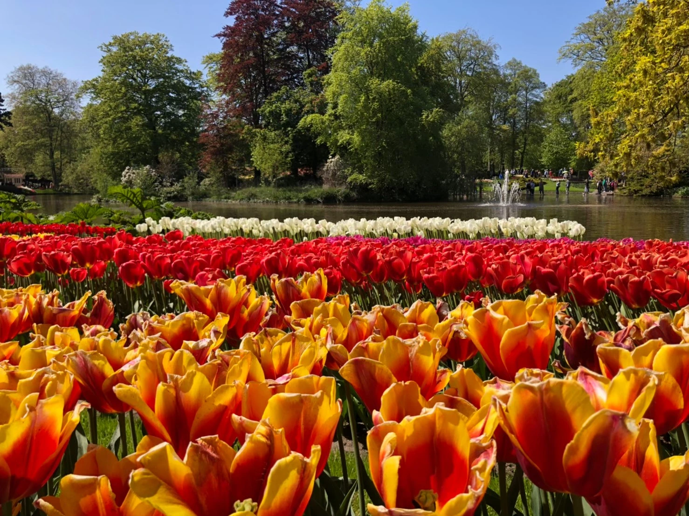
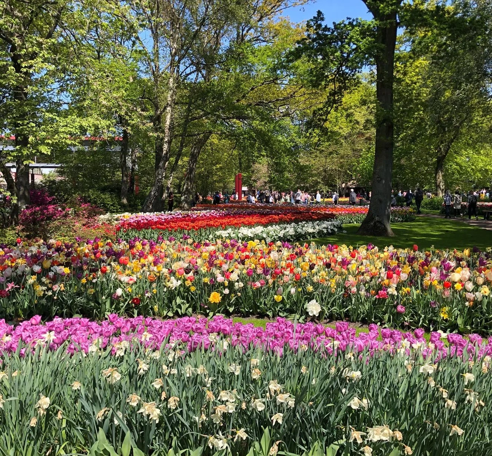
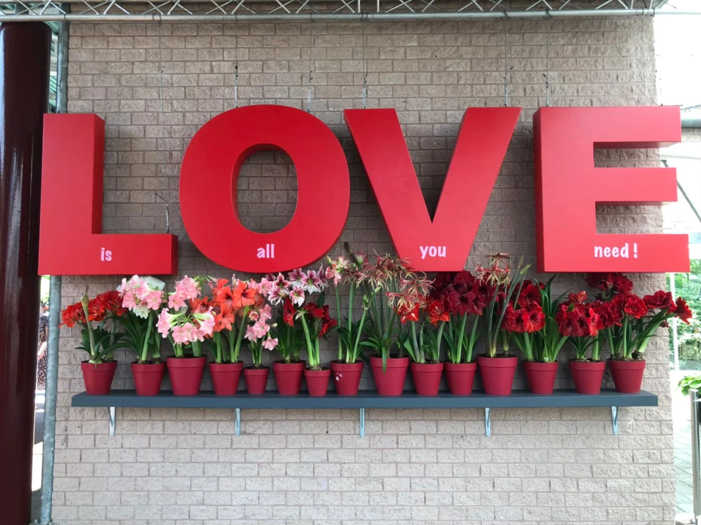
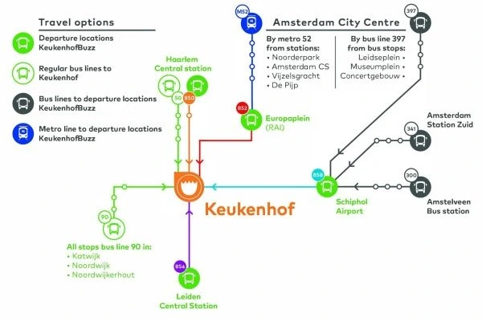

荷蘭有三寶：**風車、木屐、鬱金香**！

每年 3 月至 5 月正值荷蘭的**鬱金香花季**，庫肯霍夫花園（Keukenhof）作為世界最大的花園，每年都吸引無數遊客來此欣賞春日美景。如果你正計劃[**阿姆斯特丹自由行**](https://exittaiwan.com/posts/%E9%98%BF%E5%A7%86%E6%96%AF%E7%89%B9%E4%B8%B9%E4%BA%A4%E9%80%9A-%E5%8F%B2%E5%9F%BA%E6%B5%A6%E6%A9%9F%E5%A0%B4/)，千萬別錯過這場期間限定的花卉盛宴！

> ✔️ 越早訂越便宜：[**查詢阿姆斯特丹房價**](https://www.booking.com/city/nl/amsterdam.xt.html?aid=7956794&no_rooms=1&group_adults=2)

## 庫肯霍夫花園一日遊基本資訊

* 開放日期：2025 / 3 / 20 - 2025 / 5 / 11
* 開放時間：08:00 - 19:00
* 地址：Stationsweg 166A, 2161 AM Lisse, Netherlands
* 交通方式（花季期間提供接駁車）：
  * 阿姆斯特丹 RAI 站 → 852 號公車
  * 史基浦機場（Schiphol Airport）→ 858 號公車
  * 萊登中央車站（Leiden Centraal）→ 854 號公車
  * 哈倫中央車站（Haarlem Centraal）→ 850 號公車
* 票價：
  * 成人票：20 歐元
  * 交通 + 門票聯票可至[官網查詢](https://keukenhof.nl/en/ov/)或是至 [Klook 購票](https://affiliate.klook.com/redirect?aid=41451&aff_adid=1000566&k_site=https%3A%2F%2Fwww.klook.com%2Fzh-TW%2Factivity%2F101454-keukenhof-tours-countryside-cruise-options-landmark-tour-lisse%2F)

## 庫肯霍夫花園的歷史與特色

庫肯霍夫花園的名稱來自荷蘭語的「廚房花園」，起源於 15 世紀，當時是貴族用來種植香草與蔬菜的場所。如今，庫肯霍夫已被譽為「歐洲花園」，並成為全球最大的鬱金香公園。

1857 年，景觀設計師 Jan David Zocher 與他的兒子 Louis Paul Zocher 重新設計了花園與城堡，使其更具藝術美感。

1949 年，花卉種植商決定將此地作為春季花卉展示區，從 1950 年正式對外開放，至今已舉辦超過 75 屆，成為荷蘭最具代表性的旅遊景點之一。

## 庫肯霍夫花園一日遊亮點

### 1. 夢幻鬱金香花海與花卉藝術

庫肯霍夫花園內擁有超過 700 萬株鬱金香，各種顏色與品種交織成壯觀的花海。花季期間，天氣晴朗時更能展現花園的極致美感。此外，園內還有 花卉藝術展覽，將不同種類的花卉以創意方式呈現，是絕佳的拍照打卡點。

### 2. 城堡與園區設施

除了花卉，花園對面還有庫肯霍夫城堡（Keukenhof Castle），可以感受歐洲貴族的建築之美。園區內設有咖啡廳、紀念品店與兒童遊樂區，適合全家大小一同出遊。

### 3. 最佳交通方式與參觀建議

庫肯霍夫花園較難透過一般大眾運輸直達，建議以下方式前往：

* 租車自駕：彈性大，適合計畫荷蘭自駕遊的旅客。
* 公車接駁：花季期間可搭乘特定接駁公車，建議使用[交通 + 門票聯票](https://tickets.keukenhof.nl/en-US/tickets)，可從阿姆斯特丹、史基浦機場等地搭乘。
* 參加一日遊行程：若不想煩惱交通，推薦透過旅遊平台預訂一日遊行程，行程通常包含庫肯霍夫花園、荷蘭鄉村風光與風車遊船。
  * [Klook 庫肯霍夫花園一日遊](https://affiliate.klook.com/redirect?aid=41451&aff_adid=1000566&k_site=https%3A%2F%2Fwww.klook.com%2Fzh-TW%2Factivity%2F101454-keukenhof-tours-countryside-cruise-options-landmark-tour-lisse%2F)（含鄉村風光 & 遊船行程）

> ✔️ 越早訂越便宜：[**查詢阿姆斯特丹房價**](https://www.booking.com/city/nl/amsterdam.xt.html?aid=7956794&no_rooms=1&group_adults=2)

## 結語

如果你正在計劃阿姆斯特丹自由行，春季造訪庫肯霍夫花園絕對是不容錯過的夢幻行程。這座世界級花園讓你沉浸在七百萬株鬱金香花海的壯觀景色中，還能感受荷蘭的悠久花卉文化。記得提前預訂門票，讓你的荷蘭旅程更加完美！