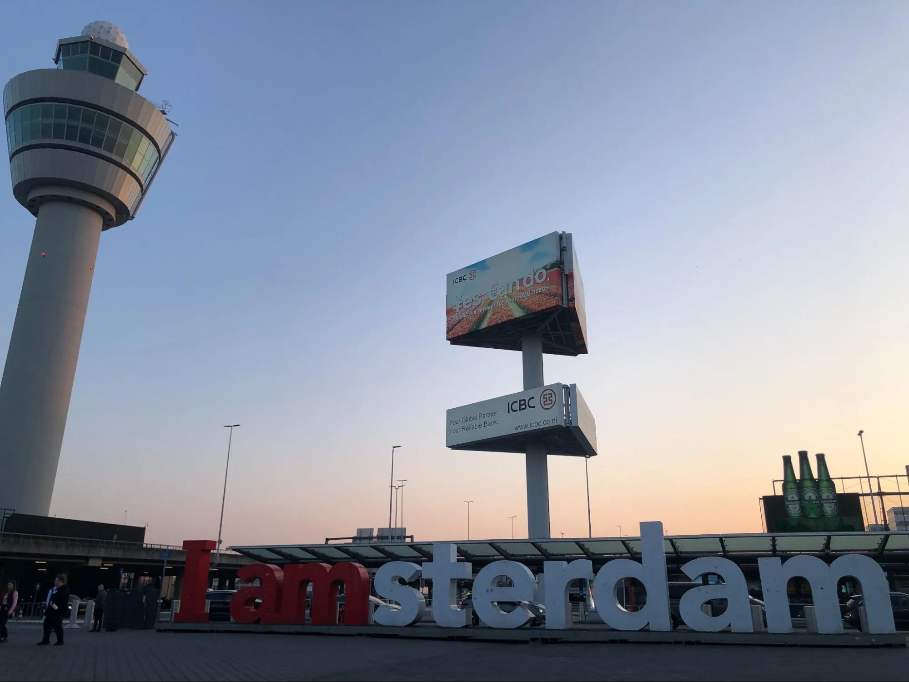
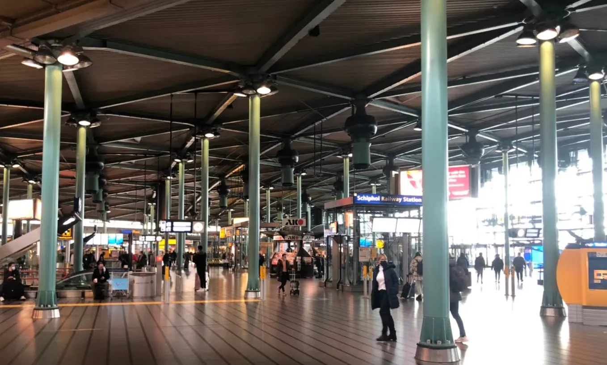
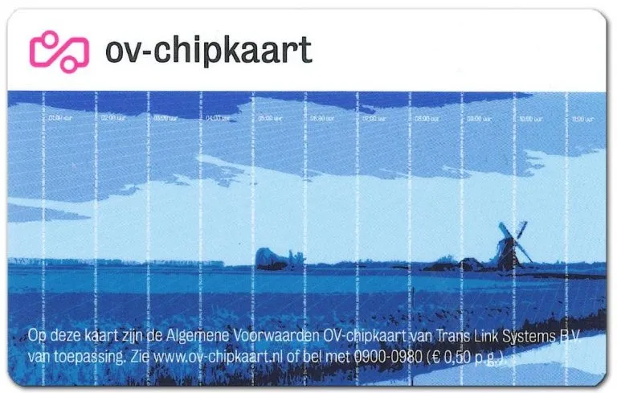
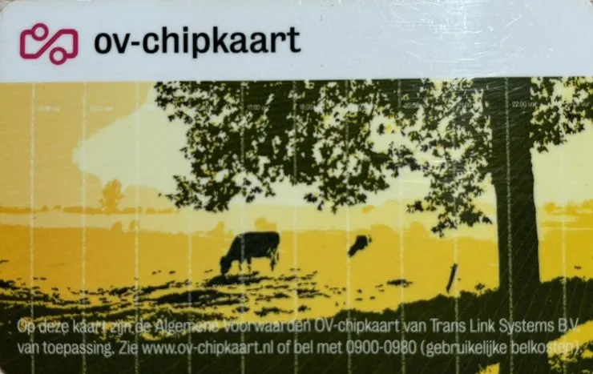
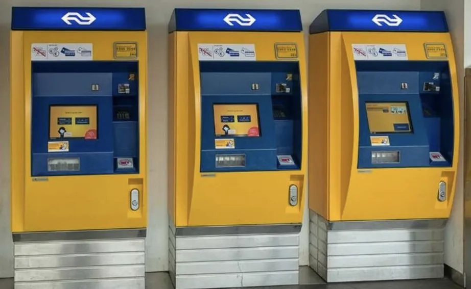
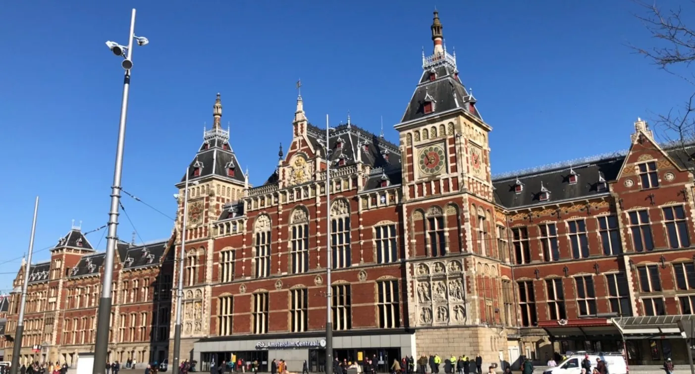
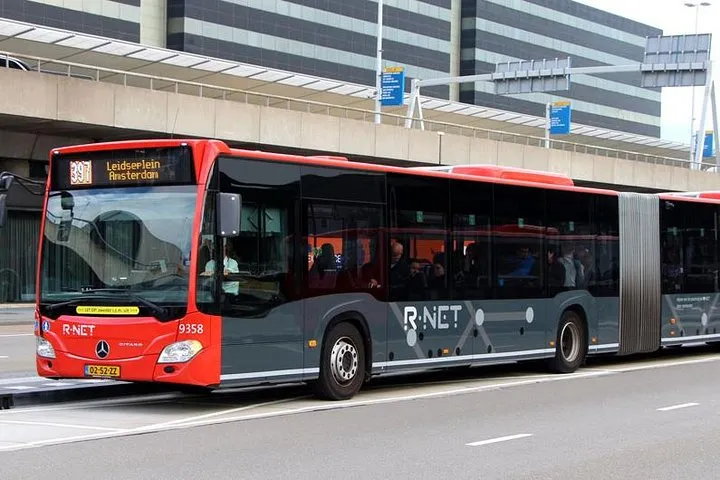
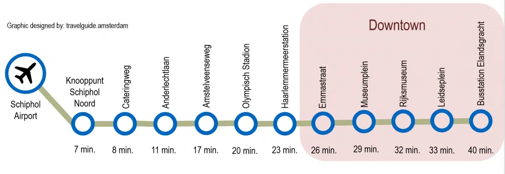

阿姆斯特丹（Amsterdam）作為荷蘭的首都，是許多遊客抵達荷蘭的首選目的地。史基浦機場（Amsterdam Schiphol Airport）則是歐洲重要的中轉站，使得阿姆斯特丹成為觀光熱點。

> ✔️ 越早訂越便宜：[**查詢阿姆斯特丹房價**](https://www.booking.com/city/nl/amsterdam.xt.html?aid=7956794&no_rooms=1&group_adults=2)

其中，阿姆斯特丹舊城區的運河風光是遊客最愛的獨特荷蘭景色。從史基浦機場到阿姆斯特丹市中心有多種交通方式可選，本篇將為您整理三種主要選擇，幫助您快速抵達市中心。

## 從阿姆斯特丹史基浦機場到市中心的三種交通方式

以下整理了火車、巴士和 Uber 這三種主要方式，依你的需求選擇最適合的方式。

## 阿姆斯特丹機場交通 - 火車：最快速、最經濟的選擇

搭火車從機場到阿姆斯特丹是最普遍的方法。

選擇搭火車的話，你會從阿姆斯特丹史基浦機場（Amsterdam Schiphol Airport）坐火車到阿姆斯特丹中央車站（Amsterdam Centraal）。有買荷蘭的交通卡 OV 卡的話，搭火車外到市區後也可以搭乘市內的大眾交通。

火車搭乘 Sprinter 車種即可，Sprinter 就很像台鐵的區間車，雖然是站站停，但僅花費 18 分鐘即可抵達阿姆斯特丹中央車站，也是最便宜的火車車種。

### 火車搭乘資訊

* 價格：4.90 歐元
* 時間：18 分鐘
* 優點：快速便利、車次多
* 缺點：會有誤點或是罷工的潛在問題

### 如何購票？

火車票可以透過以下方式購買：

1. 售票機：在機場出境後，跟著指標找到黃色的售票機器。
2. App：下載相關購票 App 即可輕鬆預訂。
3. 售票口：直接至現場購票。

> **小提醒**：進站與出站都需刷卡，記得攜帶 OV 卡，便於後續在市內搭乘交通工具。

## 阿姆斯特丹機場交通 - 機場快線公車（Bus 397）：價格友善的選擇

除了火車之外，你也可以從史基浦機場（Amsterdam Schipol Airport）搭巴士站前往阿姆斯特丹市中心。

走過出境大廳後，對面就是巴士站，機場快線從 B17 月台上車，直接載你到阿姆斯特丹市中心。

### 機場快線公車資訊

* 價格：單程 6.50 歐元，來回 11.75 歐元
* 時間：依照目的地而定，到阿姆斯特丹市區約 26 - 40 分鐘
* 優點：價格便宜、直達
* 缺點：可能有塞車或晚到問題

選擇搭巴士的話需要走到外面的巴士站等車，為了避免錯過班次，建議提早到車站等巴士來。

### 公車班次

* Bus 397：每日 5:30 至午夜 12:00 營運，每 7-15 分鐘一班。
* 夜間公車 N97：午夜 12:00 至凌晨時段營運，每小時一班，24 小時提供服務。

## 阿姆斯特丹機場交通 - 計程車（Uber）：最舒適的選擇

這個大概就是最簡單粗暴的方式抵達阿姆斯特丹。

搭計程車是相對舒適的選擇，不用人擠人而且隨叫就有，當然價格就會偏高，不過如果是三五好友旅遊的話就可以分攤車費。

偏好私密和舒適的話，搭乘 Uber 是最佳選擇，尤其是攜帶大量行李或多人同行時。

### Uber 叫車資訊

* 價格：依當下叫車價格而定
* 時間：約 37 分鐘到達阿姆斯特丹中央車站
* 優點：方便、行李空間充足、全天候服務
* 缺點：價格昂貴，可能因交通擁堵而延誤

## 阿姆斯特丹機場交通比較表

| **交通方式**   | **單程行車時間** | **起迄站**           | **單程價格**               |
| ---------- | ---------- | ----------------- | ---------------------- |
| **火車**     | 18 分鐘      | 史基浦機場 - 阿姆斯特丹中央車站 | 4.90 歐元                |
| **機場快線公車** | 26-40 分鐘   | 史基浦機場 - 阿姆斯特丹市區站點 | 單程 6.50 歐元；來回 11.75 歐元 |
| **Uber**   | 37 分鐘      | 史基浦機場 - 阿姆斯特丹中央車站 | 視當下叫車價格而定              |

## 結語

阿姆斯特丹是一座充滿魅力的城市，而選擇合適的交通方式是開啟完美旅程的重要第一步。無論是追求快速便利的火車、經濟實惠的機場快線公車，還是舒適靈活的 Uber，每種方式都有其特色與適用情況，台灣的旅客就再視自身情形調整選擇囉。

> ✔️ 越早訂越便宜：[**查詢阿姆斯特丹房價**](https://www.booking.com/city/nl/amsterdam.xt.html?aid=7956794&no_rooms=1&group_adults=2)

希望這篇文章幫助你輕鬆規劃[阿姆斯特丹自由行](https://exittaiwan.com/tags/%E9%98%BF%E5%A7%86%E6%96%AF%E7%89%B9%E4%B8%B9/)的交通行程，讓你的旅程更順暢愉快！
