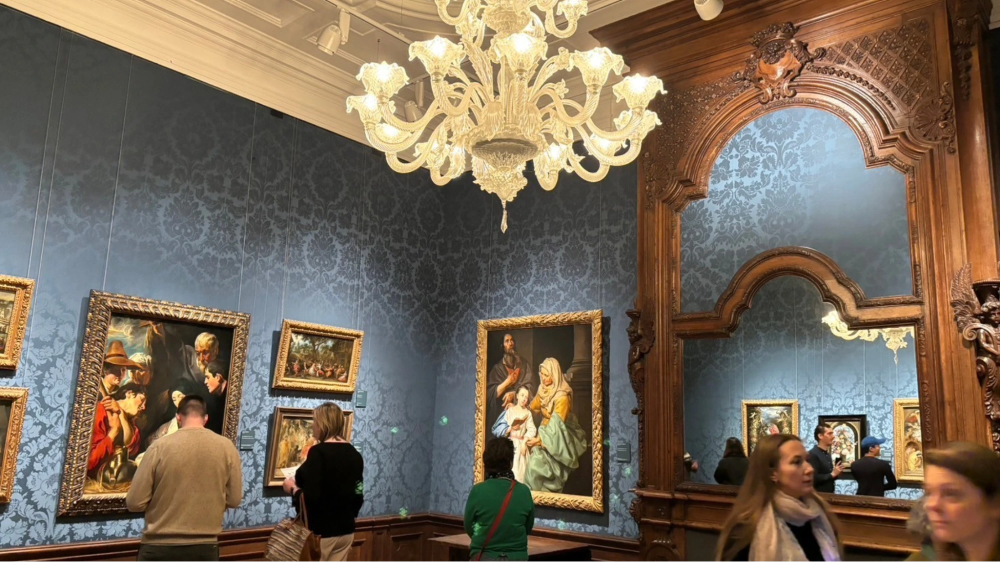

海牙（Den Haag）是荷蘭的第三大城市，擁有豐富的歷史與文化背景。除了是荷蘭議會及國際法庭的所在地，海牙也是藝術愛好者的天堂，尤其是莫瑞泰斯皇家美術館（Mauritshuis），其中以荷蘭畫家梅維爾（Johannes Vermeer）的《戴珍珠耳環的少女》吸引了大量遊客。這篇文章將帶你深入了解這個博物館的歷史背景及參觀亮點，讓你在荷蘭海牙自由行中不錯過這個藝術瑰寶。

## 莫瑞泰斯皇家美術館基本資訊

* 開放時間：

  * 週一：13:00-18:00
  * 週二至週日：10:00-18:00
* 地址：Plein 29, 2511 CS Den Haag, Netherlands
* 交通：從海牙中央車站（Den Haag Centraal Station）搭乘15或17號電車到Kort Voorhout站後，步行約6分鐘可達。或從海牙中央車站走路約10分鐘可達。
* 票價：

  * 成人票：20歐元
* 注意事項：參觀前需要事先預約並購票，可通過[官網](https://tickets.mauritshuis.nl/nl/tickets)或[Klook購票](https://www.klook.com/zh-TW/activity/100635-mauritshuis-museum-ticket-netherlands/?aid=api%7C13694%7Cdbaceabc77a247b8b00f49005-537641%7Cpid%7C537641&aff_pid=537641&aff_sid=&aff_adid=855595&utm_medium=affiliate-alwayson&utm_source=network&utm_campaign=13694&utm_term=537641&utm_content=&aff_klick_id=89490703788-api%7C13694%7Cdbaceabc77a247b8b00f49005-537641%7Cpid%7C537641-855595-3acc464)。

## 莫瑞泰斯皇家美術館的特色

莫瑞泰斯皇家美術館建於1633-1644年，最初是軍事領袖Johan Maurits van Nassau-Siegen的私人住所，後來經過改建成博物館，並於1822年對外開放。館內的藝術品主要集中於荷蘭黃金時代，特別是17世紀的荷蘭畫家作品。當中包括林布蘭（Rembrandt）與梅維爾（Johannes Vermeer）的畫作，至今該館的藝術收藏已經增長至約850件。

### 莫瑞泰斯皇家美術館的三大亮點

1. 《戴珍珠耳環的少女》

《戴珍珠耳環的少女》是梅維爾的代表作之一，這幅畫展現了畫家對光線與色彩的精湛運用。畫中的少女並非真實人物，而是梅維爾對面部表情的研究。這幅畫讓人不禁想了解她背後的故事，而電影《戴珍珠耳環的少女》也讓這幅畫作成為全球知名。

有興趣的人也可以看看[《戴珍珠耳環的少女》電影介紹](https://www.imdb.com/title/tt0393109/)。

2. 《台夫特景色》（View of Delft）

梅維爾的《台夫特景色》展現了他家鄉台夫特的美麗風光。畫作以南面角度描繪，光線與倒影的互動使得整個城市顯得寧靜而美麗，是梅維爾最具代表性的作品之一。

3. 海牙市區散步：霍夫維弗湖畔風光

博物館位於海牙市中心，周圍擁有許多觀光景點。你可以在參觀完博物館後，漫步至霍夫維弗湖畔，享受湖邊的美麗景色。如果時間允許，可以登上湖邊的黃色高塔Uitzichtpunt Binnenhof，俯瞰海牙的市區天際線。

## 總結

無論你是藝術愛好者還是純粹想要享受荷蘭的美麗風光，莫瑞泰斯皇家美術館都是海牙自由行的必去景點。別忘了事先預約門票，準備好一場藝術之旅！
