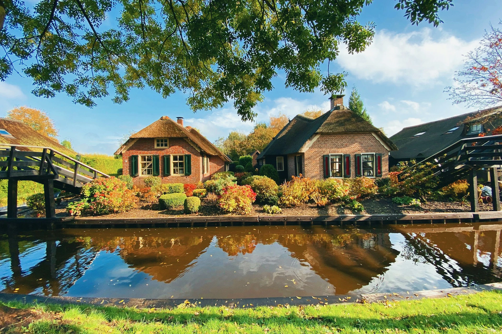
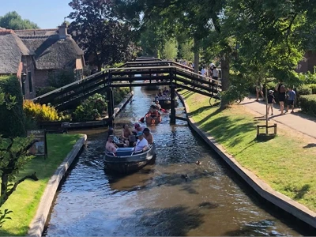
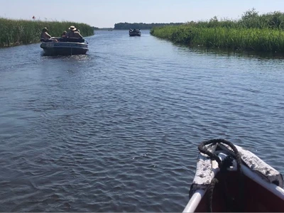
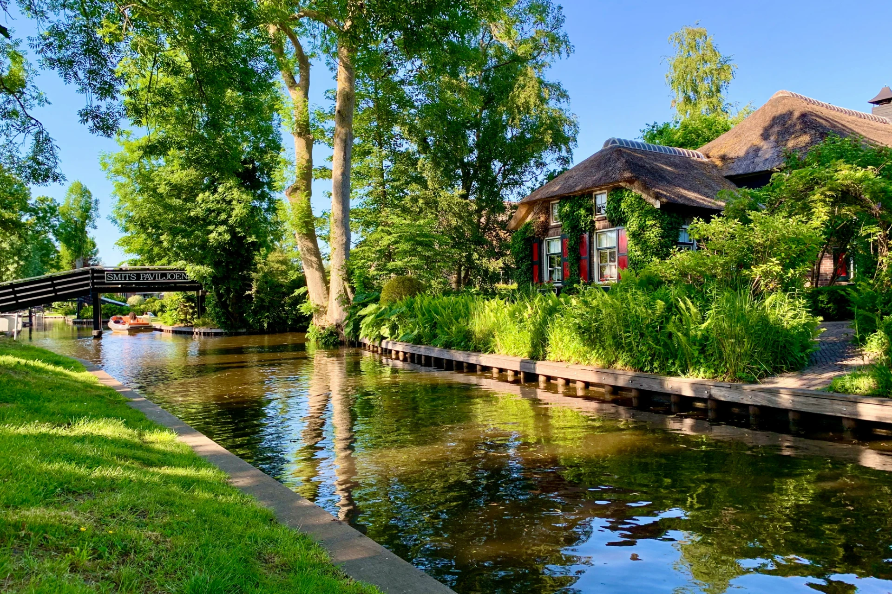

## 羊角村為什麼叫羊角村？

羊角村位於[荷蘭](https://exittaiwan.com/tags/%E8%8D%B7%E8%98%AD/)東邊的上艾瑟爾省（荷蘭文：Overijssel），是 800 年前工人開挖泥炭而知名，後來這些開挖泥炭的痕跡經過規劃後形成運河系統，再慢慢演變成現在由 176 座人行 / 自行車橋連接起來，島上也建造了現在的茅草屋。

羊角村曾在西元 1170 年時被洪水淹沒，重新整治的過程中發現許多羊角，因此才會被命名為「羊角村」。

> ✔️ 越早訂越便宜：[**現在查詢羊角村房價**](https://www.booking.com/city/nl/giethoorn.xt.html?aid=7956794&no_rooms=1&group_adults=2)

## 羊角村特色

### 羊角村的房屋

約一、兩百年前，羊角村這帶相當貧窮，當地人建造房屋都用蘆葦蓋屋頂。

而現今在這個磚瓦比蘆葦便宜的時代，加上政府被保護景觀的限制，羊角村的居民仍繼續維持傳統，使用蘆葦屋頂。

造就我們可以在羊角村旅遊時有這麼特別又漂亮的運河沿岸風景。

必須要注意的是，羊角村雖然是一個旅遊勝地，還是有當地居民住在這的，房子很特別可愛，不過不要不小心就踩到私人土地了。

## 船遊羊角村

悠閒的搭著船是最適合遊覽羊角村的方式。除了遊船外，還可以自行租船享受開船的樂趣。運河沿岸都有很多租船業者可以租船。不過如果是高峰期的話，運河上的船過多，可能就開始玩碰碰船了喔哈哈哈。

這次在羊角村停留兩天一夜，第二天早上租船來開，避開了下午的人潮，沒玩到碰碰船有點可惜(?)

> 租船價格參考可以[看這邊](https://giethoornvillage.com/rent-a-boat-in-giethoorn/)。

## 羊角村適合玩幾天？

如果是自駕或是[**跟 tour 的話適合一日遊**](https://affiliate.klook.com/redirect?aid=41451&aff_adid=1007160&k_site=https%3A%2F%2Fwww.klook.com%2Factivity%2F94943-giethoorn-day-trip-with-canal-tour-from-amsterdam%2F%3Fspm%3DSearchResult.SearchResult_LIST%26clickId%3Dc6dd6fb3f3)，當天不要再排其他行程，享受羊角村的寧靜與悠閒。

若是大眾交通前往的話，則會推薦[兩天一夜](https://www.booking.com/city/nl/giethoorn.xt.html?aid=7956794&no_rooms=1&group_adults=2)，到主要還是看從哪裡出發，這樣行程可以不用太趕避免時間都花在搭車上。

## 如何抵達羊角村？羊角村交通

1. 搭火車到 Steenwijk 站後轉 70 號公車到 Giethoorn，Dominee Hylkemaweg 站後就到羊角村啦！也可以在前幾站下車然後散步走過去。
2. 可以自駕前往，從[阿姆斯特丹](https://exittaiwan.com/tags/%E9%98%BF%E5%A7%86%E6%96%AF%E7%89%B9%E4%B8%B9/)開車車程大約 1.5 小時。不過羊角村內車子是沒有辦法開進去的，所以要把車停在外圍然後走進去。
3. 參加[**從阿姆斯特丹出發的一日遊行程**](https://affiliate.klook.com/redirect?aid=41451&aff_adid=1007160&k_site=https%3A%2F%2Fwww.klook.com%2Factivity%2F94943-giethoorn-day-trip-with-canal-tour-from-amsterdam%2F%3Fspm%3DSearchResult.SearchResult_LIST%26clickId%3Dc6dd6fb3f3)

停車的話羊角村周圍有許多停車場可以給遊客停車，且幾乎都是免費的。停車場主要都是在船公司附近，方便遊客停好車之後直接進去租船。

>  ✔️ 如果不是停在停車場內被抓到的話，會被罰 95 歐元喔！\
>  ✔️ 停車場資訊可以[看這邊](https://giethoornvillage.com/giethoorn-parking/)

## 安排到羊角村旅遊！

當你走進羊角村，彷彿踏入了一個世外桃源，寧靜的運河、茅草屋頂的房舍，以及蜿蜒的小橋構成了一幅夢幻的畫面。

無論是悠閒漫步、騎腳踏車，還是乘船穿梭於水道之間，這裡都能讓人感受到與世隔絕的寧靜與美好。如果你嚮往一場遠離喧囂、親近大自然的旅行，羊角村絕對值得列入你的荷蘭旅遊清單。

> ✔️ 越早訂越便宜：[**現在查詢羊角村房價**](https://www.booking.com/city/nl/giethoorn.xt.html?aid=7956794&no_rooms=1&group_adults=2)

下次計劃荷蘭行程時，別忘了安排時間來這裡，享受這座「荷蘭威尼斯」的獨特魅力！
