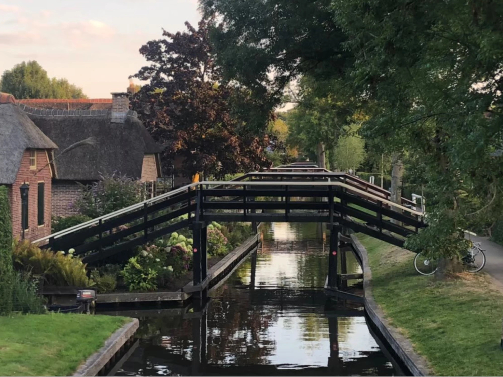

## 羊角村基本資訊

羊角村位於荷蘭東邊的上艾瑟爾省(Overijssel)，是 800 年前工人開挖泥炭而知名，後來這些開挖泥炭的痕跡經過規劃後形成運河系統，再慢慢演變成現在由176座人行/自行車橋連接起來，島上也建造了現在的茅草屋。羊角村曾在西元1170年時被洪水淹沒，重新整治的過程中發現許多羊角，因此才會被命名為「羊角村」。

羊角村官網 👉[點這邊](https://giethoornvillage.com/)

## 羊角村特色

### **羊角村的房屋**

約 1-200 年前，羊角村這帶相當貧窮，當地人建造房屋都用蘆葦蓋屋頂。而現今在這個磚瓦比蘆葦便宜的時代，加上政府被保護景觀的限制，羊角村的居民仍繼續維持傳統，使用蘆葦屋頂。造就我們可以在羊角村旅遊時有這麼特別又漂亮的運河沿岸風景。必須要注意的是，羊角村雖然是一個旅遊勝地，還是有當地居民住在這的，房子很特別可愛，不過不要不小心就踩到私人土地了。

### **船遊羊角村**

這是最適合遊覽羊角村的方式，除了遊船外，還可以自行租船享受開船的樂趣。運河沿岸都有很多租船業者可以租船。不過如果是高峰期的話，運河上的船過多，可能就開始玩碰碰船了喔哈哈哈。我們在羊角村停留兩天一夜，第二天早上租船來開，避開了下午的人潮，沒玩到碰碰船有點可惜(?)

關於租船價格參考👉[看這邊](https://giethoornvillage.com/rent-a-boat-in-giethoorn/)

### **羊角村適合玩幾天**

如果是自駕或是跟 tour 的話適合一日遊，當天不要再排其他行程，享受羊角村的寧靜與悠閒。若是大眾交通前往的話，我會推薦兩天一夜，看從哪裡出發，這樣行程可以不用太趕避免時間都花在搭車上。我跟旅伴在羊角村待了兩天一夜，步調緩慢地享受這村落，民宿前面就是小河，非常愜意阿！

### **如何抵達羊角村**

1. 搭火車到 Steenwijk 站後轉 70 號公車到 Giethoorn, Dominee Hylkemaweg 站後就到羊角村啦！或者也可以在前幾站下車然後走過去。

2. 可以自駕前往，從阿姆斯特丹開車車程大約 1.5 小時。不過羊角村內車子是沒有辦法開進去的，所以要把車停在外圍然後走進去。

停車的話羊角村周圍有許多停車場可以給遊客停車，且幾乎都是免費的。停車場主要都是在船公司附近，方便遊客停好車之後直接進去租船。需要注意的是，如果不是停在停車場內被抓到的話，會被罰95歐元喔！

停車場資訊👉[看這邊](https://giethoornvillage.com/giethoorn-parking/)

3. 參加從阿姆斯特丹出發的一日遊行程

Klook：[羊角村 & 運河一日遊（阿姆斯特丹出發）](https://klook.tp.st/KShvB7Eh)

GetYourGuide：[阿姆斯特丹：羊角村一日遊、乘船遊覽和徒步遊覽](https://getyourguide.tp.st/UxSGyIXI)
