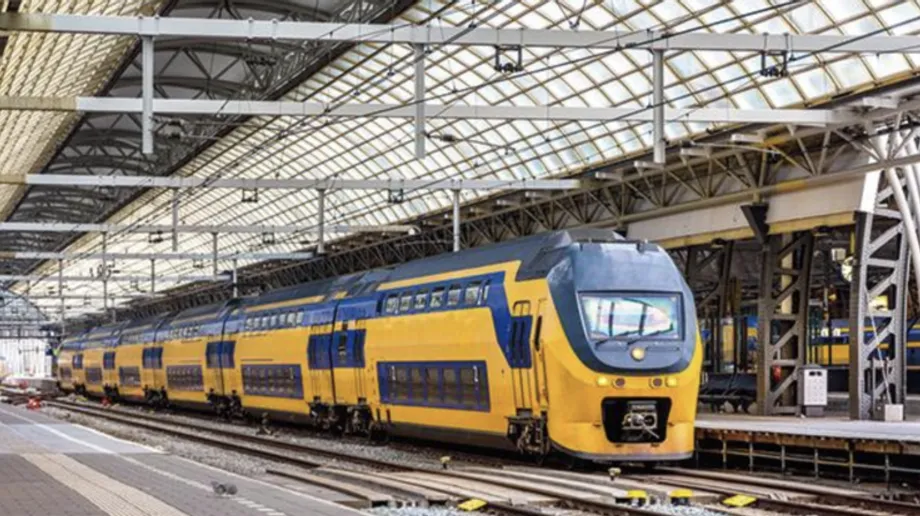
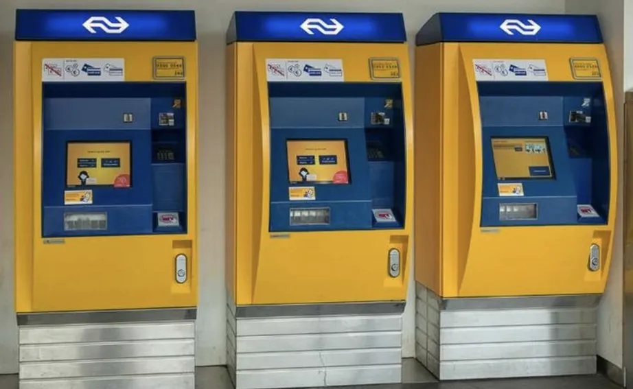
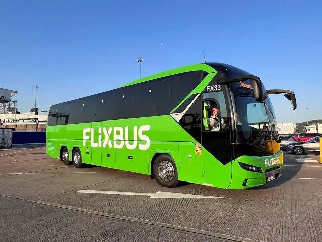

鹿特丹（Rotterdam）是荷蘭的第二大城，同時有著歐洲最大的海港，給人的感覺很像高雄。

大部分的遊客來到荷蘭旅遊想到的第一個城市大概是阿姆斯特丹（Amsterdam），不過鹿特丹作為第二大城我認為還是有其可看之處。而且人比阿姆斯特丹少遊覽起來也舒服多了。

> 越早訂越便宜：[**現在查詢鹿特丹房價**](https://www.booking.com/city/nl/rotterdam.xt.html?aid=7956794&no_rooms=1&group_adults=2)

由於鹿特丹沒有對歐洲以外的國際航線，因此需要先抵達阿姆斯特丹史基浦機場再轉乘抵達鹿特丹。以下整理三種方式可以抵達鹿特丹市中心，包含火車、巴士以及 Uber。

## 火車

搭火車從機場到鹿特丹是最普遍的方法從阿姆斯特丹史基浦機場到鹿特丹中央車站。如果有買荷蘭的交通卡 OV 卡，除了可以搭火車外到市區後也可以搭乘市內的大眾交通，便利性較高。

而火車又分成 InterCity 及 InterCity direct 兩個車種。InterCity 的搭乘時間較長約 50 分鐘，中間會停像海牙 Den Haag 等等的城市；InterCity direct 就是直達車，車程約 27 分鐘，不過這類車種是沒有辦法只用 OV 卡搭乘，必須要再加購該車種的票才能上車，不然被查到的話可是會罰款的喔。

* 價格：InterCity 14.50 歐元；InterCity direct 17.40 歐元
* 時間：InterCity 50 分鐘；InterCity direct 27 分鐘
* 優點：快速便利、座位寬敞舒適
* 缺點：會有誤點或是罷工的潛在問題

火車票除了用售票機器買之外，也可以透過 App 及現場售票口購買。火車售票機器及車站都在機場內，出境後跟著指標走就可以看得到又大又黃的機器，算是相當方便的選擇，也是我從機場到鹿特丹的交通方式首選。

## Flixbus 巴士

Flixbus 是歐洲最大的客運公司之一，範圍擴及歐洲各國的大小城市。價格上也算實惠。可以使用 App 下載使用。如果要搭乘 FlixBus 的話選擇從史基浦機場（Amsterdam Schipol Airport）到鹿特丹中央車站（Rooterdam CS）前往鹿特丹。

- 價格：3 ~ 8 歐元不等，價格浮動
- 時間：約一小時
- 優點：價格便宜、直達
- 缺點：可能有塞車或晚到問題

史基浦機場的 Flixbus 在機場外面，選擇這種交通方式的話需要走到外面的公車站。目前我在搭乘的體驗上除了晚到的問題之外沒有太大的問題。不過我個人如果搭客運的話都會提早到車站等客運來。

## Uber

這個大概就是最簡單粗暴的方式抵達鹿特丹了。這個方式當然就是相對舒適的選擇了，不用人擠人而且隨叫就有，當然價格就會偏高，不過如果是三五好友旅遊的話就可以分攤車費。

- 價格：依當下叫車價格而定
- 時間：約一小時
- 優點：叫車方便、行李可以放後車廂、24小時
- 缺點：價格昂貴、可能會有塞車問題

## 阿姆斯特丹史基浦機場往鹿特丹市區交通方式比較表

| **交通方式** | **單程行車時間** | **起迄站**                                                   | **單程價格（合計、歐元）**                      |
| ------------ | ---------------- | ------------------------------------------------------------ | ------------------------------------------------- |
| 火車         | 27-50分鐘        | 阿姆斯特丹史基浦機場（AMS；Amsterdam Schiphol Airport）-鹿特丹中央車站（Rotterdam CS） | InterCity：14.50 歐元InterCity direct：17.40 歐元 |
| 巴士         | 45-75 分鐘       | 阿姆斯特丹史基浦機場（AMS；Amsterdam Schiphol Airport）-鹿特丹中央車站（Rotterdam CS） | 浮動價格，3 - 8 歐元不等                          |
| Uber         | 60分鐘           | 阿姆斯特丹史基浦機場（AMS；Amsterdam Schiphol Airport）-鹿特丹中央車站（Rotterdam CS） | 依當下叫車價格而定                                |

> 越早訂越便宜：[**現在查詢鹿特丹房價**](https://www.booking.com/city/nl/rotterdam.xt.html?aid=7956794&no_rooms=1&group_adults=2)