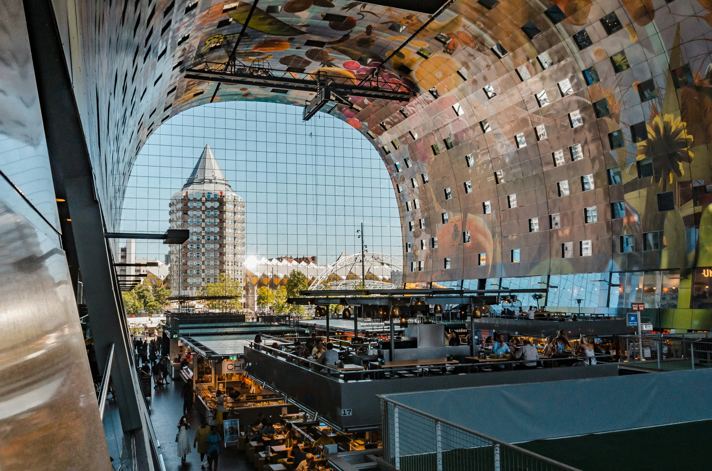
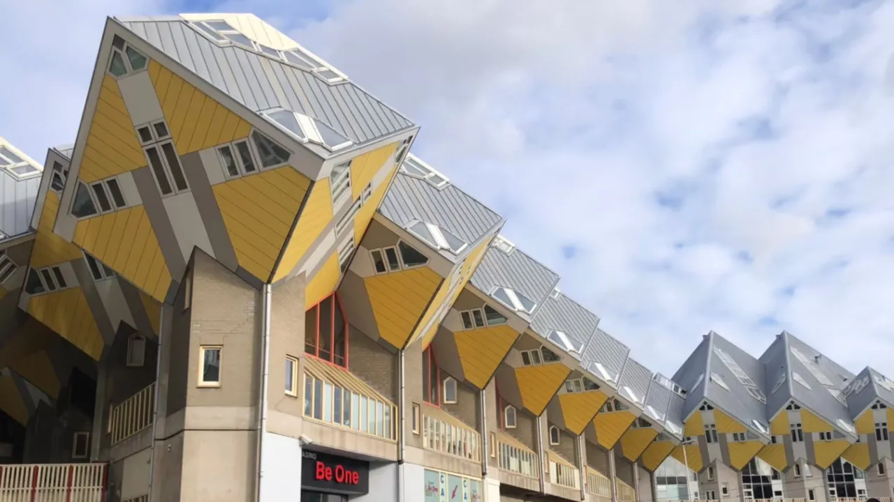
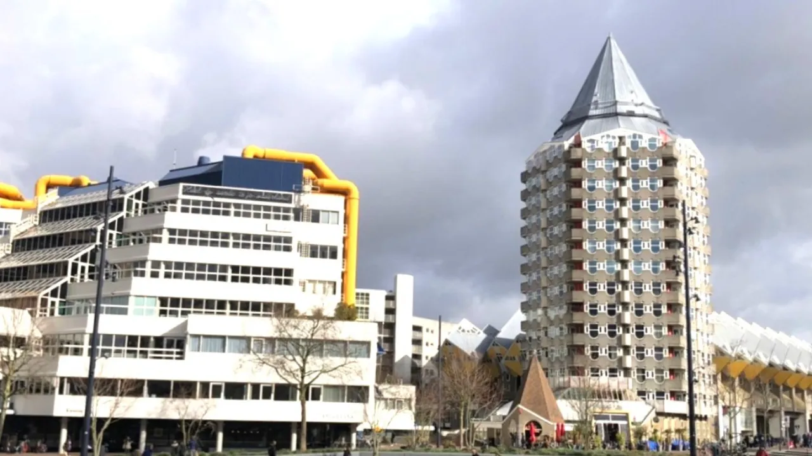
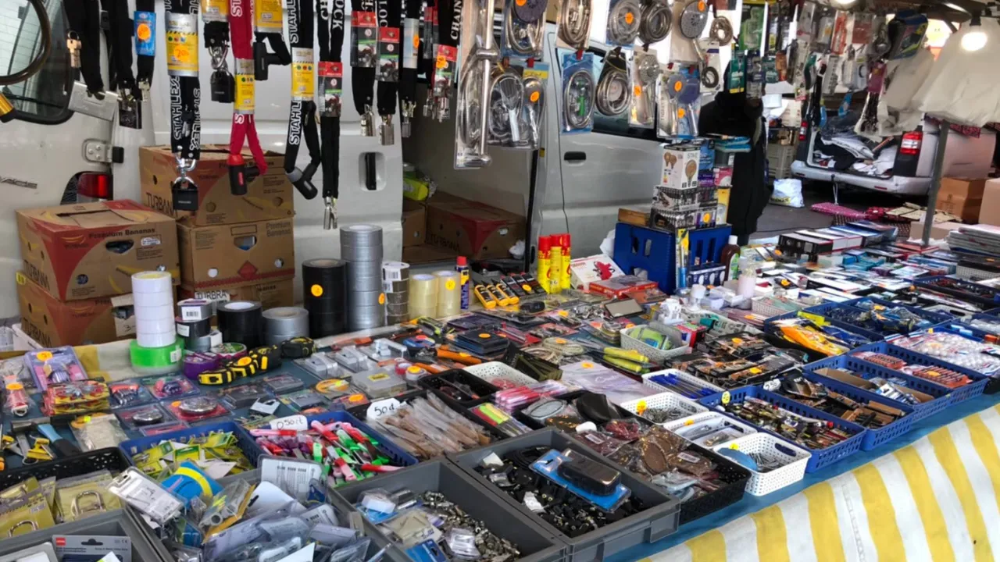
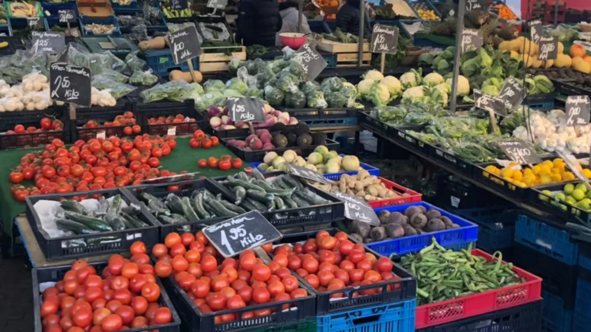
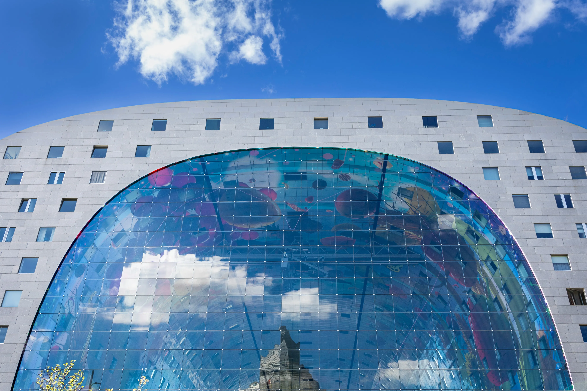
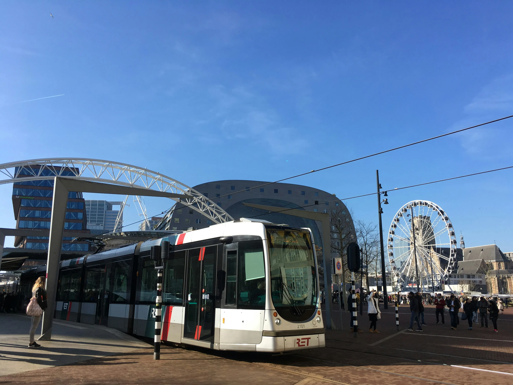

其中一個會讓人愛上[鹿特丹](https://exittaiwan.com/tags/%E9%B9%BF%E7%89%B9%E4%B8%B9/)的原因就是這裡的建築。

二戰重生後的鹿特丹，靠著當地建築師的巧手與前衛創新的思維，打造出了非常不荷蘭的鹿特丹，也為鹿特丹注入了一股未來新氣息。

> 越早訂越便宜：[**現在查詢鹿特丹房價**](https://www.booking.com/city/nl/rotterdam.xt.html?aid=7956794&no_rooms=1&group_adults=2)

## 鹿特丹市區景點 - 方塊屋（De Kijk-Kubus）基本資訊

* 地址：Overblaak 70, 3011 MH Rotterdam, The Netherlands（[Google Maps](https://maps.app.goo.gl/zJucKu8kjN7CLqLJ9)）
* 營業時間：每天 11 點到 17 點
* 門票：每人 €3
  - 持有 Rotterdam Pass 可免費入場
  - 持有 Rotterdam Welcome Card 可享 €1 折扣

由[荷蘭建築師 Piet Blom](https://forgemind.net/media/piet-blom-%E8%8D%B7%E8%98%AD%E9%B9%BF%E7%89%B9%E4%B8%B9cube-houses/) 操刀設計，方塊屋的設計前衛又突兀，每個方塊體皆傾斜 45 度，走在鹿特丹市區絕對不會忽視它的存在。

裏頭更包含了住家、些許店家、方塊屋博物館及[青年旅館 Stayokay Hostel Rotterdam](https://www.booking.com/hotel/nl/stayokay-rotterdam.xt.html?aid=7956794&no_rooms=1&group_adults=2)。有興趣進去參觀的人可以一窺在裡面牆壁傾斜的生活樣貌。

底下的運河旁有許多餐廳及酒吧可以坐下來欣賞荷蘭獨有的運河美景！

方塊屋，旁邊的兩棟建築也相當吸引人，只能說鹿特丹的很多建築都很有創意。

旁邊的公寓建築由同一位設計師設計，外型像鉛筆因此被稱為鉛筆屋；鉛筆屋旁邊的建築外觀用黃色管線點綴，因此被稱為水管屋，這個水管屋其實是鹿特丹市立圖書館（Centrale Bibliotheek Rotterdam）。

## 鹿特丹市區景點 - 拱廊市場（Markthal）

拱廊市場建於 2014 年，是一座大型的室內市場，裡面有許多異國料理，還有一間亞洲超市。

拱圓形的設計以及天花板上的蔬菜水果繪圖設計，因此拱廊市場又被稱為全球最美市場，走進去絕對顛覆你對菜市場的想像。不只吃的，拱廊市場內還有公寓、超市及付費停車場。

### 戶外廣場市集

拱廊市場一樣是鹿特丹的市區景點，就位在方塊屋的旁邊，因此只要搭電車或地鐵到 Blaak 站就對囉！

再加上拱廊市場前面的廣場每周二到六都有市集，讓 Blaak 更加熱鬧，市集有賣食物、水果、花卉、衣服，甚至是五金日用品都有！不妨可以來這邊挖寶撿便宜喔！

拱廊市場入口的大玻璃上，會應景地有不同的燈飾點綴這個城市的佳節氛圍，聖誕節就會是聖誕樹，西洋情人節就會是愛心等等...。

> 越早訂越便宜：[**現在查詢鹿特丹房價**](https://www.booking.com/city/nl/rotterdam.xt.html?aid=7956794&no_rooms=1&group_adults=2)

## 如何抵達方塊屋及拱廊市場

方塊屋及拱廊市場位在 Blaak，交通非常方便，用走的約 20 分鐘可以抵達。

只要抵達 Blaak 站 (Station Blaak)，出來後就可以看到方塊屋跟拱廊市場了。地鐵 A、B、C 線、路面電車 21、24 線、公車 32、47 路，以及火車都可以抵達 Blaak 站。

> 推薦閱讀：[**鹿特丹自由行｜機場市區來回交通全攻略**](https://exittaiwan.com/posts/%E9%B9%BF%E7%89%B9%E4%B8%B9%E6%A9%9F%E5%A0%B4%E5%88%B0%E5%B8%82%E5%8D%80%E4%BA%A4%E9%80%9A%E5%85%A8%E6%94%BB%E7%95%A5/)
