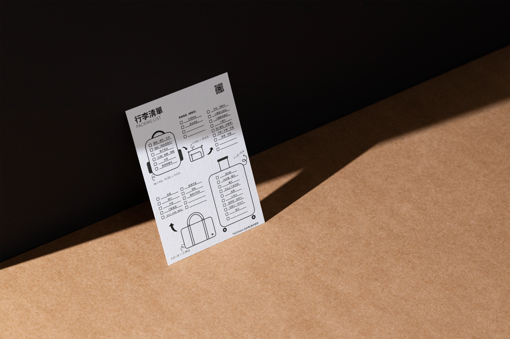
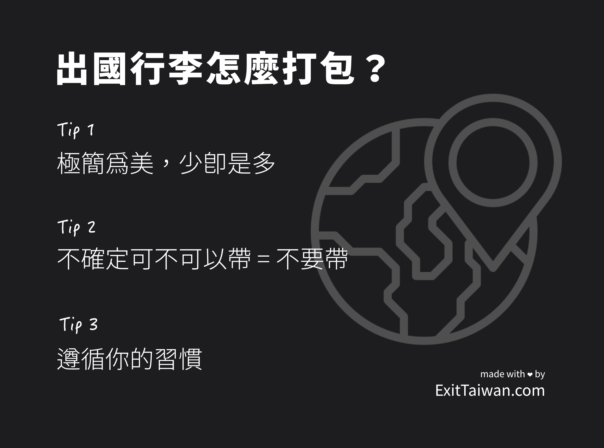
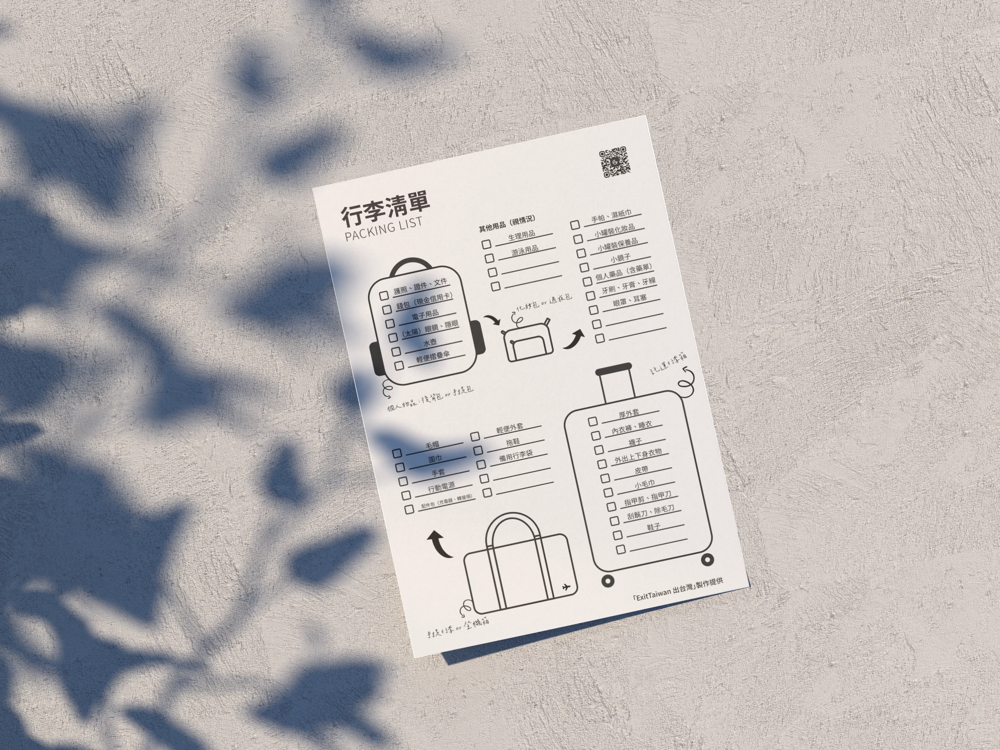

## 「出國打包行李好麻煩，要帶什麼好焦慮？」

距離出國自由行還有一個月，你已經開始慌張，不知道要怎麼打包行李了嗎？出國時行李要帶什麼？哪些東西可以帶、哪些不行？

這篇文章將告訴你出國行李應該帶什麼（以及不該帶什麼）、如何整理分類你的行李、並提供我們製作的行李清單免費供你下載使用。   

> 點擊下載[**免費自由行行李打包清單**](https://exittaiwan.gumroad.com/l/packing-list)

## 自由行出國行李要帶什麼？

許多人在打包行李時，會把所有想得到、**有可能**用到的東西全部都打包。如果你是即將要長期到國外生活、而且行李容量也充足的人，這樣做並沒有什麼問題。

但是如果你只是要前往鄰近國家，來一趟一個禮拜左右的小旅行、甚至是遠足歐美國家，準備在遙遠的國度待上一個月，在打包行李時只需要準備必要的物品，以減少旅行時的累贅感。

最怕的情況是，你以為把所有能想到所有能想到的東西都帶上了，最重要的幾樣物品卻從來沒有出現在腦海中，像是目的地國家的轉接頭、（太陽、隱形）眼鏡、國外能刷的信用卡等等，這種情況最常出現在旅行經驗還不算太多、或是每次想到旅行只感到焦慮的人們。

這樣的問題出現的原因除了缺乏經驗之外，更多是因為**沒有打包行李的原則，所以不知道怎麼篩選**該帶出國的物品。

因此，在把所有應該帶的物品一一列下來並分門別類之前，我們根據自身的經驗，提供你三個行李打包的原則：   

* 極簡為美，少即是多   
* 不倔定可不可以帶 = 不要帶   
* 遵循你的習慣

### 極簡為美，少即是多

想要為所有狀況都準備好的心情是完全可以理解的，但別忘了，旅行中的不確定性是擁有存在的。喔！還有一件事，你帶的所有東西都會跟著你一起移動，所以我們還是建議你別把所有家當都一同帶上你的旅途。

最典型的台灣人攜帶過多物品的例子大概就是熱水壺和吹風機了。除非你真的無法離開你專用的熱水壺和吹風機，**而且**你還百分百確定旅行國家的電壓和你的電器相容，否則真的沒有帶他們的必要。

可以想想如果旅行的國家當地都沒有提供熱水壺，那是不是代表當地沒有煮泡麵的習慣？那麽何不觀察看看他們宵夜吃什麼（或是他們不吃宵夜），試著體驗當地人的生活呢？

如果帶了那支好幾千、上萬元的吹風機，結果一啟動就燒壞了怎麼辦？甚至還有可能造成飯店跳電？

其實不只這兩項電器用品，在電器用品這個類別都建議能減量就減量。

除了手機和充電器之外，想想有什麼是真的必要帶出國的電器用品？帶著電器用品意味著你需要考量電壓、插座和轉接頭、行李重量、物品遭竊、物品損壞、資料遺失、被收關稅等等各種風險。再說，都花這麼多錢和時間出國旅遊了，還是盡量用那最高畫素的雙眼捕抓當下的美好吧！   

### 不確定可不可以帶 = 不要帶

對於香菸、酒類、成分複雜的食物等等，每個國家常有不同的限制和相關規定，如果沒有特別事先查詢出發國和目的地國家的相關規定，建議不要攜帶以免陷入不必要的麻煩。
攜帶個人藥品、常備藥物等，也務必確認成分是否可攜帶，並記得帶著完整包裝或是藥單以便查驗時出示。   

### 遵循你的習慣

出國時使用你平常就在用的隨身包、後背包、手提包、行李包，並且除了重要物品 — 也就是護照、手機、錢包之外 — 可以在出國時有特別擺放的位置，平常東西放哪裡就放哪裡，這將會大大降低你丟東西或找不到東西的機率。

如果平常收拾東西的習慣就比較奔放、而且東西弄丟了也不太介意，那出國時八成也要丟個幾樣東西，請你不需要太難過。

以上的三個行李打包原則有幾個優點，包括你的行李會更輕便，所以體力可以留給在旅遊時更重要的事情上、你有可能遺失物品的機會更少，所以心裡壓力也比較小、還有幫助你省錢（更輕的行李、避免不必要的旅遊行前購物）。   

## 出國行李類別

依照物品的類別，我們整理出了以下的行李細項供你參考，你可以根據自身的考量（旅行目的地、旅行天數、行李容量、生理性別、個別需求等）決定是否要增加或是減少攜帶的物品。   

| 類別       | 細項                                      | 備註          |
| -------- | --------------------------------------- | ----------- |
| **行李容器** | 托運行李箱                                   |             |
|          | 登機行李袋 / 行李箱                             |             |
|          | 隨身包 / 手提包 / 後背包                         |             |
|          | 化妝包                                     |             |
|          | 電器包                                     |             |
| **文件類**  | 護照 / 簽證 / 居留證                           |             |
|          | 駕照 / 國際駕照                               |             |
|          | 登機證                                     | 列印紙本或電子版本   |
|          | 住宿、交通、當地活動預約證明                          | 列印紙本或電子版本   |
|          | [**旅遊手冊**](https://exittaiwan.com/posts/%E5%A6%82%E4%BD%95%E8%A3%BD%E4%BD%9C%E6%97%85%E9%81%8A%E6%89%8B%E5%86%8A/)                                    |             |
| **個人物品** | 錢包 / 現金（台幣＆當地貨幣） / 信用卡                  |             |
|          | 空水瓶                                     |             |
|          | 個人藥物（常備 / 配方）                           |             |
|          | 隨身清潔消毒用品                                | 濕紙巾、手帕、衛生紙等 |
|          | 指甲剪                                     |             |
|          | 刮鬍刀 / 除毛刀                               |             |
|          | 眼鏡 / 隱形眼鏡 / 太陽眼鏡                        |             |
|          | 頸枕、眼罩、耳塞                                | 長途航班適用      |
|          | 牙膏、牙刷                                   |             |
|          | 筆                                       |             |
|          | 鑰匙                                      |             |
|          | 輕便摺疊傘 / 雨衣                              |             |
|          | 美妝保養品（洗面乳、旅行用盥洗用品、乳液、防曬乳、護手霜、保濕噴霧、護唇膏等） |             |
|          | 生理用品                                    | 如適用         |
|          | 游泳用品                                    | 如適用         |
|          | 鎖和鑰匙                                    | 如適用         |
| **盥洗衣物** | 薄外套 / 厚外套                               |             |
|          | 外出上下身衣物                                 |             |
|          | 內衣褲 / 睡衣                                |             |
|          | 圍巾                                      |             |
|          | 手套                                      |             |
|          | 襪子                                      |             |
|          | 毛巾                                      |             |
|          | 皮帶                                      |             |
|          | 鞋子                                      | 拖鞋、雪靴、備用鞋等  |
| **電器用品** | 手機（相機、耳機）                               |             |
|          | 當地通用電話卡、SIM 卡針                          |             |
|          | 行動電源                                    |             |
|          | 充電器 / 轉接頭                               |             |
|          | 平板電腦 / 筆記型電腦 / 電子書閱讀器                   | 如適用         |

## 免費下載：自由行出國行李打包清單

雖然以上表格已經列出打包物品的細項了，不過哪些東西應該要放在行李箱、哪些東西放在隨身包、登機箱？我們製作的出國行李打包清單用簡單明瞭的圖示告訴你了！馬上下載來邊打包邊使用吧！

> 點擊下載[**免費自由行行李打包清單**](https://exittaiwan.gumroad.com/l/packing-list)

