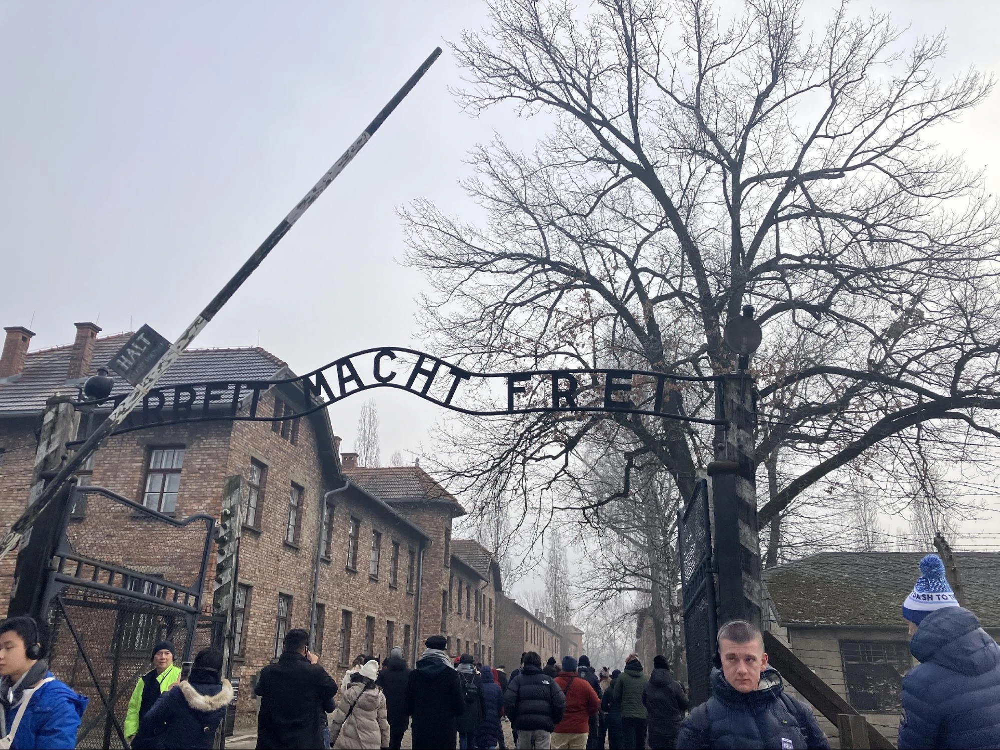

## 前言：波蘭與它的歷史印記

提到[波蘭旅遊](https://www.poland.travel/en/)，許多人可能會想到蕭邦的故鄉、極寒的內陸氣候，或是這個國家歷經數次瓜分的悲慘命運。然而，波蘭的歷史不僅僅是關於國家存亡，更深深烙印著二戰的痕跡。這次，筆者趁著聖誕假期，與友人前往奧斯威辛-比克瑙集中營（Auschwitz-Birkenau），一探這座惡名昭彰的納粹集中營，親自感受歷史的重量。

## 奧斯威辛集中營的歷史背景

奧斯威辛集中營是納粹德國於二戰期間建立的最大型集中營，它不僅是囚禁政治犯與少數族群的場所，更是納粹執行「最終解決方案（The Final Solution）」的核心地點。

### 關鍵歷史時間點：

* 1940 年：奧斯威辛集中營在納粹德國佔領的波蘭領土上建立，最初用於關押政治犯與猶太人。
* 1942 年：集中營開始大規模實行種族滅絕計畫，設置毒氣室與焚化爐。
* 1944 年：納粹在此大規模屠殺猶太人，成為歐洲[猶太人大屠殺](https://www.ushmm.org/)（Holocaust）最殘忍的象徵之一。
* 1945 年 1 月：蘇聯紅軍解放集中營，納粹在撤退前試圖銷毀證據，炸毀焚燒場。

根據官方紀錄，超過 110 萬人 在奧斯威辛喪生，其中大多數是猶太人。此外，納粹還在此進行人體實驗、強迫勞動，以及對身心障礙者的T-4 行動（Aktion T4），企圖實行「種族淨化」。

## 參觀奧斯威辛-比克瑙集中營的完整攻略

### 1. 預訂門票與入場方式

奧斯威辛集中營屬於熱門景點，建議提前至少兩個月透過[官方網站預訂門票](https://www.auschwitz.org/)。線上付款後，票券將寄至電子郵件，入場時需攜帶護照與電子票。

### 2. 交通方式

筆者當天從卡托維治（Katowice）火車站出發，搭乘火車前往奧斯威辛站（Oświęcim）。抵達後可選擇：

* 步行：約 15-20 分鐘
* 公車：火車站前有接駁車可前往集中營入口

### 3. 參觀流程與導覽資訊

進入集中營後，每位參觀者會獲得一副耳機，跟隨導覽員進行參觀。

**奧斯威辛 I 號集中營（Auschwitz I）**

* 參觀當時囚犯居住的牢房與焚燒場
* 觀看遇害者的遺物（鞋子、行李、頭髮）
* 禁止攝影區：紀錄當時大屠殺受害者的照片與遺物

**比克瑙 II 號集中營（Birkenau）**

* 著名的集中營大門：「勞動帶來自由（Arbeit macht frei）」
* 毒氣室與焚化爐遺址（納粹撤退時炸毀）
* 牢房遺跡：可見當年建築物的磚頭標記

## **集中營的關鍵歷史場景與反思**

### **1. 選擇生死的「分離區」**

集中營內，有一個德軍用來「**篩選**」受害者的區域。

* **16 歲以下孩童**、**老人** 及**病患** 直接送往毒氣室
* 其他囚犯則根據**職業**與**健康狀況**分配勞動

### **2. 毒氣室與焚化爐**

* 受害者被要求**脫光衣物**，進入毒氣室後，以**齊克隆 B（Zyklon B）** 氣體毒殺
* 遺體被運往**焚化爐**，納粹試圖消滅證據

### **3. 集中營牆上的照片與紀錄**

在牢房建築內，展示了數百張受害者照片，標示著**入營日期**與**死亡日期**。可以明顯看出，有專業技能者的生存時間稍長，但最終仍難逃厄運。

## **結語：歷史不應被遺忘**

二戰期間，波蘭是最早被納粹德國侵略的國家，並在戰爭期間遭受極大的損失。奧斯威辛-比克瑙集中營不僅象徵了猶太人大屠殺的慘痛歷史，也提醒世人，**戰爭的殘酷與極端意識形態的危害**。

雖然參訪這類景點可能讓人心情沉重，但**歷史需要被記錄與反思**。正因如此，我們更應該親身走訪，了解這些不該被遺忘的故事，避免歷史重演。
