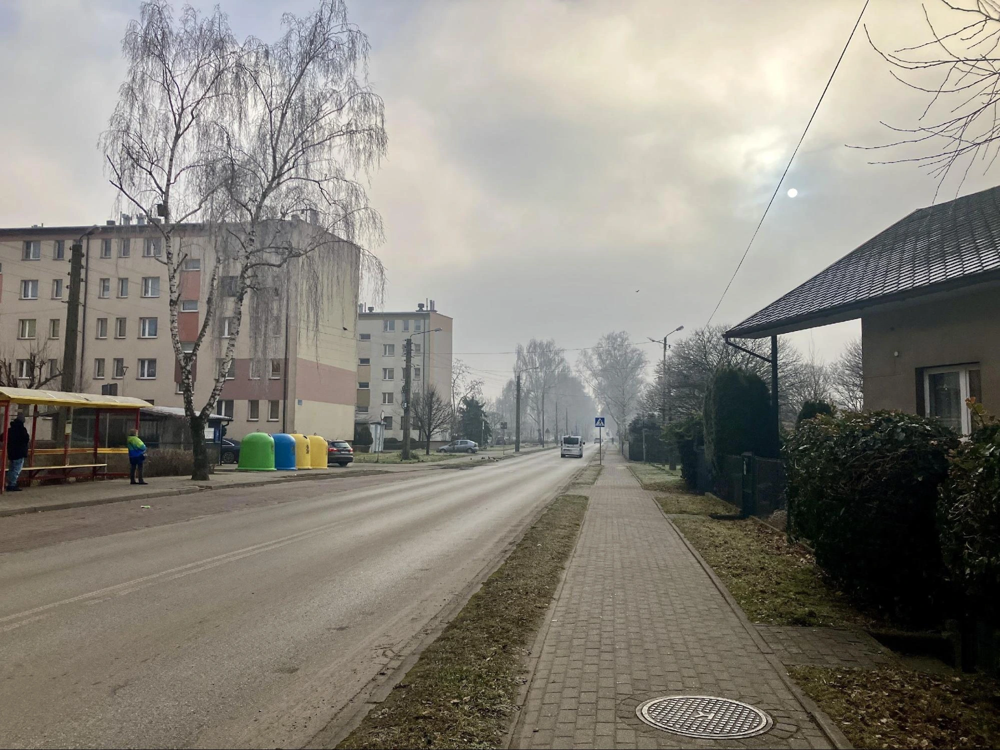
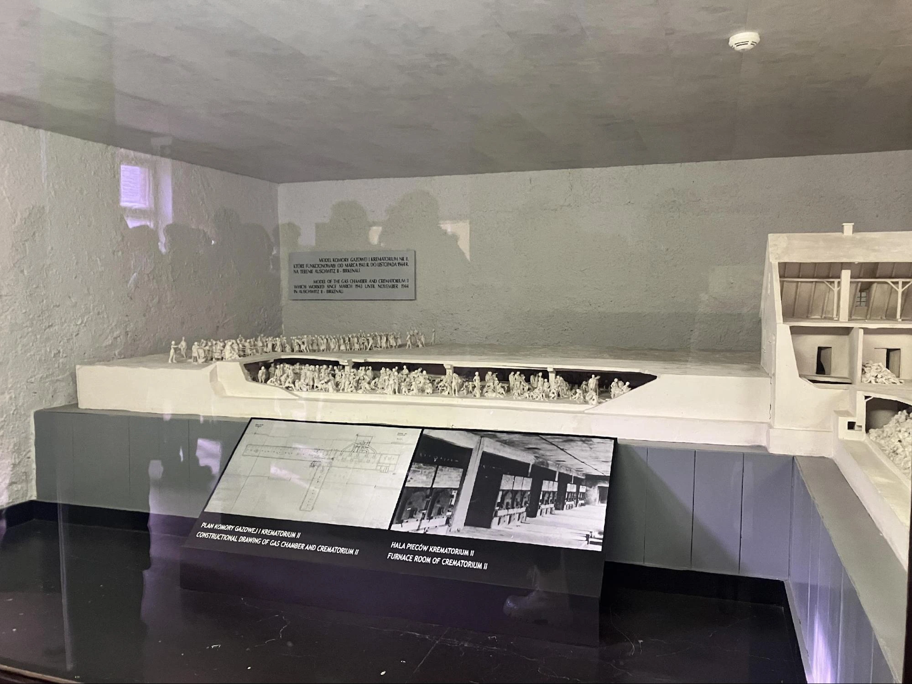
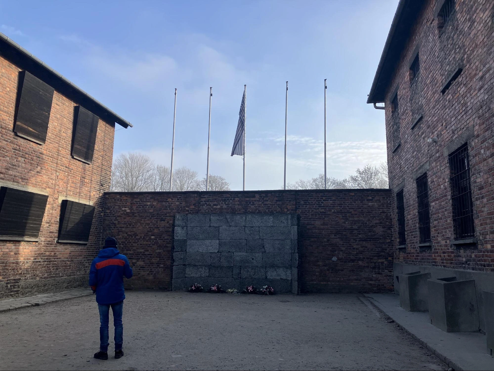
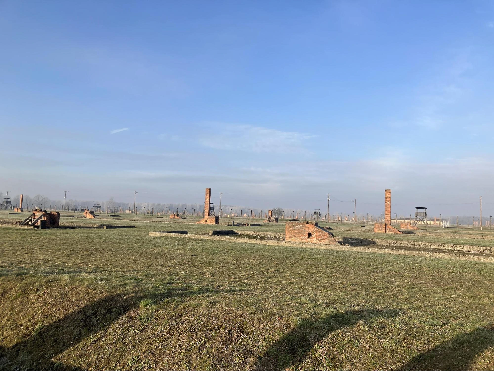
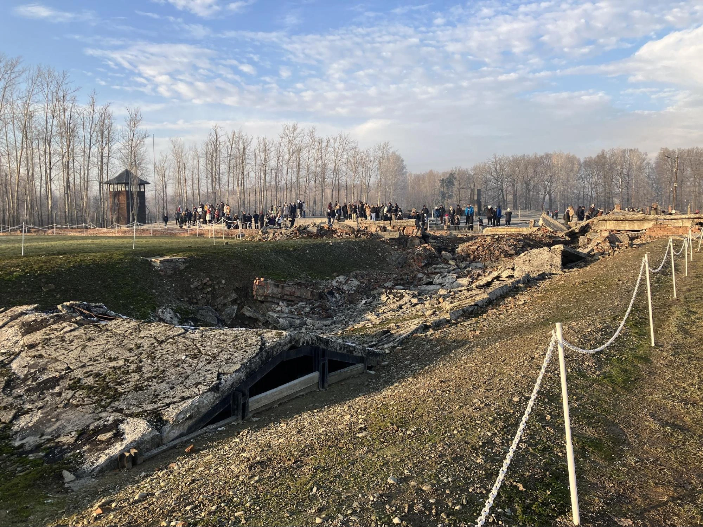

## 前言：波蘭與它的歷史印記

提到[波蘭旅遊](https://www.poland.travel/en/)，許多人可能會想到蕭邦的故鄉、極寒的內陸氣候，或是這個國家歷經數次瓜分的悲慘命運。然而，波蘭的歷史不僅僅是關於國家存亡，更深深烙印著二戰的痕跡。

這次，筆者和友人終於來到位於克拉克夫（波蘭文：Kraków）、惡名昭彰的奧斯威辛集中營（波蘭文：Miejsce Pamięci i Muzeum Auschwitz-Birkenau），了解那一段我們都曾經在歷史課耳聞，卻很少有機會親自踏訪的往事。

## 奧斯威辛集中營的歷史背景

奧斯威辛集中營是納粹德國（Nazi Germany）於二戰期間建立的最大型集中營，它不僅是囚禁政治犯與少數族群的場所，更是納粹執行「最終解決方案（The Final Solution）」的核心地點。

### 關鍵歷史時間點：

從1933年起，希特勒的親衛隊便開始在德國建立集中營，奧斯威辛集中營在1940年，於當時被德軍併吞的領土——今日的奧斯威辛（波蘭文：Oświęcim）郊區建立。初期目的是用來囚禁政治犯、猶太人和其他T-4（註）行動中，納粹德國認為不應該存在的「不健全」社會元素，例如殘疾人士。

1944年起，奧斯威辛的附加功能還有大規模消滅猶太人。根據官網記載，德軍處置這些人的方式，包括毒氣室、強迫勞動，甚至是人體實驗。

1945年一月，由於蘇聯軍隊進逼，德軍試圖銷毀證據，包括自己炸了焚燒場，並將部分人們轉移至其他囚禁處，因此現行比克瑙集中營，還可以看到當初炸毀的痕跡。

> 註：T-4行動（德語：Aktion T4）是1945年第二次世界大戰後 ，針對納粹德國曾執行的、系統地殺害患有身體殘疾或心理、精神疾病患者的「安樂死」計劃所使用的稱呼。在此計劃中，有數以萬計乃至數以十萬計的「通過決定性的醫學檢查被判為病入膏肓無可救藥的病人」被醫生殺死。

* 1940 年：奧斯威辛集中營在納粹德國佔領的波蘭領土上建立，最初用於關押政治犯與猶太人。
* 1942 年：集中營開始大規模實行種族滅絕計畫，設置毒氣室與焚化爐。
* 1944 年：納粹在此大規模屠殺猶太人，成為歐洲[猶太人大屠殺](https://www.ushmm.org/)（Holocaust）最殘忍的象徵之一。
* 1945 年 1 月：蘇聯紅軍解放集中營，納粹在撤退前試圖銷毀證據，炸毀焚燒場。

根據官方紀錄，超過 110 萬人 在奧斯威辛喪生，其中大多數是猶太人。此外，納粹還在此進行人體實驗、強迫勞動，以及對身心障礙者的T-4 行動（Aktion T4），企圖實行「種族淨化」。

## 參觀奧斯威辛-比克瑙集中營的完整攻略

### 1. 預訂門票與入場方式

奧斯威辛集中營屬於熱門景點，建議提前至少兩個月透過[官方網站預訂門票](https://www.auschwitz.org/)。線上付款後，票券將寄至電子郵件，入場時需攜帶護照與電子票。

線上付款完後，會寄票到信箱，當天抵達集中營時，直接走進去過安檢，並到櫃檯領取自己語種的貼紙就可以了。

### 2. 交通方式

筆者當天從[卡托維治（Katowice）](https://exittaiwan.com/tags/%E5%8D%A1%E6%89%98%E7%B6%AD%E6%B2%BB/)火車站出發，搭乘火車前往奧斯威辛站（Oświęcim）。

抵達後可選擇：
* 步行：約 15-20 分鐘
* 公車：火車站前有接駁車可前往集中營入口

### 3. 參觀流程與導覽資訊

進入集中營後，每位參觀者會獲得一副耳機，跟隨導覽員進行參觀。

**奧斯威辛集中營**

參觀當時囚犯居住的牢房、焚燒場等。其中有幾間不能拍照，是大屠殺過的人的鞋子、行李和頭髮。接著中間會休息十分鐘左右，需要到入口處等黃色接駁車，到另一個比克瑙集中營。

**比克瑙集中營**

比克瑙集中營是一個更荒涼的場所，人們在曾經有牢房的地方數起磚頭標記，放眼望去，很整齊、系統性的牢房讓人害怕。後面就是一大片森林，當時候就算設法逃出德軍眼線，在這麼寒冷的地方，也根本不知道逃去哪裡。

牢房外德軍行刑式槍殺人們的地方。左邊建物的窗物是緊閉的，讓裡面的人只能聽到槍聲，卻看不見發生什麼事，藉此製造未知的恐懼，

在比克瑙集中營，從豎立起來的磚頭，可以看到當初建物密集之程度。

當時被運送到集中營的人們，會經歷一個「挑選」的過程。德軍將人們分成男人一隊、女人及不分性別的小孩一隊。通常十六歲以下和年長者會直接被殺死，剩下的由德軍決定是否有利用價值。

在另一個房間裡，牆上掛滿死者的照片，從記錄上可以發現，如果本身職業是醫生或技師等，入營到被處死的時間會拉比較長，意味著對德軍比較有利用價值。

焚化廠和毒氣室。在進入毒氣室前，人們會被要求脫光身上衣物，身上任何有價值的東西，都會被留下來。

德軍為消滅證據，緊急炸毀的焚化廠。

## **歷史不應被遺忘**

二戰在歐洲是從1939年德國入侵波蘭開始算起，同年蘇聯因為與德軍簽署的「德蘇互不侵犯條約」（英文：Nazi–Soviet Pact），也從東邊入侵。在兩場行動中，大量波蘭人遭殺害或遣至賽爾維（英文：Serbia）亞，直到1941年，德軍破壞條約攻打蘇聯，史達林才轉為同盟國之一。

當時被抓去集中營的猶太人，來自所有納粹德國掌控的地區，包括北歐、巴爾幹半島等等，但其實不只是猶太人，很大一部分受害者是波蘭人及其他民族，而同性戀、耶和華見證人、政治犯等，也在納粹的名單上。

集中營不是每個旅客心目中必去的景點，畢竟有些人可能有敏感體質考量，但筆者覺得親自到大屠殺發生的地方，是很有教育意義的行程之一，這也是歷史被記錄的必要，提醒後人不要再犯一樣的錯。