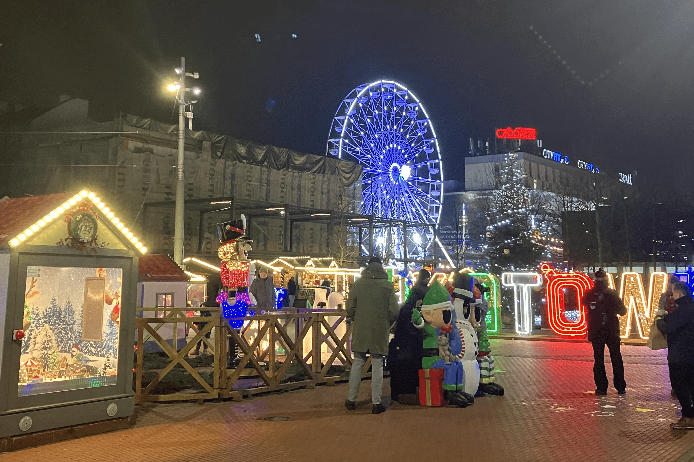
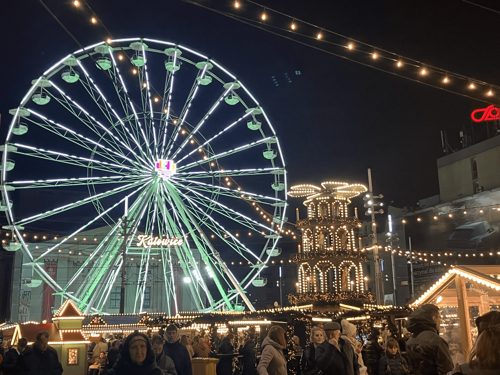
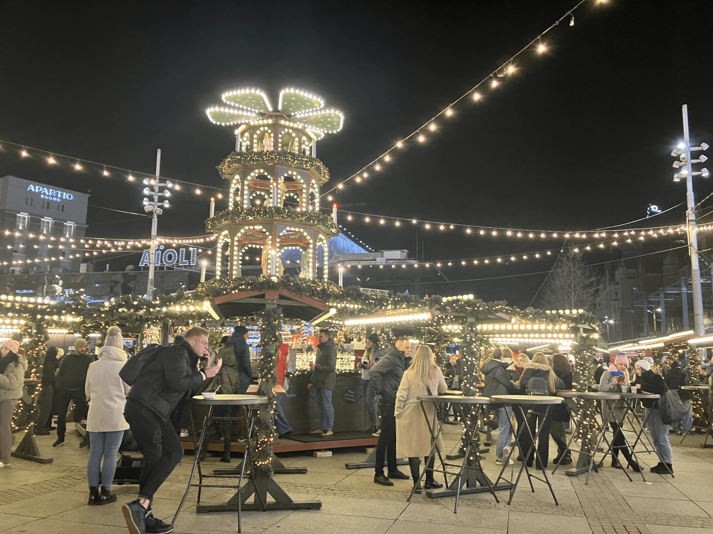
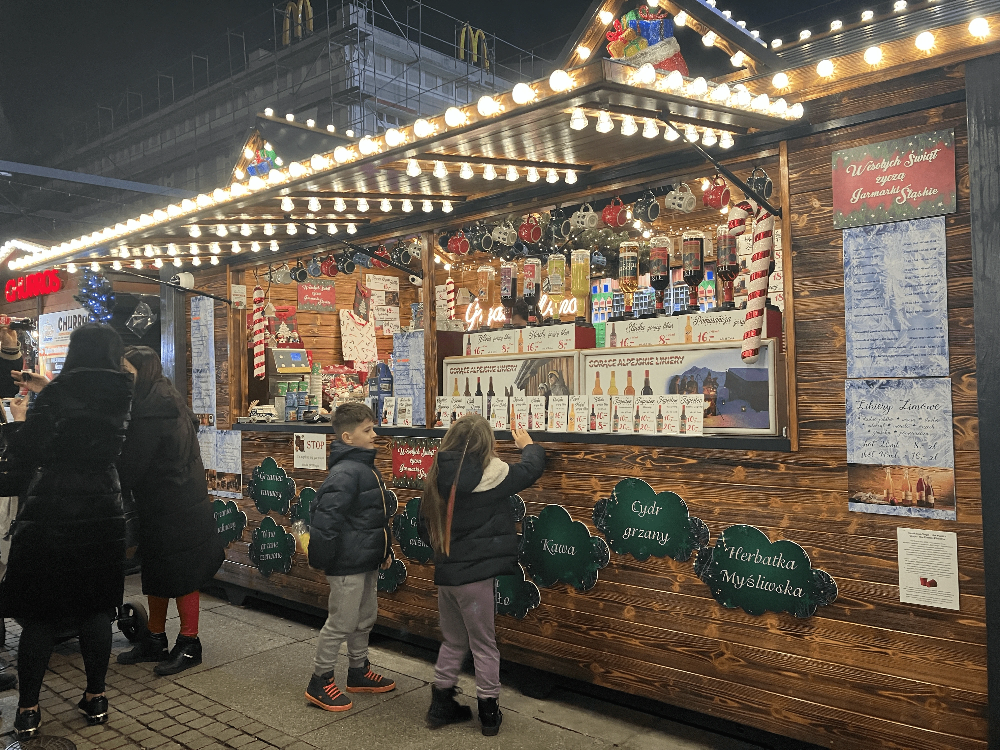
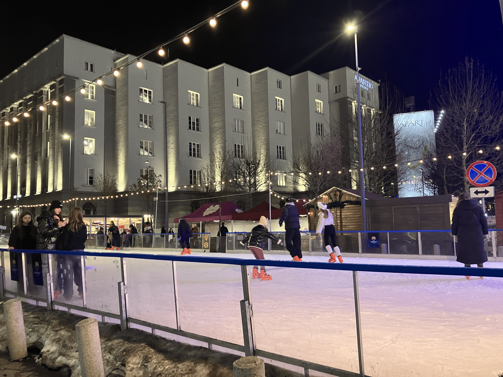

[卡托維治](https://exittaiwan.com/tags/%E5%8D%A1%E6%89%98%E7%B6%AD%E6%B2%BB/)曾是波蘭的煤礦之都，這座城市的背景充滿了濃厚的工業氣息。

近年來，隨著現代化的發展，卡托維治變得更加摩登，但卻少了像弗羅茲瓦夫或克拉科夫那樣的老城廣場。然而，每到十一月中旬，在輕軌站（Rynek）前的一塊小空地上，就會搭建起熱鬧的聖誕市集和各式裝置藝術。

只要搭乘公車至 **Katowice Piotra Skargi** 或輕軌至 **Katowice Rynek/Rondo**，就能一睹這座溫馨迷人的聖誕市集。

> 推薦閱讀：[卡托維治自由行市區交通攻略｜各交通方式、票價、購票方式全解析](https://exittaiwan.com/posts/%E5%8D%A1%E6%89%98%E7%B6%AD%E6%B2%BB%E5%B8%82%E5%8D%80%E4%BA%A4%E9%80%9A%E6%94%BB%E7%95%A5/)

## 卡托維治聖誕市集的歷史與特色

卡托維治的聖誕市集雖然不像波蘭其他城市規模那麼大，但它承載著濃厚的地方情感與聖誕文化。

市集的起源可以追溯到2010年代初，隨著城市的現代化進程，這裡逐漸成為居民和遊客們的聖誕節必訪地點。想了解更多卡托維治的旅遊資訊，可以參考 [Katowice 官方旅遊網站](https://welcome.katowice.eu)。

## 卡托維治聖誕市集亮點

### 1. 摩天輪：體驗波蘭式浪漫

與亞洲常見的封閉式摩天輪不同，波蘭的摩天輪多為半露天設計，並沒有玻璃罩住。因此，當氣溫接近零度時，搭摩天輪或許需要一點勇氣！這座摩天輪是為聖誕節特別搭建的臨時設施，比遊樂園的規模小，每次搭乘票價約為台幣160元。

儘管如此，許多人更喜歡在摩天輪旁買一杯熱紅酒，與朋友們一起欣賞裝置藝術和夜晚的燈火美景。

### 2. 中心酒吧：熱紅酒的溫暖聚點

聖誕節怎麼能少了熱紅酒？這款由紅酒、肉桂、香料與糖調製而成的飲品，是歐洲聖誕市集的標誌性存在。

在卡托維治的市集中央，有一間露天酒吧，吸引了眾多當地人與遊客聚集於此。一杯 400ml 的熱紅酒約台幣 150 元，酒吧中央設有高腳桌與防風透明小屋，儘管沒有座位，但站著與朋友聊天的氛圍卻別有一番趣味。

若您想省點預算，也可以在附近的酒精專賣店買一瓶紅酒，回到住處自己煮製熱紅酒。

### 3. 飲料與美食攤位

除了酒精飲品，市集中還有繽紛的非酒精飲料攤位，供不喝酒的遊客選擇。此外，手工餅乾、甜點、熱狗與當地特產攤位也遍布市集，讓人眼花繚亂、口水直流。

### 4. 溜冰場：冬日運動的樂趣

在市集旁，設有一座小型的露天溜冰場，不收門票，但租用溜冰鞋的費用約台幣 120 元。

雖然場地不大，但開放的空間與周圍的聖誕氣氛讓這裡成為大人小孩的歡樂天堂。休息時，可以坐在旁邊的長椅上，一邊喝飲料、一邊欣賞市集的熱鬧場景。

## 卡托維治聖誕市集的實用資訊

### 交通建議

* 公車：搭乘公車至 Katowice Piotra Skargi，步行即可到達。
* 輕軌：乘坐輕軌至 Katowice Rynek/Rondo，市集入口就在站點附近。想了解更多波蘭的交通資訊，請參考 [PKP Intercity 官方網站](https://www.intercity.pl)。

### 最佳參觀時間

* 晚上點亮燈飾後，市集的氛圍更迷人，建議於傍晚至晚上間參觀。

### 穿著建議

* 波蘭冬季氣溫低，建議穿著保暖的外套、圍巾與手套，搭配舒適的鞋子方便逛市集。

## 結語

卡托維治聖誕市集雖然規模不大，但卻充滿了節日的溫馨與樂趣。從摩天輪的夜景，到熱紅酒的溫暖氣息，再到溜冰場上的歡聲笑語，這裡提供了一場不可錯過的冬日體驗。不論您是來這裡享受美食，還是體驗當地的聖誕文化，這裡都將成為您波蘭之行的美好回憶。

如果你還想探索其他歐洲著名的聖誕市集，別忘了看看在奧地利維也納的[市政廳聖誕市集](https://exittaiwan.com/posts/%E7%B6%AD%E4%B9%9F%E7%B4%8D%E5%B8%82%E6%94%BF%E5%BB%B3%E5%BB%A3%E5%A0%B4%E8%81%96%E8%AA%95%E5%B8%82%E9%9B%86/)和[聖史蒂芬廣場聖誕市集](https://exittaiwan.com/posts/%E7%B6%AD%E4%B9%9F%E7%B4%8D%E5%8F%B2%E8%92%82%E8%8A%AC%E5%BB%A3%E5%A0%B4%E8%81%96%E8%AA%95%E5%B8%82%E9%9B%86/)！
