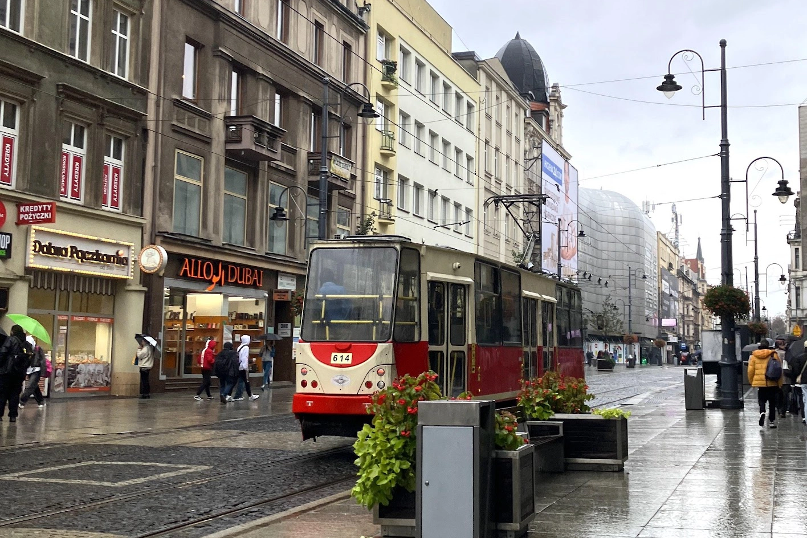
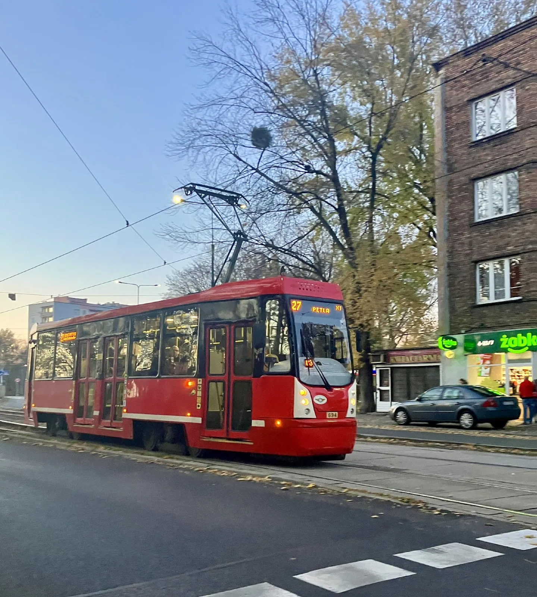
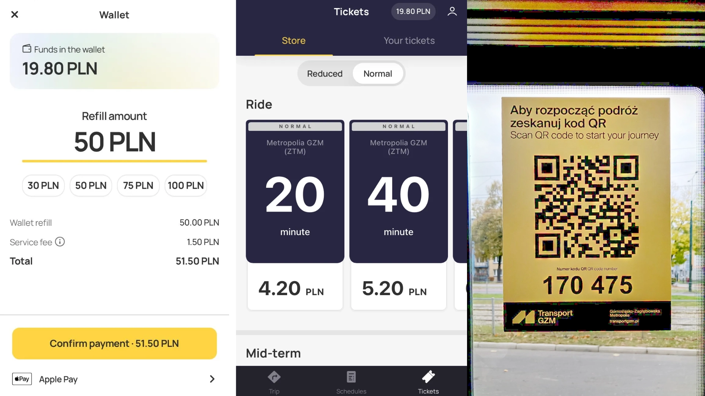
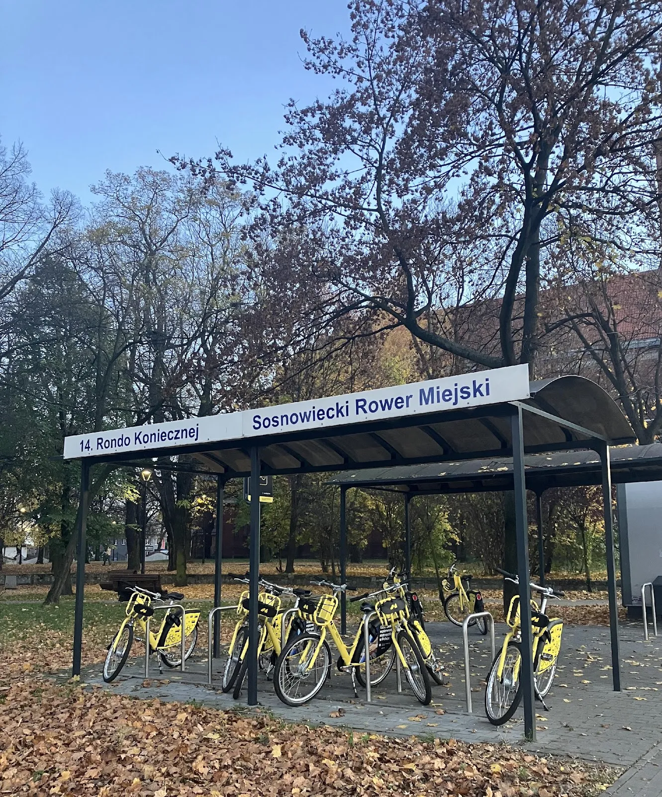
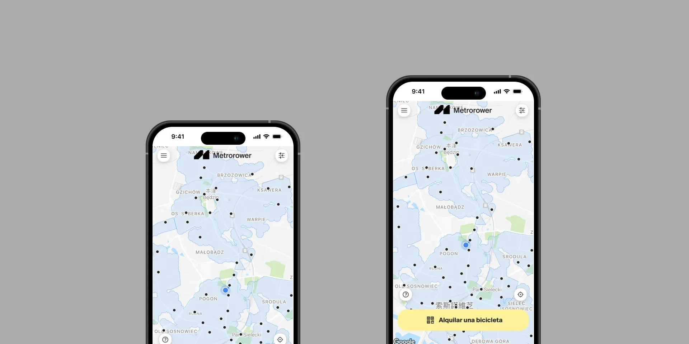
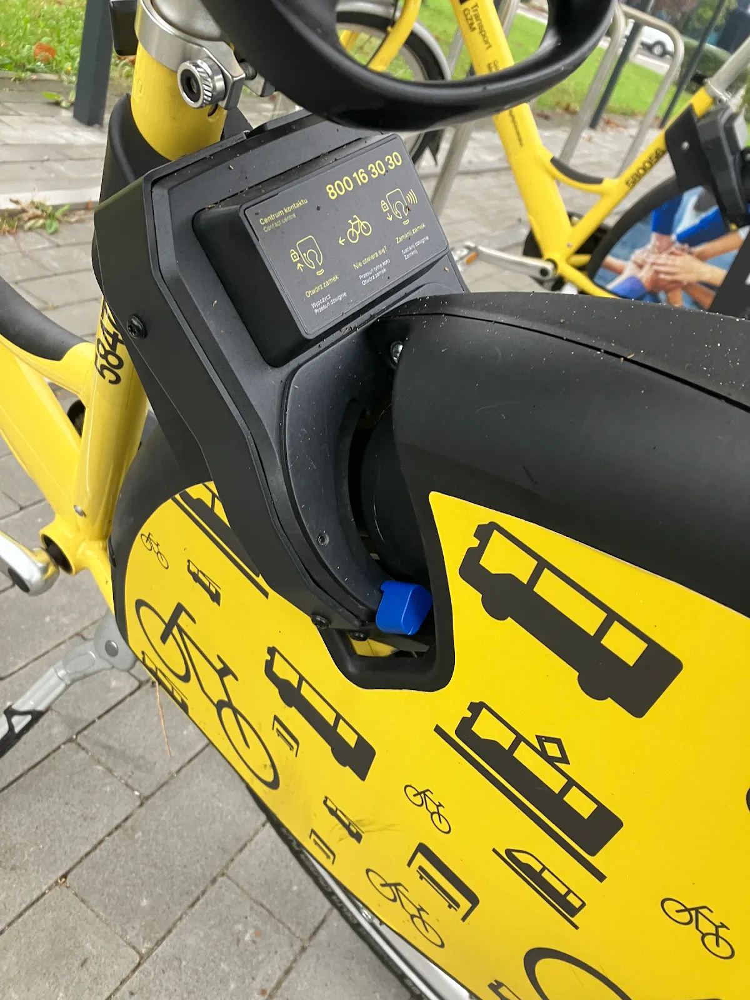

卡托維治（波蘭文：Katowice）是位在[波蘭](https://exittaiwan.com/tags/%E6%B3%A2%E8%98%AD/)南部西里西亞省（波蘭文：Województwo śląskie）的大城市，也是西里西亞省的行政首府和政府所在地。早期以煤礦產業最為著名，並有現存礦坑供旅客參觀，近年來因環保意識提高，科技公司逐漸進駐，在市中心隨處可見老式與新式辦公大樓座落，同時保有美麗的公園及中央廣場供民眾休憩。

在文化藝術方面，卡托維治設有多座博物館，對西里西亞歷史有興趣的旅客，可以到西里西亞博物館參觀。另外也有西里西亞劇院和多座電影院，提供多樣的娛樂選擇。

卡托維治市中心的交通除了步行以外，有公車、輕軌以及腳踏車、計程車等選項。計程車除了大家熟知的 Uber，也有當地的叫車 App：Bolt。建議使用叫車系統，才不會因為語言不通，或司機有意繞路造成資費糾紛。

卡托維治市中心其實不大，西里西亞博物館、大學校區、亞洲超市、多間購物中心等都在步行即可到達的距離，做輕軌或公車到其他鄰近區域，也只要半小時左右。

## 卡托維治市區交通工具介紹

### 公車 / 輕軌

學生和上班族由於需要每天通勤，買月票會比較划算。但若是旅客的話，也有一日票、三日票、七日票等票種可以選擇，能搭乘公車和輕軌。

以下介紹幣別皆為茲羅提，兌台幣為 1：8.2。

#### 單次票

* 20 分鐘：全票 4.2 波蘭茲羅提 / 優惠 2.1 波蘭茲羅提
* 40 分鐘：全票 5.2 波蘭茲羅提 / 優惠 2.6 波蘭茲羅提
* 90 分鐘：全票 6.6 波蘭茲羅提 / 優惠 3.3 波蘭茲羅提

在以上時間內，可以無限次搭乘公車或輕軌。

#### 當日票

* One-day（不管當天何時買，都只能用到當天的 23:59）：全票 13 波蘭茲羅提 / 優惠 6.5 波蘭茲羅提
* 24h（買完24小時內都可使用，還能搭乘西里西亞區火車）：全票 24 波蘭茲羅提 / 優惠 12 波蘭茲羅提

中、長期票的話，因為種類繁多，從七天到九十天的都有，也有以搭乘次數計算的，可以依個人需求組合，歡迎[至官網查看](https://www.metropoliaztm.pl/en/s/cennik)。

### 購票教學

#### 紙本

紙本可以在某些公車站的售票亭、路邊書報攤（Kiosk）、郵局取得或直接向司機購買，會比 App 內購買貴個台幣五塊左右。紙本的需要給車上的機器打個票。

#### 電子 QR-code

1. 下載公車 / 輕軌 App Jakdojade：[Google Play](https://play.google.com/store/apps/details?id=com.citynav.jakdojade.pl.android&hl=en-US&pli=1)｜[App Store](https://apps.apple.com/pl/app/jakdojade-premium/id506760190)。
2. App 內儲值任意金額。
3. 上車後，車窗上都貼有 QR code 或六位數字，點選 Buy Ticket 掃碼或手動輸入數字完成買票。

### 推薦指數：9 / 10

總的來說，買中、長期票比較划算，否則要是遇到塞車或要多趟轉車，車資也是堪比台北捷運。

但是輕軌的搭乘體驗很愜意，因為卡托維治市中心的人依舊不像台灣稠密，就算是上下班尖峰時刻，也只需要站一下下，很快就會有位子坐了，還能一路欣賞漂亮的城市景觀。

如果是秋天來訪，沿路看著金黃的楓樹都嫌不夠了，一點都不會想低頭滑手機！

### 共享腳踏車

如果你偏好「移動兼運動」的交通方式，在卡托維治市中心也有像 U-Bike 的存在，那就是 Metrorower。腳踏車顏色是亮黃色和黑色，站點繁多，借還程序也很方便。

腳踏車計價如下：

* 前30分：1 波蘭茲羅提
* 30-60分：2.5 波蘭茲羅提
* 1-2小時：7 波蘭茲羅提
* 2-3小時：13.5 波蘭茲羅提
* 3-4小時：22 波蘭茲羅提
* 4小時後的每半小時：+5 波蘭茲羅提

### 使用教學

1. 下載 Metromower App 並儲值：[Google Play](https://play.google.com/store/apps/details?id=com.nextbike.gzm&hl=en-US)｜[App Store](https://apps.apple.com/us/app/metrorower/id6477697629)。
2. 掃碼或輸入腳踏車上的號碼借車。
3. 還車時在 App 上選取還車，並壓下後輪卡榫即完成。

### 推薦指數：8 / 10

如果不趕時間，非常推薦騎腳踏車逛市中心，因為市中心規劃的腳踏車道很友善，不會過於擁擠的交通和建築群，也讓騎腳踏車的體驗更加舒適。

另外，還車時不像台灣的 U-Bike，一定要找到空的車架才能還車。在這裡，只要站點有空位、還放得下就可以還車。當然如果已經滿了，就不要再硬擠以免擾亂市容。

## 卡托維治市區內交通方式比較表

| 交通方式  | 單趟價格                                                                                               | 優點              | 缺點        |
| ----- | -------------------------------------------------------------------------------------------------- | --------------- | --------- |
| 公車 / 輕軌 | 20分：全票 4.2 / 優惠 2.1（台幣 34/17）40分：全票 5.2 / 優惠 2.6（台幣 42/18） 90分：全票 6.6 / 優惠 3.3（台幣 50/25）          | 冬天車上有暖氣、可以愜意看風景 | 公車可能會塞車 |
| 腳踏車   | 前30分：1（台幣8.2） 30-60分：2.5（台幣18） 1-2小時：7（台幣57） 2-3小時：13.5（台幣105） 3-4小時：22（台幣178） 4小時後的每半小時：+5（台幣+40） | 想停就停、兼顧運動       | 冬天要吹冷風    |
