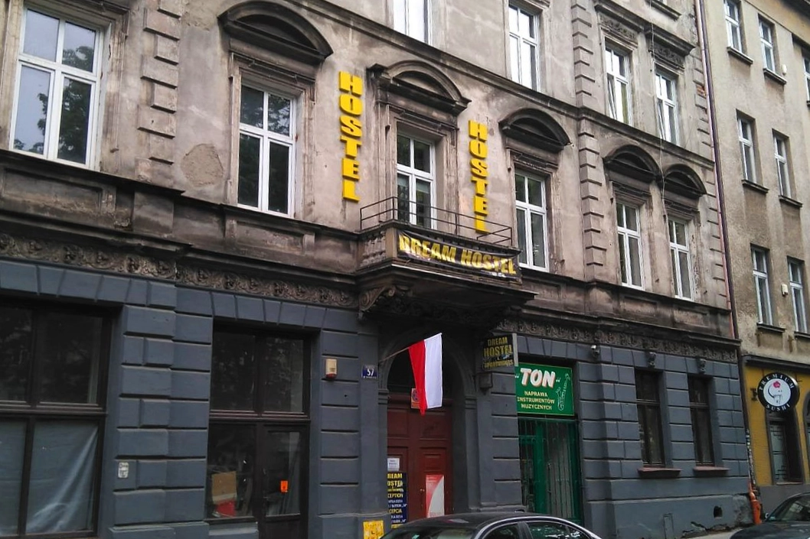
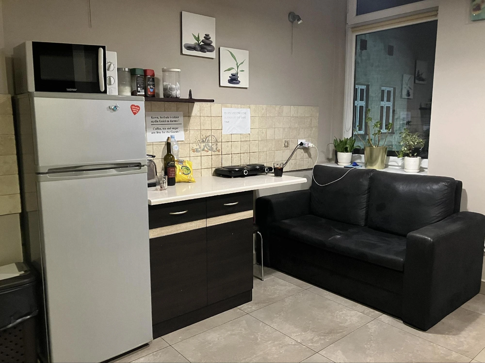
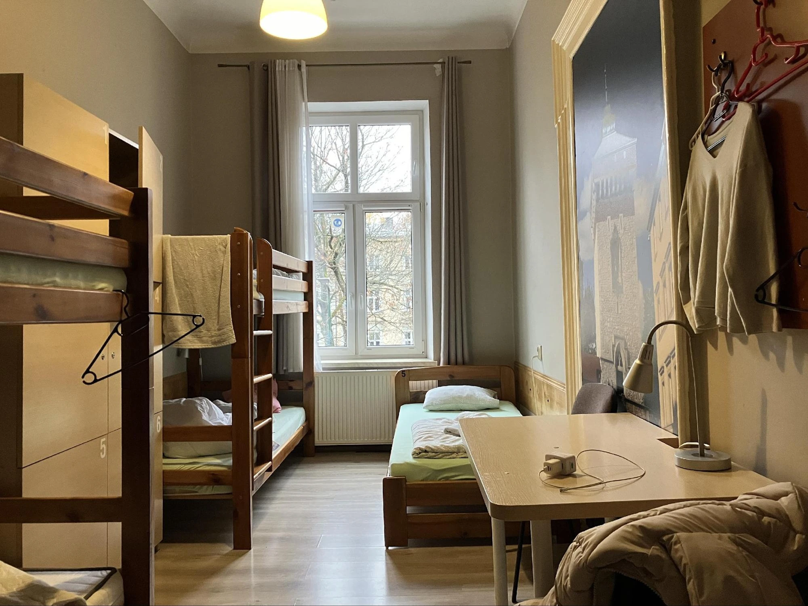

[克拉克夫（波蘭語：Kraków）](https://exittaiwan.com/tags/%E5%85%8B%E6%8B%89%E5%85%8B%E5%A4%AB/)作為波蘭旅遊大城，自然是住宿、餐廳蓬勃發展之地，筆者二度造訪該城，幸運地找到了位在老城區與猶太區間的旅社，價格經濟實惠，地理位置極佳，今天就來推薦給大家！

在筆者住過的歐洲青旅中，許多都是位在公寓的其中一層，招牌不一定很大，但一樓對講機上面會貼個樓層旅社名稱，尋找時要再注意一下。

[**夢想公寓旅社 Dream Hostel**](https://www.booking.com/hotel/pl/dream-hostel.xt.html?aid=7956794) 門前即是輕軌和公車站，相當方便。若想步行體會城市風光，古典歐風街景也會是很好的陪伴。

筆者本次只待在克拉克夫一個晚上，抵達時櫃檯人員已下班，但自助 check-in 和住宿體驗都令人滿意，便捷的交通也省下許多時間，短短的兩天一夜旅行，便造訪了猶太區和老城區。

## 克拉克夫住宿推薦 Dream Hostel 基本資料

* 地址：Dietla 57/14, Kraków, 31-054, Poland
* 價格（新台幣）：
  * 雙人房  1100-1300 / 晚
  * 背包客（混宿、五床）400-500 / 晚
  * **[點我查價](https://www.booking.com/hotel/pl/dream-hostel.xt.html?aid=7956794)**
* 周邊景點：
  * 老城區（波蘭語：Stare Miasto）步行 15 分、輕軌 10 分
  * 瓦維爾城堡（波蘭語：Zamek Królewski na Wawelu）步行 10 分
  * 克拉克夫火車站（波蘭語：Kraków Główny）輕軌 15 分
  * 辛德勒工廠（波蘭語：Fabryka ‘Emalia’ Oskara Schindlera）公車 15 分
* 交通
  * 電車站：步行1分
  * 公車站：步行2分
  * 地鐵：無
* 設施
  * 客廳：無
  * 交誼廳：有
  * 廚房：有
  * 電梯：無
  * 網路：有
  * 置物櫃：無鑰匙，需自備鎖頭
* 備品
  * 浴巾：無
  * 牙刷：無
  * 吹風機：和櫃檯借，免費
  * 沐浴乳：有
* 服務
  * 早餐
  * 24小時櫃檯

## 夢想公寓旅社實際入住體驗

### 交誼廳

夢想公寓旅社的交誼廳空間很小，只是一張桌子、一個沙發，旁邊即是廚房和櫃檯，但有個雅緻的小陽台。第二天筆者離開前在陽台上享用了咖啡和吐司，正好那時沒碰見其他旅客，一個人相當悠閒。

### 廚房

夢想公寓旅社的廚房不大，備有電磁爐、微波爐等，櫥櫃中有其他人留下的茶包和咖啡，除了油是青旅最快被用完的食材，筆者當晚還跑去超市買了一罐。

很幸運地，當天也沒什麼人來搶廚房，所以筆者一個人在那邊炸雞翅、煮紅酒，非常愜意。

### 浴室

五人背包房不會有私人浴室。公共的浴室整體空間很大，更衣方便，但淋浴間偏小，備有沐浴乳。

整體環境乾淨，與房間都在同一層樓，不必爬上爬下。

### 房間

筆者入住五床混宿房，房內暖氣很足，環境整潔，有一張大桌子和衣架。

五床算是恰恰好的數量，不會太擁擠，也符合性價比，許多青旅一下子就是八人或十人，這是目前住下來最寬敞、舒適的房間之一。同層樓房間彼此有些間隔，旅社雖然位於路邊，但因房間面朝內，入夜也很清靜。

## 夢想公寓旅社整體評價

優點：公車站和電車站即在門口、清靜、乾淨

缺點：太晚入住無櫃檯、浴室空間偏小

## 結語

**[夢想公寓旅社 Dream Hostel](https://www.booking.com/hotel/pl/dream-hostel.xt.html?aid=7956794)** 有絕佳的地理位置、實惠的價格和舒適的環境，成為[克拉克夫旅遊](https://exittaiwan.com/tags/%E5%85%8B%E6%8B%89%E5%85%8B%E5%A4%AB/)的理想住宿選擇。

不論是想深入探索歷史悠久的老城區，還是感受猶太區的獨特氛圍，從這裡出發都相當方便。

雖然公區空間不大，但整體環境整潔，房間舒適，適合短期停留或背包客入住。如果你正在尋找一間交通便利又性價比高的青旅，夢想公寓旅社絕對值得考慮！

想要稍微再高級一點的青旅嗎？看看 [**Meininger Kraków Centrum**](https://exittaiwan.com/posts/克拉克夫住宿推薦-meininger-krakow-centrum) 的住宿體驗，一定不會讓你失望！

> ✔️ **立即查詢房價與訂房**：[**夢想公寓旅社查價**](https://www.booking.com/hotel/pl/dream-hostel.xt.html?aid=7956794)\
> ✔️ **更多克拉克夫住宿推薦**：[Booking.com 克拉克夫住宿](https://www.booking.com/searchresults.xt.html?city=-510625&aid=7956794&no_rooms=1&group_adults=2)