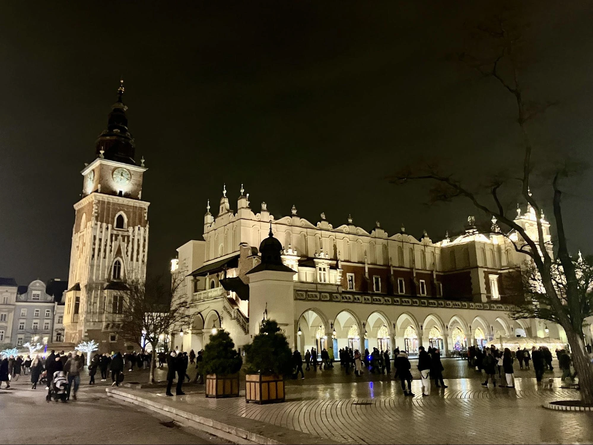
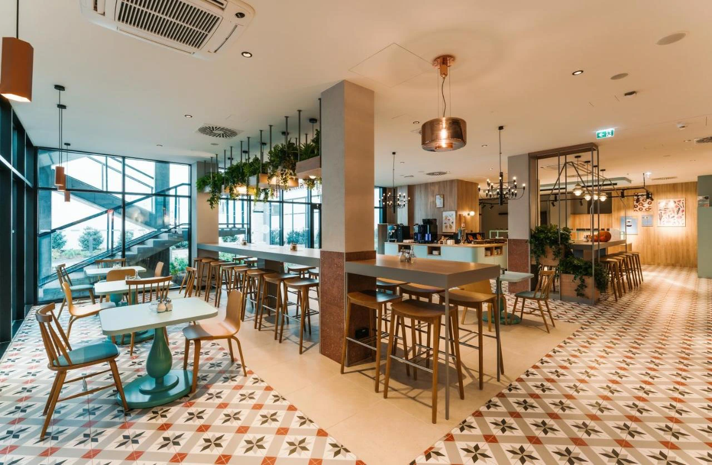
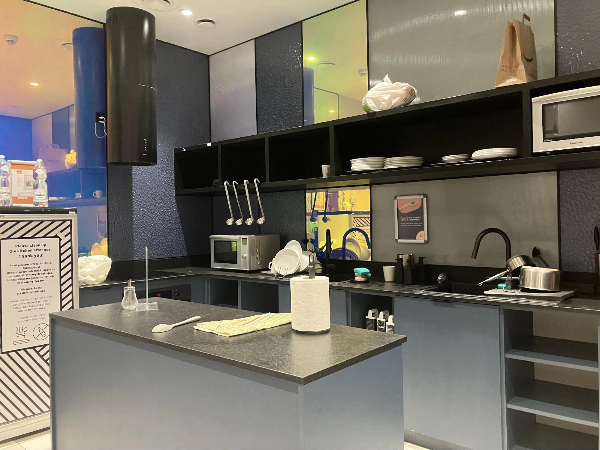
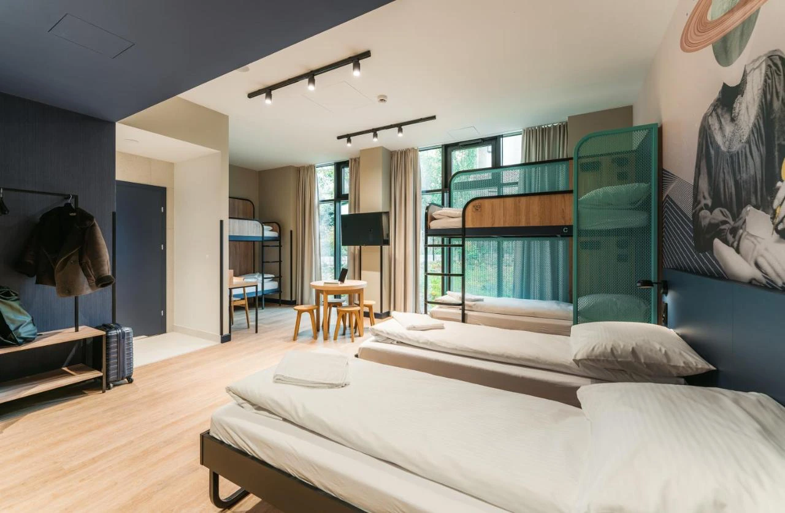
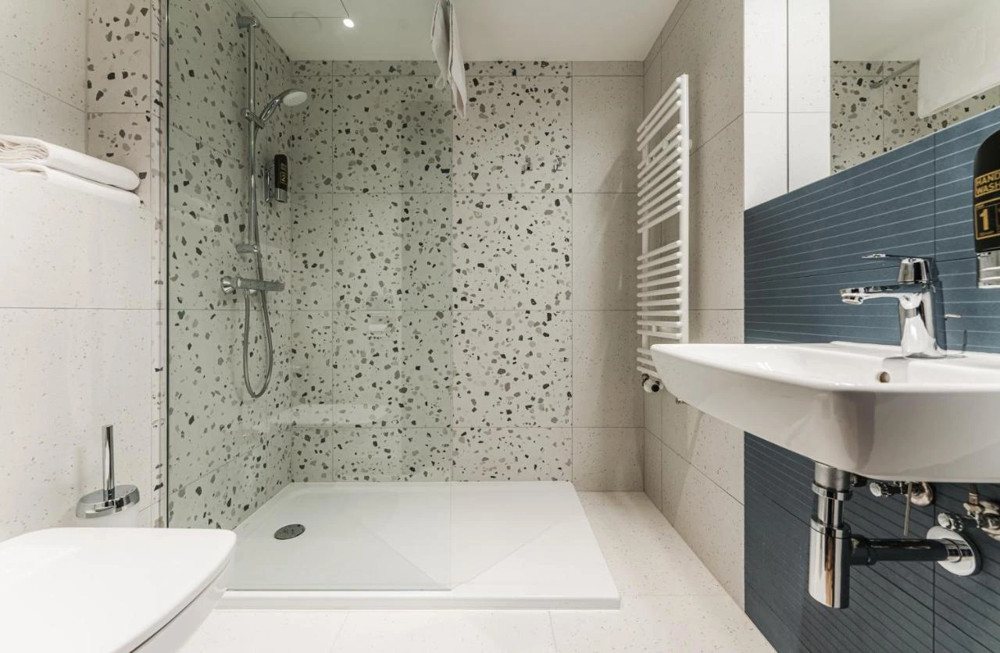

克拉克夫（Kraków）是[波蘭](http://localhost:1313/tags/%E6%B3%A2%E8%98%AD/)最具代表性的旅遊城市之一，以其豐富的歷史文化、壯麗的建築和世界知名的大學——**亞捷隆大學**（Uniwersytet Jagielloński）而聞名。這座城市充滿濃厚的歐洲古典氛圍，即使不會講波蘭文，這裡的觀光產業發達，使用英文溝通也完全沒問題。

這次筆者入住了一家**高 CP 值的青年旅館**——**[Meininger Kraków Centrum](https://www.booking.com/hotel/pl/meininger-krakow-centrum.xt.html?aid=7956794&no_rooms=1&group_adults=2)**，無論是背包客、家庭旅遊或情侶出遊都相當適合，今天就來分享這間旅館的詳細住宿體驗！

## Meininger Kraków Centrum 旅館基本資訊

* 地址：10 Grzegórzecka, Grzegórzki, 31-530 Kraków, Poland
* Booking 訂房：[Meininger Hotel Kraków Centrum](https://www.booking.com/hotel/pl/meininger-krakow-centrum.xt.html?aid=7956794&no_rooms=1&group_adults=2)
* 房型與價格（台幣）：
  * 雙人房：約 $1,800 / 晚
  * 三人房：約 $1,800 / 晚
  * 家庭房：約 $2,500 / 晚
  * 混宿背包客（六床 / 四床）：約 $500 / 晚

## 旅館周邊景點

* 瓦維爾城堡（Wawel Castle） 🚶‍♂️步行 20 分鐘
* 克拉克夫老城區（Stare Miasto） 🚶‍♂️步行 12 分鐘
* 克拉克夫當代藝術博物館（MOCAK） 🚌 公車 10 分鐘
* 奧斯威辛集中營（Auschwitz-Birkenau） 🚆 火車 1 小時 30 分 + 🚌 公車 10 分鐘
* 維利奇卡鹽礦（Wieliczka Salt Mine） 🚆 火車 30 分鐘

> 💡 建議行程安排：若時間充裕，可以考慮安排奧斯威辛集中營 & 鹽礦一日遊。

## **交通方式**

📍 電車站：步行 2 分鐘
📍 公車站：步行 2 分鐘
📍 克拉克夫中央火車站（Kraków Główny）：距離約 500 公尺，方便搭乘長途火車至其他城市

🚆 如何從機場抵達？

搭乘機場快線 Kraków Airport Train 至 Kraków Główny，轉公車或步行約 10 分鐘即可抵達旅館。

**機場官方交通資訊：**[Kraków Airport](https://krakowairport.pl/en/homepage/)

## 旅館設施與服務

| 設施         | 是否提供 | 備註                 |
|------------|------|--------------------|
| 🛋  客廳     | ✅    |                    |
| 🎮 交誼廳     | ✅    | 提供酒吧、遊戲設施          |
| 🍳 廚房      | ✅    | 附餐具、廚具、烤箱，無茶包或咖啡   |
| 🛗 電梯      | ✅    |                    |
| 📶 網路      | ✅    | 免費 Wi-Fi           |
| 🔑 置物櫃     | ✅    | 無鑰匙，需自備鎖頭          |
| 🛏 備品      | ✅    |  浴巾                |
| 🪥 牙刷      | ❌    | 需自備                |
| 💨 吹風機     | ✅    | 房內提供               |
| 🧴 沐浴乳     | ✅    | 2 合 1              |
| 🍽 早餐      | ✅    | 約 400 NTD          |
| 🕛 24 小時櫃檯 | ✅    |                    |
| 🅿 停車場     | ✅    | 停車位有限，先到先停         |

## **實際入住體驗｜公用設施**

### **交誼廳 & 客廳**

Meininger 的交誼廳設計豪華，有各式舒適的座椅、桌遊設備，甚至還有開放式酒吧，讓旅客能點選各式調酒與輕食。當天晚上 8 點左右，許多旅客聚集在這裡聊天，氣氛非常好！

早餐區位於大廳後方，需額外加購 **49 波蘭茲羅提（約台幣 400 元）**，提供冷熱食選擇。CP 值頗高，住青年旅館卻有飯店級的早餐體驗！

### **公共廚房**

廚房設有**冰箱、餐具、烤箱**，但沒有免費提供茶包或咖啡。整體空間比交誼廳小，但由於大廳有提供餐點，使用廚房的旅客不算多，因此烹飪時不會感到擁擠。

## **實際入住體驗｜房間 & 浴廁**

### **房間環境**

房內裝潢新穎時尚，床鋪上下舖皆有穩固的欄杆與窗簾，確保隱私與安全性。門口設有掛衣架，並附有置物櫃（需自備鎖頭）。

入住時，床上已備妥浴巾，門鎖為感應式嗶卡，安全性極高。

### **浴廁設備**

* 六人混宿房 內設有 獨立衛浴與淋浴間，且乾濕分離。
* 旅館提供 二合一沐浴乳，淋浴間內設有暖氣，冬天洗澡不怕冷！
* 整體環境乾淨整潔，保養良好。

## **Meininger Kraków Centrum 住宿整體評價**

**✅ 優點**	

* 交通便利：公車、電車、火車站皆在步行範圍內	
* 交誼廳高級：寬敞舒適，提供酒吧與遊戲設備
* 房間乾淨舒適：隱私窗簾、安全設施完備
* 安全性高：需嗶卡進入房間與廚房
* 早餐選擇豐富，價格合理
* 推薦給：背包客、家庭旅遊、情侶入住

**❌ 缺點**

* 需自備牙刷與置物櫃鎖頭
* 公共廚房空間較小

## Meininger Kraków Centrum 住宿總結

Meininger Kraków Centrum 是一間 **CP 值極高** 的青年旅館，無論是 **交通便利性**、**設施完善度**，還是 **房間舒適度**，都表現出色。距離克拉克夫老城區、瓦維爾城堡等熱門景點皆在步行可達範圍內，對於自由行旅客來說相當方便。此外，交誼廳寬敞且氣氛良好，房內設備新穎乾淨，提供良好的住宿體驗。

如果你計畫到 **克拉克夫自由行**，並希望找到 **價格合理、環境舒適、交通方便** 的住宿選擇，那麼 **Meininger Kraków Centrum 絕對值得考慮！** 

👉 **立即查詢房價與訂房**：[Meininger Kraków Centrum 官網](https://www.booking.com/hotel/pl/meininger-krakow-centrum.xt.html?aid=7956794&no_rooms=1&group_adults=2)\
👉 **更多克拉克夫住宿推薦**：[Booking.com 克拉克夫住宿](https://www.booking.com/searchresults.xt.html?city=-510625&aid=7956794&no_rooms=1&group_adults=2)

希望這篇住宿推薦對你的克拉克夫旅程有所幫助，祝你旅途愉快！
