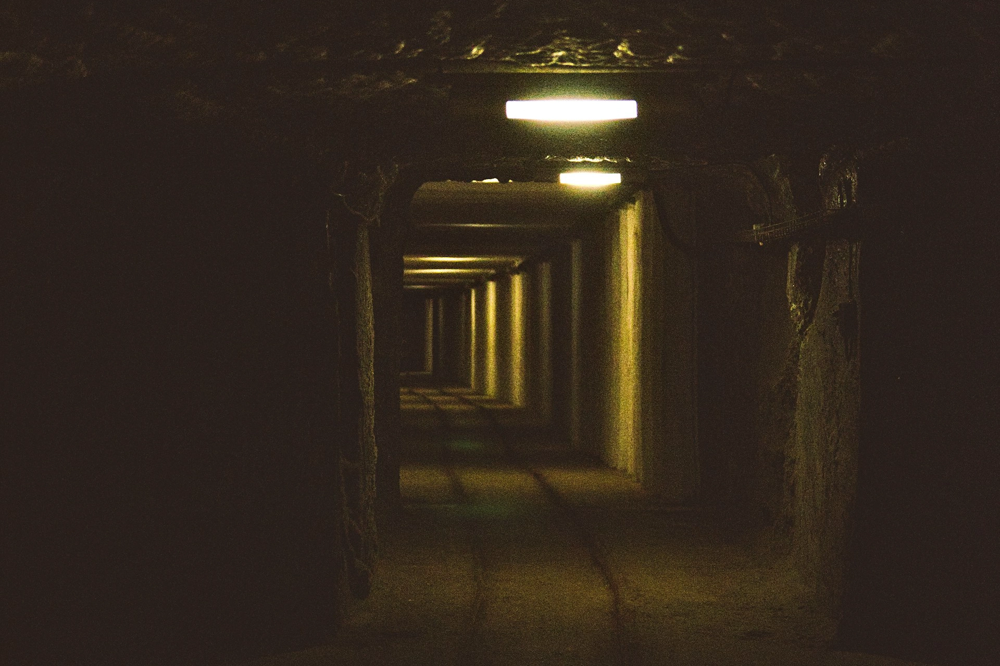
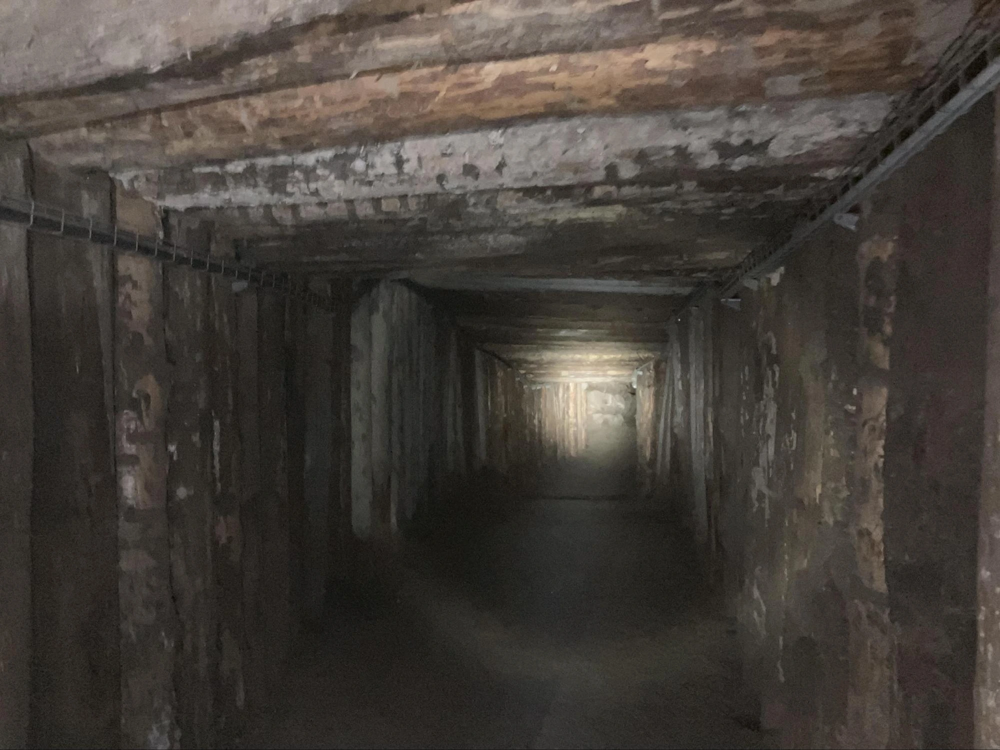
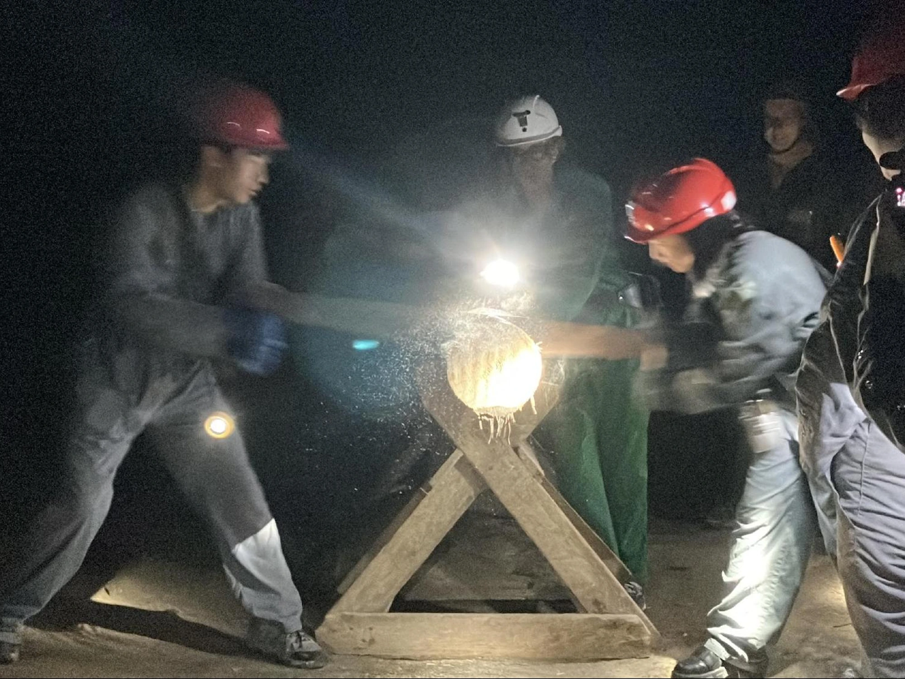
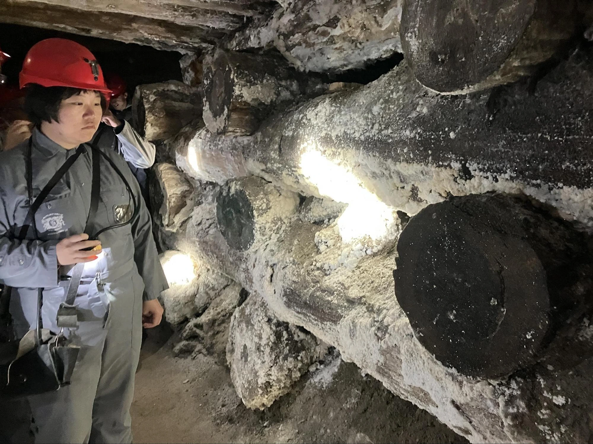
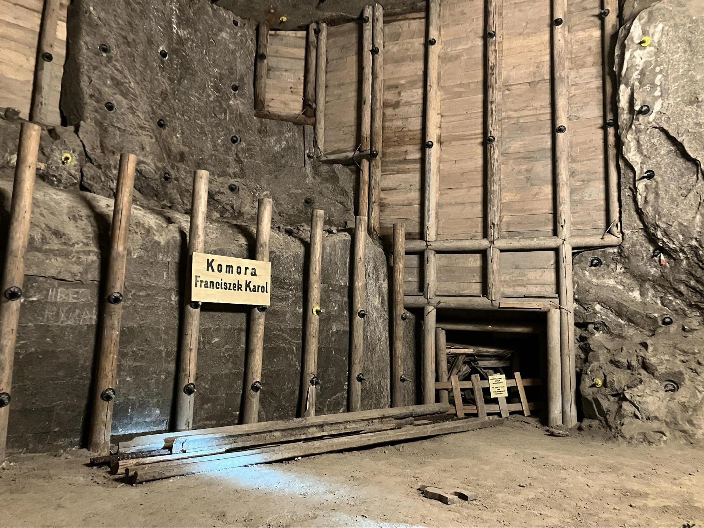

## 鹽巴與維奇利亞鹽礦的故事

現今台鹽一包五十塊內的鹽巴，在古早時候可是無價之寶。

大家都聽過「鹽巴國王」的故事，故事中的小女兒和國王說：「我像喜歡鹽巴一樣喜歡您！」，惹得國王大怒，殊不知沒有了鹽巴，才是食而無味，再好的宮廷料理沒有用。

因此早在新石器時代，人類就懂得煮沸鹽水來獲取鹽巴，中歐最古老的採鹽用具，就是在維奇利亞（波蘭文：Wieliczka）附近村莊 — Barycz （中文：巴雷奇）被發現，也是來自此時期。

以沸騰法取鹽巴也成了一個特殊的專業，人們除了將鹽巴拿來保存肉類，也作為交易的貨幣使用。

十一到十三世紀間，由於天然的的鹽水資源逐漸式微，人們開始掘井再煮沸地下水取鹽。維奇利亞的貿易和手工業此時開始蓬勃發展。而後來十三世紀時，偶然發現的石鹽進一步促使地下採礦技術的引用。中世紀時期，維奇利亞出產的鹽更高達七千至八千噸！

1964 年，維奇利亞全面停止了人工開採，採用「濕法開採」。1978 年，維奇利亞鹽礦被列入聯合國世界文化遺產。今日，仍有人員固定維護、翻新礦車和地下區域，確保旅客能有個安全且原汁原味的體驗。

## 維奇利亞鹽礦旅遊路線

維奇利亞鹽礦分為兩個路線：**遊客路線和礦工體驗**。

**遊客路線**全票約台幣一千，時長兩到三小時，會到地下三層樓。路線包含參觀地下教堂、雕像、地下湖等，最後還可以參觀鹽礦博物館。

**礦工體驗**價格一樣，時常三小時，會到地下兩層樓。不同的是，遊客會配戴當時礦工的配件，並在地下親自體驗搗石頭取鹽並參觀地下教堂。

兩者路線不重複，也有人一天內跑兩個路線，大家可以[到鹽礦官網查看](https://www.wieliczka-saltmine.com)後自己評估。

## 維奇利亞鹽礦旅遊交通：怎麼到維奇利亞鹽礦？

從[克拉克夫（波蘭文：Kraków）](https://exittaiwan.com/tags/%E5%85%8B%E6%8B%89%E5%85%8B%E5%A4%AB/)任何一個火車站搭到 Wieliczka Rynek Kopalnia 後步行即可。當天下車後看到大排長龍的建築物，基本上就是遊客中心，記得詢問一下資訊站的人，因為有預約和現場買票是分開的。

> 越早訂越便宜：[**現在查詢克拉克夫房價**](https://www.booking.com/city/pl/krakow.xt.html?aid=7956794&no_rooms=1&group_adults=2)

## 維奇利亞鹽礦體驗時間

地底溫度大約十幾度，可以帶個外套。有幽閉恐懼症的人可能不宜參加，因為全程路線都會長這樣。

一組大概十五到二十人，途中會經過一些機具，可以自願體驗，蠻有趣的。每個人都要配備頭盔、手電筒、礦工裝和最好不要用到的救命工具——碳過濾器，如果在地底發生了意外，至少還可以呼吸。當然希望是不要用到啦！

這些攀附在木頭上的，都是所謂的石鹽。這些木頭是松木，放置在礦坑裡，除了本身質地有彈性，如果發生崩塌，樹枝也會先發出聲響，讓礦工有逃生的時間。

筆者大為驚嘆前人的建築技術，能在地底下鑿開這麼大一個洞，牆上一個個黑黑的螺絲是加固牆壁的道具，雖然理性上知道很安全，但細想還是覺得當礦工的風險太大了。

沿路牆壁上有水流過，不怕髒的遊客可以嚐一嚐，還真的是鹹的。導遊有帶大家到一個教堂，該教堂沒有太多光鮮亮麗的裝飾，但以前的人們放耶穌像底下，是會了安定礦工的心情。

導遊請大家圍圈坐下、關掉手電筒，陷入一片漆黑後，寂靜中導遊的聲音帶著淺淺回音，和大家解釋鹽巴也被認為帶有好的能量，後來也請兩著自願者在黑暗中唱歌，非常特別的體驗。

結束後每個人都會拿到一張礦工證書，雖然筆者很迷糊地把它忘在廁所了。但整體體驗，從風趣幽默的導遊，到別出心裁的證書，都讓筆者覺得不虛此行。離開地底後，如果不急著到其他地方，可以停留在維奇利亞鎮上，算是個典雅小鎮，走走逛逛再搭火車回市區，為一天劃下完美的句點。

## 維奇利亞鹽礦旅遊後記

維奇利亞鹽礦不僅是波蘭的重要文化遺產，更是一場寓教於樂的歷史探索之旅。無論是震撼人心的地下教堂，還是趣味十足的礦工體驗，都讓人印象深刻。

這趟旅程不僅讓筆者更加敬佩古人的智慧與技術，也讓人深刻體會鹽在歷史中的重要性。如果你來到克拉克夫，不妨走進這座地底世界，親身感受這片埋藏千年的瑰寶！

> 越早訂越便宜：[**現在查詢克拉克夫房價**](https://www.booking.com/city/pl/krakow.xt.html?aid=7956794&no_rooms=1&group_adults=2)