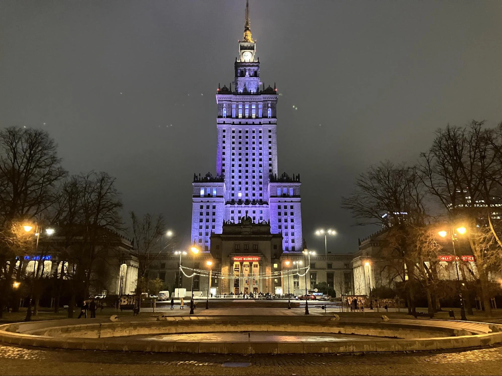
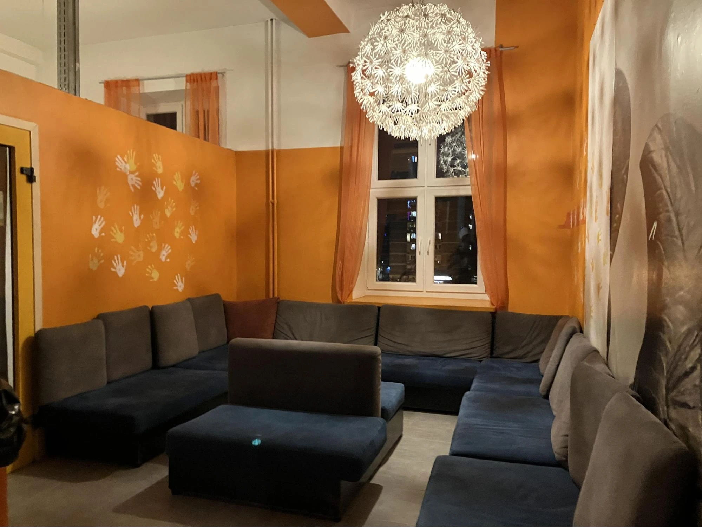
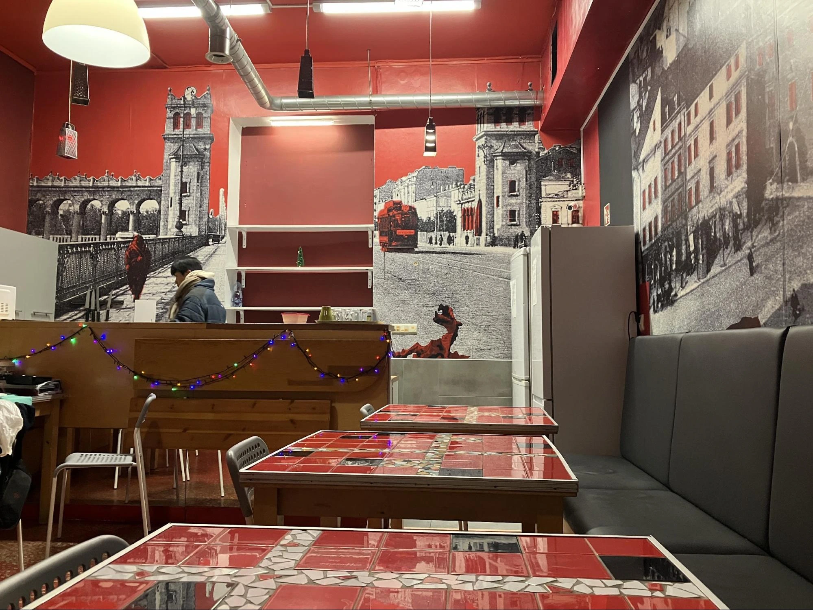
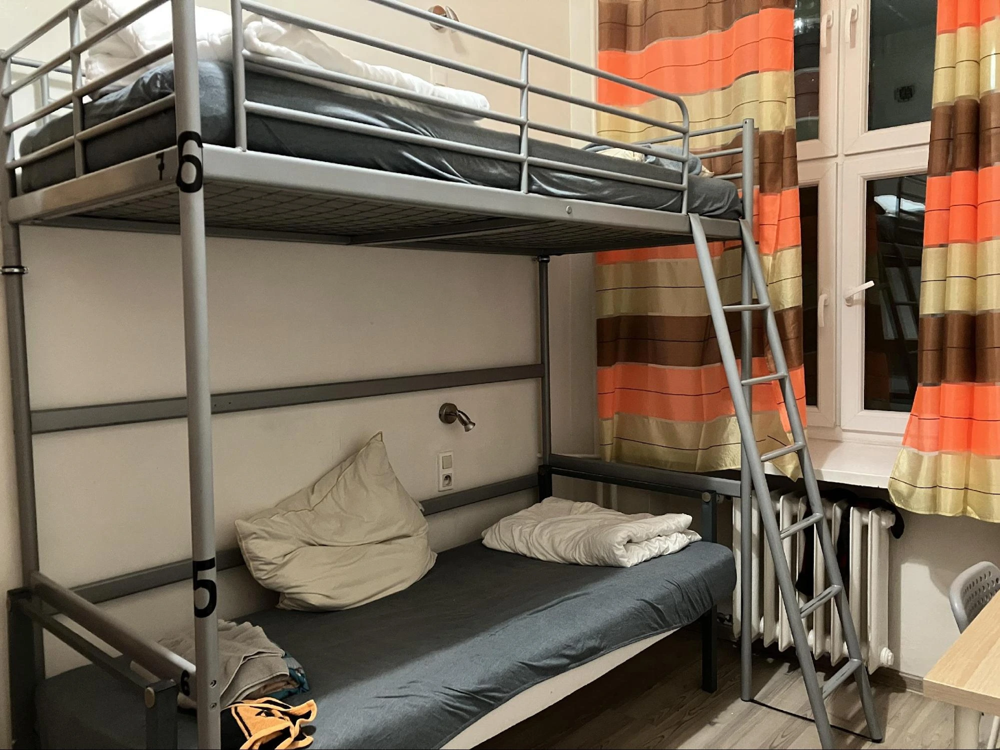
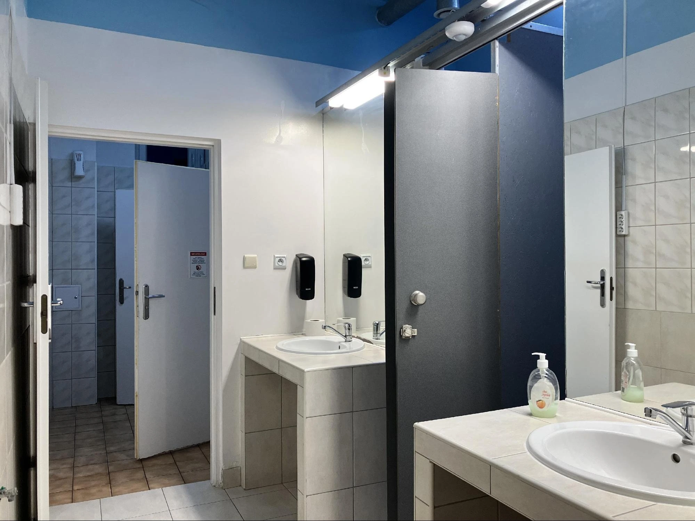

這次逢連假，筆者與朋友到[波蘭](http://exittaiwan.com/tags/%E6%B3%A2%E8%98%AD/)首都華沙旅行，選擇入住 [**Oliwka Hostel**](https://www.booking.com/hotel/pl/oliwka-hostel-warszawa.xt.html?aid=7956794&no_rooms=1&group_adults=2)，這是一間 CP 值高、交通便利的青年旅館，距離華沙地標科學文化宮（Pałac Kultury i Nauki）只要步行 5 分鐘，周邊生活機能佳，地鐵站、餐廳、超市、景點都在步行範圍內，適合來華沙自由行的旅客。

本文將詳細介紹 Oliwka Hostel 的房型、設施、交通資訊，並分享實際入住體驗，讓你評估是否適合你的華沙旅程！

## Oliwka Hostel 旅館基本資訊

* 名稱：Oliwka Hostel
* 地址：3 Plac Jana Henryka Dąbrowskiego, 00-057 Warszawa, Poland
* 官網 / 訂房連結：[Oliwka Hostel 房價查詢](https://www.booking.com/hotel/pl/oliwka-hostel-warszawa.xt.html?aid=7956794&no_rooms=1&group_adults=2)
* 價格（新台幣，參考 Booking.com）：
  * 雙人房（分為豪華版與經濟版）：約 NT$ 1000 - 1700 / 晚
  * 四人房（上下鋪）：約 NT$ 1700 / 晚
  * 背包客房（混宿 8 床）：約 NT$ 500 / 晚

## 旅館周邊景點（步行可達）

* 科學文化宮（Pałac Kultury i Nauki） - 5 分鐘
* 札切塔現代藝術博物館（Zachęta Narodowa Galeria Sztuki） - 6 分鐘
* 薩克森花園（Ogród Saski） - 9 分鐘
* 聖十字教堂（Bazylika Świętego Krzyża） - 10 分鐘
* 蕭邦博物館（Muzeum Fryderyka Chopina） - 搭公車 15 分鐘

**推薦玩法**：早上先到薩克森花園散步，接著前往科學文化宮觀景台俯瞰華沙市景，下午可安排札切塔藝術館或蕭邦博物館，最後在舊城區用餐，感受華沙的歷史與現代交融的氛圍！

## 交通資訊

* 地鐵站（Metro Świętokrzyska） - 步行 3 分鐘，紅線 / 藍線交會站，前往舊城區或機場超方便
* 公車站 - 步行 5 分鐘
* 電車站 - 步行 5 分鐘

### 機場前往方式：

* 搭乘 SKM S2 或 S3 火車 到 Warszawa Śródmieście，再步行 8 分鐘
* 搭 175 號公車 直達 科學文化宮，再步行 5 分鐘
* 叫車 App：波蘭可使用 Uber、Bolt，機場到旅館約 NT$ 400-500

## 旅館設施與服務

| 設施         | 有無 |
|------------|----|
| 客廳 / 交誼廳   | ✅  |
| 廚房         | ✅  |
| 電梯         | ❌  |
| 免費 Wi-Fi   | ✅  |
| 置物櫃（需自備鎖頭） | ✅  |
|  浴巾（入住時領取） | ✅  |
| 吹風機（可向櫃台借）  | ✅  |
| 沐浴乳        | ❌  |
| 24 小時櫃檯    | ✅  |
| 早餐         | ❌  |

**特別提醒**：置物櫃和許多青年旅館一樣**沒有附鑰匙**，務必**自備密碼鎖頭**，確保貴重物品安全！

## 公共區域體驗

### 交誼廳

旅館的交誼廳位於三樓樓梯口，擺放幾組沙發，但空間較小且燈光較暗，適合短暫休息，不太適合長時間辦公。

> **注意**：大樓一樓門口晚上 11 點後上鎖，有時會看到外來旅客在交誼廳過夜，建議晚上盡量不要長時間逗留。

### 廚房

小型廚房，裝潢色彩繽紛，設備包含 冰箱、微波爐、餐具、烤箱。每天早晨 會有清潔阿姨打掃，但 不提供免費茶包、咖啡。

## 房間體驗

🔹混宿背包客房（8 床）

* 房內無鎖，需自備鎖頭
* 中間有牆，隔開兩張床與四張床，隱私度較高
* 每張床皆有個人插座與閱讀燈，晚上不打擾他人

> **安全提醒**：房門無法上鎖，若攜帶貴重物品，務必鎖進個人置物櫃！

### 浴廁體驗

* 廁所 & 淋浴間分開，減少排隊等待時間
* 熱水穩定、水壓夠，浴室整潔
* 冬天浴室有暖氣，但 衣服掛鉤在淋浴間外，洗完澡出來會稍微接觸冷空氣

>**注意**：不提供沐浴乳，需自行準備。

## 整體評價

| 優點          | 缺點       | 補充                |
|-------------|----------|-------------------|
| ✅ 超棒地理位置    | ❌ 置物櫃無鑰匙 | 🔹 需自備鎖頭          |
| ✅ 近地鐵 / 公車站 | ❌ 浴室較小   | 🔹 但熱水穩定          |
| ✅ 隱私度較高     | ❌ 房門無法上鎖 | 🔹 建議將貴重物品鎖入置物櫃   |
| ✅ 價格實惠      | ❌ 無提供早餐  | 🔹 但附近超市多，可自行購買 | 

## 總結

[**Oliwka Hostel**](https://www.booking.com/hotel/pl/oliwka-hostel-warszawa.xt.html?aid=7956794&no_rooms=1&group_adults=2) 是一間地理位置優越、交通便利的青年旅館，適合預算型旅客。雖然設施較簡單，但整體環境乾淨，若你計畫來華沙自由行、想住在市中心，這間旅館會是值得考慮的選擇！

希望這篇華沙住宿攻略對你有幫助！祝旅途愉快！
