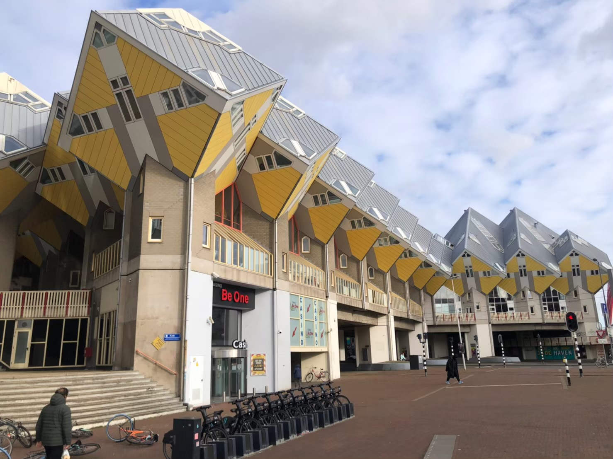

鹿特丹（Rotterdam）是荷蘭的第二大城，同時有著歐洲最大的海港，給我的感覺很像高雄。大部分的遊客來到荷蘭旅遊想到的第一個城市大概是阿姆斯特丹（Amsterdam），不過鹿特丹作為第二大城我認為還是有其可看之處。而且人比阿姆斯特丹少遊覽起來也舒服多了。

由於鹿特丹沒有對歐洲以外的國際航線，因此需要先抵達阿姆斯特丹史基浦機場再轉乘抵達鹿特丹。以下整理三種方式可以抵達鹿特丹市中心，包含火車、巴士以及Uber。
