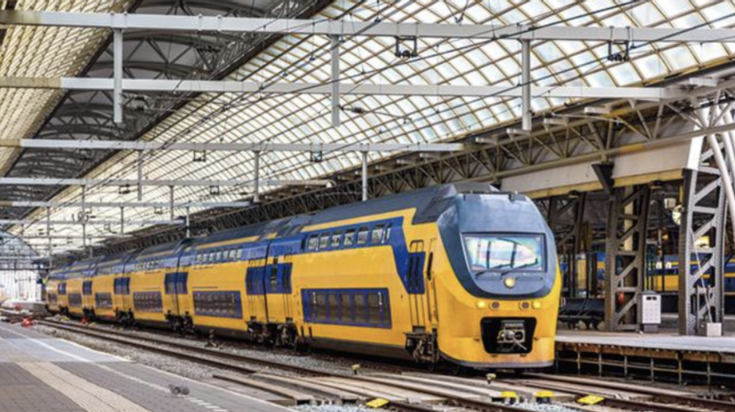
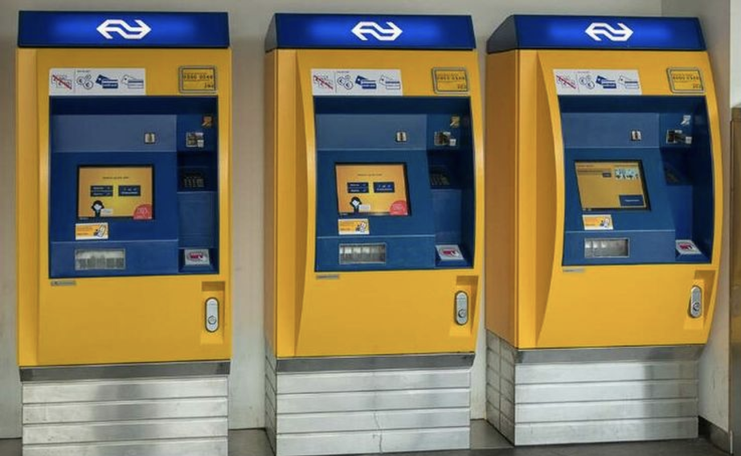
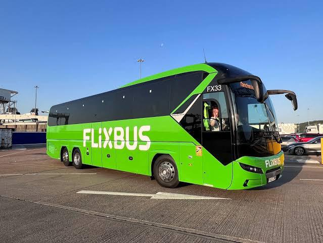

鹿特丹（Rotterdam）是荷蘭的第二大城，同時有著歐洲最大的海港，給我的感覺很像高雄。大部分的遊客來到荷蘭旅遊想到的第一個城市大概是阿姆斯特丹（Amsterdam），不過鹿特丹作為第二大城我認為還是有其可看之處。而且人比阿姆斯特丹少遊覽起來也舒服多了。

由於鹿特丹沒有對歐洲以外的國際航線，因此需要先抵達阿姆斯特丹史基浦機場再轉乘抵達鹿特丹。以下整理三種方式可以抵達鹿特丹市中心，包含火車、巴士以及 Uber。

## 火車

搭火車從機場到鹿特丹是最普遍的方法從阿姆斯特丹史基浦機場到鹿特丹中央車站。如果有買荷蘭的交通卡OV卡，除了可以搭火車外到市區後也可以搭乘市內的大眾交通，便利性較高。

而火車又分成 InterCity 及 InterCity direct 兩個車種，InterCity 的搭乘時間較長約 50 分鐘，中間會停像海牙 Den Haag 等等的城市；InterCity direct 就是直達車，車程約 27 分鐘，不過這類車種是沒有辦法只用 OV 卡搭乘，必須要再加購該車種的票才能上車，不然被查到的話可是會罰款的喔。

* 價格：InterCity 14.50 歐元；InterCity direct 17.40 歐元
* 時間：InterCity 50 分鐘；InterCity direct 27 分鐘
* 優點：快速便利、座位寬敞舒適
* 缺點：會有誤點或是罷工的潛在問題

火車票除了用售票機器買之外，也可以透過App及現場售票口購買。火車售票機器及車站都在機場內，出境後跟著指標走就可以看得到又大又黃的機器，算是相當方便的選擇，也是我從機場到鹿特丹的交通方式首選。

## Flixbus 巴士

