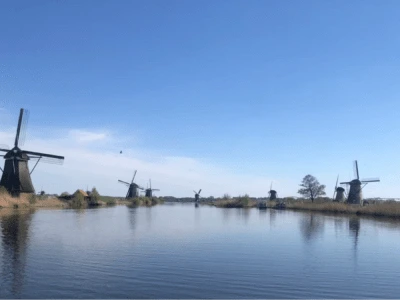

小孩堤防（Kinderdijk）是荷蘭最大的風車群，共有19座風車，已有超過700年的歷史，並被聯合國教科文組織列為世界文化遺產。荷蘭不僅以自行車著名，風車更是這片土地的象徵，因此又被稱作「風車之國」。早期風車的主要功能是排水，幫助荷蘭人「與海爭地」，將沼澤地轉化為農田與居民區。隨著技術發展，風車逐漸被應用於風力發電和農業生產，如磨米與磨粉，展現了荷蘭人的創新精神。

## 小孩堤防基本資訊
