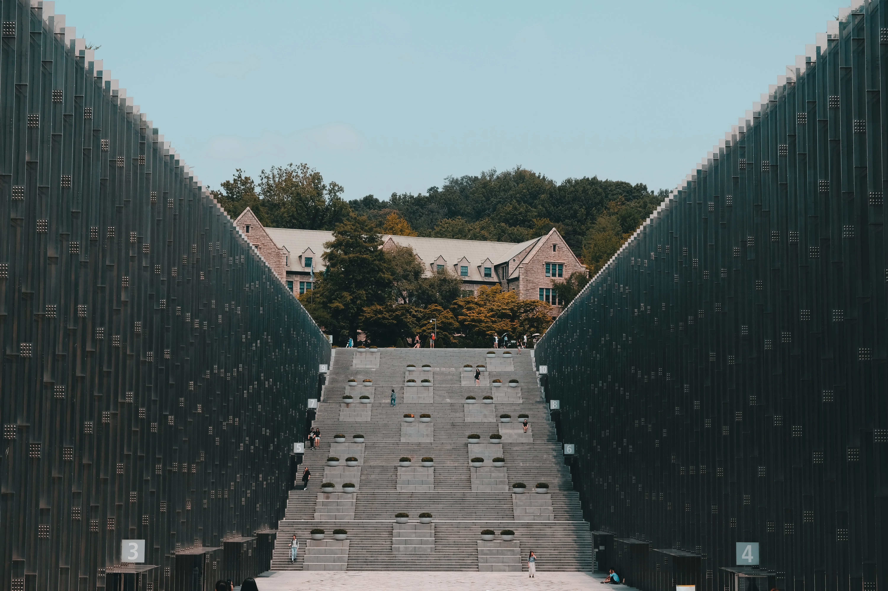
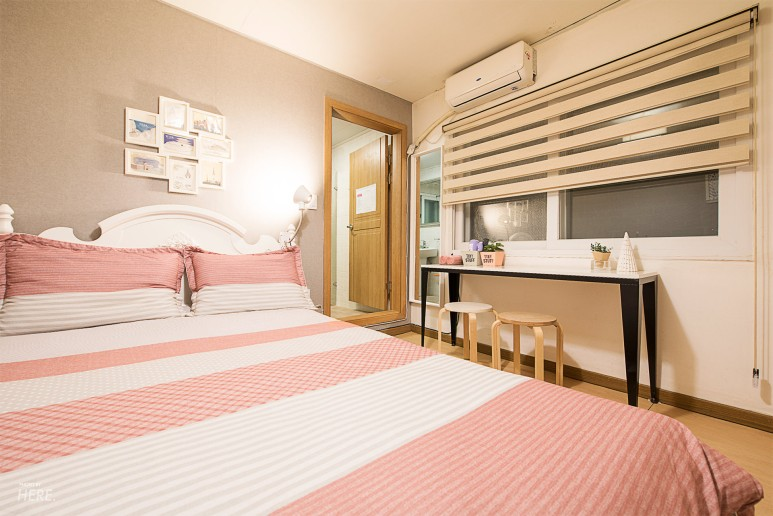
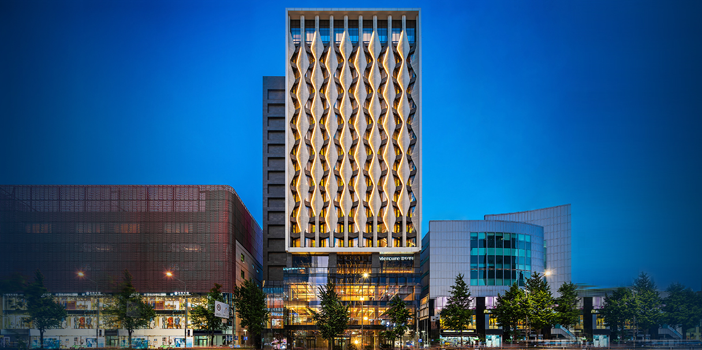
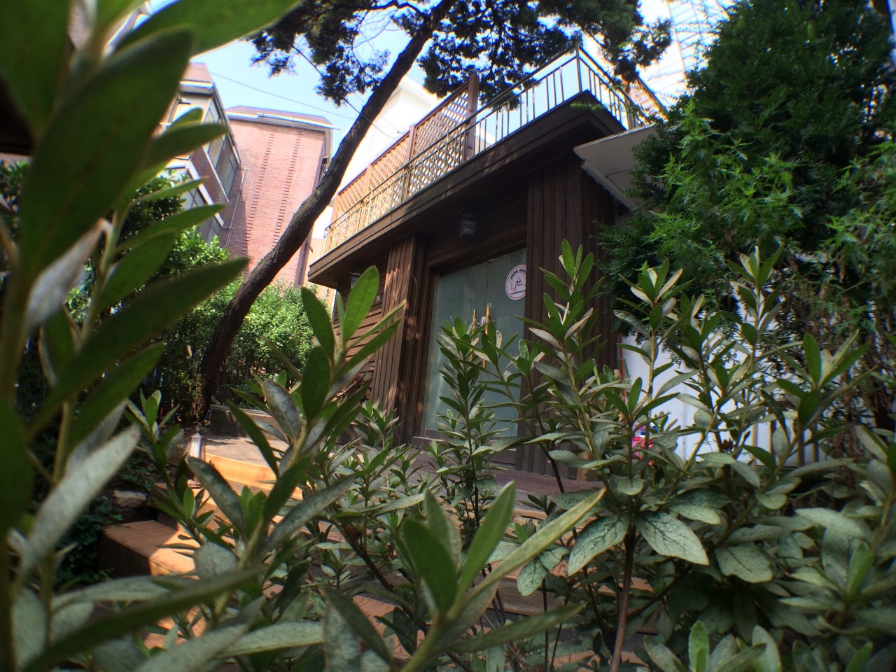
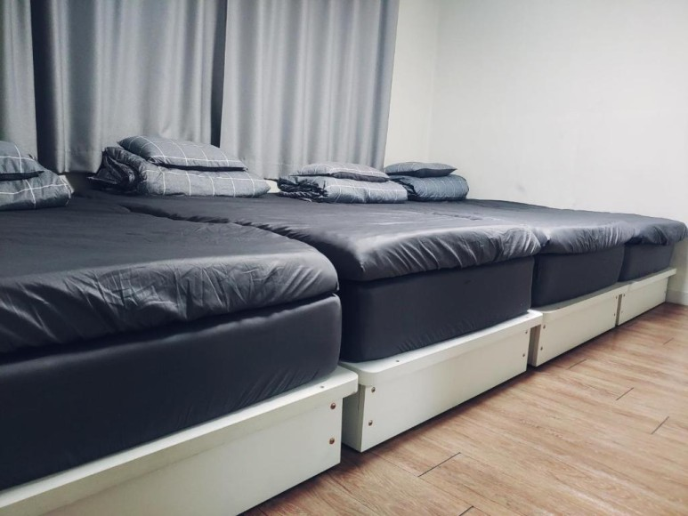
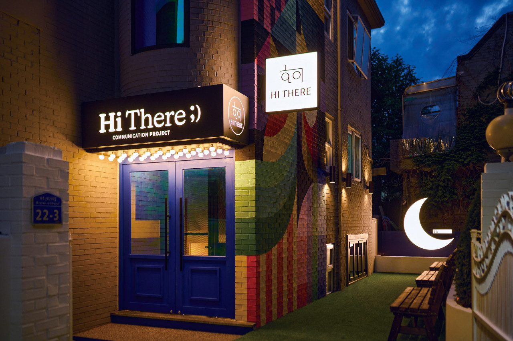
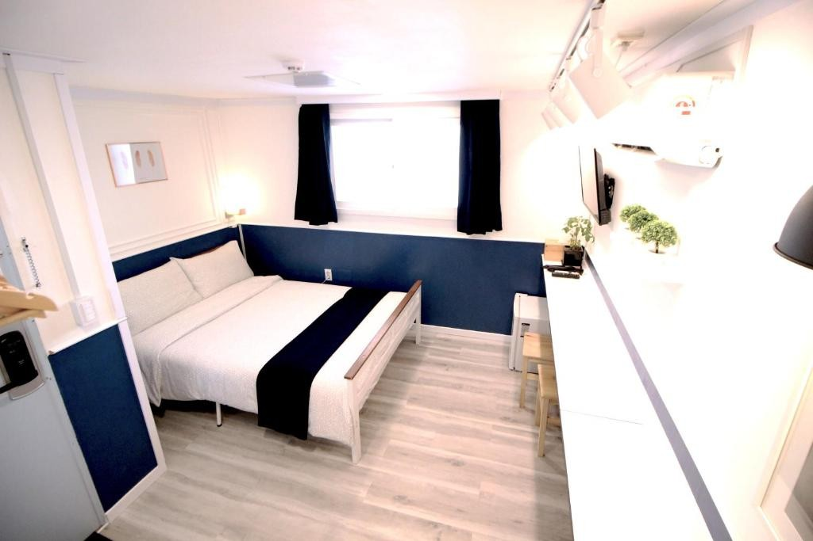
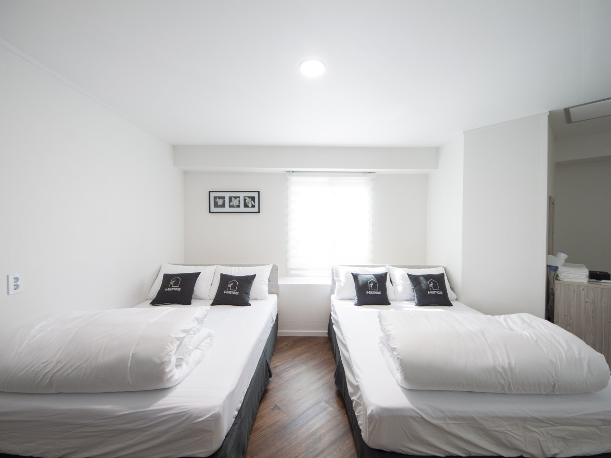
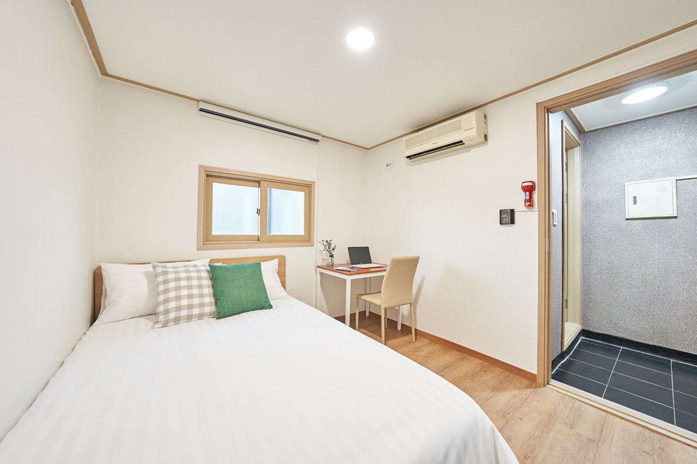

## 首爾弘大、梨大、新村商圈

[弘大商圈](https://bobby.tw/blog/post/227567630-%E3%80%90%E9%9F%93%E5%9C%8B%E3%80%91%E5%BC%98%E5%A4%A7%E6%9C%80%E5%BC%B7%E9%80%9B%E8%A1%97%E5%9C%B0%E5%9C%96%EF%BC%812019%E9%A6%96%E7%88%BE%E5%BC%98%E5%A4%A7%E7%BE%8E)是首爾著名的商業區之一，它散發著年輕活力、文化氛圍和街頭表演，有如倫敦皮卡迪利圓環。不同於高端、時尚的風格，弘大商圈更加融合了藝術和設計元素，周圍散發著韓國年輕人所追求的自由和獨特個性的街頭風格。這裡擁有獨具特色的弘大生活。

[梨大商圈](https://www.bring-you.info/zh-tw/ewha-womans-university)同樣是來首爾自由行絕對不能錯過的地方，梨大（梨花女子大學）享有盛名，早已被傳頌美麗與浪漫。這裡也是眾多韓劇的取景地，即使對韓劇不太感興趣，來首爾自由行時，也值得一探這個頂尖學府的風采。特別是在秋天，梨大更是首爾賞楓的絕佳勝地之一！

[新村商圈](https://blog.asiayo.com/2023/04/20/archives/29604/)就在弘大、梨大兩大商圈的附近。因為它鄰近需多大學，主要客群主要是學生，因此價格相對便宜，卻不減品質。如果你喜歡購物，這裡是最明智的選擇，因為性價比極高！首爾新村商圈位於首爾市中心，融合了時尚、文化、藝術和美食，深受韓國年輕人喜愛。

想要在首爾的這三大商圈有最完整的體驗，少不了一間**適合的住宿**！這篇文章，我整理了十間我最推薦且包含各個價格區間、位在首爾的弘大、梨大、新村商圈飯店推薦給前往韓國旅遊的你們，包括：

1. [弘大風格旅館](#首爾弘大梨大新村飯店推薦-1---弘大風格旅館)
2. [Mercure Ambassador Seoul Hongdae](#首爾弘大梨大新村飯店推薦-2---mercure-ambassador-seoul-hongdae)
3. [Localstitch Seogyo Town](#首爾弘大梨大新村飯店推薦-3---localstitch-seogyo-town)
4. [鄭家旅館](#首爾弘大梨大新村飯店推薦-4---鄭家旅館)
5. [首爾弘大智選假日飯店](#首爾弘大梨大新村飯店推薦-5---首爾弘大智選假日飯店)
6. [弘大愛博 2 號旅館](#首爾弘大梨大新村飯店推薦-6---弘大愛博-2-號旅館)
7. [Hi there guesthouse](#首爾弘大梨大新村飯店推薦-7---hi-there-guesthouse)
8. [首爾大廈旅館](#首爾弘大梨大新村飯店推薦-8---首爾大廈旅館)
9. [梨大首爾大旅館](#首爾弘大梨大新村飯店推薦-9---梨大首爾大旅館)
10. [K'STAY Sinchon](#首爾弘大梨大新村飯店推薦-10---kstay-sinchon)

因為[在韓國 Google Maps 不太能用](https://exittaiwan.com/posts/%E7%82%BA%E4%BB%80%E9%BA%BC-google-maps-%E5%9C%A8%E9%9F%93%E5%9C%8B%E4%B8%8D%E8%A1%8C%E7%94%A8%E6%9C%89%E4%BB%80%E9%BA%BC%E6%9B%BF%E4%BB%A3%E6%96%B9%E6%A1%88/)，以下的飯店地址資訊我都直接連接到 Naver Map 和 Kakao Map 囉！

<!--
$ = < 1000,
$$ = 1000~4999
$$$ = 5000 ~ 9999
$$$$ = > 10000
-->

## 十間首爾弘大、梨大、新村商圈飯店住宿推薦

### 首爾弘大、梨大、新村飯店推薦 1 - 弘大風格旅館

[弘大風格旅館](https://www.booking.com/hotel/kr/hongdae-style-guesthouse.xt.html?aid=7956794&no_rooms=1&group_adults=2)具有方便的交通位置，前往城市內的各大景點和設施都很輕鬆快速。儘管位於市中心，住宿處卻非常安靜，提供了一個非常適合休息的環境。旅館提供老闆親自做的早餐，也有訂購外送的服務，用餐方面完全不用擔心。弘大風格旅館還是個講求安全性飯店，設有高度的安全措施，門窗都有雙層保護。最後，老闆非常友善和客氣，也很熱情。推薦給想要舒適安心旅遊的你！

可以到 [Booking.com](https://www.booking.com/hotel/kr/hongdae-style-guesthouse.xt.html?aid=7956794&no_rooms=1&group_adults=2) 上面看更多弘大風格旅館房間的照片喔！

**弘大風格旅館基本資訊**
- 地址：23-3 World Cup buk-ro 4-gil, Mapo-gu, Seoul | 韓文：서울특별시 마포구 월드컵북로4길 23-3 (동교동)
    - [Naver Map](https://naver.me/xUSugtLQ)
    - [Kakao Map](https://kko.to/VPxO0Hn_vg)
- 地鐵：地鐵弘大入口站 1 號出口步行約 2 分鐘
- 商圈：位在弘大商圈內、距離梨大商圈約 1.1 公里、距離新村商圈約 0.6 公里
- 最近機場：距離金浦國際機場約 9 公里
- 是否含早餐：有
- 平均每晚雙人房價格：約台幣 3,800 元（$$）
- 查看即時房價：[**點我前往**](https://www.booking.com/hotel/kr/hongdae-style-guesthouse.xt.html?aid=7956794&no_rooms=1&group_adults=2)

### 首爾弘大、梨大、新村飯店推薦 2 - Mercure Ambassador Seoul Hongdae

[Mercure Ambassador Seoul Hongdae](https://www.booking.com/hotel/kr/mercure-ambassador-seoul-hongdae.xt.html?aid=7956794&no_rooms=1&group_adults=2) 是一間四星級飯店，提供一個愜意的住宿環境。房間內部環境非常乾淨舒適，讓旅客能夠真的感到賓至如歸。飯店的服務人員都很親切和熱心助人，隨時準備為你提供任何所需的幫助。此外，飯店設有美麗的露台，從那裡可以欣賞到令人驚艷的城市景色，不管事早上還是晚上看，都方長的賞心悅目，絕對是休閒和放鬆的好地方。最後，值得一提的是飯店的床非常舒適，每天都睡得一覺到天明！推薦給想要好好放鬆的你！

可以到 [Booking.com](https://www.booking.com/hotel/kr/mercure-ambassador-seoul-hongdae.xt.html?aid=7956794&no_rooms=1&group_adults=2) 上面看更多 Mercure Ambassador Seoul Hongdae 房間的照片喔！

**Mercure Ambassador Seoul Hongdae 基本資訊**
- 地址：144 Yanghwa-ro, Mapo-gu, Seoul | 韓文：서울특별시 마포구 양화로 144 (동교동)
    - [Naver Map](https://naver.me/5Z0Jzeqd)
    - [Kakao Map](https://kko.to/yxKU44dorA)
- 地鐵：地鐵弘大入口站 9 號出口步行約 1 分鐘
- 商圈：位在弘大商圈內、距離梨大商圈約 1 公里、距離新村商圈約 0.7 公里
- 最近機場：距離金浦國際機場約 9 公里
- 是否含早餐：有
- 平均每晚雙人房價格：約台幣 7,000 元（$$$）
- 查看即時房價：[**點我前往**](https://www.booking.com/hotel/kr/mercure-ambassador-seoul-hongdae.xt.html?aid=7956794&no_rooms=1&group_adults=2)

### 首爾弘大、梨大、新村飯店推薦 3 - Localstitch Seogyo Town

[Localstitch Seogyo Town](https://www.booking.com/hotel/kr/rokeolseutici-seogyotaun.xt.html?aid=7956794&no_rooms=1&group_adults=2) 這間旅館營造出一個非常可愛的氛圍，建築設計充滿視覺感，很有吸引力。員工也很友善，隨時提供協助。雖然房間規模較小，但它們非常乾淨整潔，並且提供了所有必要的設施，讓旅客可以感到無比舒適。這間旅館特別設立了辦公區，提供了一個理想的住宿兼辦公選擇！推薦給準備出差的人或是想要邊旅遊邊工作的遠端工作者。

可以到 [Booking.com](https://www.booking.com/hotel/kr/rokeolseutici-seogyotaun.xt.html?aid=7956794&no_rooms=1&group_adults=2) 上面看更多 Localstitch Seogyo Town 房間的照片喔！

**Localstitch Seogyo Town 基本資訊**
- 地址：41 World Cup buk-ro 5-gil, Mapo-gu, Seoul | 韓文：서울특별시 마포구 월드컵북로5길 41 (서교동)
    - [Naver Map](https://naver.me/x7r7qLdG)
    - [Kakao Map](https://kko.to/TOSb_iojwQ)
- 地鐵：地鐵弘大入口站 1 號出口步行約 7 分鐘
- 商圈：距離弘大商圈約 0.5 公里、距離梨大商圈約 1 公里、距離新村商圈約 0.5 公里
- 最近機場：距離金浦國際機場約 9 公里
- 是否含早餐：有
- 平均每晚雙人房價格：約台幣 3,000 元（$$）
- 查看即時房價：[**點我前往**](https://www.booking.com/hotel/kr/rokeolseutici-seogyotaun.xt.html?aid=7956794&no_rooms=1&group_adults=2)

### 首爾弘大、梨大、新村飯店推薦 4 - 鄭家旅館

[鄭家旅館](https://www.booking.com/hotel/kr/jeong-house.xt.html?aid=7956794&no_rooms=1&group_adults=2)的接待人員非常親切友善，給你的感覺就是遠房親戚。整個民宿給人的感覺就像是回到了自己的家鄉一樣。地理位置優越，便於前往各處，極為方便。整體環境保持著高度的乾淨衛生，讓到來的人都能感到舒適。此外，這個民宿不是位於一座大樓內，而是獨立的小房子，充滿了溫馨和家的感覺。特別推薦給想要感受到更多韓國人民人情味的你！

可以到 [Booking.com](https://www.booking.com/hotel/kr/jeong-house.xt.html?aid=7956794&no_rooms=1&group_adults=2) 上面看更多鄭家旅館房間的照片喔！

**鄭家旅館基本資訊**
- 地址：11-4 Sinchon-ro, Seodaemun-gu, Seoul | 韓文：서울특별시 서대문구 신촌로 11-4 (창천동)
    - [Naver Map](https://naver.me/xZ3QvHND)
    - [Kakao Map](https://kko.to/k3ElE99njS)
- 地鐵：地鐵弘大入口站 1 號出口步行約 2 分鐘
- 商圈：距離弘大商圈約 0.5 公里、距離梨大商圈約 0.7 公里、距離新村商圈約 0.5 公里
- 最近機場：距離金浦國際機場約 10 公里
- 是否含早餐：無
- 平均每晚雙人房價格：約台幣 2,500 元（$$）
- 查看即時房價：[**點我前往**](https://www.booking.com/hotel/kr/jeong-house.xt.html?aid=7956794&no_rooms=1&group_adults=2)

### 首爾弘大、梨大、新村飯店推薦 5 - 首爾弘大智選假日飯店

[首爾弘大智選假日飯店](https://www.booking.com/hotel/kr/holiday-inn-express-seoul-hongdae.xt.html?aid=7956794&no_rooms=1&group_adults=2)的地點幾乎是完美，下樓就是地鐵站，交通真的非常方便，能夠輕鬆抵達市區的各大景點。此外，員工服務親切、熱情，提供優質的住宿環境。飯店的早餐選擇也非常豐富，滿足各種口味。樓下設有便利商店，在寒冷的季節，可以在不受寒的狀況下買到熱咖啡和食物。最後，飯店的各種設施都非常人性化且實用，特別推薦給注重方便性的你！

可以到 [Booking.com](https://www.booking.com/hotel/kr/holiday-inn-express-seoul-hongdae.xt.html?aid=7956794&no_rooms=1&group_adults=2) 上面看更多首爾弘大智選假日飯店房間的照片喔！

**首爾弘大智選假日飯店基本資訊**
- 地址：188 Yanghwa-ro, Mapo-gu, Seoul | 韓文：서울특별시 마포구 양화로 188 (동교동)
    - [Naver Map](https://naver.me/GWFJV2Cs)
    - [Kakao Map](https://kko.to/LlHRhpYzvC)
- 地鐵：地鐵弘大入口站 5 號出口步行約 1 分鐘
- 商圈：位在弘大商圈內、距離梨大商圈約 1 公里、距離新村商圈約 0.5 公里
- 最近機場：距離金浦國際機場約 10 公里
- 是否含早餐：有
- 平均每晚雙人房價格：約台幣 4,500 元（$$）
- 查看即時房價：[**點我前往**](https://www.booking.com/hotel/kr/holiday-inn-express-seoul-hongdae.xt.html?aid=7956794&no_rooms=1&group_adults=2)

### 首爾弘大、梨大、新村飯店推薦 6 - 弘大愛博 2 號旅館

[弘大愛博 2 號旅館](https://www.booking.com/hotel/kr/able-guesthouse-hongdae-2.xt.html?aid=7956794&no_rooms=1&group_adults=2)的房間雖然簡潔，稍微小了一點但有一應俱全的基本設施。這家旅館的價格相對於提供的便利和舒適度來說，非常經濟實惠。更值得一提的是，它位於首爾充滿活力的弘大商圈內，要前往城市內各個熱門景點和文化體驗變得非常簡單。對於尋找物超所值住宿選擇的個人旅行者，這絕對是一個非常推薦的選擇。

可以到 [Booking.com](https://www.booking.com/hotel/kr/able-guesthouse-hongdae-2.xt.html?aid=7956794&no_rooms=1&group_adults=2) 上面看更多弘大愛博 2 號旅館房間的照片喔！

**弘大愛博 2 號旅館基本資訊**
- 地址：7-8 Wausan-ro 29ma-gil, Mapo-gu, Seoul | 韓文：서울특별시 마포구 와우산로29마길 7-8 (서교동)
    - [Naver Map](https://naver.me/5CbIE5xs)
    - [Kakao Map](https://kko.to/GPpEAF_Owi)
- 地鐵：地鐵弘大入口站 7 號出口步行約 3 分鐘
- 商圈：位在弘大商圈內、距離梨大商圈約 1.1 公里、距離新村商圈約 0.6 公里
- 最近機場：距離金浦國際機場約 10 公里
- 是否含早餐：有
- 平均每晚雙人房價格：約台幣 1,600 元（$$）
- 查看即時房價：[**點我前往**](https://www.booking.com/hotel/kr/able-guesthouse-hongdae-2.xt.html?aid=7956794&no_rooms=1&group_adults=2)

### 首爾弘大、梨大、新村飯店推薦 7 - Hi there guesthouse

[Hi there guesthouse](https://www.booking.com/hotel/kr/hi-there-guesthouse-haideeo-geseuteu-hauseu.xt.html?aid=7956794&no_rooms=1&group_adults=2) 這間民宿附近擁有很多餐廳和美食的選擇，完全不必擔心半夜肚子餓。除此之外，民宿主人的服務態度非常良好，回覆快速，也盡量達到任何要求。整體環境也保持著高度的整潔，可以安心的住宿。而且，飯店地點位置極佳，方便前往市區內各大景點。此外，每週二還定期舉辦晚餐聚會，為旅客提供社交互動的機會，增添了住宿體驗的一點趣味。如果你也想交朋友，不妨考慮看看！

可以到 [Booking.com](https://www.booking.com/hotel/kr/hi-there-guesthouse-haideeo-geseuteu-hauseu.xt.html?aid=7956794&no_rooms=1&group_adults=2) 上面看更多 Hi there guesthouse 房間的照片喔！

**Hi there guesthouse 基本資訊**
- 地址：22-3 Wausan-ro 29ra-gil, Mapo-gu, Seoul | 韓文：서울특별시 마포구 와우산로29라길 22-3 (서교동)
    - [Naver Map](https://naver.me/5ZjwVVWW)
    - [Kakao Map](https://kko.to/IcmLCC3vin)
- 地鐵：地鐵弘大入口站 7、8 號出口步行約 4 分鐘
- 商圈：距離弘大商圈約 0.3 公里、距離梨大商圈約 0.8 公里、距離新村商圈約 0.5 公里
- 最近機場：距離金浦國際機場約 10 公里
- 是否含早餐：無
- 平均每晚雙人房價格：約台幣 2,700 元（$$）
- 查看即時房價：[**點我前往**](https://www.booking.com/hotel/kr/hi-there-guesthouse-haideeo-geseuteu-hauseu.xt.html?aid=7956794&no_rooms=1&group_adults=2)

### 首爾弘大、梨大、新村飯店推薦 8 - 首爾大廈旅館

[首爾大廈旅館](https://www.booking.com/hotel/kr/seoul-mansion-guesthouse.xt.html?aid=7956794&no_rooms=1&group_adults=2)的地理位置超棒，距離地鐵站非常近。環境乾淨度也保持得很好，是個舒適的住宿環境。客房內提供所有基本設備，很多插頭。而且，這間旅館的員工回覆以及解決問題的速度都很快。在價格方面，這家旅館的性價比非常高。最貼心的是，旅館門口還設有行李秤，方便要前往機場的人在出行前輕鬆檢查行李重量，這種細節設計讓住宿體驗更加愉快。這裡很適合目標是來首爾購物的各位！

可以到 [Booking.com](https://www.booking.com/hotel/kr/seoul-mansion-guesthouse.xt.html?aid=7956794&no_rooms=1&group_adults=2) 上面看更多首爾大廈旅館房間的照片喔！

**首爾大廈旅館基本資訊**
- 地址：4-21 Yanghwa-ro 23-gil, Mapo-gu, Seoul | 韓文：서울특별시 마포구 양화로23길 4-21 (동교동)
    - [Naver Map](https://naver.me/FdsepRq4)
    - [Kakao Map](https://kko.to/4OxZADqlQK)
- 地鐵：地鐵弘大入口站 3 號出口步行約 2 分鐘
- 商圈：位在弘大商圈內、距離梨大商圈約 1.1 公里、距離新村商圈約 0.7 公里
- 最近機場：距離金浦國際機場約 10 公里
- 是否含早餐：有
- 平均每晚雙人房價格：約台幣 3,600 元（$$）
- 查看即時房價：[**點我前往**](https://www.booking.com/hotel/kr/seoul-mansion-guesthouse.xt.html?aid=7956794&no_rooms=1&group_adults=2)
- 
### 首爾弘大、梨大、新村飯店推薦 9 - 梨大首爾大旅館

[梨大首爾大旅館](https://www.booking.com/hotel/kr/k-grand-hostel-ewha.xt.html?aid=7956794&no_rooms=1&group_adults=2)的地理位置非常方便，無論是前往市區的主要景點還是各種設施，都非常輕鬆。不僅如此，飯店的隔音設施非常優秀，讓遊客享受安靜的住宿環境，無需擔心外界的噪音。房間的寬敞設計有充足的空間理行李，同時提供了各種貼心的小設施，簡直應有盡有。而且，飯店的價格相對於提供的設施和服務來說，性價比非常高。適合獨自旅行的背包客！

可以到 [Booking.com](https://www.booking.com/hotel/kr/k-grand-hostel-ewha.xt.html?aid=7956794&no_rooms=1&group_adults=2) 上面看更多梨大首爾大旅館房間的照片喔！

**梨大首爾大旅館 基本資訊**
- 地址：8F, 155 Sinchon-ro, Seodaemun-gu, Seoul | 韓文：서울특별시 서대문구 신촌로 155 (대현동)
    - [Naver Map](https://naver.me/5PSwEIGC)
    - [Kakao Map](https://kko.to/V7taJCrZSp)
- 地鐵：地鐵梨花女子大學站 1 號出口步行約 2 分鐘
- 商圈：距離弘大商圈約 0.5 公里、位在梨大商圈內、距離新村商圈約 0.5 公里
- 最近機場：距離金浦國際機場約 11 公里
- 是否含早餐：無
- 平均每晚雙人房價格：約台幣 2,500 元（$$）
- 查看即時房價：[**點我前往**](https://www.booking.com/hotel/kr/k-grand-hostel-ewha.xt.html?aid=7956794&no_rooms=1&group_adults=2)

### 首爾弘大、梨大、新村飯店推薦 10 - K'STAY Sinchon

[K'STAY Sinchon](https://www.booking.com/hotel/kr/k-39-stay.xt.html?aid=7956794&no_rooms=1&group_adults=2) 的周邊地區本身就非常熱鬧，有許多各式各樣的餐廳，還有許多可愛的活動，住在這裡的期間絕不會感到無聊。此外，交通非常方便，不管事地鐵還是公車站都很近。飯店內部環境乾淨整潔，裝修帶有新鮮感，十分舒適。值得一提的是，飯店非常貼心，提供轉接頭和耳塞等生活用品。另外，飯店還有一個簡單的廚房，讓遊客可以自行烹飪，很是便利。推薦給想要省住宿費的你！

可以到 [Booking.com](https://www.booking.com/hotel/kr/k-39-stay.xt.html?aid=7956794&no_rooms=1&group_adults=2) 上面看更多 K'STAY Sinchon 房間的照片喔！

**K'STAY Sinchon 基本資訊**
- 地址：12 Yonsei-ro 4-gil, Seodaemun-gu, Seoul | 韓文：서울특별시 서대문구 연세로4길 12 (창천동)
    - [Naver Map](https://naver.me/FDX66nmn)
    - [Kakao Map](https://kko.to/Hzrus1JFI2)
- 地鐵：地鐵新村站 4 號出口步行約 3 分鐘
- 商圈：距離弘大商圈約 0.7 公里、距離梨大商圈約 0.5 公里、距離新村商圈約 0.5 公里
- 最近機場：距離金浦國際機場約 11 公里
- 是否含早餐：無
- 平均每晚雙人房價格：約台幣 2,200 元（$$）
- 查看即時房價：[**點我前往**](https://www.booking.com/hotel/kr/k-39-stay.xt.html?aid=7956794&no_rooms=1&group_adults=2)

## 十間弘大、梨大、新村商圈飯店推薦比較表格

| 飯店 | 價格 | 距離弘大商圈 | 即時房價 |
| -------- | -------- | -------- | -------- |
| 弘大風格旅館 | $$     | 位於弘大商圈內     | [**前往查價→**](https://www.booking.com/hotel/kr/hongdae-style-guesthouse.xt.html?aid=7956794&no_rooms=1&group_adults=2)     |
| Mercure Ambassador Seoul Hongdae  | $$$     | 位於弘大商圈內  | [**前往查價→**](https://www.booking.com/hotel/kr/mercure-ambassador-seoul-hongdae.xt.html?aid=7956794&no_rooms=1&group_adults=2 )    |
| Localstitch Seogyo Town | $$   | 500 公尺  | [**前往查價→**](https://www.booking.com/hotel/kr/rokeolseutici-seogyotaun.xt.html?aid=7956794&no_rooms=1&group_adults=2) |
|鄭家旅館| $$ | 500 公尺 | [**前往查價→**](https://www.booking.com/hotel/kr/jeong-house.xt.html?aid=7956794&no_rooms=1&group_adults=2) |
| 首爾弘大智選假日飯店 | $$   |  位於弘大商圈內 | [**前往查價→**](https://www.booking.com/hotel/kr/holiday-inn-express-seoul-hongdae.xt.html?aid=7956794&no_rooms=1&group_adults=2) |
|弘大愛博 2 號旅館 | $$ |位於弘大商圈內 | [**前往查價→**](https://www.booking.com/hotel/kr/able-guesthouse-hongdae-2.xt.html?aid=7956794&no_rooms=1&group_adults=2) |
| Hi there guesthouse | $$ | 300 公尺 | [**前往查價→**](https://www.booking.com/hotel/kr/hi-there-guesthouse-haideeo-geseuteu-hauseu.xt.html?aid=7956794&no_rooms=1&group_adults=2) |
| 首爾大廈旅館| $$    |位於弘大商圈內 | [**前往查價→**](https://www.booking.com/hotel/kr/seoul-mansion-guesthouse.xt.html?aid=7956794&no_rooms=1&group_adults=2) |
| 梨大首爾大旅館 | $$ | 500 公尺 | [**前往查價→**](https://www.booking.com/hotel/kr/k-grand-hostel-ewha.xt.html?aid=7956794&no_rooms=1&group_adults=2) |
| K'STAY Sinchon | $$   | 700 公尺 | [**前往查價→**](https://www.booking.com/hotel/kr/k-39-stay.xt.html?aid=7956794&no_rooms=1&group_adults=2) |

價格方面都是以住宿日期前約一個月下訂計算，如果你更早決定好要去弘大、梨大、新村三大商圈附近下榻，提前兩到三個月基本上都可以再省下 30% 花費 (旺季除外)。

以上就是十間位在弘大、梨大、新村商圈的飯店住宿推薦，希望能夠幫助到想要到韓國首爾旅遊的各位！