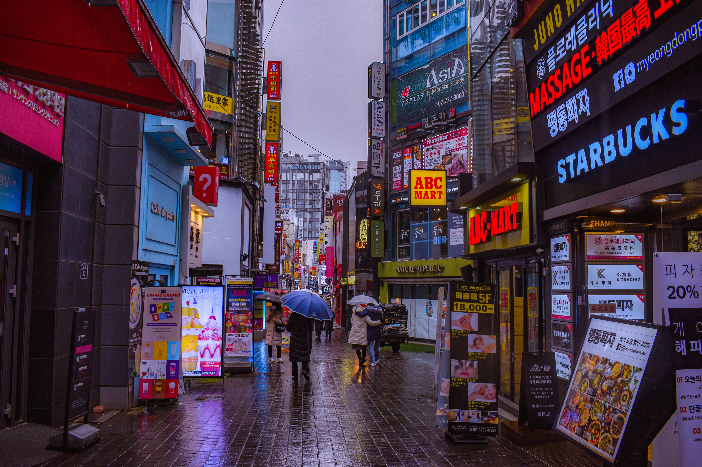

## 首爾自由行明洞飯店

[**首爾明洞（韓文：명동）商圈**](https://www.agoda.com/zh-tw/travel-guides/south-korea/seoul/myeongdong-shopping-seoul)是在首爾購物和娛樂的絕佳選擇，跟台北的西門町很像但更加多元豐富，是一個韓國主要旅遊景點之一。

在這裡的購物體驗可以說是一站式，不論是時尚服飾還是彩妝，各種選擇應有盡有。美食選擇也是多不勝數，附近有許多不同風味的餐廳和小吃攤位。更不用說附近還有樂天百貨、超市和免稅店等方便的選擇。此外，這裡還有溫泉和汗蒸幕，以及有名的爛打秀表演。

明洞的街道整齊有序，各式各樣的商店聚在一起，無論是有特定目標的購物愛好者，還是想隨意逛逛的遊客，都能輕鬆找到心儀的店鋪。

不過，想要在首爾明洞商圈玩得、逛得盡興，一間**適合的住宿**是少不了的！這篇文章，我整理了十間我最推薦且包含各個價格區間、位在首爾明洞的飯店給前往韓國旅遊的你們，包括：

1. [索拉利亞西鐵酒店](#首爾明洞飯店推薦-1---索拉利亞西鐵酒店)
2. [明洞托馬斯酒店](#首爾明洞飯店推薦-2---明洞托馬斯酒店)
3. [明洞 57 號旅館](#首爾明洞飯店推薦-3---明洞-57-號旅館)
4. [OYO 屋頂旅館](#首爾明洞飯店推薦-4---oyo-屋頂旅館)
5. [318 Stay](#首爾明洞飯店推薦-5---318-stay)
6. [8 小時酒店](#首爾明洞飯店推薦-6---8-小時酒店)
7. [南山酒店](#首爾明洞飯店推薦-7---南山酒店)
8. [首爾威斯汀朝鮮飯店](#首爾明洞飯店推薦-8---首爾威斯汀朝鮮飯店)
9. [好加旅館](#首爾明洞飯店推薦-9---好加旅館)
10. [夢賓館](#首爾明洞飯店推薦-10---夢賓館)

因為[**在韓國 Google Maps 不太能用**](https://exittaiwan.com/posts/%E7%82%BA%E4%BB%80%E9%BA%BC-google-maps-%E5%9C%A8%E9%9F%93%E5%9C%8B%E4%B8%8D%E8%A1%8C%E7%94%A8%E6%9C%89%E4%BB%80%E9%BA%BC%E6%9B%BF%E4%BB%A3%E6%96%B9%E6%A1%88/)，以下的飯店地址資訊我都直接連接到 Naver Map 和 Kakao Map 囉！

<!--
$ = < 1,000
$$ = 1,000~4999
$$$ = 5,000 ~ 9999
$$$$ = > 1,0000
-->

### 首爾明洞飯店推薦 1 - 索拉利亞西鐵酒店

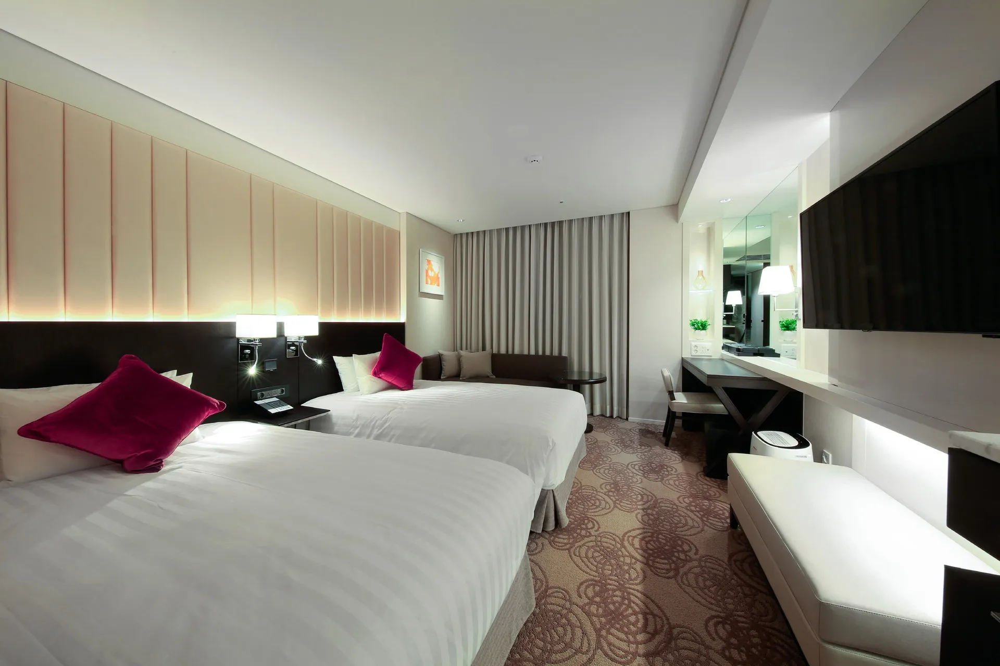

[索拉利亞西鐵酒店](https://www.booking.com/hotel/kr/solaria-nishitetsu-seoul.xt.html?aid=7956794&no_rooms=1&group_adults=2)是一間位於熱鬧的明洞商圈中 3 星級住宿。飯店的房間空間相當寬敞，並擁有高檔免治馬桶以及乾溼分離的浴室。房間均位於高樓層，擁有開闊的視野，可以欣賞首爾城市的美麗景色。飯店人員以親切和良好的服務聞名，住宿體驗無懈可擊。除此之外，索拉利亞西鐵酒店也提供現代化的設施，讓你在旅途中享受便利與奢華。無論你是前來購物、品味美食，還是探索首爾的文化，這個飯店都是理想的住宿選擇。特別適合喜歡在忙於旅遊一天後靜靜享受夜景的你！

可以到 [Booking.com](https://www.booking.com/hotel/kr/solaria-nishitetsu-seoul.xt.html?aid=7956794&no_rooms=1&group_adults=2) 上面看更多索拉利亞西鐵酒店飯店房間的照片喔！

**索拉利亞西鐵酒店飯店基本資訊**
- 地址：27 Myeongdong 8-gil, Jung-gu, Seoul｜韓文：서울특별시 중구 명동8길 27（명동2가）（[Naver Map](https://naver.me/57wVlxLD)｜[Kakao Map](https://kko.to/Hws1lFgdB3)）
- 地鐵：地鐵明洞站三 8 號出口步行約 2 分鐘
- 商圈：位在明洞商圈內
- 最近機場：距離金浦國際機場約 15 公里
- 平均每晚雙人房價格：約台幣 6,000 元（$$$）
- 是否含早餐：有
- 查看即時房價：[**點我前往**](https://www.booking.com/hotel/kr/solaria-nishitetsu-seoul.xt.html?aid=7956794&no_rooms=1&group_adults=2)

### 首爾明洞飯店推薦 2 - 明洞托馬斯酒店

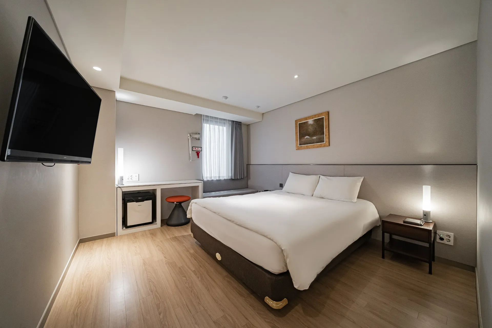

[明洞托馬斯酒店](https://www.booking.com/hotel/kr/thomas-myeongdong.xt.html?aid=7956794&no_rooms=1&group_adults=2)以其出色的服務和優越的地理位置而聞名。櫃台人員總是以非常親切和有禮貌的態度迎接，每天都會詢問是否需要清房。飯店的地理位置更是無可挑剔，鄰近市廳站能夠輕鬆前往城市各處，無論是購物、美食還是觀光都非常方便。房間寬敞且極為乾淨，冷氣夠涼，在炎熱的天氣中也能保持涼爽。此外，飯店的隔音設備出色，讓遊客可以有寧靜的休息時光。最後，浴室的水壓也很強勁，洗澡很舒服！推薦給想要帶另一伴出遊的各位。

可以到 [Booking.com](https://www.booking.com/hotel/kr/thomas-myeongdong.xt.html?aid=7956794&no_rooms=1&group_adults=2) 上面看更多明洞托馬斯酒店房間的照片喔！

**明洞托馬斯酒店基本資訊**
- 地址：26 Sejong-daero 16-gil, Jung-gu, Seoul｜韓文：서울특별시 중구 세종대로16길 26（북창동）（[Naver Map](https://naver.me/GmFzoetT)｜[Kakao Map](https://kko.to/FXzfctHDRc)）
- 地鐵：地鐵市廳站 7、8 號出口步行約 3 分鐘
- 商圈：距離明洞商圈約 0.5 公里
- 最近機場：距離金浦國際機場約 14 公里
- 平均每晚雙人房價格：約台幣 3,100 元 ($$)
- 是否含早餐：無
- 查看即時房價：[**點我前往**](https://www.booking.com/hotel/kr/thomas-myeongdong.xt.html?aid=7956794&no_rooms=1&group_adults=2)

### 首爾明洞飯店推薦 3 - 明洞 57 號旅館

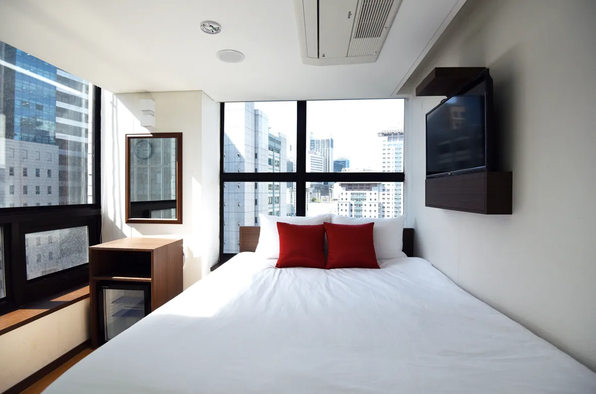

[明洞57號旅館](https://www.booking.com/hotel/kr/philstay-myeongdong-station-seoul1.xt.html?aid=7956794&no_rooms=1&group_adults=2)坐落在明洞的中心地帶，在最熱鬧的區域。櫃檯人員流利地講中文，溝通和服務都一級棒。旅館的房間和廁所都保持著極高的乾淨度和整潔度，而且提供每住兩天就能打掃一次房間的服務。儘管房間相對較小，但其格局設計非常巧妙，並提供充足的插頭，是個相對舒適的環境。此外，明洞 57 號旅館的早餐非常豐盛，每天都提供不同的菜色。無論你是商務出差還是觀光旅遊，都非常適合！

可以到 [Booking.com](https://www.booking.com/hotel/kr/philstay-myeongdong-station-seoul1.xt.html?aid=7956794&no_rooms=1&group_adults=2) 上面看更多明洞 57 號旅館房間的照片喔！

**明洞 57 號旅館基本資訊**
- 地址：57 Myeongdong 2-gil, Jung-gu, Seoul｜韓文：서울특별시 중구 명동2길 57（충무로 1 가）（[Naver Map](https://naver.me/x50mvme9)｜[Kakao Map](https://kko.to/gKgWrNEcWV)）
- 地鐵：地鐵明洞站 5 號出口步行約 1 分鐘
- 商圈：位在明洞商圈內
- 最近機場：距離金浦國際機場約 15 公里
- 平均每晚雙人房價格：約台幣 2,300 元 ($$)
- 是否含早餐：有
- 查看即時房價：[**點我前往**](https://www.booking.com/hotel/kr/philstay-myeongdong-station-seoul1.xt.html?aid=7956794&no_rooms=1&group_adults=2)

### 首爾明洞飯店推薦 4 - OYO 屋頂旅館

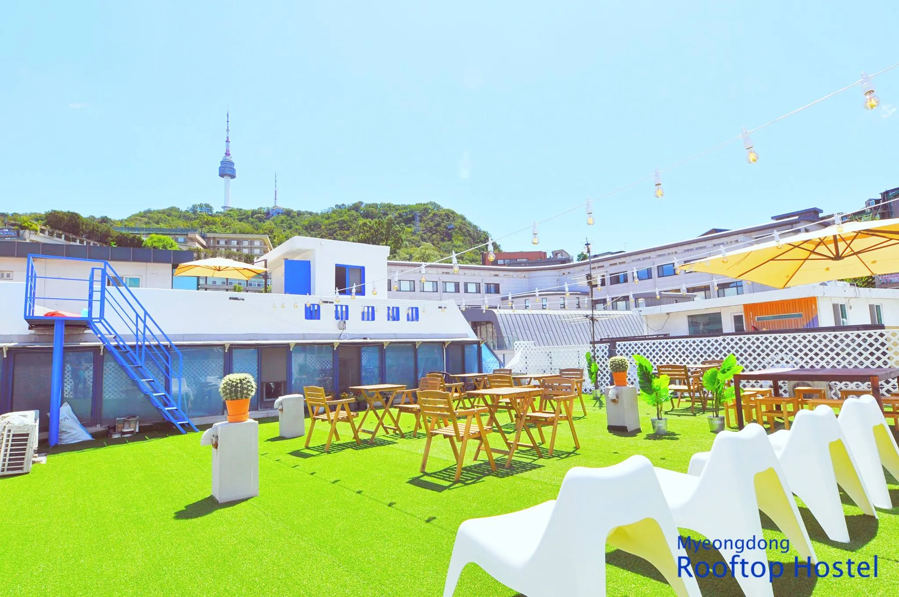

[OYO 屋頂旅館](https://www.booking.com/hotel/kr/skydeck-myeongdong-guesthouse.xt.html?aid=7956794&no_rooms=1&group_adults=2)的員工都非常親切，隨時樂意提供服務。寄放行李的服務可以到晚上 10 點之前。提供這間旅館也有提供熨燙服務，並設有傳真和影印等商務設備。另外，整個公共空間都散發著一股香香的芳香，營造出愉悅的氛圍，一走進去就會感到很舒適。它的特色是屋頂上的公共區域，早上剛起床想透透氣或晚上想要欣賞夜景都很適合。 如果你在找商務旅行可以住的地方，完全可以考慮這裡！

可以到 [Booking.com](https://www.booking.com/hotel/kr/skydeck-myeongdong-guesthouse.xt.html?aid=7956794&no_rooms=1&group_adults=2) 上面看更多 OYO 屋頂旅館房間的照片喔！

**OYO 屋頂旅館基本資訊**
- 地址：47 Toegye-ro 20-gil, Jung-gu, Seoul｜韓文：서울특별시 중구 퇴계로20길 47（남산동 2 가）（[Naver Map](https://naver.me/GDc5fDSh)｜[Kakao Map](https://kko.to/lkkcQF6ghc)）
- 地鐵：地鐵明洞站站 3 號出口步行約 4 分鐘
- 商圈：距離明洞商圈約 0.6 公里
- 最近機場：距離金浦國際機場約 15 公里
- 平均每晚雙人房價格：約台幣 4,000 元 ($$)
- 是否含早餐：有
- 查看即時房價：[**點我前往**](https://www.booking.com/hotel/kr/skydeck-myeongdong-guesthouse.xt.html?aid=7956794&no_rooms=1&group_adults=2)

### 首爾明洞飯店推薦 5 - 318 Stay

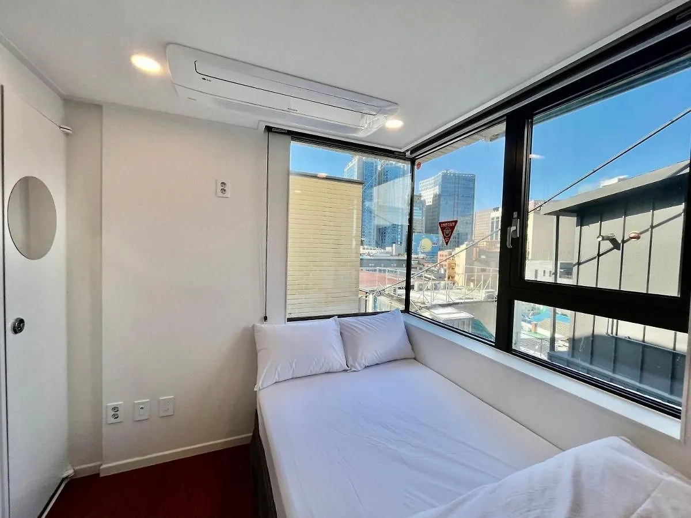

[318 Stay](https://www.booking.com/hotel/kr/318-stay-seoulteugbyeolsi.xt.html?aid=7956794&no_rooms=1&group_adults=2) 是一間民宿，老闆講究的是舒適和便利。房間功能完善，一切都經過精心設計，確保遊客的舒適和便利。房間不僅乾淨明亮，床也非常舒適。民宿內設有電梯，若有訂房會先提前告知詳細的路線、密碼以及房號等資訊，以確保遊客能夠輕鬆找到民宿位置。此外，頂樓的公共空間非常舒適，可以在那裡放鬆身心，還有一個大投影幕，以供觀賞影片。最重要的是，民宿主人非常熱心和友善。推薦給想要來一場說走就走的旅行的你！

可以到 [Booking.com](https://www.booking.com/hotel/kr/318-stay-seoulteugbyeolsi.xt.html?aid=7956794&no_rooms=1&group_adults=2) 上面看更多 318 Stay 外觀房間的照片喔！

**318 Stay 基本資訊**
- 地址：26 Toegye-ro 20ga-gil, Jung-gu, Seoul｜韓文：서울특별시 중구 퇴계로20가길 26（남산동 2 가）（[Naver Map](https://naver.me/5jjgnEsf)｜[Kakao Map](https://kko.to/CLwyMvOIvq)）
- 地鐵：地鐵明洞站 3 號出口步行 3 分鐘
- 商圈：位在明洞商圈內
- 最近機場：距離金浦國際機場約 15 公里
- 平均每晚雙人房價格：約台幣 2,000 元 ($$)
- 是否含早餐：無
- 查看即時房價：[**點我前往**](https://www.booking.com/hotel/kr/318-stay-seoulteugbyeolsi.xt.html?aid=7956794&no_rooms=1&group_adults=2)

### 首爾明洞飯店推薦 6 - 8 小時酒店

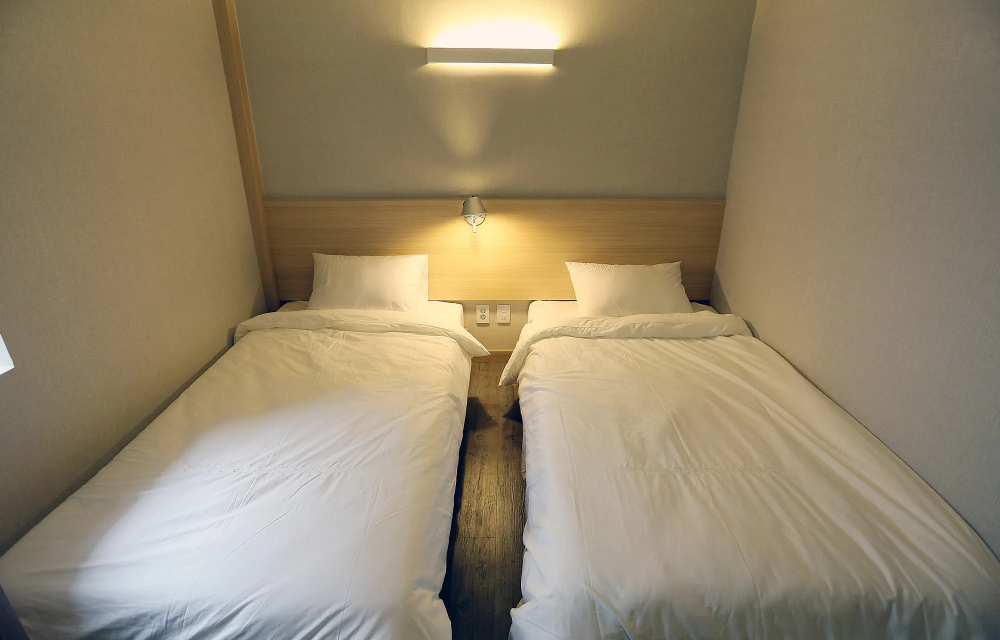

[8 小時酒店](https://www.booking.com/hotel/kr/8-hours.xt.html?aid=7956794&no_rooms=1&group_adults=2)工作人員極度友善，員工對每一位客人都充滿耐心，隨時準備回答客人的疑問，提供所需的幫助。旅館有提供須付費的往返仁川國際機場或金浦國際機場叫車服務。這間旅館的交通非常方便，讓遊客能夠輕鬆前往城市的各個地方，無論是觀光景點、購物區還是商務區域。總而言之，是一間中規中矩、性價比非常高的飯店，不管你是旅遊、出差或是來找朋友，8 小時酒店絕對是一個不錯的選擇！

可以到 [Booking.com](https://www.booking.com/hotel/kr/8-hours.xt.html?aid=7956794&no_rooms=1&group_adults=2) 上面看更多 8 小時酒店房間的照片喔！

**8 小時酒店基本資訊**
- 地址：26-10 Namdaemun-ro 1-gil, Jung-gu, Seoul｜韓文：서울특별시 중구 남대문로1길 26-10（북창동）（[Naver Map](https://naver.me/xyUTlwxC)｜[Kakao Map](https://kko.to/DotnHiUxG_)）
- 地鐵：地鐵市廳站 7 號出口步行約 5 分鐘
- 商圈：距離明洞商圈約 0.5 公里
- 最近機場：距離金浦國際機場約 14 公里
- 平均每晚雙人房價格：約台幣 2,000 元 ($$)
- 是否含早餐：無
- 查看即時房價：[**點我前往**](https://www.booking.com/hotel/kr/8-hours.xt.html?aid=7956794&no_rooms=1&group_adults=2)

### 首爾明洞飯店推薦 7 - 南山酒店

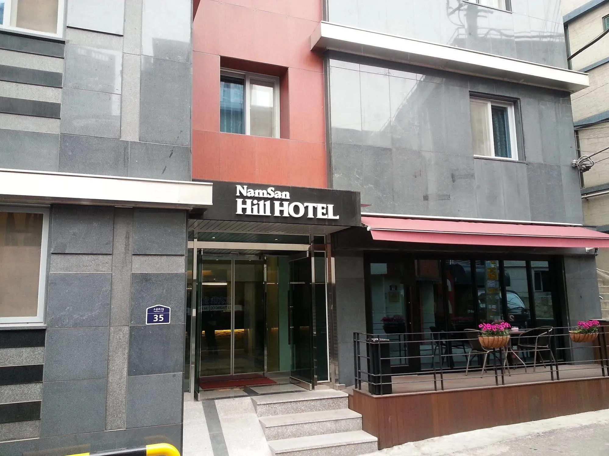

[南山酒店](https://www.booking.com/hotel/kr/namsan-hill.xt.html?aid=7956794&no_rooms=1&group_adults=2)位於地點極佳的位置，雖然它位於山頂，但基本上很多地方都能夠步行抵達，而也就是因為它位於山頂，遊客可以欣賞到漂亮的景色，而且社區本身非常安靜和安全。在這裡，櫃檯人員很親切且和善，還可以跟它面借轉接頭。另外，床單的品質也非常高，淋浴設施也很不錯。無論你是前來休閒度假還是商務出差，這間旅館提供了一個舒適的住宿環境。特別推薦給喜歡大自然景色的你！

可以到 [Booking.com](https://www.booking.com/hotel/kr/namsan-hill.xt.html?aid=7956794&no_rooms=1&group_adults=2) 上面看更多南山酒店房間的照片喔！

**南山酒店基本資訊**
- 地址：35 Sogong-ro 3-gil, Jung-gu, Seoul｜韓文：서울특별시 중구 소공로3길 35（회현동 1 가）（[Naver Map](https://naver.me/F0KgqlXy)｜[Kakao Map](https://kko.to/JXnpM5A3OD)）
- 地鐵：地鐵會賢站 1 號出口步行約 8 分鐘
- 商圈：距離明洞商圈約 1 公里
- 最近機場：距離金浦國際機場約 15 公里
- 平均每晚雙人房價格：約台幣 2,300 元 ($$)
- 是否含早餐：無
- 查看即時房價：[**點我前往**](https://www.booking.com/hotel/kr/namsan-hill.xt.html?aid=7956794&no_rooms=1&group_adults=2)

### 首爾明洞飯店推薦 8 - 首爾威斯汀朝鮮飯店

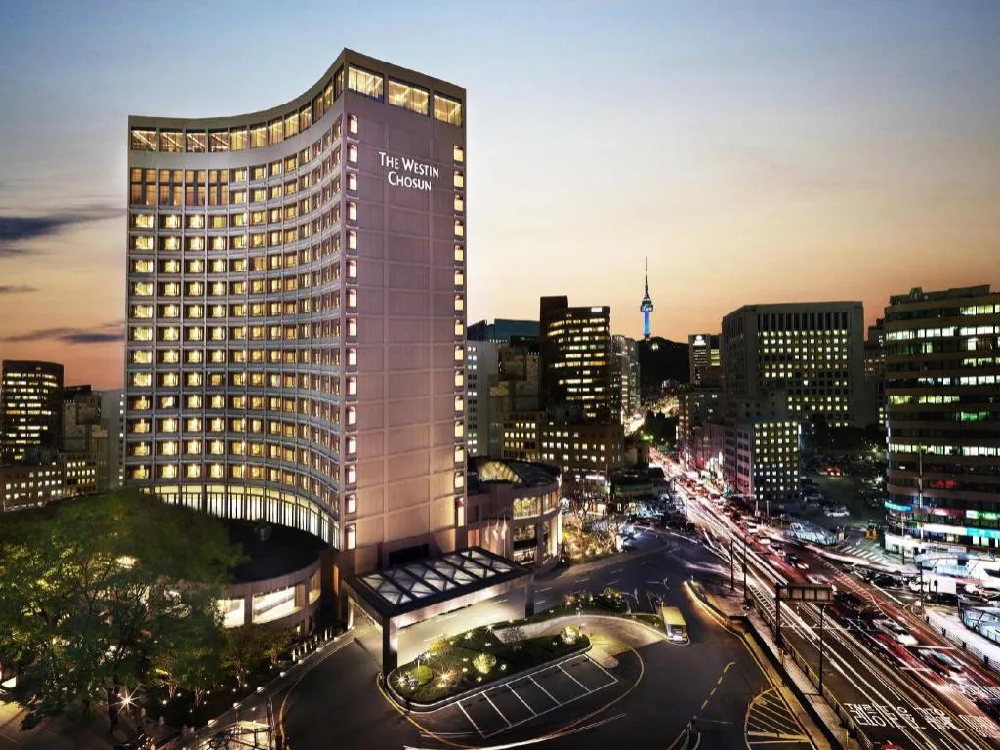

[首爾威斯汀朝鮮飯店](https://www.booking.com/hotel/kr/westin-chosun-seoul.xt.html?aid=7956794&no_rooms=1&group_adults=2)是一間優雅氛圍的五星級旅館，卓越的服務和壯麗的景色就是它的特色。旅館內的氛圍令人陶醉，感受無比的舒適。服務團隊不僅專業，而且樂於助人。威斯汀朝鮮飯店景色的迷人。此外，它提供獨特的樂部酒廊，讓遊客在不只能休息還能休閒。早餐有多樣的選擇並且都非常美味。最後，館內設有實用的商務中心等商業性附加設施。如果你是來出差，不妨試試看這間五星級酒店，讓自己奢華一回！

可以到 [Booking.com](https://www.booking.com/hotel/kr/westin-chosun-seoul.xt.html?aid=7956794&no_rooms=1&group_adults=2) 上面看更多首爾威斯汀朝鮮飯店房間的照片喔！

**首爾威斯汀朝鮮飯店基本資訊**
- 地址：106 Sogong-ro, Jung-gu, Seoul｜韓文：서울특별시 중구 소공로 106（소공동）（[Naver Map](https://naver.me/FOvM0bKc)｜[Kakao Map](https://kko.to/wnk87syrdc)）
- 地鐵：地鐵市廳站 5 號出口步行約 1 分鐘
- 商圈：位在明洞商圈內
- 最近機場：距離金浦國際機場約 15 公里
- 平均每晚雙人房價格：約台幣 11,000 元 ($$$$)
- 是否含早餐：有
- 查看即時房價：[**點我前往**](https://www.booking.com/hotel/kr/westin-chosun-seoul.xt.html?aid=7956794&no_rooms=1&group_adults=2)

### 首爾明洞飯店推薦 9 - 好加旅館

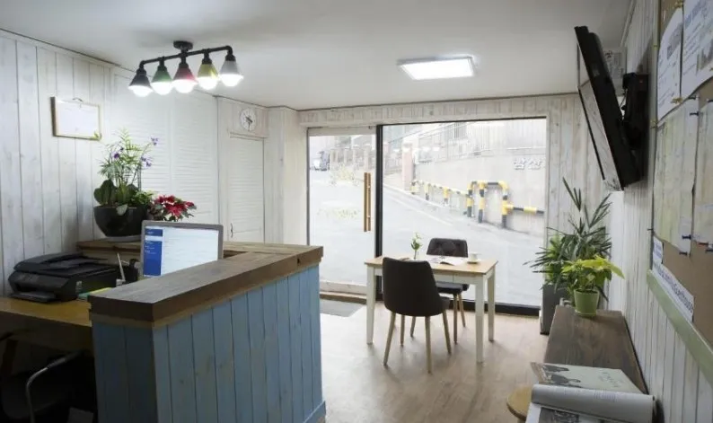

[好加旅館](https://www.booking.com/hotel/kr/jun-guesthouse.xt.html?aid=7956794&no_rooms=1&group_adults=2)擁有一個舒適的共用休息室，為客人提供一個輕鬆的聚會和休息的場所。同時，旅館提供行李寄存服務，方便遊客在入住前或退房後安全保管行李。旅館的地理位置極加，坐落於明洞購物街的正對面。此外，辦理入住手續時間非常彈性，讓大家能夠根據自己的行程自由安排。整個旅館環境乾淨又可愛，營造出一個溫馨的氛圍。不論您是前來購物、觀光還是放鬆，都可以考慮看看這裡！

可以到 [Booking.com](https://www.booking.com/hotel/kr/jun-guesthouse.xt.html?aid=7956794&no_rooms=1&group_adults=2) 上面看更多好加旅館房間的照片喔！

**好加旅館基本資訊**
- 地址：15 Toegye-ro 20na-gil, Jung-gu, Seoul｜韓文：서울특별시 중구 퇴계로20나길 15（남산동 2 가）（[Naver Map](https://naver.me/FM6AxvF5)｜[Kakao Map](https://kko.to/wxTjwFJwJj)）
- 地鐵：地鐵明洞站 3 號出口步行約 4 分鐘
- 商圈：距離明洞商圈約 0.5 公里
- 最近機場：距離金浦國際機場約 15 公里
- 平均每晚雙人房價格：約台幣 1,600 元 ($$)
- 是否含早餐：有
- 查看即時房價：[**點我前往**](https://www.booking.com/hotel/kr/jun-guesthouse.xt.html?aid=7956794&no_rooms=1&group_adults=2)

### 首爾明洞飯店推薦 10 - 夢賓館

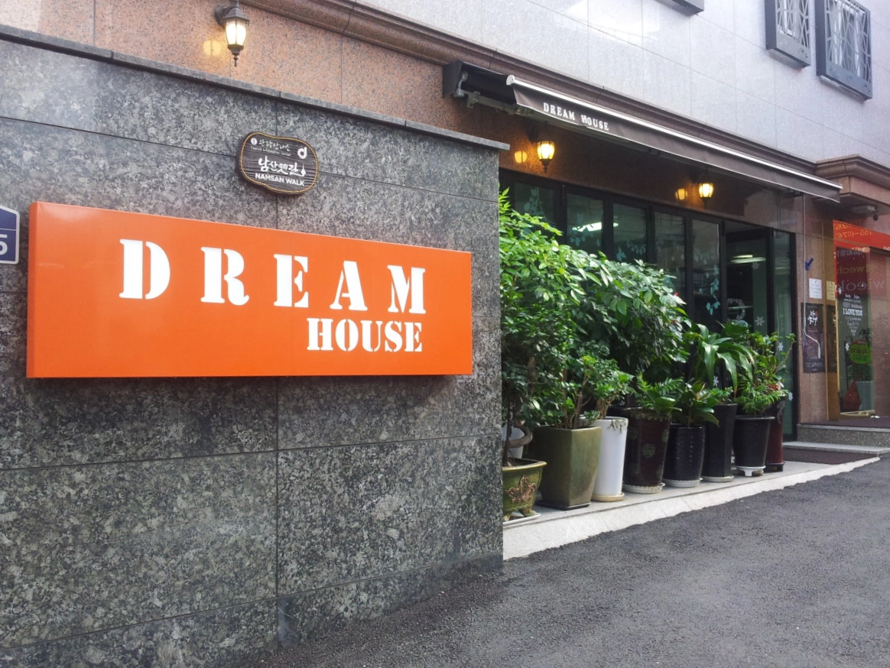

[夢賓館](https://www.booking.com/hotel/kr/dream-guesthouse.xt.html?aid=7956794&no_rooms=1&group_adults=2)的大堂設有一間舒適的咖啡廳，讓客人能夠隨時享受一杯咖啡或茶，並在一個輕鬆的環境中放鬆身心。工作人員非常友善，態度很好。這夢賓館整體來說很乾淨，並且設施維護的很好，此外，它的地理位置極優，前往城市的各個景點、購物區域和餐廳都不適問題，是一間性價比高，對錢包非常友善的旅館。推薦給旅遊初學者以及口袋不深的大學生們！

可以到 [Booking.com](https://www.booking.com/hotel/kr/dream-guesthouse.xt.html?aid=7956794&no_rooms=1&group_adults=2) 上面看更多夢賓館房間的照片喔！

**夢賓館基本資訊**
- 地址：22-5 Toegye-ro 6-gil, Jung-gu, Seoul｜韓文：서울특별시 중구 퇴계로6길 22-5（남창동）（[Naver Map](https://naver.me/GyeMFuFn)｜[Kakao Map](https://kko.to/BlcafDwq9T)）
- 地鐵：地鐵會賢站 3 號出口步行約 1 分鐘
- 商圈：距離明洞商圈約 1 公里
- 最近機場：距離金浦國際機場約 14 公里
- 平均每晚雙人房價格：約台幣 1,300 元 ($$)
- 是否含早餐：無
- 查看即時房價：[**點我前往**](https://www.booking.com/hotel/kr/dream-guesthouse.xt.html?aid=7956794&no_rooms=1&group_adults=2)

## 十間首爾東大門飯店推薦比較表格

| 飯店 | 價格 | 距離明洞商圈 | 即時房價 |
| -------- | -------- | -------- | -------- | 
| 索拉利亞西鐵酒店  | $$$     | 位在明洞商圈內     | [**前往查價→**](https://www.booking.com/hotel/kr/solaria-nishitetsu-seoul.xt.html?aid=7956794&no_rooms=1&group_adults=2)     |
| 明洞托馬斯酒店  | $$     | 0.5 公里     | [**前往查價→**](https://www.booking.com/hotel/kr/thomas-myeongdong.xt.html?aid=7956794&no_rooms=1&group_adults=2)     |
| 明洞 57 號旅館 | $$     | 位在明洞商圈內     | [**前往查價→**](https://www.booking.com/hotel/kr/skydeck-myeongdong-guesthouse.xt.html?aid=7956794&no_rooms=1&group_adults=2)     |
| OYO 屋頂旅館   | $$     | 0.6 公里     | [**前往查價→**](https://www.booking.com/hotel/kr/skydeck-myeongdong-guesthouse.xt.html?aid=7956794&no_rooms=1&group_adults=2) |
| 318 Stay  | $$     | 位在明洞商圈內   |[**前往查價→**](https://www.booking.com/hotel/kr/318-stay-seoulteugbyeolsi.xt.html?aid=7956794&no_rooms=1&group_adults=2)    |
| 8 小時酒店   | $$     | 0.5 公里    | [**前往查價→**](https://www.booking.com/hotel/kr/8-hours.xt.html?aid=7956794&no_rooms=1&group_adults=2) |
| 南山酒店   | $$$     | 1 公里     | [**前往查價→**](https://www.booking.com/hotel/kr/namsan-hill.xt.html?aid=7956794&no_rooms=1&group_adults=2) |
| 首爾威斯汀朝鮮飯店  | $$$$    | 位在明洞商圈內    | [**前往查價→**](https://www.booking.com/hotel/kr/westin-chosun-seoul.xt.html?aid=7956794&no_rooms=1&group_adults=2) |
| 好加旅館   | $$     | 0.5 公里     | [**前往查價→**](https://www.booking.com/hotel/kr/jun-guesthouse.xt.html?aid=7956794&no_rooms=1&group_adults=2) |
| 夢賓館  | $$   | 1 公里   | [**前往查價→**](https://www.booking.com/hotel/kr/dream-guesthouse.xt.html?aid=7956794&no_rooms=1&group_adults=2) |

價格方面都是以住宿日期前約一個月下訂計算，如果你更早決定好要去首爾的明洞商圈附近下榻，提前兩到三個月基本上都可以再省下 30% 花費（旺季除外）。

以上就是十間位在明洞商圈的飯店住宿推薦，希望能夠幫助到想要到韓國首爾旅遊的各位！