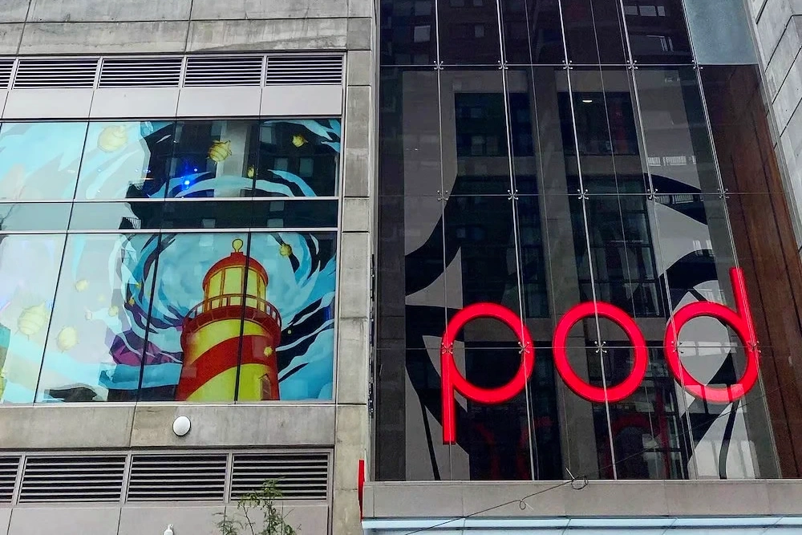
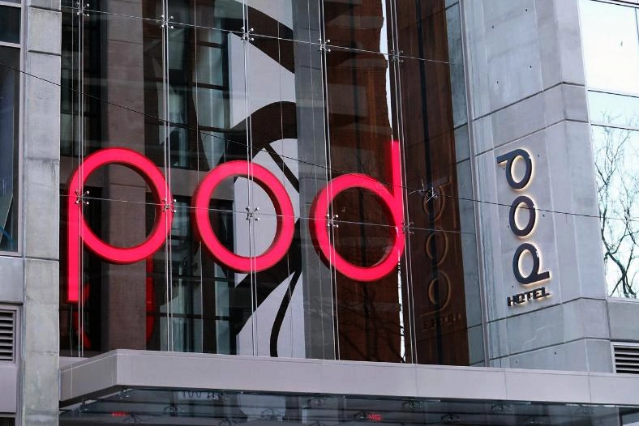
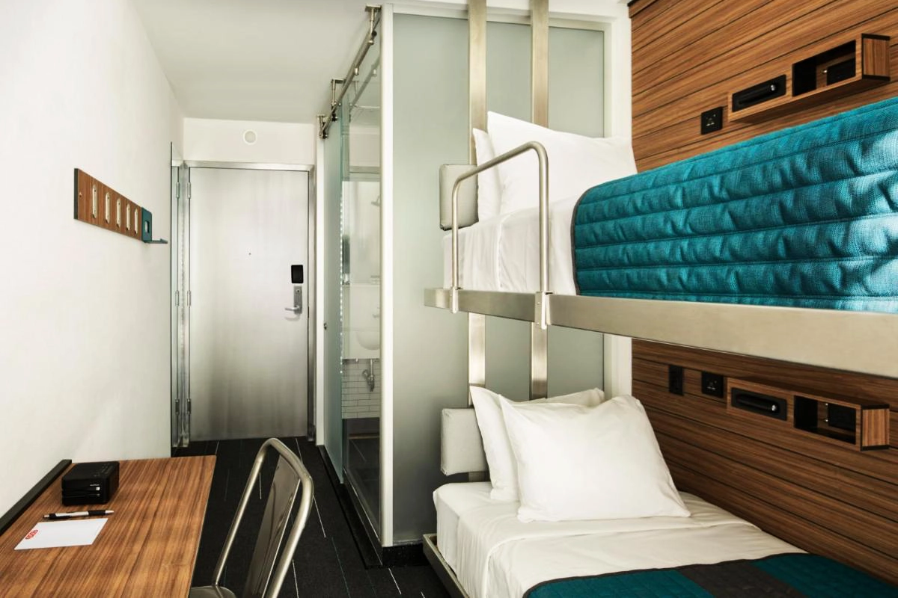
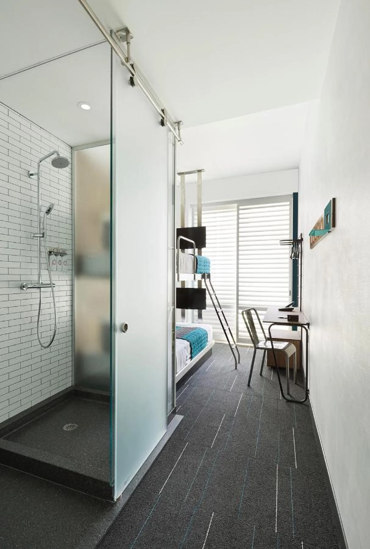
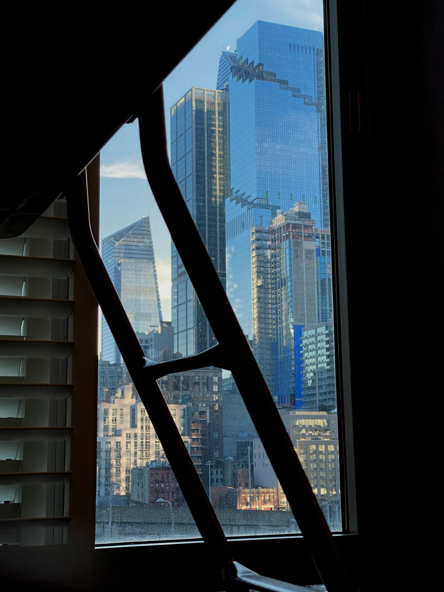

[**龐德時代酒店 Pod Times Square**](https://www.booking.com/hotel/us/pod-times-square.xt.html?aid=7956794) 是一間位在紐約市中心曼哈頓區的酒店。當你安排[**紐約自由行**](https://exittaiwan.com/posts/%E7%B4%90%E7%B4%84%E8%87%AA%E7%94%B1%E8%A1%8C%E6%97%85%E9%81%8A/)，你會發現越靠近曼哈頓中心的時代廣場，住宿價格越貴，但交通也的確最方便。

Pod Times Square 的位置就在紐約巴士總站 PABT（英文：Port Authority Bus Terminal）步行五分鐘可到之處，附近就是百老匯街區，而且走路十分鐘就可以到達時代廣場。

以曼哈頓來說，Pod Times Square 已經算是「非青年旅館」最便宜又有品質的飯店選擇了。到紐約自由行旅遊但是預算稍微有限的人，可以考慮入住這間 酒店！

其實 Pod 是一場間在紐約的連鎖旅館，所以不只有離時代廣場步行十分鐘的 Pod Times Square，曼哈頓還有其他兩間，分別是在[東 51 街](https://exittaiwan.com/posts/%E7%B4%90%E7%B4%84%E5%B8%82%E5%8D%80%E4%BA%A4%E9%80%9A%E5%85%A8%E6%94%BB%E7%95%A5/)的 [**Pod 51**](https://www.booking.com/hotel/us/pod.xt.html?aid=7956794)，還有在[東 39 街](https://exittaiwan.com/posts/%E7%B4%90%E7%B4%84%E5%B8%82%E5%8D%80%E4%BA%A4%E9%80%9A%E5%85%A8%E6%94%BB%E7%95%A5/)的 [**Pod 39**](https://www.booking.com/hotel/us/the-pod-39th-street.xt.html?aid=7956794)。可以每間價錢比較看看，品質都是差不多的水準。

> 推薦閱讀：[紐約自由行旅遊全攻略｜紐約旅遊景點、交通、住宿懶人包](https://exittaiwan.com/posts/%E7%B4%90%E7%B4%84%E8%87%AA%E7%94%B1%E8%A1%8C%E6%97%85%E9%81%8A/)

## 龐德時代酒店 Pods Times Square 基本資訊

- 地址：400 W 42nd St, New York, NY 10036 ([Google Maps](https://maps.app.goo.gl/TkQ3nG7kigtLSyPFA))
- 是否含早餐：無
- 平均每晚價格：台幣 6,000 ~ 14,000（雙人房）
- 查看即時房價：[**現在查看**](https://www.booking.com/hotel/us/pod-times-square.xt.html?aid=7956794)

> 推薦閱讀：[紐約自由行市區交通全攻略｜五種紐約交通方式一次看懂](https://exittaiwan.com/posts/%E7%B4%90%E7%B4%84%E5%B8%82%E5%8D%80%E4%BA%A4%E9%80%9A%E5%85%A8%E6%94%BB%E7%95%A5/)

## 龐德時代酒店 Pod Times Square 實際入住體驗

### 接待大廳

進入 Pod Times Square 的大樓後要搭乘電梯才會到樓上的接待大廳，入住 check-in 的時候旅客比較多有等了一下，但整個流程是順暢的。

要提醒的是 Pod Times Square 跟美國不少飯店一樣，在旅客 check-in 入住時會先要求旅客用信用卡刷一筆保證金，沒有意外發生的話這筆訂金會在退房後兩星期內就會透過信用卡公司刷退。

建議台灣旅客在櫃檯人員刷訂金的時候可以和他們確認保證金的金額、退款時間、並且記得自己是用哪一張卡刷的，如果之後款項沒退下來才可以和信用卡公司聯繫後續處理。

### 房間

雙層膠囊間是採用上下鋪的床位配置，房間小小的，如果是拉著托運行李箱來的旅客可能沒有辦法將行李箱完全打開。

空間雖然不大，但是該有的備品都有。在寸土寸金的曼哈頓，Pod Times Square 的房間完全體現了「麻雀雖小，五臟俱全」的道理。

### 廁浴

廁浴簡潔乾淨，不過空間偏小，有些房間的洗手台偶爾會有排水問題，但清潔人員知道後會幫助解決。另外因爲沒有淋浴拉門或浴缸，有時候水會濺到外面，住客要再自行注意一下。

## 龐德時代酒店 Pod Times Square 整體評價

這次兩人入住 Pod Times Square 的上下舖雙人房，旅程結束後根據自身的經驗分享一些優缺點。

### 龐德時代酒店 Pod Times Square 優點

Pod Times Square 的地點已經沒什麼好挑惕的了，幾乎所有地鐵線都有到 Time Sq-42 St（時代廣場 42 街站）。

房間和廁浴乾淨整潔是另一個優點，還有房價雖然第一眼看上去真的會覺得蠻貴的，但要是你在訂房網站看了一輪紐約住宿之後，你就會發現 Pod Times Square 的好⋯⋯。

### 龐德時代酒店 Pod Times Square 缺點

幾個明顯的缺點是大樓的電梯有時候會壞掉，所以排電梯會需要一點時間。廁浴因為沒有拉門，不是獨立式的衛浴，所以偶爾有潮濕和排水的問題。最後，接待人員態度可能無法符合台灣旅客的標準，不過這個蠻看個人的。

### 龐德時代酒店 Pod Times Square 評價

來到紐約自由行入住 [**Pod Times Square**](https://www.booking.com/hotel/us/pod-times-square.xt.html?aid=7956794)，整體的感覺是很不錯的！

雖然硬要說的話，Pod Times Square 是有不少可以改進的地方，但是因為它幾乎完美的地點再加上在紐約曼哈頓相對便宜的價格，滿分十分的話，Pod Times Square 還是可以得到 8 分，推薦給前往紐約自由行的台灣旅客！