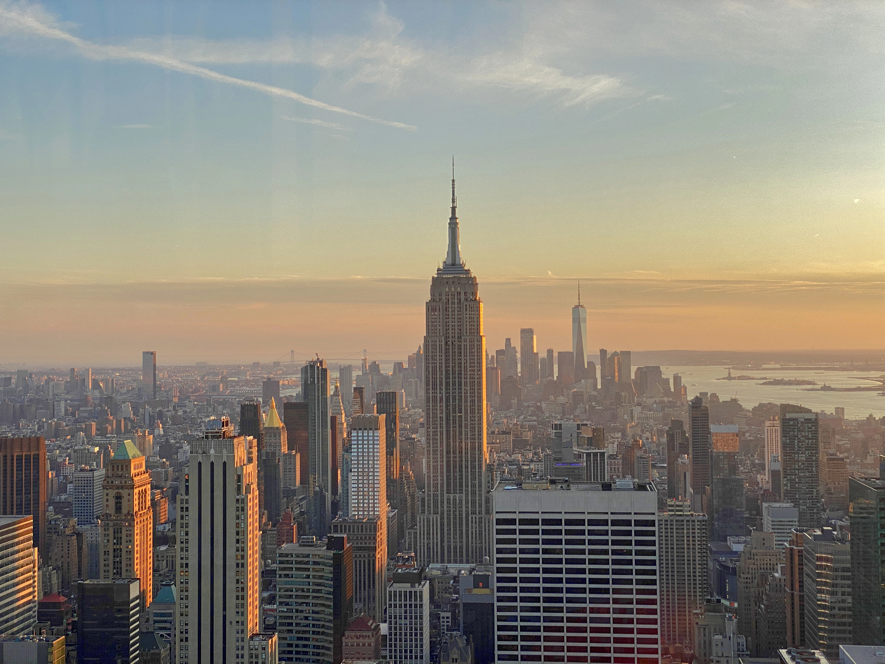
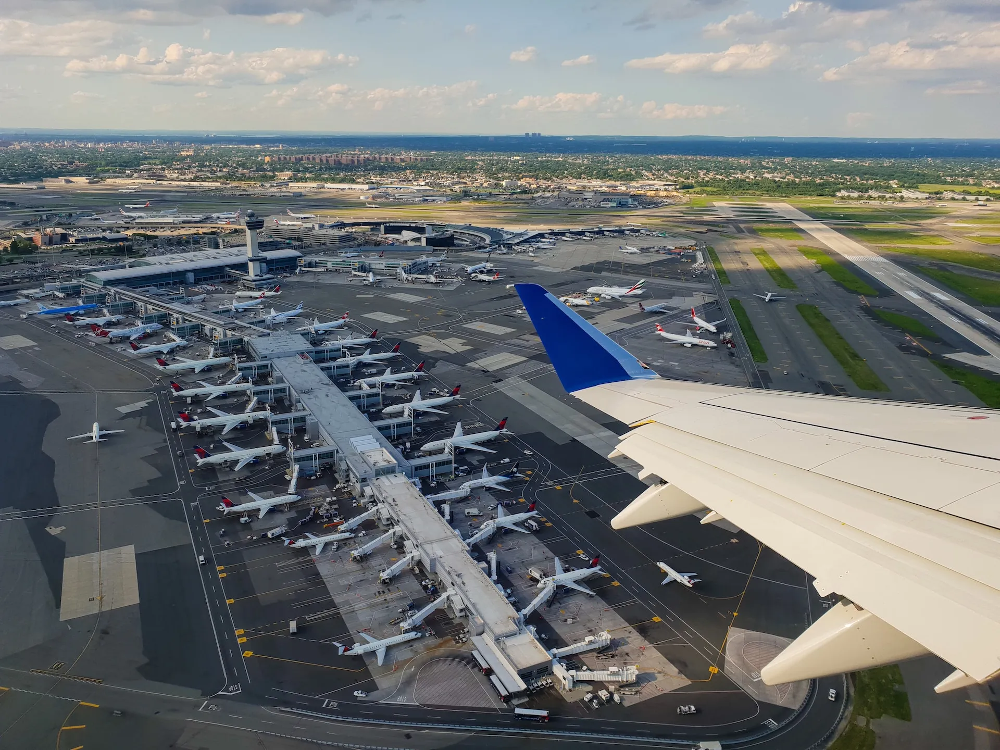
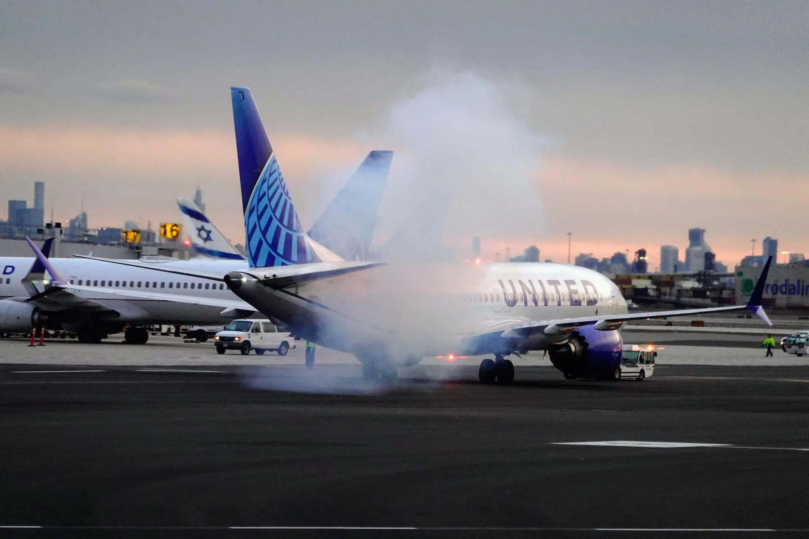
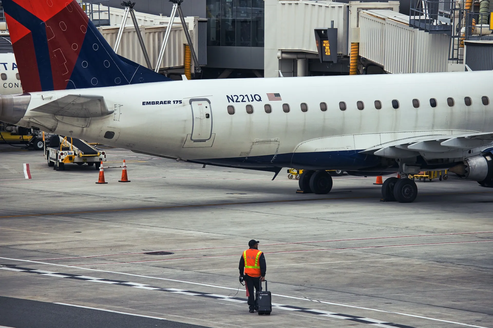

即將前往[**紐約自由行旅遊**](https://exittaiwan.com/posts/紐約自由行旅遊/)嗎？當你搭飛機來到紐約，有很大的機率你會降落在紐約的三個機場之一：**甘迺迪國際機場、紐瓦克國際機場、拉瓜迪亞機場**，其中又以甘迺迪國際機場（JFK）和紐瓦克國際機場（EWR）最為常見，相對地理位置可以參考下面地圖。

> ✔️ 免費下載[**紐約地圖＋地鐵路線圖高清 PDF 版**](https://exittaiwan.gumroad.com/l/nyc?layout=profile)

這篇文章詳細介紹從甘迺迪機場到紐約曼哈頓市區的各種交通方式、通車時間、價格比較、優缺點等等，並也簡單提供紐瓦克國際機場和拉瓜迪亞機場的資訊，讓有需要的人可以到相關網站做深入查詢了解。

> 推薦閱讀：[**紐約自由行市區交通全攻略｜五種紐約交通方式一次看懂**](https://exittaiwan.com/posts/%E7%B4%90%E7%B4%84%E5%B8%82%E5%8D%80%E4%BA%A4%E9%80%9A%E5%85%A8%E6%94%BB%E7%95%A5/)

## 甘迺迪國際機場（John F. Kennedy International Airport, JFK）

絕大部分的台灣旅客來到紐約會降落在甘迺迪機場，從這裡來回曼哈頓市中心有五種方式：

1. 機場捷運 AirTrain + 地鐵
2. 計程車
3. Uber 或 Lyft
4. 飯店機場接送服務
5. [**私人機場接送服務**](https://affiliate.klook.com/redirect?aid=41451&aff_adid=745177&k_site=https%3A%2F%2Fwww.klook.com%2Fzh-TW%2Factivity%2F86268-private-john-f-kennedy-international-airport-jfk-transfer-new-york%2)

### 機場捷運 AirTrain ＋ 地鐵

如果你是第一次來到紐約旅遊，我**非常不推薦**你帶著大包小包搭乘機場捷運 AirTrain 加上地鐵這個路線。

雖然這個方式前往曼哈頓的價格最低，時間也不一定比其他方式慢，但是機場捷運 AirTrain 只能用地鐵卡（Metro Card）付費，所以要先去購買地鐵卡才能搭乘，再加上在地鐵站上上下下的搬運行李、還有地鐵站的安全考量等等，你應該不會希望剛下飛機需要經歷這些旅程才能抵達你的住處。

要是你很倔強（或是你是背包客、又或是長期生活在當地的人），真的要搭機場捷運加上地鐵往返甘迺迪機場和曼哈頓的話，可以參考下面的兩個路線：

- **你的目的地在 Midtown 曼哈頓**：
搭乘 AirTrain 到牙買加站，轉乘地鐵 E 線（Jamaica Station ＋ Transit E Metro）
- **你的目的地在 Downtown 曼哈頓**：
搭乘 AirTrain 到霍華德海灘站，轉乘地鐵 A 線（Howard Beach Station ＋ Transit A Metro）

我們不推薦這個方法給初訪紐約的旅客原因有很多。關於它唯的一優點就只有價格便宜，一趟 [AirTrain 單程票 $8.25 美元](https://www.jfkairport.com/to-from-airport/air-train)，加上[地鐵單趟 $2.9 美元](https://new.mta.info/fares)，總共是 $11.15 美元。

- **價格**：$11.15 美元
- **時間**：約一小時
- **優點**：價格低
- **缺點**：只能使用地鐵卡付費、需搬運行李、非點到點移動、較不安全、有可能誤點

> **機場巴士**：AirTrain 從機場到 Jamica 地鐵站的這段路也可以用機場巴士替代，不過光是這一段搭[機場巴士 Q3 路線](https://new.mta.info/document/6271)就要一個小時，應該不會有人想這樣搭，這邊就不詳細說明了。

### 計程車

從機場到曼哈頓，計程車的車資是固定的費率，一趟單程基本費 $70 美元（在平日下午四點到晚上八點尖峰時段加 $5 美元），如果司機走了需要付道路通行費的路段也會加在費用裡面（大約 $5 美元，到曼哈頓通常不會經過這些路段），最後再加上 15% 的小費約 $11.25 美元。

所以算下來總共是：$70 ＋（尖峰時段 $5）＋（通行費）+ 小費（15% = $11.25 美元），共約 $75 ~ $90 美元。

- **價格**：$75 ~ $90 美元
- **時間**：非尖峰時段約 40 分鐘，尖峰時段可能超過一小時
- **優點**：免搬行李、價格落差小、點到點移動、多人可平分費用、全天營運
- **缺點**：價格較高、有可能塞車

> 機場官方聲明：請小心避免機場航廈內非法拉客的司機，旅客應該**直接前往航廈外的計程車招呼站搭乘**。

### Uber 或 Lyft

根據時段、當下有叫車需求的用戶數量、以及實際前往的確切地點，[**Uber**](https://referrals.uber.com/refer?id=uf3rqv9dyawj
) 和 [**Lyft**](https://www.lyft.com/i/CHEN61210?utm_medium=p2pi_iacc
) 系統顯示的車資大約會落在 $70 ~ $120 美元。

- **價格**：$70 ~ $120 美元
- **時間**：非尖峰時段約 40 分鐘，尖峰時段可能超過一小時
- **優點**：免搬行李、點到點移動、價格計算方式單一、價格有可能比計程車低、多人可平分費用、全天營運。
- **缺點**：價格浮動大、有可能塞車

### 飯店機場接送服務

對於願意花大錢、喜歡奢華旅行、舒服旅行的人來說，直接到訂有機場接送服務的飯店或是最佳選擇，你可以透過飯店的官方網站找尋有沒有提供這項服務，也可以在各大訂房網站像是 [**Booking.com**](https://www.booking.com/index.html?aid=7956794) 上直接用篩選的方式尋找提供機場接送服務的飯店。

一般來說，總訂單要超過約三到五萬元台幣才比較有機會訂到曼哈頓有提供免費機場接送服務的飯店喔！

- **價格**：免費
- **時間**：非尖峰時段約 40 分鐘，尖峰時段可能超過一小時
- **優點**：接機服務、免搬行李、點到點移動
- **缺點**：適合預算較高的人、有可能塞車

<!--[[10 間紐約頂級飯店推薦](/d1-EoqX-RDG3Oo8Kr9tp_A)]-->

### 私人機場接送服務

對於稍有預算，但也不想碰運氣看 [**Uber**](https://referrals.uber.com/refer?id=uf3rqv9dyawj
) 和 [**Lyft**](https://www.lyft.com/i/CHEN61210?utm_medium=p2pi_iacc
)  車資價格和數量的多寡的人來說，私人的出租車是不錯的選擇。

私人出租車大概分兩種：**公司（含各平台）經營**的和**個人經營**的，公司（含各平台）提供的機場接送服務價格約在 $3,000 ~ 4,000 台幣（約 $100 出頭美元），個人經營的價格則是比較少公開在網路上，但市場價格應該都是 $100 美元上下。

以平台來說，在 [**Klook**](https://affiliate.klook.com/redirect?aid=41451&aff_adid=745177&k_site=https%3A%2F%2Fwww.klook.com%2Fzh-TW%2Factivity%2F86268-private-john-f-kennedy-international-airport-jfk-transfer-new-york%2F) 上也可以找到這個價格區間的選擇，大家可以多多到處比較參考。

- **價格**：$3,000 ~ 4,000 元台幣（約 $100 出頭美元）
- **時間**：非尖峰時段約 40 分鐘，尖峰時段可能超過一小時
- **優點**：免搬行李、點到點移動、價格計算方式單一、多人可平分費用。
- **缺點**：價格稍貴、有可能塞車

### 甘迺迪機場往返紐約市區交通方式比較表

| 同行人數 | 推薦交通方式    | 單程價格（合計，美元）|
|-----------|-------------|------------|
| 單人小（少）件行李 | 機場捷運 ＋ 地鐵 / 機場巴士  | $11.15                          |
| 單人大（多）件行李 | 計程車 / Uber 或 Lyft / 機場接送服務 | $75 ~ $90 / $70 ~ $120 / ~$100+ |
| 兩人以上同行 | 計程車 / Uber 或 Lyft / 機場接送服務 | $75 ~ $90 / $70 ~ $120 / ~$100+ |
| 有錢人 | 飯店機場接送服務  | 免費  |

> 更多詳細資料及最新消息，請參考甘迺迪機場[官方網站](https://www.jfkairport.com/to-from-airport/public-transportation)。

## 紐瓦克國際機場（Newark Liberty International Airport, EWR）

紐瓦克機場的班機主要服務美國國內和歐洲國際線，這個機場位在離曼哈頓較遠的紐澤西州，因此沒有地鐵進紐約市區。

從這裡到曼哈頓的交通方式有巴士、計程車、 [**機場接送**](https://affiliate.klook.com/redirect?aid=41451&aff_adid=745264&k_site=https%3A%2F%2Fwww.klook.com%2Fzh-TW%2Factivity%2F86462-private-newark-liberty-international-airport-ewr-transfer-new-york%2F)、[**Uber**](https://referrals.uber.com/refer?id=uf3rqv9dyawj
) 或 [**Lyft**](https://www.lyft.com/i/CHEN61210?utm_medium=p2pi_iacc
)  、還有機場捷運 AirTrain。

**我們非常不推薦搭乘機場巴士**，不但班次少，環境差、搭車地點標示不明、票價還很貴。

計程車、Uber 或 Lyft 直接在機場接送區叫車，除了價格偏高以外應該不會有太大的問題。如果下一次降落在這個機場，可能會嘗試搭搭看機場捷運 AirTrain。

> 更多關於紐瓦克機場的交通資訊，可以參考紐瓦克國際機場[官方網站](https://www.newarkairport.com/to-from-airport/public-transportation)。

## 拉瓜迪亞機場（LaGuardia Airport, LGA）

從機場的[官方網站](https://laguardiaairport.com/)來看，拉瓜迪亞機場的航線目前都是美國國內線，如果有經過美國國內線轉機的旅客比較有可能降落在這個機場。

拉瓜迪亞機場有三個航廈，每個航廈都有公車、地鐵、計程車、[**機場接送**](https://affiliate.klook.com/redirect?aid=41451&aff_adid=745263&k_site=https%3A%2F%2Fwww.klook.com%2Fzh-TW%2Factivity%2F86446-private-laguardia-airport-lga-transfer-new-york%2F)、以及 [**Uber**](https://referrals.uber.com/refer?id=uf3rqv9dyawj
) 或 [**Lyft**](https://www.lyft.com/i/CHEN61210?utm_medium=p2pi_iacc
)  可以搭乘前往曼哈頓。根據你選擇的交通方式，票價從免費到 $50 美元左右都有可能。

如果你降落在這個機場，我們預設你的英文程度應該不錯，所以比較有機率在美國飛國內線，詳細的交通資訊可以直接到機場的[這個頁面](https://laguardiaairport.com/to-from-airport/public-transportation)做參考。