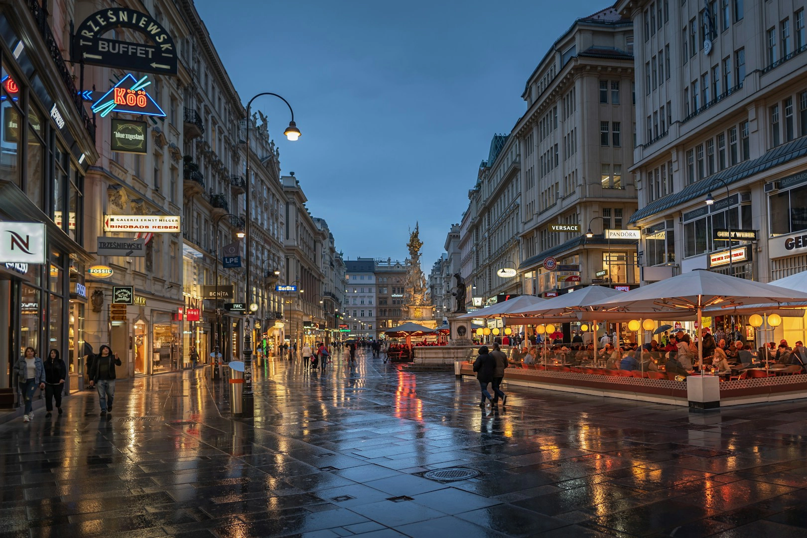
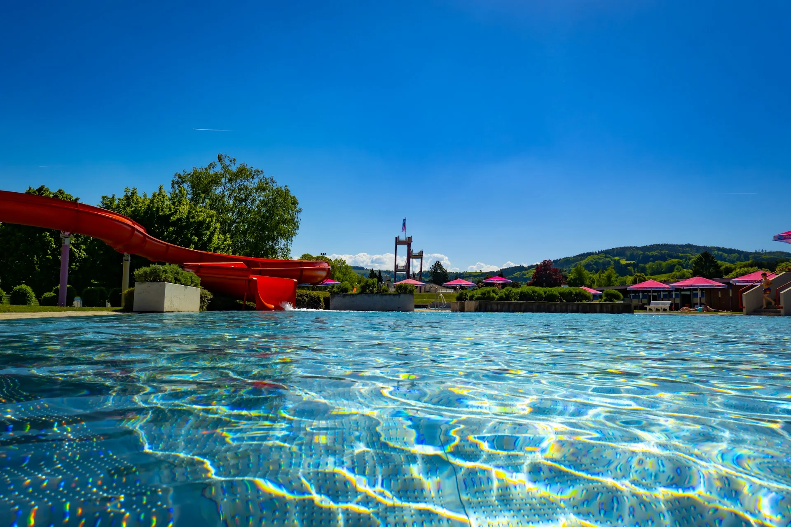

今年生日，剛好在維也納過嗎？這篇文章整理了所有在奧地利境內的各項[生日優惠](/tags/生日優惠/)，讓你就算人不在台灣，也能享受到生日壽星的福利，在歐洲快樂慶生！

免責聲明：這些優惠是根據各方資料收集而成，實際情況請在現場確認。如果商家表示沒有該優惠、或該優惠已經不再適用，請不要為難商家唷。

在奧地利，壽星的優惠和台灣最大的差別是，在台灣許多店家都提供一整個月的壽星優惠，但是在奧地利，只有壽星**生日當天**可以享有該優惠喔！同行的友人除非也當天生日，不然通常友人是不會有任何優惠的。如果是兩個人一起慶生，就把這些優惠當作買一送一、打了五折吧。也別忘了你的英文證件啦！

## 全奧地利適用優惠

- 奧地利國鐵 ÖBB：（需持 Vorteilscard 優惠卡）可免費搭乘全奧地利路線鐵路：[活動頁面](https://www.oebb.at/en/tickets-kundenkarten/kundenkarten/vorteilscard/vorteilscard-geburtstagsaktion)
- 星巴克：持會員卡（Reward Card）可免費獲得一杯飲料：[活動頁面](https://www.starbucks.at/en/starbucks-card)
- XXXLutz：持「Preispass」會員卡可免費用餐：[活動頁面](https://www.xxxlutz.at/c/preisepass-vorteile)
- Oldtimer 休息站：免費兒童（14 歲以前）套餐、蛋糕及小禮物：[活動頁面](https://www.oldtimer.at/)
- Don Camillo 披薩：持「Amico Card」可獲得 10 歐元折價券：[活動頁面](https://www.doncamillo.at/amico_card.html)
- Heinemann：10 歐元折價券：[活動頁面](https://www.heinemann-shop.com/de/global/heinemann-and-me-vorteile)
- Mediamarkt：10 歐元折價券：[活動頁面](https://www.mediamarkt.at/de/myaccount/loyalty-benefits)
- Humanic：10 歐元折價券：[活動頁面](https://www.humanic.net/at/club)
- Swarovski：八折優惠券：[活動頁面](https://www.swarovski.com/en-AT/s-sclanding/)
- 奧地利賭場 Casino Austria：持會員卡享有生日優惠：[活動頁面](https://www.casinos.at/en/membersclub/member-card)
- Thalia 書店：持會員卡享有生日優惠：[活動頁面](https://www.thalia.at/bonuscard/bonuscard)

## 維也納生日優惠

- 多瑙塔：免費入場、免費玩溜滑梯，壽星生日前後兩天有效：[活動頁面](https://www.donauturm.at/en/event-news-and-culinary/events/top-of-birthday-party/)
- No Way Out 密室逃脫：（需四人以上同行）免費入場，同行者享九折優惠：[活動頁面](https://www.nowayout-escape.at/birthday-parties/)
- Watertuin World Kitchen：壽星免費吃到飽（需至少一成人同行）：[活動頁面](https://www.watertuin.at/aktionen)
- Köö 撞球：Köö 卡可獲 4 歐元折扣券：[活動頁面](https://www.billardcafe.at/de/koo-card.html)
- Wien Ticket：生日前一個月的月底寄出 10 歐元折價券：[活動頁面](https://www.wien-ticket.at/en/service/wien-ticket-club)
- 杜莎夫人蠟像館：免費入場：[活動頁面](https://www.madametussauds.com/wien/en/plan-your-visit/before-your-visit/visitor-information/)
- PicArt 博物館：免費入場：[活動頁面](https://www.3dpicart-museum.at/happy-birthday/)

## 維也納近郊生日優惠

- 布根蘭州家庭樂園：（適用於14歲以下兒童）免費入場：[活動頁面](https://www.familypark.at/en/prices/)
- St. Martins 溫泉度假村：免費入場：[活動頁面](https://www.stmartins.at/en/preise-therme)
- Avita 溫泉：免費入場：[活動頁面](https://www.avita.at/en/opening-hours-prices-tatzmannsdorf/)

## 下奧地利邦（Niederösterreich）生日優惠

- Therma Laa 溫泉：入場五折：[活動頁面](https://www.therme-laa.at/en/angebote/happy-birthday/)
- Sole Felsen Bad 溫泉：免費入場：[活動頁面](https://www.solefelsenwelt.at/en/birthday-special-offer.html)
- Ybbstaler 鹽水溫泉：免費入場：[活動頁面](https://ybbstaler-solebad.at/informationen/eintrittspreise-aktionen/#)
- 巴登羅馬溫泉：免費入場：[活動頁面](https://www.roemertherme.at/)
- Thayatal 健康浴場：免費入場：[活動頁面](https://www.thayatal-vitalbad.at/index.php?option=com_content&view=article&id=87&Itemid=316)
- Lindberg Asia 溫泉：（需事先寄信預約）門票五折優惠 + 贈一杯飲料：[活動頁面](https://www.linsbergasia.at/therme/preise/angebote-therme-spa.html)
- Hopfeld Dreikönigshof（Stockerau）餐廳：生日當天與至少 1 位同伴用餐可獲 50 歐元美食優惠券及免費開胃酒，需使用代碼 GEBURTSTAGS.AKTION 預訂座位（優惠適用於生日前後各5天）：[活動頁面](https://www.hopfeld.at/geburtstagsessen)

## 上奧地利邦（Oberösterreich）生日優惠

- Geinberg 溫泉：入場五折或住宿兩晚以上享一晚免費：[活動頁面](https://www.sparesortgeinberg.at/de/therme/angebote-day-spa)
- Moser Wirt 飯店餐廳：4 位客人以上同行時，壽星所有消費全免：[活動頁面](https://www.moserwirt.at/gasthof/alles-gratis-zum-geburtstag/)
- Ried 休閒浴場：免費入場：[活動頁面](https://www.freizeitbadried.at/infos/preise/)

## 薩爾斯堡邦（Salzburg）生日優惠

- Alpentherme Gastein 阿爾卑斯溫泉：免費入場：[活動頁面](https://alpentherme.com/de/therme-sauna/preise-angebote)
- Felsentherme Bad Gastein 溫泉：免費入場：[活動頁面](https://www.felsentherme.com/en/specials/specials/geburtagsspecial)
- Vigaun 溫泉：免費入場：[活動頁面](https://www.badvigaun.com/heiltherme/eintrittspreise/)

## 施泰爾馬克邦（Steiermark）生日優惠

- Bad Radkersburg 溫泉：免費入場：[活動頁面](https://www.parktherme.at/pakete/gratis-eintritt-am-geburtstag/#pll_switcher)
- Loipersdorf 溫泉：免費入場：[活動頁面](https://www.therme.at/en/discounts/)
- Aqualux 溫泉：免費入場：[活動頁面](https://www.therme-aqualux.at/de/therme/Preise.asp)
- H2O 溫泉：免費入場：[活動頁面](https://www.hoteltherme.at/erwachsene/preise-oeffnungszeiten-therme.html)
- Bad Waltersdorf 溫泉：免費入場：[活動頁面](https://www.heiltherme.at/heiltherme/oeffnungszeiten-und-preise/)

## 蒂羅爾邦（Tirol）生日優惠
- Ehrenberg 溫泉：免費入場：[活動頁面](https://www.alpentherme-ehrenberg.at/infos/preise/)

最後更新：2026 年 4 月\
有勘誤嗎？歡迎[聯絡我們](/contact/)。

> **推薦文章：**
>
> ✔️ [保證省下 300 歐｜歐洲食衣住行樂全方位教學，馬上壓低歐洲自由行花費！](/posts/europe-travel-on-budget-tutorial/)