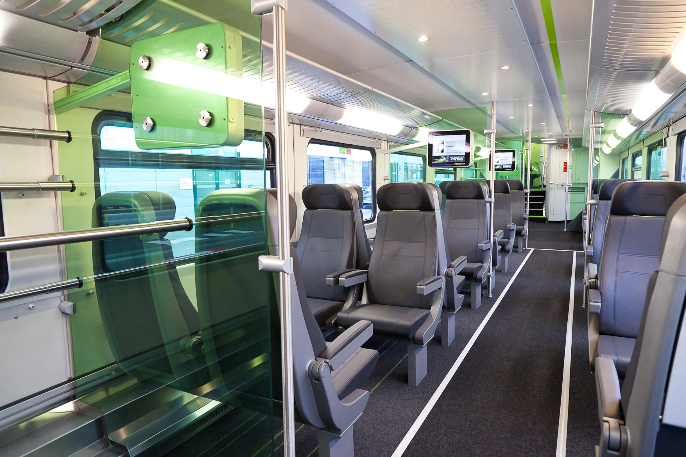
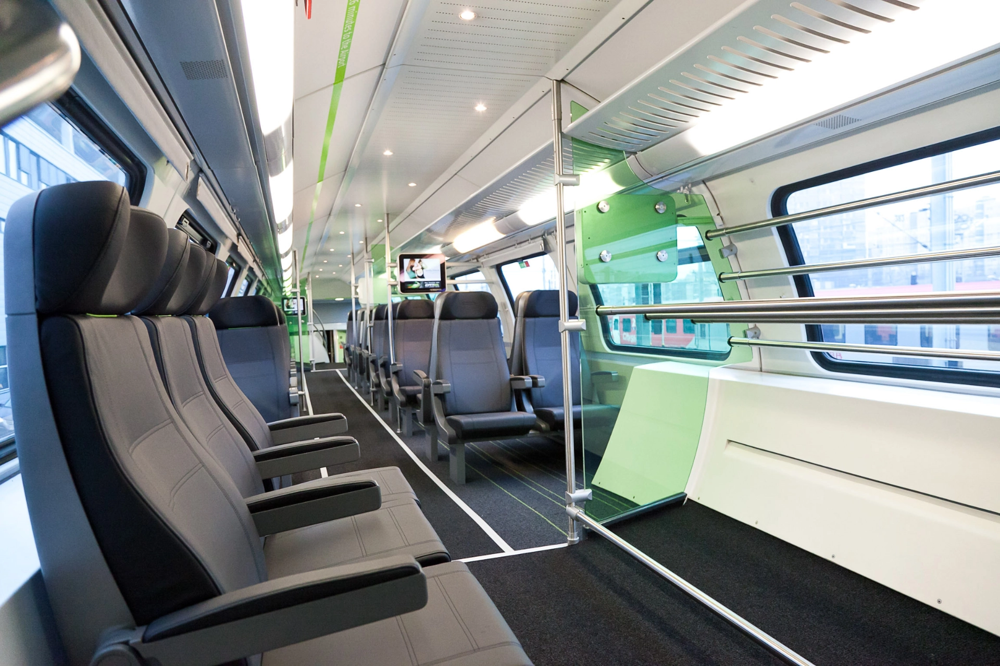

## 維也納機場快線 CAT 是什麼？

[維也納的機場快線（City Airport Train，CAT）](https://affiliate.klook.com/redirect?aid=41451&aff_adid=1011857&k_site=https%3A%2F%2Fwww.klook.com%2Fzh-TW%2Factivity%2F8895-vienna-city-airport-train-ticket-vienna%2F%3Fspm%3DActivity.TopNavigation.SelectCurrency%26clickId%3D160621ce0b)是來回維也納市區和機場的所有方法中最快速的選擇。

機場快線是維也納機場站和 Wien Mitte（英文：Vienna Center；暫譯：維也納中央車站）兩站的直達車，只要 16 分鐘就可以抵達到站。

*注意：[**Wien Mitte（維也納中央車站）和 Wien Hbf（維也納主火車站）是不同的車站**](/posts/維也納市區交通攻略/)！

<!---->

## 維也納機場快線 CAT 方便嗎？

只要不是選在半夜的時間，在[所有往返維也納機場和市區的方式](/posts/維也納機場到市區交通全攻略/)裡面，維也納機場快線 CAT 可以說是最方便的選擇。

在維也納機場，維也納機場快線 CAT 的淺綠色標示非常顯眼，想要錯過都很難。從機場上 CAT 火車，搭一站 16 分鐘就抵達中央車站（Wien Mitte）下車，完全不怕下錯車。

要從維也納市中心前往機場時，也只要再次來到位在 Wien Mitte The Mall（維也納中心購物商場）裡面的 CAT 車站，就能到 CAT 專用的火車月台再次用 16 分鐘直達機場搭機。

*Wien Mitte The Mall 購物商場裡面[有免費廁所](/posts/歐洲找免費廁所攻略/)可以使用。



## 維也納機場快線 CAT 值得買嗎？

維也納機場快線 CAT 值得買嗎？考量以下因素：

- 來回票比單程票划算一點。
- 14 歲以下孩童免費搭乘。
- 16 分鐘直達市中心，無腦搭乘不怕下錯站。

維也納機場快線 CAT 非常適合⋯

- [第一次來到維也納，準備從維也納機場到市中心的自由行旅客](/posts/維也納自由行/)。
- 趕時間的旅客。
- 住宿地點就位在中央車站（Wien Mitte）、或是地鐵線 U3 和 U4 的旅客。
- 有 14 歲以下孩童同行的旅客。
- 不想一直搬行李上上下下的旅客。
- 有長輩或是行動不便者坐輪椅的旅客。

如果你符合上述族群，不用猶豫的[訂購 CAT 維也納機場市區來回直達票](https://affiliate.klook.com/redirect?aid=41451&aff_adid=1011857&k_site=https%3A%2F%2Fwww.klook.com%2Fzh-TW%2Factivity%2F8895-vienna-city-airport-train-ticket-vienna%2F%3Fspm%3DActivity.TopNavigation.SelectCurrency%26clickId%3D160621ce0b)吧！

## 維也納機場快線 CAT 價格表

| 票種   | 票價    |
| ------ | ------- |
| 單程票 | 14.90 € |
| 來回票 | 24.90 € |

*14 歲以下（含）孩童免費搭乘。



## 維也納機場快線 CAT 發車時間表

CAT 發車時間重點整理：

- 每天運行，包含（國定）假日，每半小時一班車。
- 每天從維也納中央車站（Wien Mitte）發車的首班車為早上 5:37 ，末班車 23:07。
- 每天從維也納國際機場發車的首班車為早上 6:07 ，末班車 23:37。

| 小時   | 從維也納中央車站（Wien Mitte） | 從維也納國際機場 |
| ------ | ------------------------------ | ---------------- |
| 0 / 24 |                                |                  |
| 1 點   |                                |                  |
| 2 點   |                                |                  |
| 3 點   |                                |                  |
| 4 點   |                                |                  |
| 5 點   | 37 分                          |                  |
| 6 點   | 07 分 / 37 分                  | 07 分 / 37 分    |
| 7 點   | 07 分 / 37 分                  | 07 分 / 37 分    |
| 8 點   | 07 分 / 37 分                  | 07 分 / 37 分    |
| 9 點   | 07 分 / 37 分                  | 07 分 / 37 分    |
| 10 點  | 07 分 / 37 分                  | 07 分 / 37 分    |
| 11 點  | 07 分 / 37 分                  | 07 分 / 37 分    |
| 12 點  | 07 分 / 37 分                  | 07 分 / 37 分    |
| 13 點  | 07 分 / 37 分                  | 07 分 / 37 分    |
| 14 點  | 07 分 / 37 分                  | 07 分 / 37 分    |
| 15 點  | 07 分 / 37 分                  | 07 分 / 37 分    |
| 16 點  | 07 分 / 37 分                  | 07 分 / 37 分    |
| 17 點  | 07 分 / 37 分                  | 07 分 / 37 分    |
| 18 點  | 07 分 / 37 分                  | 07 分 / 37 分    |
| 19 點  | 07 分 / 37 分                  | 07 分 / 37 分    |
| 20 點  | 07 分 / 37 分                  | 07 分 / 37 分    |
| 21 點  | 07 分 / 37 分                  | 07 分 / 37 分    |
| 22 點  | 07 分 / 37 分                  | 07 分 / 37 分    |
| 23 點  | 07 分                          | 07 分 / 37 分    |

決定好搭程維也納機場快線 CAT 前往維也納市區了嗎？那你可能也會想知道[**維也納交通核心區的交通和購票方式**](/posts/維也納市區交通攻略/)！

