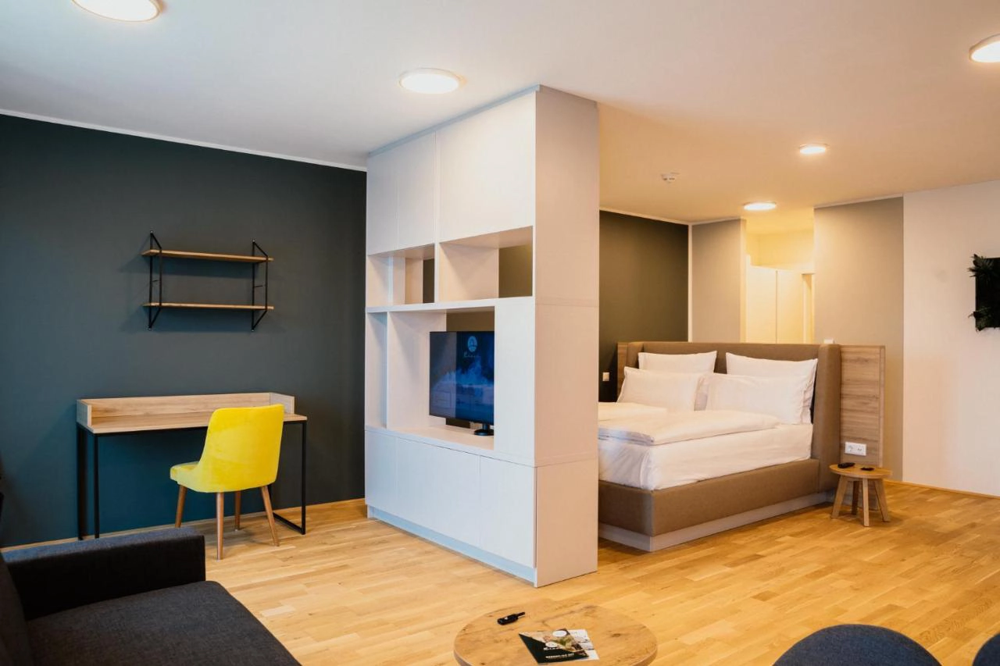

## 維也納住宿區域

來到[維也納自由行](/posts/維也納自由行/)，選擇住宿時很多人考量的第一優先不是價格，而是安全性。

維也納相比其他歐洲大城市可說是最安全的城市之一，不過旅行時基本該有的警覺當然還是不能少。在維也納，除了維也納主火車站（Wien Hbf）以南的第十區 Favoriten 因為種族複雜所以偶有危險，其他區域都算非常安全。

要知道維也納的區域，只要看地址顯示的四碼郵遞區號，就能知道該地址位在哪一區。舉例來說，位在最忠心的聖史蒂芬大教堂地址是 Stephansplatz 3, 1010 Wien，其中 1010 是四碼郵遞區號，而**四碼中間的兩碼就是維也納的第幾區**，所以聖史蒂芬大教堂位在 01，第一區。

而比較可能稍有危險的區域 Favoriten 則是 1100，位在維也納的第 10 區。

此外，[維也納的市區交通](/posts/維也納市區交通攻略/)極度方便，市區的範圍又不是太大，所以只要是住在地鐵站附近都算非常方便。



## 維也納住宿推薦

### 完美到不真實的維也納住宿｜ Luxury Suites Vienna

[**Luxury Suites Vienna**](https://www.booking.com/hotel/at/luxury-suites-vienna.xt.html?aid=7956794) 位在維也納 Traisengasse 火車站走路三分鐘的位置，不論是要搭火車或是電車前往市中心的非常方便。

這間公寓擁有現代化的室內裝潢，廚房設備和用具皆有提供，洗衣機烘衣機一個都不少，甚至還有具有城市景觀的露台，讓你一邊品酒一邊享受維也納的城市景觀。

選擇你要前往維也納的日期，如果有空房，拜託你訂下去⋯⋯。

- 地址：Dresdner Str. 128, 1200 Wien ([Google Maps](https://maps.app.goo.gl/9AZkATgaCwsw8ERh8))
- 是否含早餐：無
- 平均每晚價格：約台幣 4,000 ~ 6,000（一～四人入住）
- 查看即時房價：[**點我前往**](https://www.booking.com/hotel/at/luxury-suites-vienna.xt.html?aid=7956794)

### 美泉宮旁邊的公寓｜Elegante Auszeit l LF35

[**Elegante Auszeit l LF35**](https://www.booking.com/hotel/at/zwischen-schonbrunn-und-dem-city-center-apt-35.xt.html?aid=7956794) 就在維也納麥德林火車站（德文：Medling Bahnhof）附近，距離地鐵 U4 線 Längenfeldgasse 站只要走路三分鐘，從這裡搭車到鼎鼎大名的美泉宮（德文：Schönbrunn）只要十分鐘，可以說是 Luxury Suites Vienna 後第二優先的維也納住宿選擇。

- 地址：Längenfeldgasse 12, 1120 Wien ([Google Maps](https://maps.app.goo.gl/MU6jfi4SfEtHou9p6))
- 是否含早餐：無
- 平均每晚價格：約台幣 4,000 ~ 6,000（一～四人入住）
- 查看即時房價：[**點我前往**](https://www.booking.com/hotel/at/zwischen-schonbrunn-und-dem-city-center-apt-35.xt.html?aid=7956794)

### 活得像個當地人｜Palais Petrus

[**Palais Petrus**](https://www.booking.com/hotel/at/palais-petrus.xt.html?aid=7956794) 是一間看似樸實的公寓，其實是維也納當地人最典型的生活方式！

一間典型的當地公寓，電器、衛浴、廚房設備應有盡有，不論是要在這裡整理行李洗衣服，到附近的超市購買新鮮食材自行下廚，或是去旁邊的公園散步，[**Palais Petrus**](https://www.booking.com/hotel/at/palais-petrus.xt.html?aid=7956794) 是一間 CP 值最高的維也納住宿選擇之一！

距離地鐵 U3 的 Kardinal-Nagl-Platz 站和 Schlachthausgasse 都只要走路五分鐘，搭地鐵十分鐘就到市中心的聖史蒂芬大教堂，堪稱完美的地理位置。

- 地址：Petrusgasse 4/4, 1030 Wien ([Google Maps](https://maps.app.goo.gl/4jwWNaCvCxudQ3hU7))
- 是否含早餐：無
- 平均每晚價格：約台幣 4,000 ~ 7,000（一～三人入住）
- 查看即時房價：[**點我前往**](https://www.booking.com/hotel/at/palais-petrus.xt.html?aid=7956794)

### 三分鐘就到地鐵站｜Vienna Deluxe Apartment

雖然位於前面提到的 Favoriten 第十區，但是這間 [**Vienna Deluxe Apartment**](https://www.booking.com/hotel/at/vienna-deluxe-apartment.xt.html?aid=7956794) 不論是價格、地理位置、公寓設備、廚房衛浴等等一切都太優質，實在很難不推。

超級優惠的價格算換下來，如果四個人一同入住搞不好一個人還不用一千台幣一個晚上。

走路到地鐵 U1 上的 Reumannplatz 站只要三分鐘，住在這裡只要不要太半夜還在街上遊晃，還是沒問題的！

- 地址：Neusetzgasse 5, 1100 Wien ([Google Maps](https://maps.app.goo.gl/GFa2mj9GmLXkJEuY8))
- 是否含早餐：無
- 平均每晚價格：約台幣 4,000 ~ 6,000（一～四人入住）
- 查看即時房價：[**點我前往**](https://www.booking.com/hotel/at/vienna-deluxe-apartment.xt.html?aid=7956794)

### 像是回到溫馨的家｜Rioca Vienna Posto 1

擁有大房間的 [**Rioca Vienna Posto 1**](https://www.booking.com/hotel/at/rioca.xt.html?aid=7956794)、工作人員親切、整體衛生清潔乾淨，同時又提供相對平價的住宿價格。

雖然位置離市區有一小段距離，但是走路五分鐘就可以到 Trisengasse 火車站，搭乘市區火車十分鐘就可以到有[機場火車 CAT 直達](/posts/維也納機場快線-cat/)的維也納中央車站（德文：Wien Mitte），也就是城市公園旁邊的火車站。對於稍微有預算考量的人來說，這是一個很不錯的維也納住宿選擇！

- 地址：Dresdner Str. 109, 1200 Wien ([Google Maps](https://maps.app.goo.gl/etTvq4AYL7bgpemD8))
- 是否含早餐：有
- 平均每晚價格：約台幣 3,000 ~ 6,000（雙人房）
- 查看即時房價：[**點我前往**](https://www.booking.com/hotel/at/rioca.xt.html?aid=7956794)

### 像是回到溫馨的「新」家｜Rioca Vienna Posto 2

欸？是不是有點似曾相似？沒錯，[**Rioca Vienna Posto 2**](https://www.booking.com/hotel/at/rioca-vienna-posto-2.xt.html?aid=7956794) 就是上面 Rioca Vienna Posto 1 的 二館，命名就是這麼簡單粗暴。

Rioca Vienna Posto 2 最近幾年剛開幕，比起一館，二館位在地鐵 U3 線步行十分鐘的位置，距離火車站 St. Marx 更是只要 5 分鐘，同樣可以從這裡搭乘市區火車前往維也納中央車站（德文：Wien Mitte），也就是[維也納機場直達列車 CAT](/posts/維也納機場快線-cat/) 的車站。

當然，更新的裝潢和更方便的地理位置，也意味著稍微高一點的價格，但是和一館相比也沒有貴太多。如果有空房的話，推薦你入住二館！

- 地址：Viehmarktgasse 4, 1030 Wien ([Google Maps](https://maps.app.goo.gl/awn6akB2YvFefiZYA))
- 是否含早餐：有，須加購
- 平均每晚價格：約台幣 4,000 ~ 8,000（雙人房）
- 查看即時房價：[**點我前往**](https://www.booking.com/hotel/at/rioca-vienna-posto-2.xt.html?aid=7956794)

### 納許市場旁青年旅館｜Wombat’s City Hostel Vienna Naschmarkt

你是預算超級吃緊的背包客嗎？那也沒問題！[**Wombat’s City Hostel Vienna Naschmarkt**](https://www.booking.com/hotel/at/wombats-hostels-vienna-naschmarkt.xt.html?aid=7956794) 可以說是維也納最有名的青年旅館之一。它就位在納許市場（德文：Naschmarkt）旁邊，距離地鐵 U4 的車站只需要步行五分鐘，離卡爾廣場（德文：Karlsplatz）也不遠，大廳有簡單的咖啡廳、隨時都有不少旅客在這邊交朋友！

- 地址：Rechte Wienzeile 35, 1040 Wien ([Google Maps](https://maps.app.goo.gl/Efb7nWaNXNH4aKjb7))
- 是否含早餐：有，需加購
- 平均每晚價格：約台幣 1000（單床位）
- 查看即時房價：[**點我前往**](https://www.booking.com/hotel/at/wombats-hostels-vienna-naschmarkt.xt.html?aid=7956794)
