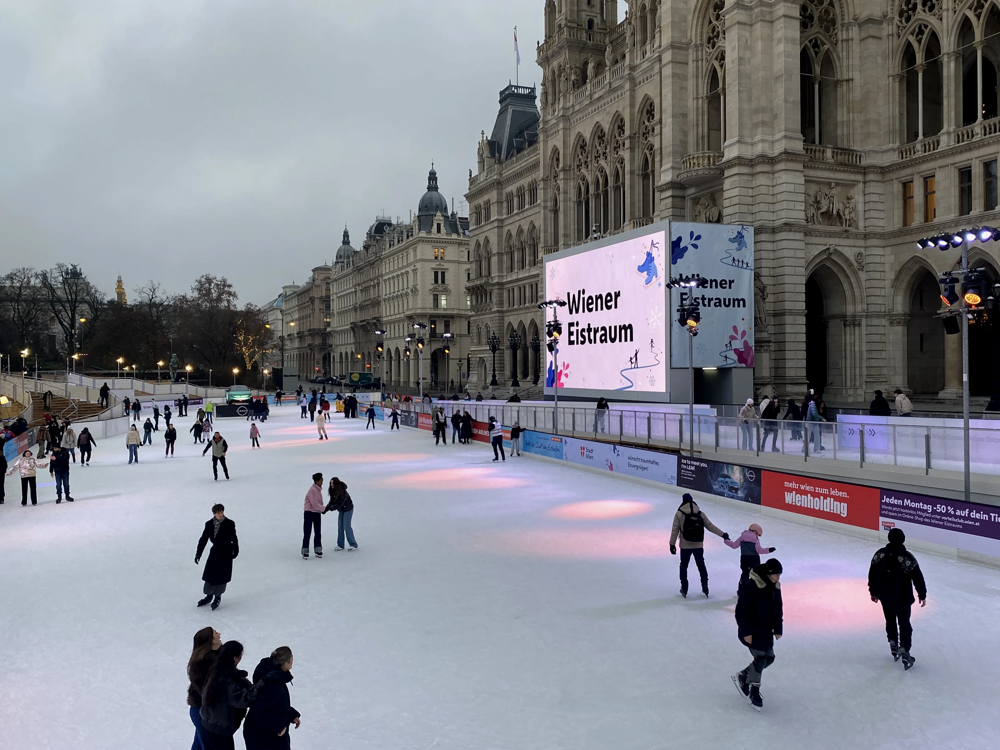
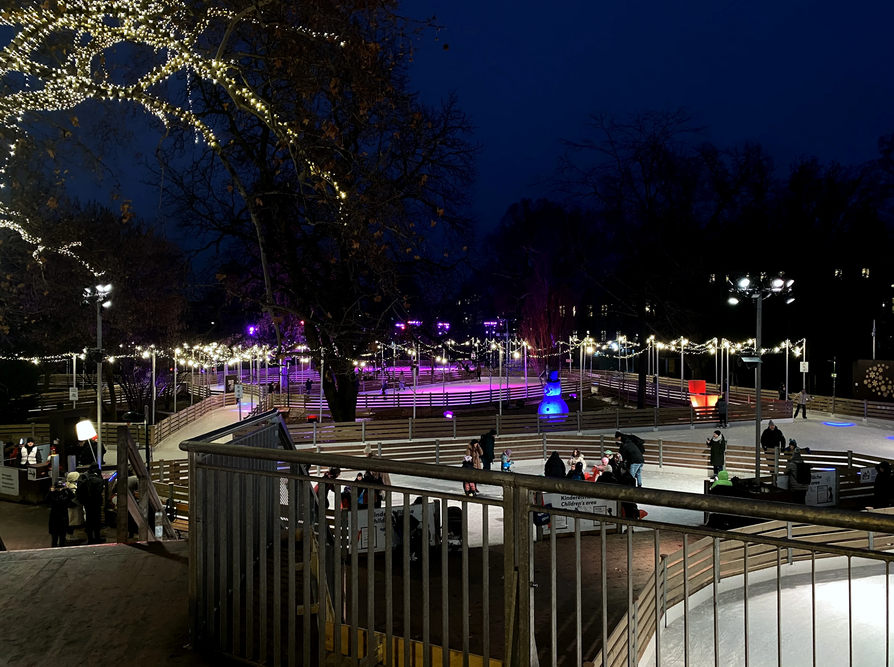
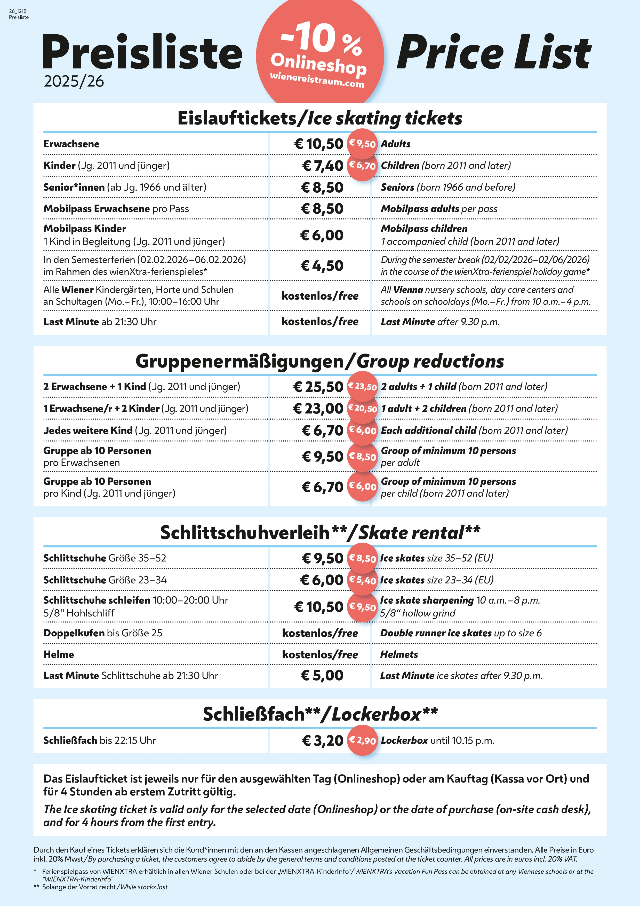
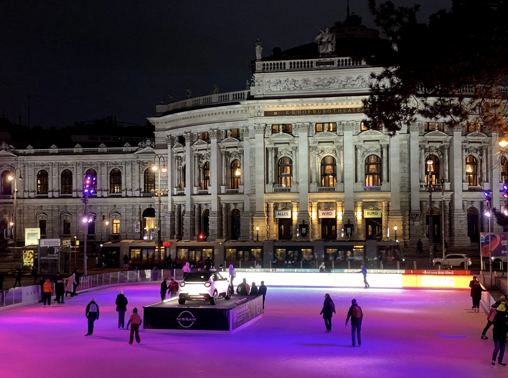

維也納市政廳是維也納最熱門的觀光景點之一。不只因為它獨特的哥德式風格建築，更是因為在一整年當中，舉辦在這裡的活動幾乎滿檔！其中最知名熱門的活動，當然就是每年冬天在這裡舉辦、維也納最大的[市政廳廣場前聖誕市集](/posts/%E7%B6%AD%E4%B9%9F%E7%B4%8D%E5%B8%82%E6%94%BF%E5%BB%B3%E5%BB%A3%E5%A0%B4%E8%81%96%E8%AA%95%E5%B8%82%E9%9B%86/)了！

在市政廳前廣場聖誕市集的活動期間，還有一件小孩大人的期待的活動，也就是室外溜冰，現在就來看看要怎麼最完整體驗在維也納市政廳溜冰吧！

## 維也納市政廳溜冰開放時間

有趣的是，維也納市政廳溜冰場在聖誕市集期間，僅有較小的腹地。而在聖誕市集結束後，整個前廣場會經過大約兩個禮拜的整修期，將整個最完整的溜冰場建造起來，成為當地人所稱呼的維也納冰上夢幻世界（Wiener Eistraum）。

- 聖誕市集期間：2025 年 11 月 14 日～2026 年 1 月 6 日（已結束）
- 冰上夢幻世界期間：2026 年 1 月 22 日～2026 年 3 月 8 日，每日早上 10 點至晚上 10 點。

## 維也納市政廳溜冰值得嗎？

根據多年的旅居經驗，在維也納市政廳的溜冰將是你最難忘的回憶之一！維也納冰上夢幻世界（Wiener Eistraum）的滑冰區總面積超過 10,000 平方公尺，相當壯觀。最近幾年起，新搭建的觀景平台更是讓你可以溜冰的二樓平台，在更高處欣賞維也納獨特的冬天景觀。

## 維也納市政廳溜冰票價

今年的票價就在這張圖內了，建議一律線上購票，不但有 9 折優惠，還不用排隊領票。入場票都是從初次**進場後開始算，四個小時內可以刷 QR Code 無限次進出**。

方便中文世界的大家了解，這邊一併提供中文表格做參考：

### 溜冰入場票價

| 身份                        | 原價（歐元） | 線上價格（歐元） |
| ------------------------- | ------ | -------- |
| 成人                        | 10.5   | 9.5      |
| 孩童（2011 年後出生）             | 7.4    | 6.7      |
| 敬老（1966 年前出生）             | 8.5    | 不適用      |
| Last Minute 票（晚上 9 點半後入場） | 免費     | 免費       |

**ExitTaiwan 團隊提供的好康資訊**！現在加入 ExitTaiwan 出台灣[會員專屬優惠社團](https://membership.exittaiwan.com/)，解鎖每個禮拜一的優惠碼，每週一溜冰入場票價直接打五折，只要 4.75 歐（孩童票 3.35 歐）元！現在每個月只要台幣 99 元起就能成為會員！



### 團體票價

| 身份                     | 原價（歐元） | 線上價格（歐元） |
| ---------------------- | ------ | -------- |
| 2 成人 + 1 孩童            | 25.5   | 23.5     |
| 1 成人 + 2 孩童（2011 年後出生） | 23     | 20.5     |
| 每多一孩童                  | 6.7    | 6        |
| 十人以上（每個成人）             | 9.5    | 8.5      |
| 十人以上（每個孩童）             | 6.7    | 6        |

### 溜冰用具租借價格

| 租借用具說明                     | 原價（歐元） | 線上價格（歐元） |
| -------------------------- | ------ | -------- |
| 溜冰鞋（EU 35 - 52）            | 9.5    | 8.5      |
| 溜冰鞋（EU 23 - 34）            | 6      | 5.4      |
| 頭盔                         | 免費     | 免費       |
| Last Minute 租借（晚上 9 點半後租借） | 5      | 5        |
| 置物櫃                        | 3.2    | 2.9      |

## 維也納市政廳溜冰流程

買好票之後，就可以準備出發溜冰啦！

1. 著裝：
   溜冰一定要穿長袖長褲、還要戴手套，不只保暖也增加一些安全性。
2. 置物櫃（至晚上 10:15 分，建議提早取物）：
   如果身上有太多東西又沒人幫忙顧的話，就租個旁邊的置物櫃用吧！
3. 領取溜冰鞋：
   根據自己鞋子的歐洲尺碼，到溜冰鞋的櫃檯領取適合自己腳的大小的溜冰鞋。
4. 刷票進出場（初次進場後 4 小時內有效）：
   拿著手機 QR Code，每次進場刷一下就沒問題。
5. 歸還溜冰鞋 / 置物櫃取物（至晚上 10:15 分，建議提早取物）：
   筋疲力盡之後，別忘了把溜冰鞋還一還，置物櫃東西拿走唷。

> 推薦閱讀：[**維也納自由行市區交通攻略｜維也納交通核心區在哪裡？這篇文章告訴你**](/posts/%E7%B6%AD%E4%B9%9F%E7%B4%8D%E5%B8%82%E5%8D%80%E4%BA%A4%E9%80%9A%E6%94%BB%E7%95%A5/)
> 推薦閱讀：[**【歐洲自由行花費】保證省下 300 歐｜歐洲食衣住行樂全方位教學，馬上壓低歐洲自由行花費！**](/posts/%E6%AD%90%E6%B4%B2%E8%87%AA%E7%94%B1%E8%A1%8C%E8%8A%B1%E8%B2%BB%E7%9C%81%E9%8C%A2%E6%94%BB%E7%95%A5/)