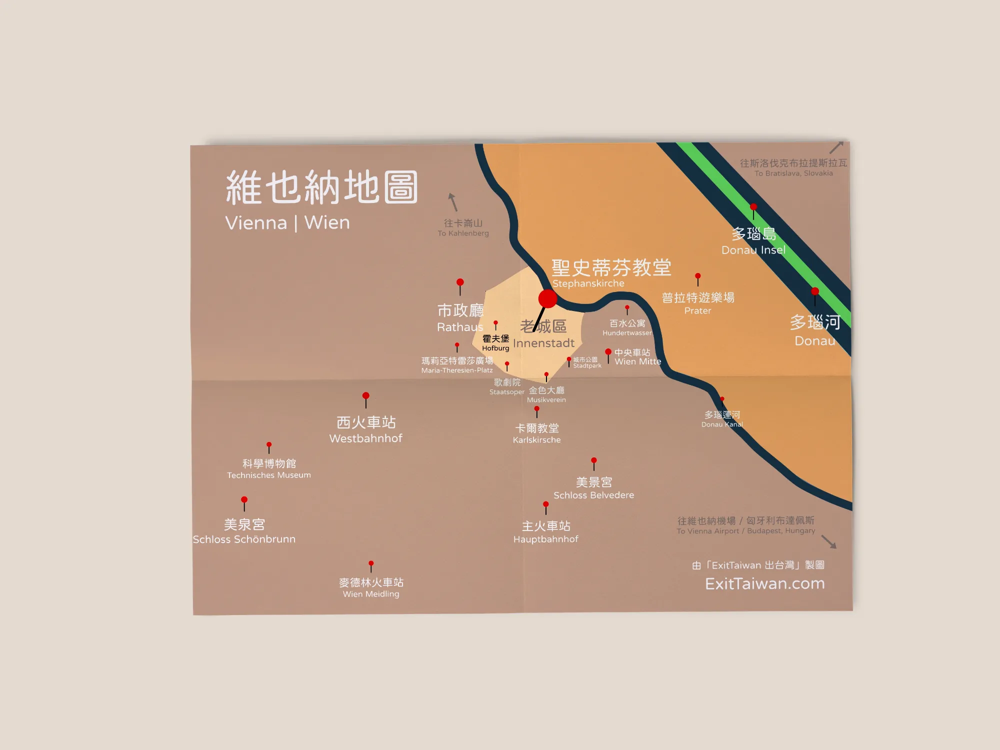
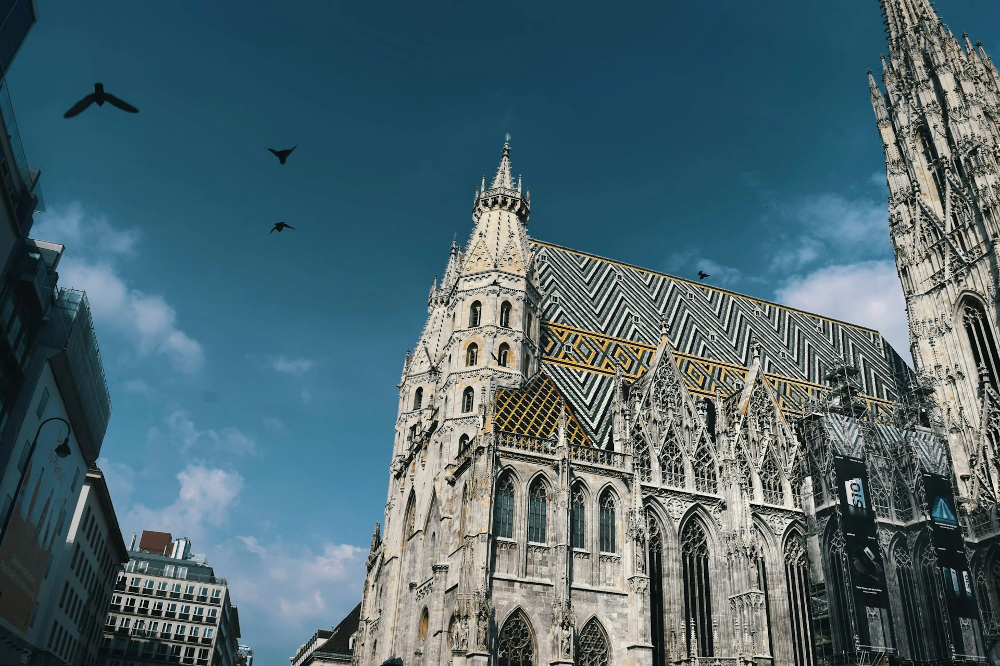
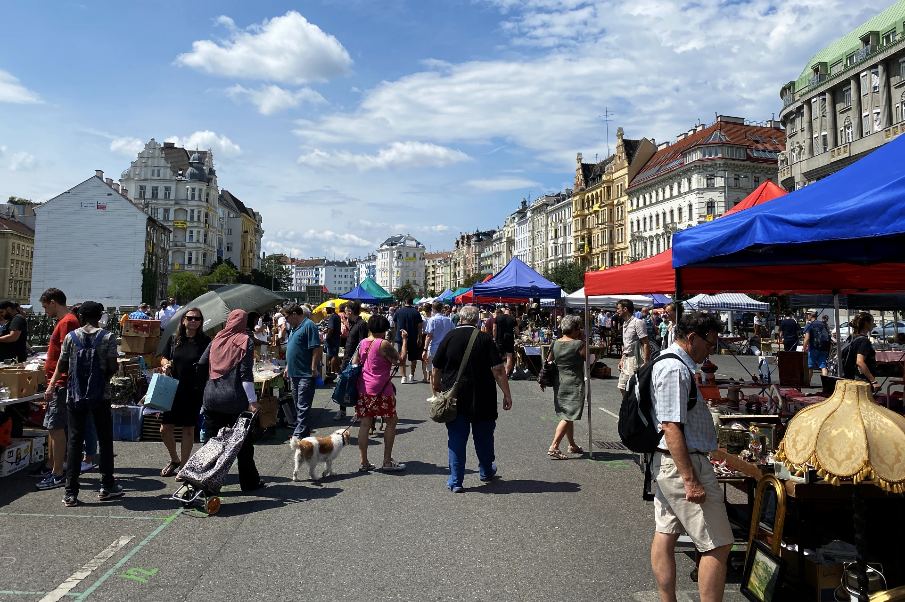
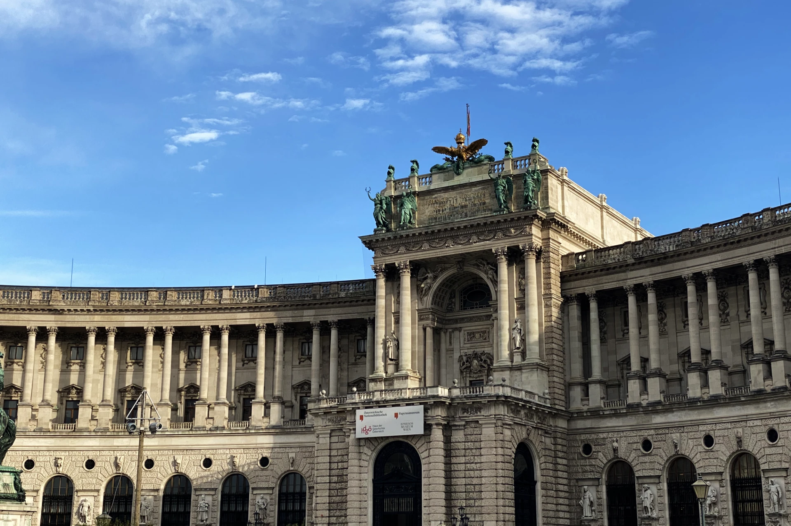
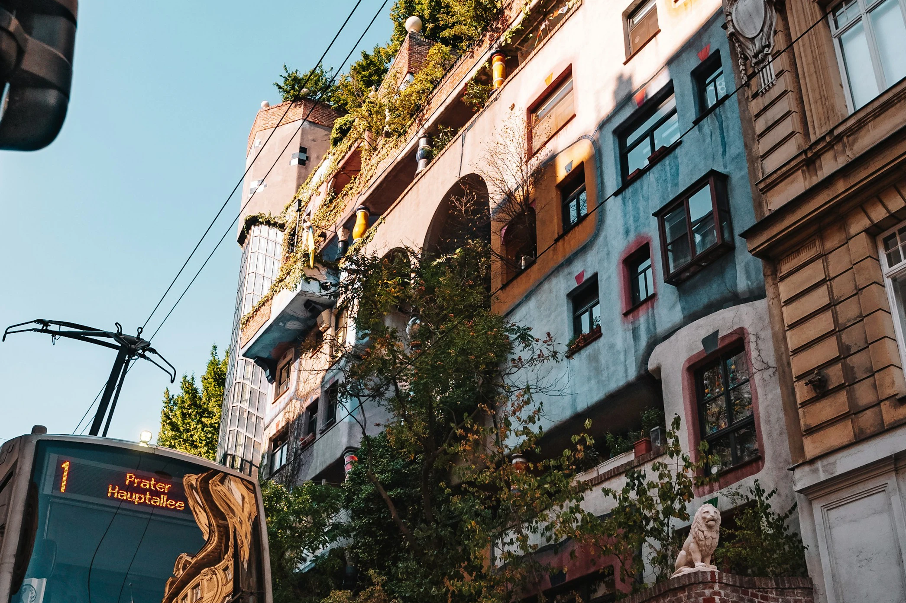
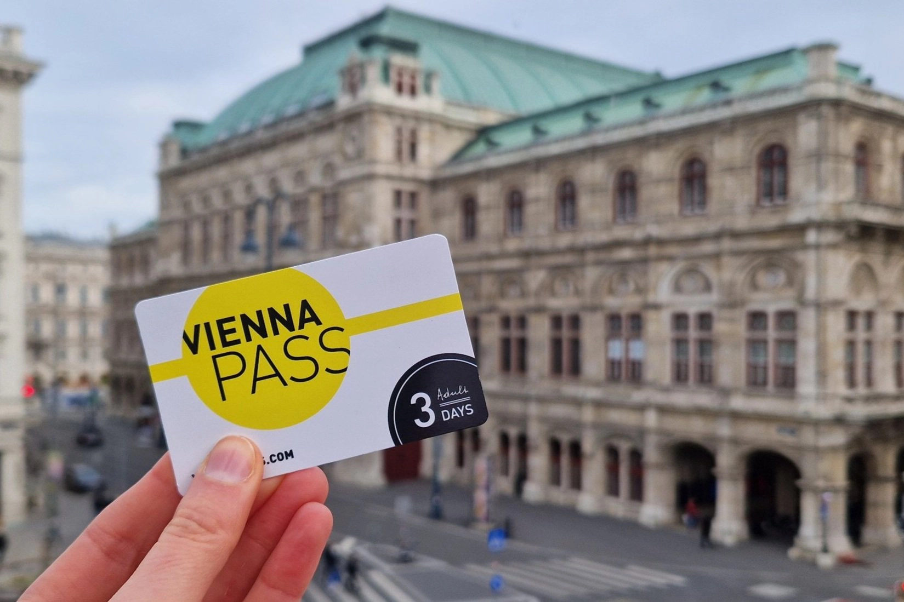

## 維也納景點地圖



[維也納](/posts/維也納自由行/)的景點幾乎一律圍繞在老城區附近，只有像是美泉宮和普拉特遊樂場距離市中心比較遠一點點。

住宿地點只要選在地鐵站附近、或是火車站附近（維也納西火車站、維也納主火車站、維也納中央車站、維也納麥德林車站等等），都可以透過[大眾交通工具](/posts/維也納市區交通攻略/)很方便的到達維也納各個景點。

> 推薦閱讀：
>
> ✔️ [維也納自由行市區交通攻略｜維也納交通核心區範圍到哪裡？](/posts/維也納市區交通攻略/)
>
> ✔️ [CP 值高、交通又方便的維也納住宿推薦](/posts/維也納住宿/)

## 維也納景點推薦

### 維也納必訪景點｜美景宮 Schloss Belvedere

美景宮（德文：Schloss Belvedere）位在維也納主火車站（德文：Wien Hbf）走路十分鐘的位置，非常容易抵達。

美景宮分為上美景宮和下美景宮，克林姆最有名的畫作《吻（Der Kuss）》就在上美景宮展出。

大部分旅客會前往上美景宮了解宮殿的歷史，並欣賞宮殿內的裝潢、裝飾、以及包括古斯塔夫・克林姆（德文：Gustav Klimt）在內多名藝術家的名作。

要是剛好在年底來到維也納，美景宮的戶外也會有聖誕市集可以逛喔！

- 地址：Prinz-Eugen-Straße 27, 1030 Wien ([Google Maps](https://maps.app.goo.gl/2kZU5YvEc3wwP7dU6))
- 營業時間：每日早上 9 點到 18 點
- 旅行建議：
  - 特別推薦給對藝術有興趣的旅客。
  - 建議停留時間 1 ~ 2 小時。
- 門票：成人 €17.50（現場購買 €20）｜65 歲以上或 26 歲以下 €14.10（現場購買 €16.50）｜19 歲以下免費
  - 適用[**維也納景點通行證 Vienna Pass**](https://affiliate.klook.com/redirect?aid=41451&aff_adid=1004215&k_site=https%3A%2F%2Fwww.klook.com%2Factivity%2F105133-vienna-attractions-pass%2F%3Fspm%3DSearchResult.SearchResult_LIST%26clickId%3D3b93d25d1e)
  - 適用[維也納博物館美術館套票](https://www.bundesmuseencard.at/)

### 維也納必訪景點｜聖史蒂芬大教堂 Stephansdom

聖史蒂芬大教堂（德文：Stephansdom 或 Stephanskirsche）是維也納的中心點，是每個旅客來到維也納一定會來參觀的景點。教堂內有一小區是可以免費參觀的區域，如果想要上塔或是到地下墓穴，就需要另外買票囉。

如果你剛好在冬天 11 ~ 12 月時來到聖史蒂芬大教堂，這裡的[聖誕市集](https://exittaiwan.com/posts/維也納史蒂芬廣場聖誕市集/)更是會有著滿滿的人潮！

- 地址：Stephansplatz 3, 1010 Wien ([Google Maps](https://maps.app.goo.gl/fA7GSuQhRS73AwCc8))
- 營業時間：每週一至週六早上 9 ~ 11:30，下午 1 點 ~ 4:30。週日及國定假日開放下午 1 點 ~ 4:30
- 旅行建議：
  - 所有來到維也納的旅客都會踩的點。
  - 建議停留時間 15 分鐘 至 1 小時。
- 門票：免費，付費區根據[參觀行程及年齡](https://www.stephanskirche.at/info.php)，€6 ~ €25

### 維也納必訪景點｜格拉本大街 Graben

就在聖史蒂芬大教堂外，以教堂為中心的圓周都是徒步購物街，而格拉本大街（德文：Graben）就是維也納最有名街區，這裡有許多受台灣人喜愛的精品品牌，

格拉本大街上也有為了紀念 17 世紀末在維也納發生的鼠疫而建造的鼠疫紀念柱，又稱三位一體紀念柱。

另外，聖誕節時格拉本大街上的燈飾幾乎是每個觀光客都會打卡拍照的景點。

- 地址：地鐵 U1 和 U3 線史蒂芬廣場（德文：Stephanplatz）站
- 旅行建議：
  - 特別推薦給想要採購精品的旅客。
  - 建議停留時間 15 分鐘 ~ 2 小時。
- 營業時間：全天，星期日及國定假日大部分商店關門，但餐廳幾乎都會正常營業

### 維也納必訪景點｜卡爾教堂 Karlskirsche

卡爾教堂（德文：Karlskirsche）就位在維也納音樂協會對面的卡爾廣場（德文：Karlsplatz），為 18 世紀建成的巴洛克建築，是在西元 1713 年大瘟疫後，神聖羅馬帝國查利六世為聖嘉祿·鮑榮茂（拉丁語：Sanctus Carolus Borromeus；義大利語：Santo Carlo Borromeo；1538年—1584年）所建造的。

教堂旁邊旁邊曾經是醫院墓地，音樂家安東尼奧-韋瓦第（Antonio Vivaldi）在 1741 年去世時就埋葬在此，但是今日墓地已不存在，而是變成維也納科技大學（德文：TU Wien）。韋瓦第的墳墓因為已經無法找到，所以卡爾教堂裡幾乎每天晚上都會[**上演韋瓦第的《四季》音樂會**](https://affiliate.klook.com/redirect?aid=41451&aff_adid=1003266&k_site=https%3A%2F%2Fwww.klook.com%2Factivity%2F106019-vivaldis-four-seasons-concert-ticket-st-charless-church%2F%3Fspm%3DSearchResult.SearchResult_LIST%26clickId%3Dfc4b60e21b)來紀念他。

此外，卡爾廣場也有兒童遊戲區、聖誕節期間有規模蠻大的聖誕市集、平日也可以看到維也納科技大學的學生在廣場上聊天談心，是在內城裡面相當悠閒的區域，旁邊的維也納科技大學內[有免費廁所](/posts/歐洲找免費廁所攻略/)可以使用。

- 地址：Karlskirche, Karlsplatz 10, 1040 Wien ([Google Maps](https://maps.app.goo.gl/d1ZKRNcHhfsxVnjJA))
- 營業時間：每日 7:30 ~ 19:00
- 旅行建議：
  - 推薦給所有來到維也納的旅客。
  - 建議停留時間約半小時。
- 門票：戶外免費，入內參觀 €9.50

### 維也納必訪景點｜納許市場 Naschmarkt

納許市場 Naschmarkt 是維也納最大的傳統市場之一。這裡有各式各樣的異國美食和香料，除了需要回家烹飪的生鮮食材及蔬果外，這裡也有不少餐廳、一旁更是有許多歷史悠久的咖啡廳、早午餐餐廳、以及亞洲超市等，再加上位置臨近卡爾教堂廣場，納許市場已經是觀光客最愛買伴手禮和小點心的勝地。

另外，**每週六上午這裡還會有二手市集**，喜歡尋寶的人千萬別錯過囉！

- 地址：Naschmarkt, 1060 Wien ([Google Maps](https://maps.app.goo.gl/6BnWL3PmmrnqovZu6))
  - 地鐵 U1、U2、U4 在 Karlsplatz 站下，步行 2 分鐘
- 營業時間：每日早上 6 點到 17 點左右（週日市場休息），二手市集週六上午
- 旅行建議：
  - 推薦給所有來到維也納的旅客。
  - 建議停留時間約一小時。
- 門票：無

### 維也納必訪景點｜霍夫堡 Hofburg

霍夫堡 Hofburg 在地圖上沒有顯示明確的範圍，不過整個霍夫堡大概包含了世界（民族學）博物館、皇家公寓、皇家銀器收藏、阿爾貝蒂娜 Albertina 博物館、奧地利國家圖書館、皇家珍寶館、西班牙馬術學校、維也納歷史博物館，還有人民公園和城堡公園，要逛完所有展覽可能一整天都夠！

在新霍夫堡裡面的世界（民族學）博物館（德文：Weltmuseum）除了展示來自世界各地的文明遺物，也有完整的騎士盔甲、武器展，和不少古董樂器的展示，不論你是歷史迷、軍事迷、或是音樂迷都可以來這裡開開眼界。

- 地址：Heldenplatz, 1010 Wien ([Google Maps](https://maps.app.goo.gl/ffmSq43tMUwQwCQC6))
  - 街道路面電車 71、2、D、或 1 號線 Burgring 站步行五分鐘
  - 地鐵 U3 Volkstheater 站步行 5 ~ 10 分鐘
- 營業時間：10 ~ 18 點，週二至 21 點（週三休息）
- 旅行建議：
  - 推薦給所有來到維也納的旅客。
  - 建議停留時間約 3 小時，可依照選擇 2 ~ 4 個展館參觀。
- 門票：成人 € 16｜65 歲以上或 25 歲以下 € 12｜19 歲以下免費
  - 適用[**維也納景點通行證 Vienna Pass**](https://affiliate.klook.com/redirect?aid=41451&aff_adid=1004215&k_site=https%3A%2F%2Fwww.klook.com%2Factivity%2F105133-vienna-attractions-pass%2F%3Fspm%3DSearchResult.SearchResult_LIST%26clickId%3D3b93d25d1e)
  - 適用[維也納博物館美術館套票](https://www.bundesmuseencard.at/)

### 維也納必訪景點｜奧地利國家圖書館 Österreichische Nationalbibliothek

奧地利國家圖書館（德文：Österreichische Nationalbibliothek）其實是一個類似博物館的地方，藏書古老無法翻閱，和你想像的圖書館不太一樣。

奧地利圖書館建於 18 世紀，長約 80 公尺、高 20 公尺的華麗大廳（德文：Prunksaal，英文：The State Hall）雖然規模不大，但是擁有超過二十萬藏書。

此外，巴洛克式風格裝潢、天花板由奧地利繪家丹尼爾・格蘭（德文：Daniel Gran）繪製的圓頂濕壁畫（Fresco）、還有四周由洛倫佐・馬蒂利（Lorenzo Mattielli，也是設計卡爾教堂兩邊的大柱的雕刻家）創作的雕塑作品，都讓人讚嘆前人偉大的美術之作。

在人潮較少，尤其是白天陽光充足的時候，這裡是一個超適合拍美照的地方！

需要特別注意的是，因為圖書館藏歷史悠久，如果當天剛好遇到下雨天比較潮濕，館內會稍微有霉味，嗅覺比較敏感的人就要再多考量是否前往囉。

- 地址：Josefsplatz 1, 1015 Wien ([Google Maps](https://maps.app.goo.gl/ckitgYBJaVjwc2DJ7))
  - *約瑟夫廣場 (Josefsplatz) 旁邊的小門
- 營業時間：每天 10 點到 18 點（週二至 21 點，週一休館）
- 旅行建議：
  - 推薦給所有來到維也納的旅客。
  - 建議停留時間約半小時至 1 小時。
- 門票：成人 €11｜27 歲以下學生票 €8
  - 適用[**維也納景點通行證 Vienna Pass**](https://affiliate.klook.com/redirect?aid=41451&aff_adid=1004215&k_site=https%3A%2F%2Fwww.klook.com%2Factivity%2F105133-vienna-attractions-pass%2F%3Fspm%3DSearchResult.SearchResult_LIST%26clickId%3D3b93d25d1e)
  - 適用[維也納博物館美術館套票](https://www.bundesmuseencard.at/)

### 維也納必訪景點｜市政廳廣場 Rathausplatz

在歐洲旅行，每個大城市的市政廳幾乎都是當地的景點之一。除了市政廳的建築本身通常外觀宏偉、具有獨特歷史意義之外，每年不同時間在市政廳舉辦的活動也是市政廳成為打卡景點的關鍵。

維也納的市政廳廣場幾乎無時無刻都有活動進行著。從春天有復活節市集、夏天有電影節、到了[冬天有聖誕市集](https://exittaiwan.com/posts/維也納市政廳廣場聖誕市集/)、市集結束後又會把整個廣場變成露天溜冰場。除了活動間短暫的施工期間之外，市政廳廣場幾乎是除了聖史蒂芬大教堂之外最受觀光客歡迎的景點。

- 地址：Rathausplatz, 1010 Wien（[Google Maps](https://maps.app.goo.gl/AKRGoRRqLiw4UCWj8)）
  - 街道路面電車：1 號、71 號、或路線 D 到 Rathausplatz（市政廳前廣場）站
  - 地鐵：U3 到 Volkstheater（人民劇院） 站後走路約 10 分鐘
- 營業時間：廣場全天開放，活動期間則不固定
- 旅行建議：
  - 推薦給所有來到維也納的旅客。
  - 建議停留時間約半小時。

### 維也納必訪景點｜瑪麗亞・特蕾西亞廣場 Maria-Theresien-Platz

從老城區的西南方跨過一個路口，你就到達了瑪麗亞·特蕾西亞廣場。這個廣場特別之處在於它以中間的奧地利女大公·神聖羅馬帝國皇后瑪麗亞·特蕾西亞的大型雕塑為中心，兩旁蓋了一模一樣的建築，只有前面的雕塑稍有區別。

在現今，這兩棟建築作為博物館的用途，一棟是藝術歷史博物館，另一棟則是自然歷史博物館，且中間的大廣場也和市政廳廣場一樣，一年之中常常有活動，因此每天都吸引著大批遊客拜訪。

- 地址：Maria-Theresien-Platz, 1010 Wien ([Google Maps](https://maps.app.goo.gl/5kxXjbrRS5rtkToc9))
- 營業時間：
  - 廣場 24 小時全天開放
  - 藝術史博物館 10 點 ~ 18 點（星期四至 21 點），星期一休息
  - 自然史博物館 9 點 ~ 18 點（星期三至 20 點），星期二休息
- 旅行建議：
  - 推薦給對藝術或自然科學有興趣的旅客。
  - 如果選擇入館，建議停留時間約 2  至 3 小時。
- 門票：
  - 藝術史史博物館：€21
  - 自然史博物館：€18
  - 適用[**維也納景點通行證 Vienna Pass**](https://affiliate.klook.com/redirect?aid=41451&aff_adid=1004215&k_site=https%3A%2F%2Fwww.klook.com%2Factivity%2F105133-vienna-attractions-pass%2F%3Fspm%3DSearchResult.SearchResult_LIST%26clickId%3D3b93d25d1e)
  - 適用[維也納博物館美術館套票](https://www.bundesmuseencard.at/)

### 維也納必訪景點｜城市公園 Stadtpark

城市公園（Stadtpark）位於維也納市中心，因為鄰近各個車站（維也納中央車站 Wien Mitte、地鐵 U3、U4 線、公車和街道路面電車站）交通方便、公園維護標準相當高、還有幾座蠻有名的像是史特勞斯和舒伯特紀念雕像，城市公園已經成為旅客必訪的景點之一。

在春夏季天氣好的時候，不少人都會來到公園裡待一整個下午，和朋友聊天、野餐、情侶約會、家庭活動等等。

- 地址：Parkring 1, 1010 Wien ([Google Maps](https://maps.app.goo.gl/tbTJ38n9ymkDEz9YA))
- 營業時間：24 小時開放
- 旅行建議：
  - 推薦給剛好經過城市公園的旅客稍作休息。
  - 建議停留時間約半小時。
- 門票：免門票

### 維也納必訪景點｜美泉宮 Schloss Schönbrunn

美泉宮因其德文發音又稱熊布朗宮（德文：Schloss Schönbrunn）位於距離維也納市中心搭乘地鐵約半小時，算是維也納少數離市中心較遠的景點。美泉宮建築本體為巴洛克藝術的皇家建築，且曾是神聖羅馬帝國、 奧地利帝國和奧匈帝國的御用宮殿。

現在的美泉宮不只宮殿內開放民眾購票參觀皇室房間、收藏品，也將美泉宮殿後面花園的大部分區域免費開放給民眾散步、喝咖啡下午茶，甚至還有迷宮、動物園、花園（收費）等戶外休閒活動，是很適合家庭旅遊、朋友同遊的半天戶外景點。

- 地址：Schönbrunner Schloßstraße 47, 1130 Wien ([Google Maps](https://maps.app.goo.gl/N5sytdrJbft6g7b89))
- 營業時間：購票入場區域每日 8:30 ~ 17:00
- 旅行建議：
  - 推薦給所有來到維也納的旅客。
  - 建議停留時間約 3 小時至半天。
- 門票：成人 €32｜學生票 25 歲以下 €27｜孩童（6 ~ 18 歲）€23
  - 適用[**維也納景點通行證 Vienna Pass**](https://affiliate.klook.com/redirect?aid=41451&aff_adid=1004215&k_site=https%3A%2F%2Fwww.klook.com%2Factivity%2F105133-vienna-attractions-pass%2F%3Fspm%3DSearchResult.SearchResult_LIST%26clickId%3D3b93d25d1e)

### 維也納推薦景點｜維也納國立歌劇院 Wiener Staatsoper

[**維也納國立歌劇院（德文：Wiener Staatsoper）**](/posts/維也納國家歌劇院完全指南/)幾乎每天都上演著歌劇演出，包括由莫札特創作的費加洛的婚禮（Le nozze di Figaro）、喬治・比才創作的卡門等等知名歌劇。

在歌劇院裡的每個觀眾席前面都有一個小型的螢幕，顯示翻譯的台詞，所以不用怕聽不懂台上的人在唱什麼，喜歡歌劇的人千萬別錯過這個難得的機會。

想要一探究竟的歌劇入門者，也可以買 15 ~ 20 歐元的站票，了解這個古典的藝術表演。有時候在半場休息過後，如果坐票的人沒有再回到位子上，也可以視情況到位子坐著觀看下半場的演出喔！

> 推薦閱讀：[**維也納國家歌劇院購票攻略**](https://exittaiwan.com/posts/維也納國家歌劇院完全指南/)

歌劇院的附近也有不少餐廳、咖啡廳，連鼎鼎大名的沙赫蛋糕（Sacher Torte）創始店沙赫飯店（Hotel Sacher）都在對街而已。

- 地址：Opernring 2, 1010 Wien ([Google Maps](https://maps.app.goo.gl/xpQon1WsTn8goLhT6))
- 營業時間：根據演出及活動調整，夏天暑假沒有演出
- 旅行建議：
  - 推薦給所有來到維也納想看秀的旅客。
  - 建議停留時間約 3 小時。
- 門票：€15 ~ €140+

### 維也納推薦景點｜阿爾貝蒂娜 Albertina 美術館

阿爾貝蒂娜 Albertina 美術館是世界上最多人造訪的美術館之一，擁有豐富的近代美術史館藏，包含印象派（Impressionism）、點描主義（Pointilism）、野獸派（法文：fauvisme）各個歷代大師的作品，你在這裡可以看到畢卡索、莫內、克林姆等人的作品。

Albertina 二樓的戶外也是 1995 年的電影《[愛在黎明破曉時（Before Sunrise）](https://www.imdb.com/title/tt0112471/)》的拍攝場景，所以就算不進去美術館參觀，你也可以到外面，和就在對街的維也納國立歌劇院拍幾張照片留念！

- 地址：Albertinapl. 1, 1010 Wien ([Google Maps](https://maps.app.goo.gl/Ly6tErBRLB8zog6HA))
  - 街道路面電車 71、2、D、或 1 號線 Burgring 站步行五分鐘
  - 地鐵 Karlsplatz 往 Oper 出口步行五分 5 分鐘
- 營業時間：每天 10:00–18:00（週三、五到21:00）
- 旅行建議：
  - 推薦給對藝術有興趣的旅客。
  - 建議停留時間約 1 至 2 小時。
- 門票：成人 €19.9｜65 歲以上或 26 歲以下 € 15.9｜19 歲以下免費
  - 適用[**維也納景點通行證 Vienna Pass**](https://affiliate.klook.com/redirect?aid=41451&aff_adid=1004215&k_site=https%3A%2F%2Fwww.klook.com%2Factivity%2F105133-vienna-attractions-pass%2F%3Fspm%3DSearchResult.SearchResult_LIST%26clickId%3D3b93d25d1e)
  - 適用[維也納博物館美術館套票](https://www.bundesmuseencard.at/)

### 維也納推薦景點｜Sisi 茜茜公主博物館

茜茜公主（Elisabeth Amalie Eugenie）作為奧地利史上最有影響力的皇后之一，在奧地利和匈牙利等等歐洲國家都留下了重要的歷史意義，茜茜公主博物館介紹了她傳奇的一生，從童年生活、她的家庭成長背景、到之後嫁給地利的皇帝法蘭茲喬瑟夫一世（Franz Josef I）等等戲劇性般的情節，讓人一窺當時茜茜公主的生活。

- 地址：Michaelerkuppel, 1010 Wien ([Google Maps](https://maps.app.goo.gl/LAkDrDSQTTocNiSz8))
  - 地鐵 U3 Herrengasse 站步行五分鐘
- 營業時間：每日 9 點到 17:30
- 旅行建議：
  - 推薦給對奧匈帝國歷史有興趣的旅客。
  - 建議停留時間約 1 至 2 小時。
- 門票：成人 €19.5｜25 歲以下學生票 €18｜12 ~ 18 歲 €12
  - 適用[**維也納景點通行證 Vienna Pass**](https://affiliate.klook.com/redirect?aid=41451&aff_adid=1004215&k_site=https%3A%2F%2Fwww.klook.com%2Factivity%2F105133-vienna-attractions-pass%2F%3Fspm%3DSearchResult.SearchResult_LIST%26clickId%3D3b93d25d1e)

### 維也納推薦景點｜金色大廳 Musikverein

如果你是因為音樂之都之名來到維也納，那金色大廳（德文：Goldener Saal）是你絕對不能錯過的景點之一。

雖然大部分的人沒有辦法實際在新年時，進入金色大廳欣賞全球同步直播的維也納新年音樂會，不過金色大廳和歌劇院一樣，幾乎每天都有公開的售票演出。當然，對於只想嚐鮮踩點的觀光客來說，你也可以購買站票用便宜的價格體驗古典音樂會。如果你連音樂會都不想聽，也可以參加每日的英文導覽，了解金色大廳的歷史和建築意義。

另外，金色大廳[**其實是維也納音樂協會（德文：Musikverein）**](https://exittaiwan.com/posts/維也納金色大廳完全指南/)這棟建築裡面的演奏廳之一，但因為這個演奏廳的名氣太大，現在台灣人都用金色大廳來稱呼這個地方了，要記得，在路上找指標時，要跟著維也納音樂協會（Musikverein）的標示走，你可是永遠不會找到金色大廳（Goldener Saal）的指標啊！

- 地址：Musikvereinsplatz 1, 1010 Vienna（[Google Maps](https://maps.app.goo.gl/AmfAgEFLcTxy5FCX9)）
  - 地鐵 U1 或 U4 線搭到卡爾廣場（Karlsplatz）站，步行約五分鐘
  - 路面電車 71 號搭到 Schwarzenbergplatz 站
  - 公車 59A 搭到歌劇院，卡爾廣場（Oper, Karlsplatz）站或是 4A 搭到卡爾廣場（Karlsplatz）站
- 營業時間：根據演出及活動調整，夏天暑假沒有演出
- 旅行建議：
  - 推薦給對古典音樂有興趣的旅客。
  - 如觀賞演出，建議停留時間約 3 小時。
- 演出門票價格：€10 ~ €140+（看看[金色大廳音樂會訂票攻略](https://exittaiwan.com/posts/維也納金色大廳完全指南/)）

### 維也納推薦景點｜百水公寓 Hundertwasser Haus

百水公寓（德文：Hundertwasser Haus）其名來自於建築師百水先生（Friedensreich Hundertwasser）。百水先生的建築風格以和自然融合為特色。百水先生在奧地利的建築作品不只有百水公寓，另外也在維也納的垃圾處理廠、還有世界各地多處包含日本大阪和東京、德國、紐西蘭等都有他的建築作品

目前百水公寓是有當地居民居住在裡面的，所以到該景點時建議盡量降低音量，不要打擾到他們的生活喔。

- 地址：Kegelgasse 36-38, 1030 Wien (Google Maps)
  - 1 號電車至 Hetzgasse 或是 Löwengasse 站走路約三分鐘
- 營業時間：戶外 24 小時開放
- 旅行建議：
  - 推薦給對建築有興趣的旅客。
  - 建議停留時間約 15 分鐘至半小時。
- 門票：無

### 維也納推薦景點｜普拉特室外遊樂場 Prater

對於喜愛遊樂設施、享受刺激的人來說，普拉特市外遊樂場（Prater）可以滿足你的心願！

不像台灣的樂園，普拉特是不需要購票入園的，而是看你想要搭乘哪一個遊樂設施就購買該遊樂設施的乘坐票卷。遊樂場也有不少賣吃的小店面，想要在這裡嗨一整晚都沒問題。

- 地址：Gaudeegasse 1, 1020 Wien ([Google Maps](https://maps.app.goo.gl/24bVaXZq5HbRybcU9))
- 營業時間：戶外 24 小時開放
- 旅行建議：
  - 推薦給有攜帶孩童或是青少年的旅客。
  - 建議停留時間約 2 小時。
- 門票：搭乘各個遊樂設施前購買

## 維也納四季節慶及活動

維也納除了上述必去的景點之外，在每年的不同季節中也常常會有節慶和活動。要是和你的行程時間剛好搭上的話，不妨去湊個熱鬧看看！

### 春天（4 - 6 月）

維也納的春天最重要的節日就是四月中下旬的復活節了！在這個時間剛好是春天剛到來，許多鮮花盛開，日照時間也逐漸變長，氣溫回暖，非常適合長時間在戶外享受好天氣！

在復活節期間，維也納多處有復活節市集，像是在美泉宮（德文：Schönbrunn）、中央咖啡廳（Café Central）附近的 Altwiener Ostermarkt（[Google Maps](https://maps.app.goo.gl/CRnozCuhA7H1x2gd7)）、還有在比較郊區的花園公園（德文：Blumengarten）都有。

沒有復活節市集的時間，也很推薦你到維也納的各個公園走走。維也納市政府花費非常多心力和資源在維護城市造景，所以一到春天各個公園幾乎都是鮮花朵朵開、草坪綠意盎然。

幾個知名的公園包括城市公園（德文：Stadtpark）、霍夫堡兩側的城堡公園（德文：Burggarten）和人民公園（德文：Volksgarten）、還有過了多瑙河的奧公園（德文：Augarten）。

### 夏天（ 6 - 8 月）

到了夏天，維也納的氣溫也會來到攝氏 30 度，許多人會選擇到多瑙河沿岸進行水上活動，在 6 月底的多瑙河島每年都會舉辦「[多瑙河島音樂祭](https://donauinselfest.at/Programm/)」，喜歡狂歡的朋友千萬別錯過。

此外，從 6 月底到八月底在市政廳廣場（德文：Rathausplatz）也有一年一度的維也納電影節。整個市政廳廣場腹地會有數十個食物攤位，免費入場，並在市政廳前面欣賞露天電影。

### 秋天（9 - 11 月）

到了秋天，所有奧地利人最愛的啤酒節就來了！從九月底到十月中，[維也納的啤酒節](https://kaiserwiesn.at/en/)在普拉特室外遊樂場（德文：Prater）舉辦，數不清的表演活動就在這裡上演。

### 冬天（12 - 3 月）

雖然冬天是維也納的旅遊淡季，而且日照時間又最短，但是卻可以說是活動最多的時候！

從十一月開始，聖誕市集就在維也納各個地點舉辦，包括[聖史蒂芬大教堂](/posts/維也納史蒂芬廣場聖誕市集/)（德文：Stephanskirche）、[市政廳廣場](/posts/維也納市政廳廣場聖誕市集/)（德文：Rathausplatz）、美泉宮（德文：Schönbrunn）、美景宮（德文：Schloss Belvedere）、卡爾教堂廣場（德文：Karlsplatz）等等都有！

聖誕市集伴隨的是在市政廳廣場的戶外溜冰場，在聖誕市集結束過後的一段時間，整片市政廳廣場更是會全部都變成有雙層的溜冰場，剛好遇到的話一定要去玩玩（注意安全）！

要是你剛好是個滑雪狂熱者，你應該早有耳聞奧地利擁有世界上數一數二高品質的滑雪場。距離維也納最近的是大概是兩個小時車程的 [Semmering](https://www.semmering.com/en/)，從維也納主火車站（德文：Wien Hbf）搭火車到 Semmering Bahnhof 火車站，並且走路約 20 分鐘即可抵達雪場。

### 全年推薦活動

當然，除了季節限定的節慶和活動之外，也有全年都可以從事的休閒娛樂。

所有的博物館和美術館全年都可以去參觀，戶外的普拉特樂園除了冬天有時候太冷會關閉順便進行設備更新之外，也是全年開放。

另外，所有音樂會和歌劇演出除了夏季 7、8 月放暑假之外，也是全年都有演出！

## 維也納優惠票卷

### 維也納通行證 Vienna Pass

[**維也納通行證 Vienna Pass**](https://affiliate.klook.com/redirect?aid=41451&aff_adid=1004215&k_site=https%3A%2F%2Fwww.klook.com%2Factivity%2F105133-vienna-attractions-pass%2F%3Fspm%3DSearchResult.SearchResult_LIST%26clickId%3D3b93d25d1e) 可以購買一天、兩天、三天、或六天，包含了 90 多個維也納的景點和體驗行程，從美景宮、藝術史博物館、阿爾貝蒂娜美術館、美泉宮、茜茜公主博物館等等都一次包辦，並且可以無限制的搭乘維也納 HOP ON HOP OFF 觀光景點巴士，喜歡到處踩點、時間有限的旅客非常適合！

> [前往購買維也納通行證 Vienna Pass](https://affiliate.klook.com/redirect?aid=41451&aff_adid=1004215&k_site=https%3A%2F%2Fwww.klook.com%2Factivity%2F105133-vienna-attractions-pass%2F%3Fspm%3DSearchResult.SearchResult_LIST%26clickId%3D3b93d25d1e)

### 維也納博物館 / 美術館套票

[**Bundes Museen Card**](https://www.bundesmuseencard.at/) 是維也納博物館和美術館的套票，是藝術愛好者的一大福音。這張套票售價 € 99，購買日起 365 天有效，可以無限次進出維也納的八個博物館和美術館，總共 25 個展區。

八個博物館和美術館包含了：

- 阿爾貝蒂娜（德文：Albertina）
- 美景宮（德文：Belvedere）
- 藝術史博物館（德文：Kunsthistorisches Museum Wien）
- 應用藝術美術館（德文：Museum für Angewandte Kunst, MAK）
- 現代藝術美術館（德文：Museum Moderner Kunst Stiftung Ludwig Wien, MUMOK）
- 自然史博物館（德文：Naturhistorisches Museum Wien）
- 奧地利國家圖書館（德文：Österreichische Nationalbibliothek）
- 科學博物館（德文：Technisches Museum Wien）

> 更詳盡的介紹可以看看這篇文章：[維也納博物館通票｜藝術愛好者的一大福音，一張票讓你有逛不完的展覽](https://exittaiwan.com/posts/維也納博物館通票/)