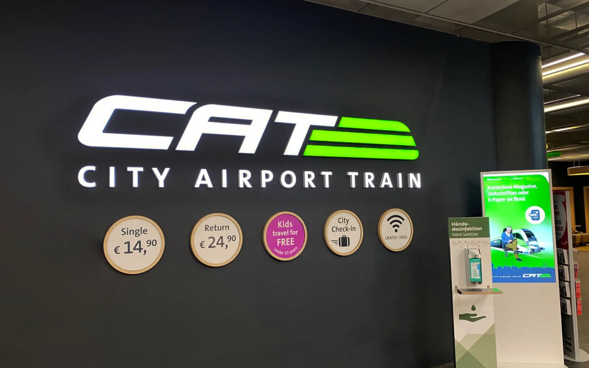
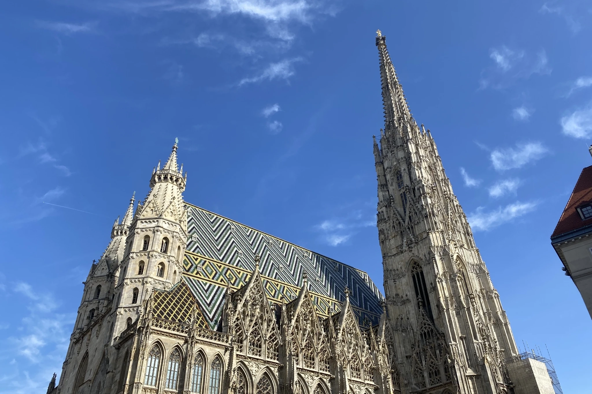
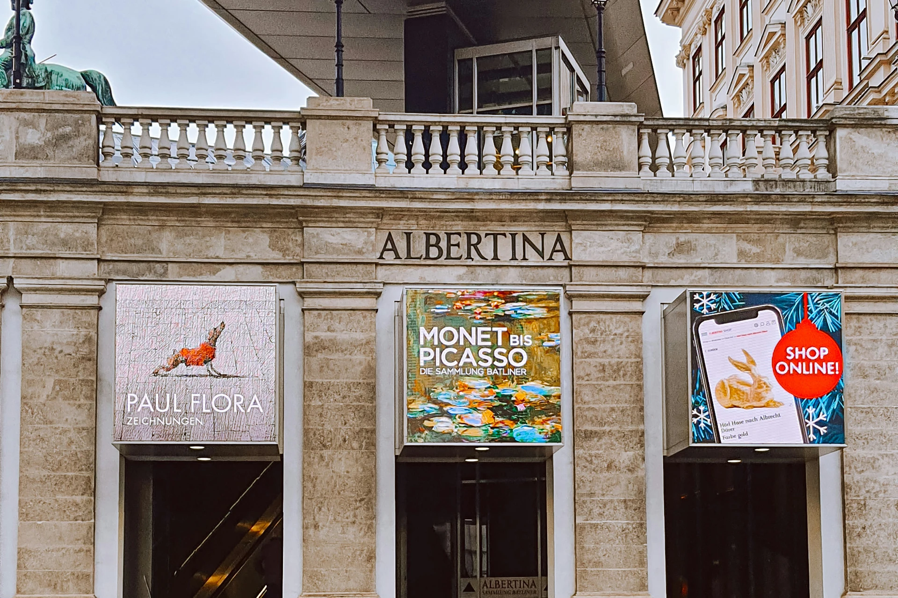
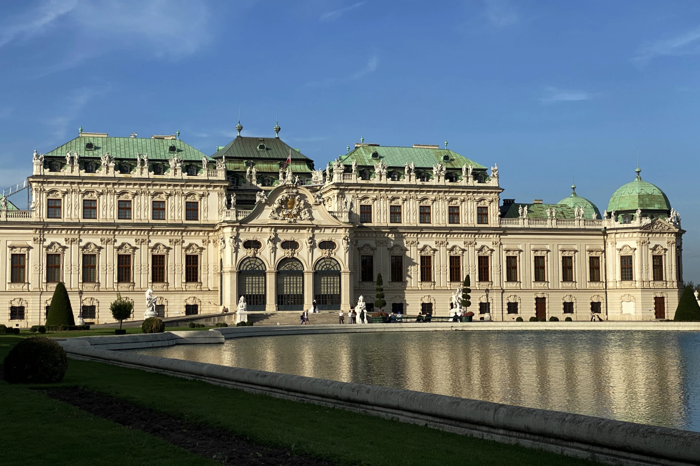
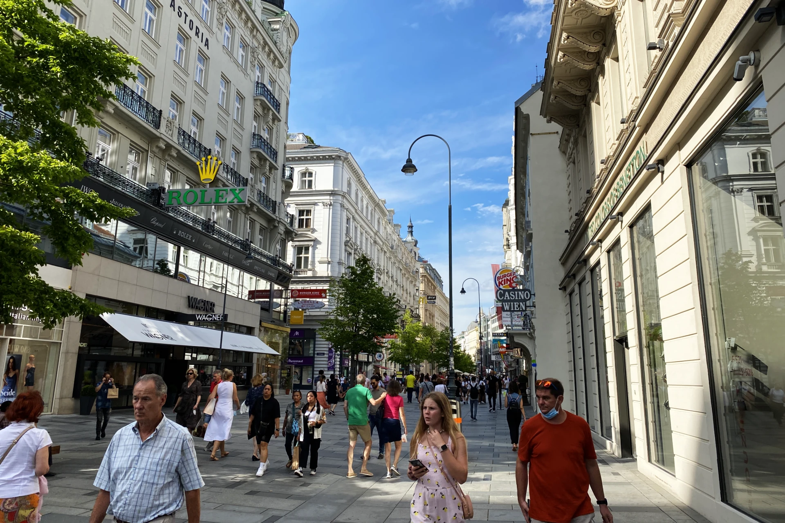
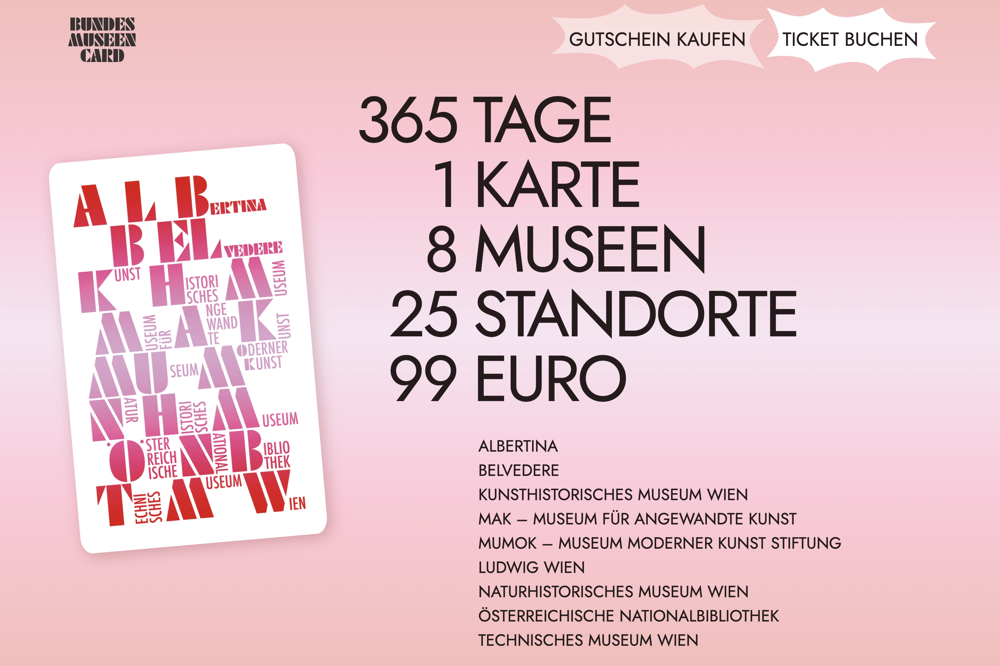

<!---->

>  **使用說明書**\
這篇文章分成了五大章節，從對維也納的基本了解、交通、自由行旅遊景點、住宿、和優惠都幫你整理好了！文章比較長，建議配合目錄更快速找到資訊。\
\
喜歡隨興安排旅遊的人，只需要看**行前須知**來確保出發前對維也納有最基本的了解讓你的旅程平安順遂，和最後的[**優惠票卷**](https://affiliate.klook.com/redirect?aid=41451&aff_adid=1004215&k_site=https%3A%2F%2Fwww.klook.com%2Factivity%2F105133-vienna-attractions-pass%2F%3Fspm%3DSearchResult.SearchResult_LIST%26clickId%3D3b93d25d1e)幫自己省一點錢。\
\
喜歡把一切都規劃好的旅客，也可以先把文章加入書籤列，旅途中隨時回來查看需要的資訊。

<!--文章目錄：
- [維也納自由行 — 行前須知](#維也納自由行--行前須知)
- [維也納自由行交通](#維也納自由行交通)
- [維也納自由行必訪景點](#維也納自由行必訪景點)
- [維也納自由行推薦住宿](#維也納自由行推薦住宿)
- [維也納自由行優惠票卷](#維也納自由行景點優惠票卷)
-->

## 維也納自由行 — 行前須知

### 關於維也納的迷思

**維也納是一個城市**

聽了好久的維也納，傳說中的音樂之「都」，好多台灣人還以為維也納就是一個國家，你也是其中之一嗎？那你就錯了，維也納可是奧地利的首都喔！

維也納位於奧地利國土的最東側，奧地利整個國家被德國、捷克、斯洛伐克、匈牙利、斯洛維尼亞、義大利、和瑞士圍繞著，從維也納搭火車一小時到十二小時之間可以到達這些國家的主要城市。

**奧地利和澳洲完全不一樣**

又有些人可能大概聽說過奧地利這個國家的英文名字是⋯ Aus- 開頭的英文？Australia？再次大錯特錯！奧地利的英文是 Austria，Australia 是在大西洋的澳洲！

這就是為什麼當你來到奧地利時，會看到不少給觀光客逛的紀念品在販賣很多「No Kangaroos in Austria（奧地利沒有袋鼠）」，因為不只台灣人，連外國人都常常把 Austria 和 Australia 搞混了。老實說這也是很能理解的，就像外國人常常把台灣 Taiwan 和泰國 Thailand 當同一個地方⋯⋯。

**德文是母語，但這裡不是德國**

奧地利人的英文很好，不過他們的母語是德文。但千萬不要把奧地利和德國當成同一個國家了，奧地利人（和德國人）可都是對自己的國家感到非常驕傲的，非常不喜歡被認成對方⋯⋯。

### 維也納氣候

維也納氣候四季分明，春天和夏天是旅遊旺季，秋冬時氣溫較低、且因位於阿爾卑斯山脈，市中心也常有強風，每年 12 月和 1 月偶有強降雪，所以春天和夏天才是維也納的旅遊旺季。

維也納基本資訊：

- 維也納是奧地利的首都
- 奧地利官方語言：德文
- 奧地利電壓 / 插頭：220V / 50Hz，歐規雙圓孔插座
- 奧地利生水：可直接飲用
- 奧地利小費文化：非必要，可適當給予 10 ~ 20%

## 維也納自由行交通攻略

維也納國際機場是維也納唯一一個國際機場，它位在維也納東南方的位置，距離維也納市中心只需要 15 - 30 分鐘就可抵達，對於旅客來說非常方便。

此外，你有各種不同的交通選擇往返機場和維也納市區，包括了私人租車、計程車（還有 Uber 和 Lyft）、機場巴士、一般火車、[**快速直達火車**](https://affiliate.klook.com/redirect?aid=41451&aff_adid=1011857&k_site=https%3A%2F%2Fwww.klook.com%2Fzh-TW%2Factivity%2F8895-vienna-city-airport-train-ticket-vienna%2F%3Fspm%3DActivity.TopNavigation.SelectCurrency%26clickId%3D160621ce0b)等，你可以根據自身的預算和時間做出適當的選擇，大多數旅客的需求，使用火車和計程車就可以滿足。

想要了解更多各種交通方式的差別和細節，你可以參考這篇[**維也納機場到市區交通全攻略**](/posts/%E7%B6%AD%E4%B9%9F%E7%B4%8D%E6%A9%9F%E5%A0%B4%E5%88%B0%E5%B8%82%E5%8D%80%E4%BA%A4%E9%80%9A%E5%85%A8%E6%94%BB%E7%95%A5/)。



在維也納市區內你有不少選擇選擇。你可以透過步行、地鐵、街道路面電車、公車、腳踏車、計程車等來探索這座美麗的城市。最多自由行旅客使用、也最普遍常見的交通方式是公車、地鐵和街道電車。

維也納交通核心區的大眾交通工具不管距離長短、轉乘多少次，票價單趟都是約台幣 100 元，便宜又方便。

至於維也納交通核心區的範圍到哪裡、以及詳細如何購票等等資訊，可以讀這篇[**維也納市區交通全攻略**](/posts/%E7%B6%AD%E4%B9%9F%E7%B4%8D%E5%B8%82%E5%8D%80%E4%BA%A4%E9%80%9A%E6%94%BB%E7%95%A5/)喔！

以上就是所有前往維也納旅遊前你一定需要知道的事情，喜歡隨性旅遊的人可以出發了！

- **加入書籤**：有打算要逛景點但不想現在做功課的人，可以把這篇文章加到網頁書籤，供旅程途中參考。
- [**維也納景點通行證**](https://affiliate.klook.com/redirect?aid=41451&aff_adid=1004215&k_site=https%3A%2F%2Fwww.klook.com%2Factivity%2F105133-vienna-attractions-pass%2F%3Fspm%3DSearchResult.SearchResult_LIST%26clickId%3D3b93d25d1e)：Vienna Pass 讓你快速造訪超過九十個在維也納的觀光景點，並且可以無限次搭乘 HOP ON HOP OFF 觀光巴士。
- [維也納博物館美術館套票](https://www.bundesmuseencard.at/)：一年內無限次進出八個維也納博物館和美術館

## 維也納自由行推薦景點

不管是在金色大廳上演的古典音樂會、維也納歌劇院的歌劇演出、到擁有上千年歷史的聖史蒂芬大教堂、冬天的市政廳聖誕市集、再到大人小孩都愛的戶外遊樂園，維也納不但是充滿文化和歷史的古都，你更可以看到維也納將新舊時代融合的風光。

### 內城區 / 老城區（及周圍）景點

在歐洲許多城市，城市規劃都是圍繞著該城市的主要火車站，並從該火車站為中心，以同心圓的方式規劃設計。在維也納同樣是同心圓的規劃，差別在於中心點不是主要火車站，而是聖史蒂芬大教堂（德文：Stephansdom）。

以聖史蒂芬大教堂為中心，範圍在環城大道（德文：Ringstrasse）以內的區域範圍，稱為內城區（又稱舊城區或老城區）。這個區域被列為 UNESCO 世界文化遺產，當中景點除了正中心的聖史蒂芬大教堂之外，還包含了維也納歌劇院、維也納音樂協會（金色大廳）、霍夫堡⋯⋯等等。

這個範圍內大部分是行人步行區，不只可以享受文化歷史、購物商圈也少不了，且都在走路二十分鐘以內的距離。

**聖史蒂芬大教堂 Stephansdom**

聖史蒂芬大教堂（德文：Stephansdom 或 Stephanskirsche）是維也納的中心點，是每個旅客來到維也納一定會來參觀的景點。教堂內有一小區是可以免費參觀的區域，如果想要上塔或是到地下墓穴，就需要另外買票囉。

如果你剛好在冬天 11 ~ 12 月時來到聖史蒂芬大教堂，這裡的[聖誕市集](/posts/%E7%B6%AD%E4%B9%9F%E7%B4%8D%E5%8F%B2%E8%92%82%E8%8A%AC%E5%BB%A3%E5%A0%B4%E8%81%96%E8%AA%95%E5%B8%82%E9%9B%86/)更是會有著滿滿的人潮！

- 地址：Stephansplatz 3, 1010 Wien ([Google Maps](https://maps.app.goo.gl/fA7GSuQhRS73AwCc8))
- 營業時間：每週一至週六早上 9 ~ 11:30，下午 1 點 ~ 4:30。週日及國定假日開放下午 1 點 ~ 4:30
- 門票：根據[參觀行程及年齡](https://www.stephanskirche.at/info.php)，€6 ~ €25

**格拉本大街 Graben**

就在聖史蒂芬大教堂外，以教堂為中心的圓周都是徒步購物街，而格拉本大街（德文：Graben）就是維也納最有名街區，這裡有許多受台灣人喜愛的精品品牌，

格拉本大街上也有為了紀念 17 世紀末在維也納發生的鼠疫而建造的鼠疫紀念柱，又稱三位一體紀念柱。

另外，聖誕節時格拉本大街上的燈飾幾乎是每個觀光客都會打卡拍照的景點。

- 地址：地鐵 U1 和 U3 線史蒂芬廣場（德文：Stephanplatz）站
- 營業時間：全天，星期日及國定假日大部分商店關門，但餐廳幾乎都會正常營業

**維也納國立歌劇院 Wiener Staatsoper**

[**維也納國立歌劇院（德文：Wiener Staatsoper）**](/posts/%E7%B6%AD%E4%B9%9F%E7%B4%8D%E5%9C%8B%E5%AE%B6%E6%AD%8C%E5%8A%87%E9%99%A2%E5%AE%8C%E5%85%A8%E6%8C%87%E5%8D%97/)幾乎每天都上演著歌劇演出，包括由莫札特創作的費加洛的婚禮（Le nozze di Figaro）、喬治・比才創作的卡門等等知名歌劇。

在歌劇院裡的每個觀眾席前面都有一個小型的螢幕，顯示翻譯的台詞，所以不用怕聽不懂台上的人在唱什麼，喜歡歌劇的人千萬別錯過這個難得的機會。

想要一探究竟的歌劇入門者，也可以買 15 ~ 20 歐元的站票，了解這個古典的藝術表演。有時候在半場休息過後，如果坐票的人沒有再回到位子上，也可以視情況到位子坐著觀看下半場的演出喔！

> 推薦閱讀：[**維也納國家歌劇院購票攻略**](/posts/%E7%B6%AD%E4%B9%9F%E7%B4%8D%E5%9C%8B%E5%AE%B6%E6%AD%8C%E5%8A%87%E9%99%A2%E5%AE%8C%E5%85%A8%E6%8C%87%E5%8D%97/)

歌劇院的附近也有不少餐廳、咖啡廳，連鼎鼎大名的沙赫蛋糕（Sacher Torte）創始店沙赫飯店（Hotel Sacher）都在對街而已。

- 地址：Opernring 2, 1010 Wien ([Google Maps](https://maps.app.goo.gl/xpQon1WsTn8goLhT6))
- 營業時間：根據演出及活動調整
- 門票：€15 ~ €140+

**霍夫堡 Hofburg**

霍夫堡 Hofburg 在地圖上沒有顯示明確的範圍，不過整個霍夫堡大概包含了世界（民族學）博物館、皇家公寓、皇家銀器收藏、阿爾貝蒂娜 Albertina 博物館、奧地利國家圖書館、皇家珍寶館、西班牙馬術學校、維也納歷史博物館，還有人民公園和城堡公園，要逛完所有展覽可能一整天都夠！

在新霍夫堡裡面的世界（民族學）博物館（德文：Weltmuseum）除了展示來自世界各地的文明遺物，也有完整的騎士盔甲、武器展，和不少古董樂器的展示，不論你是歷史迷、軍事迷、或是音樂迷都可以來這裡開開眼界。

- 地址：Heldenplatz, 1010 Wien ([Google Maps](https://maps.app.goo.gl/7Gvg9yj4y8XDyTzH9))
  - 街道路面電車 71、2、D、或 1 號線 Burgring 站步行五分鐘
  - 地鐵 U3 Volkstheater 站步行 5 ~ 10 分鐘
- 營業時間：10 ~ 18 點，週二至 21 點（週三休息）
- 門票：成人 € 16｜65 歲以上或 25 歲以下 € 12｜19 歲以下免費
  - 適用[**維也納景點通行證 Vienna Pass**](https://affiliate.klook.com/redirect?aid=41451&aff_adid=1004215&k_site=https%3A%2F%2Fwww.klook.com%2Factivity%2F105133-vienna-attractions-pass%2F%3Fspm%3DSearchResult.SearchResult_LIST%26clickId%3D3b93d25d1e)
  - 適用[維也納博物館美術館套票](https://www.bundesmuseencard.at/)

**阿爾貝蒂娜 Albertina 美術館**

阿爾貝蒂娜 Albertina 美術館是世界上最多人造訪的美術館之一，擁有豐富的近代美術史館藏，包含印象派（Impressionism）、點描主義（Pointilism）、野獸派（法文：fauvisme）各個歷代大師的作品，你在這裡可以看到畢卡索、莫內、克林姆等人的作品。

Albertina 二樓的戶外也是 1995 年的電影《[愛在黎明破曉時（Before Sunrise）](https://www.imdb.com/title/tt0112471/)》的拍攝場景，所以就算不進去美術館參觀，你也可以到外面，和就在對街的維也納國立歌劇院拍幾張照片留念！

- 地址：Albertinapl. 1, 1010 Wien ([Google Maps](https://maps.app.goo.gl/iSRRV9zqsxnSFWWBA))
  - 街道路面電車 71、2、D、或 1 號線 Burgring 站步行五分鐘
  - 地鐵 Karlsplatz 往 Oper 出口步行五分 5 分鐘
- 營業時間：每天 10:00–18:00（週三、五到21:00）
- 門票：成人 €19.9｜65 歲以上或 26 歲以下 € 15.9｜19 歲以下免費
  - 適用[**維也納景點通行證 Vienna Pass**](https://affiliate.klook.com/redirect?aid=41451&aff_adid=1004215&k_site=https%3A%2F%2Fwww.klook.com%2Factivity%2F105133-vienna-attractions-pass%2F%3Fspm%3DSearchResult.SearchResult_LIST%26clickId%3D3b93d25d1e)
  - 適用[維也納博物館美術館套票](https://www.bundesmuseencard.at/)

**Sisi 茜茜公主博物館**

茜茜公主（Elisabeth Amalie Eugenie）作為奧地利史上最有影響力的皇后之一，在奧地利和匈牙利等等歐洲國家都留下了重要的歷史意義，茜茜公主博物館介紹了她傳奇的一生，從童年生活、她的家庭成長背景、到之後嫁給地利的皇帝法蘭茲喬瑟夫一世（Franz Josef I）等等戲劇性般的情節，讓人一窺當時茜茜公主的生活。

- 地址：Michaelerkuppel, 1010 Wien ([Google Maps](https://maps.app.goo.gl/PpZNV7kWqh4UKPXHA))
  - 地鐵 U3 Herrengasse 站步行五分鐘
- 營業時間：每日 9 點到 17:30
- 門票：成人 €19.5｜25 歲以下學生票 €18｜12 ~ 18 歲 €12
  - 適用[**維也納景點通行證 Vienna Pass**](https://affiliate.klook.com/redirect?aid=41451&aff_adid=1004215&k_site=https%3A%2F%2Fwww.klook.com%2Factivity%2F105133-vienna-attractions-pass%2F%3Fspm%3DSearchResult.SearchResult_LIST%26clickId%3D3b93d25d1e)

**奧地利國家圖書館 Österreichische Nationalbibliothek**

奧地利國家圖書館（德文：Österreichische Nationalbibliothek）建於 18 世紀，長約 80 公尺、高 20 公尺的華麗大廳（德文：Prunksaal，英文：The State Hall）雖然規模不大，但是擁有超過二十萬藏書。

此外，巴洛克式風格裝潢、天花板由奧地利繪家丹尼爾・格蘭（德文：Daniel Gran）繪製的圓頂濕壁畫（Fresco）、還有四周由洛倫佐・馬蒂利（Lorenzo Mattielli，也是設計卡爾教堂兩邊的大柱的雕刻家）創作的雕塑作品，都讓人讚嘆前人偉大的美術之作。

在人潮較少，尤其是白天陽光充足的時候，這裡是一個超適合拍美照的地方！

需要特別注意的是，因為圖書館藏歷史悠久，如果當天剛好遇到下雨天比較潮濕，館內會稍微有霉味，嗅覺比較敏感的人就要再多考量是否前往囉。

- 地址：Josefsplatz 1, 1015 Wien ([Google Maps](https://maps.app.goo.gl/yhX5bAEhXk7U6Gdv6))
  - *約瑟夫廣場 (Josefsplatz) 旁邊的小門
- 營業時間：每天 10 點到 18 點（週二至 21 點，週一休館）
- 門票：成人 €11｜27 歲以下學生票 €8
  - 適用[**維也納景點通行證 Vienna Pass**](https://affiliate.klook.com/redirect?aid=41451&aff_adid=1004215&k_site=https%3A%2F%2Fwww.klook.com%2Factivity%2F105133-vienna-attractions-pass%2F%3Fspm%3DSearchResult.SearchResult_LIST%26clickId%3D3b93d25d1e)
  - 適用[維也納博物館美術館套票](https://www.bundesmuseencard.at/)

**維也納市政廳廣場 Rathausplatz**

在歐洲旅行，每個大城市的市政廳幾乎都是當地的景點之一。除了市政廳的建築本身通常外觀宏偉、具有獨特歷史意義之外，每年不同時間在市政廳舉辦的活動也是市政廳成為打卡景點的關鍵。

維也納的市政廳廣場幾乎無時無刻都有活動進行著。從春天有復活節市集、夏天有電影節、到了[冬天有聖誕市集](/posts/%E7%B6%AD%E4%B9%9F%E7%B4%8D%E5%B8%82%E6%94%BF%E5%BB%B3%E5%BB%A3%E5%A0%B4%E8%81%96%E8%AA%95%E5%B8%82%E9%9B%86/)、市集結束後又會把整個廣場變成露天溜冰場。除了活動間短暫的施工期間之外，市政廳廣場幾乎是除了聖史蒂芬大教堂之外最受觀光客歡迎的景點。

- 地址：Rathausplatz, 1010 Wien（[Google Maps](https://www.google.com/maps/place/Rathausplatz/@48.2106456,16.3561805,17z/data=!3m1!4b1!4m6!3m5!1s0x476d07966dc3b145:0x1e7a761d819e68fa!8m2!3d48.2106456!4d16.3587554!16s%2Fg%2F12345hdy?authuser=1&entry=ttu)）
	- 街道路面電車：1 號、71 號、或路線 D 到 Rathausplatz（市政廳前廣場）站
	- 地鐵：U3 到 Volkstheater（人民劇院） 站後走路約 10 分鐘
- 營業時間：廣場全天開放，活動期間則不固定

<!-- link to 維也納市政廳每年活動 -->

**瑪麗亞・特蕾西亞廣場 Maria-Theresien-Platz**

從老城區的西南方跨過一個路口，你就到達了瑪麗亞·特蕾西亞廣場。這個廣場特別之處在於它以中間的奧地利女大公·神聖羅馬帝國皇后瑪麗亞·特蕾西亞的大型雕塑為中心，兩旁蓋了一模一樣的建築，只有前面的雕塑稍有區別。

在現今，這兩棟建築作為博物館的用途，一棟是藝術歷史博物館，另一棟則是自然歷史博物館，且中間的大廣場也和市政廳廣場一樣，一年之中常常有活動，因此每天都吸引著大批遊客拜訪。

<!-- 藝術史博物館館藏：《巴別塔》 -->

- 地址：Maria-Theresien-Platz, 1010 Wien ([Google Maps](https://maps.app.goo.gl/5kxXjbrRS5rtkToc9))
- 營業時間：
  - 廣場 24 小時全天開放
  - 藝術史博物館 10 點 ~ 18 點（星期四至 21 點），星期一休息
  - 自然史博物館 9 點 ~ 18 點（星期三至 20 點），星期二休息
- 門票：
  - 藝術史史博物館：€21
  - 自然史博物館：€18
  - 適用[**維也納景點通行證 Vienna Pass**](https://affiliate.klook.com/redirect?aid=41451&aff_adid=1004215&k_site=https%3A%2F%2Fwww.klook.com%2Factivity%2F105133-vienna-attractions-pass%2F%3Fspm%3DSearchResult.SearchResult_LIST%26clickId%3D3b93d25d1e)
  - 適用[維也納博物館美術館套票](https://www.bundesmuseencard.at/)

**城市公園 Stadtpark**

城市公園（Stadtpark）位於維也納市中心，因為鄰近各個車站（維也納中央車站 Wien Mitte、地鐵 U3、U4 線、公車和街道路面電車站）交通方便、公園維護標準相當高、還有幾座蠻有名的像是史特勞斯和舒伯特紀念雕像，城市公園已經成為旅客必訪的景點之一。

在春夏季天氣好的時候，不少人都會來到公園裡待一整個下午，和朋友聊天、野餐、情侶約會、家庭活動等等。

- 地址：Parkring 1, 1010 Wien ([Google Maps](https://maps.app.goo.gl/tbTJ38n9ymkDEz9YA))
- 營業時間：24 小時開放
- 門票：免門票

**金色大廳 Musikverin**

如果你是因為音樂之都之名來到維也納，那金色大廳（德文：Goldener Saal）是你絕對不能錯過的景點之一。

雖然大部分的人沒有辦法實際在新年時，進入金色大廳欣賞全球同步直播的維也納新年音樂會，不過金色大廳和歌劇院一樣，幾乎每天都有公開的售票演出。當然，對於只想嚐鮮踩點的觀光客來說，你也可以購買站票用便宜的價格體驗古典音樂會。如果你連音樂會都不想聽，也可以參加每日的英文導覽，了解金色大廳的歷史和建築意義。

另外，金色大廳[**其實是維也納音樂協會（德文：Musikverein）**](/posts/%E7%B6%AD%E4%B9%9F%E7%B4%8D%E9%87%91%E8%89%B2%E5%A4%A7%E5%BB%B3%E5%AE%8C%E5%85%A8%E6%8C%87%E5%8D%97/)這棟建築裡面的演奏廳之一，但因為這個演奏廳的名氣太大，現在台灣人都用金色大廳來稱呼這個地方了，要記得，在路上找指標時，要跟著維也納音樂協會（Musikverein）的標示走，你可是永遠不會找到金色大廳（Goldener Saal）的指標啊！

- 地址：Musikvereinsplatz 1, 1010 Vienna（[Google Maps](https://www.google.com/maps/place/金色大廳/@48.2007972,16.3647574,15z/data=!4m6!3m5!1s0x476d079d51daeac7:0x82c12bc03731834f!8m2!3d48.200544!4d16.372359!16zL20vMDFwbDZx?entry=ttu)）
  - 地鐵 U1 或 U4 線搭到卡爾廣場（Karlsplatz）站，步行約五分鐘
  - 路面電車 71 號搭到 Schwarzenbergplatz 站
  - 公車 59A 搭到歌劇院，卡爾廣場（Oper, Karlsplatz）站或是 4A 搭到卡爾廣場（Karlsplatz）站
- 營業時間：根據演出及活動調整
- 演出門票價格：€10 ~ €140+（看看[金色大廳音樂會訂票攻略](/posts/%E7%B6%AD%E4%B9%9F%E7%B4%8D%E9%87%91%E8%89%B2%E5%A4%A7%E5%BB%B3%E5%AE%8C%E5%85%A8%E6%8C%87%E5%8D%97/)）

**卡爾教堂 Karlskirsche**

卡爾教堂（德文：Karlskirsche）就位在維也納音樂協會對面的卡爾廣場（德文：Karlsplatz），為 18 世紀建成的巴洛克建築，是在西元 1713 年大瘟疫後，神聖羅馬帝國查利六世為聖嘉祿·鮑榮茂（拉丁語：Sanctus Carolus Borromeus；義大利語：Santo Carlo Borromeo；1538年—1584年）所建造的。

教堂旁邊旁邊曾經是醫院墓地，音樂家安東尼奧-韋瓦第（Antonio Vivaldi）在 1741 年去世時就埋葬在此，但是今日墓地已不存在，而是變成維也納科技大學（德文：TU Wien）。韋瓦第的墳墓因為已經無法找到，所以卡爾教堂裡幾乎每天晚上都會[**上演韋瓦第的《四季》音樂會**](https://affiliate.klook.com/redirect?aid=41451&aff_adid=1003266&k_site=https%3A%2F%2Fwww.klook.com%2Factivity%2F106019-vivaldis-four-seasons-concert-ticket-st-charless-church%2F%3Fspm%3DSearchResult.SearchResult_LIST%26clickId%3Dfc4b60e21b)來紀念他。

此外，卡爾廣場也有兒童遊戲區、聖誕節期間有規模蠻大的聖誕市集、平日也可以看到維也納科技大學的學生在廣場上聊天談心，是在內城裡面相當悠閒的區域。

- 地址：Karlskirche, Karlsplatz 10, 1040 Wien ([Google Maps](https://maps.app.goo.gl/d1ZKRNcHhfsxVnjJA))
- 營業時間：每日 7:30 ~ 19:00
- 門票：€9.50

**納許市場 Naschmarkt**

納許市場 Naschmarkt 是維也納最大的傳統市場之一。這裡有各式各樣的異國美食和香料，除了需要回家烹飪的生鮮食材及蔬果外，這裡也有不少餐廳、一旁更是有許多歷史悠久的咖啡廳、早午餐餐廳、以及亞洲超市等，再加上位置臨近卡爾教堂廣場，納許市場已經是觀光客最愛買伴手禮和小點心的勝地。

另外，每週六上午這裡還會有二手市集，喜歡尋寶的人千萬別錯過囉！

- 地址：Naschmarkt, 1060 Wien ([Google Maps](https://maps.app.goo.gl/TRsKooPGMyhxUqLu8))
  - 地鐵 U1、U2、U4 在 Karlsplatz 站下，步行 2 分鐘
- 營業時間：每日早上 6 點到 17 點左右（週日市場休息），二手市集週六上午
- 門票：無

### 維也納老城區外知名景點

在環城大道（德文：Ringstraße）範圍以外就大致上是老城區以外了。雖然意義上不再是市中心，但是維也納便捷的大眾交通運輸也讓老城區外的景點都相當容易抵達。知名的宮殿景點美景宮和美泉宮都等著你造訪！

**美景宮 Schloss Belvedere**

美景宮（德文：Schloss Belvedere）分為上美景宮和下美景宮，大部分旅客會前往上美景宮了解宮殿的歷史，並欣賞宮殿內的裝潢、裝飾、以及包括古斯塔夫・克林姆（德文：Gustav Klimt）在內多名藝術家的名作。

克林姆最有名的畫作《吻（Der Kuss）》也在這裡展出。

- 地址：Prinz-Eugen-Straße 27, 1030 Wien ([Google Maps](https://maps.app.goo.gl/2kZU5YvEc3wwP7dU6))
- 營業時間：每日早上 9 點到 18 點
- 門票：成人 €17.50（現場購買 €20）｜65 歲以上或 26 歲以下 €14.10（現場購買 €16.50）｜19 歲以下免費
  - 適用[**維也納景點通行證 Vienna Pass**](https://affiliate.klook.com/redirect?aid=41451&aff_adid=1004215&k_site=https%3A%2F%2Fwww.klook.com%2Factivity%2F105133-vienna-attractions-pass%2F%3Fspm%3DSearchResult.SearchResult_LIST%26clickId%3D3b93d25d1e)
  - 適用[維也納博物館美術館套票](https://www.bundesmuseencard.at/)

**美泉宮 Schloss Schönbrunn**

美泉宮因其德文發音又稱熊布朗宮（德文：Schloss Schönbrunn）位於距離維也納市中心搭乘地鐵約半小時，算是維也納少數離市中心較遠的景點。美泉宮建築本體為巴洛克藝術的皇家建築，且曾是神聖羅馬帝國、 奧地利帝國和奧匈帝國的御用宮殿。

現在的美泉宮不只宮殿內開放民眾購票參觀皇室房間、收藏品，也將美泉宮殿後面花園的大部分區域免費開放給民眾散步、喝咖啡下午茶，甚至還有迷宮、動物園、花園（收費）等戶外休閒活動，是很適合家庭旅遊、朋友同遊的半天戶外景點。

- 地址：Schönbrunner Schloßstraße 47, 1130 Wien ([Google Maps](https://maps.app.goo.gl/N5sytdrJbft6g7b89))
- 營業時間：購票入場區域每日 8:30 ~ 17:00
- 門票：成人 €32｜學生票 25 歲以下 €27｜孩童（6 ~ 18 歲）€23
  - 適用[**維也納景點通行證 Vienna Pass**](https://affiliate.klook.com/redirect?aid=41451&aff_adid=1004215&k_site=https%3A%2F%2Fwww.klook.com%2Factivity%2F105133-vienna-attractions-pass%2F%3Fspm%3DSearchResult.SearchResult_LIST%26clickId%3D3b93d25d1e)

**百水公寓 Hundertwasser Haus** 

百水公寓（德文：Hundertwasser Haus）其名來自於建築師百水先生（Friedensreich Hundertwasser）。百水先生的建築風格以和自然融合為特色。百水先生在奧地利的建築作品不只有百水公寓，另外也在維也納的垃圾處理廠、還有世界各地多處包含日本大阪和東京、德國、紐西蘭等都有他的建築作品

目前百水公寓是有當地居民居住在裡面的，所以到該景點時建議盡量降低音量，不要打擾到他們的生活喔。

因為這個景點離市中心有一段距離，所以推薦給特別喜歡看建築、時間充裕的自由行旅客。

- 地址：Kegelgasse 36-38, 1030 Wien ([Google Maps](https://maps.app.goo.gl/52Xi5f9RA7y52uan8))
  - 1 號電車至 Hetzgasse 或是 Löwengasse 站走路約三分鐘
- 營業時間：戶外 24 小時開放
- 門票：無

**普拉特室外遊樂場 Prater**

對於喜愛遊樂設施、享受刺激的人來說，普拉特市外遊樂場（Prater）可以滿足你的心願！

不像台灣的樂園，普拉特是不需要購票入園的，而是看你想要搭乘哪一個遊樂設施就購買該遊樂設施的乘坐票卷。遊樂場也有不少賣吃的小店面，想要在這裡嗨一整晚都沒問題。

- 地址：Gaudeegasse 1, 1020 Wien ([Google Maps](https://maps.app.goo.gl/24bVaXZq5HbRybcU9))
- 營業時間：戶外 24 小時開放
- 門票：搭乘各個遊樂設施前購買

### 維也納近郊景點

維也納市區外的景點就稍微比較少了，也比較沒這麼容易抵達。不過如果你在維也納安排十天以上的停留時間，也不妨出市區看看近郊的景色！

**卡崙堡 Kahlenberg**

卡崙堡（德文：Kahlenberg）在維也納的北方，從市中心搭乘大眾交通工具大概要一個小時左右，不過還是在維也納交通核心區的範圍內，所以不用特別買市區外的交通票。

在卡崙堡山上有幾間咖啡廳提供輕食和飲料，是一個在天氣晴朗時可以遠眺整個維也納市中心的景點。

- 地址：1190 Vienna ([Google Maps](https://maps.app.goo.gl/ewT8WTbEf2pU3kLK6))
  - 公車 38 A 卡倫堡（德文 Kahlenberg）站
- 營業時間：戶外 24 小時開放
- 門票：無

**地底湖 Seegrotte**

地底湖（德文：Seegrotte）位於維也納西南方，從維也納搭乘交通大眾運輸工具約一個半小時車程。地底湖是由開採石灰岩後人工形成，並經歷二戰等歷史，門票包含約 5 ~ 10 分鐘的地底湖船票，此景點適合慢遊、時間多的旅客前往。

*此景點不在維也納交通核心區內，必須另外購買交通票卷

- 地址：Grutschgasse 2a, 2371 Hinterbrühl, Austria ([Google Maps](https://maps.app.goo.gl/Jqk8vUHQ1j7dKkAF8))
- 營業時間：每日 9:30 ~ 16:30
- 門票：成人 18 歐元｜孩童（5 ~ 14 歲）12 歐元｜敬老（60 歲以上）15 歐元

<!-- 維也納近郊景點

**Semering**

**Melk 修道院**

**布拉提斯拉瓦 Bratislava**

布拉提斯拉瓦是奧地利東邊鄰國斯洛伐克的首都。

一日遊

要帶護照

===

===
奧地利其他自由行熱門城市

insert image 
薩爾斯堡
insert image 
哈修塔特
insert image 
格拉茨
insert image 
林茲
insert image 
因斯布魯克
insert image 
奧地利周邊自由行熱門國家
insert image 

斯洛伐克、布達佩斯、布拉格、波蘭、義大利、德國、瑞士。

 -->

## 維也納自由行推薦住宿

來到維也納旅行應該要住在哪裡呢？在這裡我們精選出了幾間住宿選擇，從超高價位的奢華飯店，到平價適合單人背包客的青年旅館都有，現在就看看吧！

### 維也納推薦住宿一：Hotel Sacher  薩赫酒店

你有無上限的旅遊預算、想要超級奢華的體驗嗎？[**Hotel Sacher 薩赫酒店**](https://www.booking.com/hotel/at/sacher-wien.xt.html?aid=7956794)是維也納老城區最有名、最經典、最頂級的飯店之一。它就位在國家歌劇院（德文：Staatsoper）旁邊，走路五分鐘就到卡爾廣場（德文：Karlsplatz）、三分鐘到阿爾貝蒂娜（德文：Albertina）美術館，旁邊又有克恩藤（德文：Kärntner Straße）和格拉本（德文：Graben）購物大街，要什麼有什麼，享受貴賓等級的待遇！

- 地址：Philharmoniker Str. 4, 1010 Wien ([Google Maps](https://maps.app.goo.gl/sSewXD2sJwtL2hCh6))
- 是否含早餐：是
- 平均每晚價格：台幣 30,000 元以上（雙人房）
- 查看即時房價：[**點我前往**](https://www.booking.com/hotel/at/sacher-wien.xt.html?aid=7956794)

### 維也納推薦住宿二：rooms by wolfensson

不喜歡傳統高貴的飯店風格，而是現代摩登的高級飯店？那麼 [**rooms by wolfensson**](https://www.booking.com/hotel/at/rooms-by-wolfensson.xt.html?aid=7956794) 絕對是一個絕佳的選擇。[**rooms by wolfensson**](https://www.booking.com/hotel/at/rooms-by-wolfensson.xt.html?aid=7956794) 也在老城區裡面，不遠處就是聖史蒂芬大教堂（德文：Stephansdom），是一間服務超好、地點超優、整體評價超高的星級飯店！

- 地址：Habsburgergasse 3, 1010 Wien ([Google Maps](https://www.google.com/maps/place/rooms+by+wolfensson/@48.2080295,16.3678843,16.93z/data=!4m9!3m8!1s0x476d0787ad14f519:0xfb0ebe451ae006a0!5m2!4m1!1i2!8m2!3d48.2083497!4d16.3687462!16s%2Fg%2F11wqny5ykn?authuser=1&entry=ttu&g_ep=EgoyMDI1MDIxOS4xIKXMDSoASAFQAw%3D%3D))
- 是否含早餐：無
- 平均每晚價格：約台幣 15,000（雙人房）
- 查看即時房價：[**點我前往**](https://www.booking.com/hotel/at/rooms-by-wolfensson.xt.html?aid=7956794)

### 維也納推薦住宿三：Hotel Spiess & Spiess 司碧思酒店

在 U3 地鐵 Rochusgasse 站附近，[**Hotel Spiess & Spiess 司碧思酒店**](https://www.booking.com/hotel/at/appartement-pension-spiess-amp-spiess.xt.html?aid=7956794) 擁有格局相當大的房間，距離市中心的聖史蒂芬大教堂（德文：Stephansdom）搭 U3 也只要 5 分鐘就能抵達，到城市公園（德文：Stadtpark）也很近，是一間性價比非常高的維也納首選飯店！

- 地址：Hainburger Str. 19, 1030 Wien ([Google Maps](https://maps.app.goo.gl/d7mvoZitc83UdrA3A))
- 是否含早餐：有
- 平均每晚價格：約台幣 6,000 ~ 8,000（雙人房）
- 查看即時房價：[**點我前往**](https://www.booking.com/hotel/at/appartement-pension-spiess-amp-spiess.xt.html?aid=7956794)

### 維也納推薦住宿四：Rioca Vienna Posto 1

擁有大房間的 [**Rioca Vienna Posto 1**](https://www.booking.com/hotel/at/rioca.xt.html?aid=7956794)、工作人員親切、整體衛生清潔乾淨，同時又提供相對平價的住宿價格。

雖然位置離市區有一小段距離，但是走路五分鐘就可以到 Trisengasse 火車站，搭乘市區火車十分鐘就可以到有[機場火車 CAT ](/posts/維也納機場快線-cat/)直達的維也納中央車站（德文：Wien Mitte），也就是城市公園旁邊的火車站。對於稍微有預算考量的人來說，這是一個很不錯的維也納住宿選擇！

- 地址：Dresdner Str. 109, 1200 Wien ([Google Maps](https://maps.app.goo.gl/etTvq4AYL7bgpemD8))
- 是否含早餐：有
- 平均每晚價格：約台幣 3,000 ~ 6,000（雙人房）
- 查看即時房價：[**點我前往**](https://www.booking.com/hotel/at/rioca.xt.html?aid=7956794)

### 維也納推薦住宿五：Wombat's City Hostel Vienna Naschmarkt

你是預算超級吃緊的背包客嗎？那也沒問題！[**Wombat's City Hostel Vienna Naschmarkt**](https://www.booking.com/hotel/at/wombats-hostels-vienna-naschmarkt.xt.html?aid=7956794) 可以說是維也納最有名的青年旅館之一。它就位在納許市場（德文：Naschmarkt）旁邊，距離地鐵 U4 的車站只需要步行五分鐘，離卡爾廣場（德文：Karlsplatz）也不遠，大廳有簡單的咖啡廳、隨時都有不少旅客在這邊交朋友！

- 地址：Rechte Wienzeile 35, 1040 Wien ([Google Maps](https://maps.app.goo.gl/Efb7nWaNXNH4aKjb7))
- 是否含早餐：有，需加購
- 平均每晚價格：約台幣 1000（單床位）
- 查看即時房價：[**點我前往**](https://www.booking.com/hotel/at/wombats-hostels-vienna-naschmarkt.xt.html?aid=7956794)

> 四間住宿不夠，想要比較看看更多維也納住宿選擇嗎？現在就看看這篇我們最新整理的[**CP 值高、交通又方便的維也納住宿推薦**](/post/維也納住宿)！

## 維也納自由行景點優惠票卷

### 維也納通行證 Vienna Pass

[**維也納通行證 Vienna Pass**](https://affiliate.klook.com/redirect?aid=41451&aff_adid=1004215&k_site=https%3A%2F%2Fwww.klook.com%2Factivity%2F105133-vienna-attractions-pass%2F%3Fspm%3DSearchResult.SearchResult_LIST%26clickId%3D3b93d25d1e) 可以購買一天、兩天、三天、或六天，包含了 90 多個維也納的景點和體驗行程，從美景宮、藝術史博物館、阿爾貝蒂娜美術館、美泉宮、茜茜公主博物館等等都一次包辦，並且可以無限制的搭乘維也納 HOP ON HOP OFF 觀光景點巴士，喜歡到處踩點、時間有限的旅客非常適合！

> [前往購買維也納通行證 Vienna Pass](https://affiliate.klook.com/redirect?aid=41451&aff_adid=1004215&k_site=https%3A%2F%2Fwww.klook.com%2Factivity%2F105133-vienna-attractions-pass%2F%3Fspm%3DSearchResult.SearchResult_LIST%26clickId%3D3b93d25d1e)

<!--  TODO: link to Vienna pass article -->

### 維也納博物館 / 美術館套票

[**Bundes Museen Card**](https://www.bundesmuseencard.at/) 是維也納博物館和美術館的套票，是藝術愛好者的一大福音。這張套票售價 € 99，購買日起 365 天有效，可以無限次進出維也納的八個博物館和美術館，總共 25 個展區。

八個博物館和美術館包含了：
- 阿爾貝蒂娜（德文：Albertina）
- 美景宮（德文：Belvedere）
- 藝術史博物館（德文：Kunsthistorisches Museum Wien）
- 應用藝術美術館（德文：Museum für Angewandte Kunst, MAK）
- 現代藝術美術館（德文：Museum Moderner Kunst Stiftung Ludwig Wien, MUMOK）
- 自然史博物館（德文：Naturhistorisches Museum Wien）
- 奧地利國家圖書館（德文：Österreichische Nationalbibliothek）
- 科學博物館（德文：Technisches Museum Wien）

> 更詳盡的介紹可以看看這篇文章：[維也納博物館通票｜藝術愛好者的一大福音，一張票讓你有逛不完的展覽
](/posts/維也納博物館通票/)

## 現在就安排屬於你的維也納自由行

維也納是一座非常方便的城市，很適合台灣自由行的旅客來走走，沈浸在歷史與文化的薰陶之中。

喜歡自己規劃旅行、透過文字紀錄旅行的人可以下載我們設計的[出國行李清單](/posts/%E5%87%BA%E5%9C%8B%E8%A1%8C%E6%9D%8E%E6%89%93%E5%8C%85/)，自己[手作旅遊手冊](/posts/%E5%A6%82%E4%BD%95%E8%A3%BD%E4%BD%9C%E6%97%85%E9%81%8A%E6%89%8B%E5%86%8A/)、也可以直接購買[維也納旅遊手冊的電子檔](https://exittaiwan.gumroad.com/l/travel-brochure-austria)。

如果時間夠多，推薦你到東邊的斯洛伐克首都[**布拉提斯拉瓦（Bratislava）半日遊或一日遊**](/posts/%E5%B8%83%E6%8B%89%E6%8F%90%E6%96%AF%E6%8B%89%E7%93%A6%E8%87%AA%E7%94%B1%E8%A1%8C%E6%97%85%E9%81%8A%E5%85%A8%E6%94%BB%E7%95%A5/)。

而遊完維也納後，也可以很輕鬆的搭火車前往位在西邊的[哈修塔特（德文：Hallstatt）](/posts/哈修塔特自由行/)、或是要前往匈牙利布達佩斯或捷克布拉格都從維也納主火車站（德文：Hbf Wien）有直達火車。甚至你想要直接從維也納飛到其他歐洲國家大城市、又或是飛回台灣都有直達班機喔！