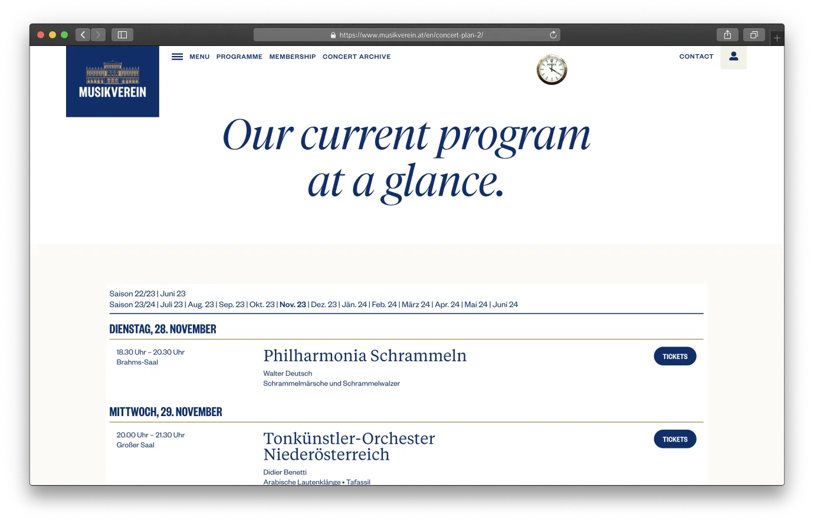
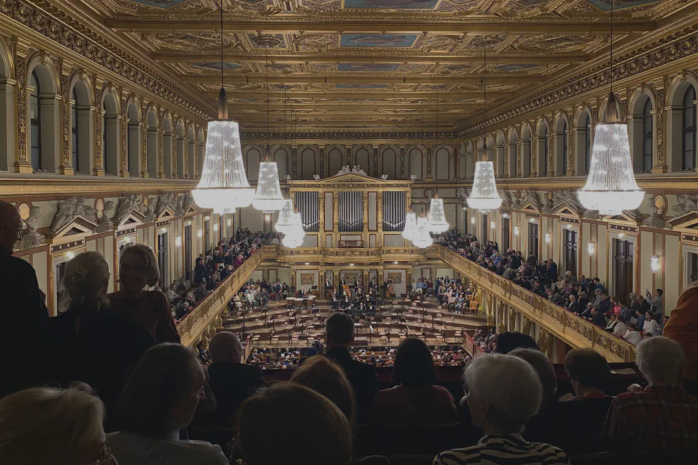
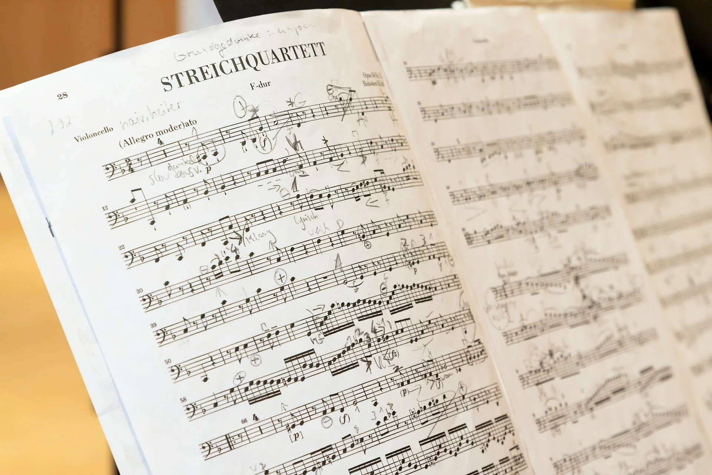
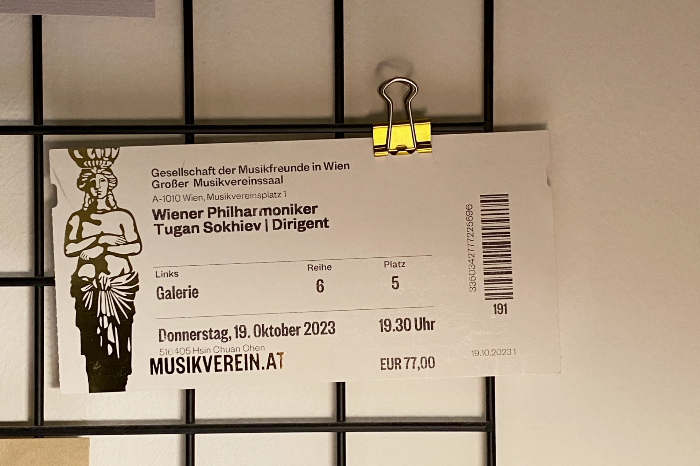


🔥 實用工具：[出國自由行行李清單，行前不再手忙腳亂（免費下載）](https://exittaiwan.gumroad.com/l/packing-list)


在維也納晚上沒事做？去聽一場莫札特音樂會，值得排進你的行程。就算你不是古典樂迷，光是坐在維也納的金色大廳裡，聽著《小夜曲》或《費加羅的婚禮》現場演奏，那種氛圍就已經很值回票價了。

莫札特音樂會幾乎每晚都有演出，曲目從莫札特的交響曲、協奏曲，到施特勞斯的《藍色多瑙河》都有，選擇很多，票價也還算親民。這篇文章帶你快速了解怎麼挑場次、在哪裡買票和取票，還有音樂會曲目的預習（雖然大部分你應該都聽過了！），到時候到了音樂會當下，你就能盡情享受音樂饗宴囉。

## 維也納莫札特音樂會演出日期

維也納莫札特音樂會的演出日期並不固定。

在非暑假（七、八月）期間，因為金色大廳幾乎都有維也納愛樂等等國際知名樂團的演出，所以偏觀光性質的莫札特音樂會能用金色大廳的日子就被壓縮很多。比較多場次會在館內的另一個廳，布拉姆斯廳上演。

不過如果你是在七、八月份來到維也納，這段期間就剛好是各個樂團放暑假的時候，也就代表莫札特音樂會幾乎每天都能使用金色大廳的場地，旅客可以選擇的場次就相對的非常多了。

要實際看哪天有演出的日子，可以直接到 Klook 的購票頁面，能買票的日期就是有演出的日期，非常直觀。

> Klook 中文購票連結：
> 
> ✔️ [**金色大廳演出日期：點選查看**](https://affiliate.klook.com/redirect?aid=41451&aff_adid=1258660&k_site=https%3A%2F%2Fwww.klook.com%2Fzh-TW%2Factivity%2F120397-mozart-concert-at-the-golden-hall-in-vienna%2F)
> 
> ✔️ [**布拉姆斯廳演出日期：點選查看**](https://affiliate.klook.com/redirect?aid=41451&aff_adid=1273104&k_site=https%3A%2F%2Fwww.klook.com%2Fzh-TW%2Factivity%2F120398-mozart-concert-at-the-brahms-hall-in-vienna%2F)

如果帶 5 ~ 18 歲的小孩，或是年紀 27 歲以下（28 歲生日前），持有 ISIC 國際學生證的學生，可以在[官網購票](https://mozartorchester.com/home_en.php)享有票價五折優惠。

---

## 維也納莫札特音樂會演出時間

不論是在布拉姆斯廳或是金色大廳，音樂會都是 20:15 開始，演出時長約一個小時四十五分鐘，大概在晚上十點結束。這個時間點[維也納市區的大眾交通工具](/posts/vienna-public-transportation-guide/)都還有在營運，就算不是住在老城區，要回飯店也完全不用擔心。

---

## 維也納莫札特音樂會演出地點

維也納莫札特音樂會的演出地點就在維也納音樂協會。在這棟建築裡面，有許多音樂廳，其中最知名的就是「[金色大廳](/posts/維也納金色大廳完全指南/)（德文：Goldener Saal）」囉！不過根據每個月份的演出安排，有些場次可能是安排在布拉姆斯廳（德文：Brahams-Saal）。

金色大廳內約有 1,700 個座位和 300 個站位，並標榜聲音效果在廳內的任何一個角落都一樣完美。布拉姆斯廳的規模相比於金色大廳小了許多，不過內部的裝潢毫不遜色。這個廳雖然大部分用於室內樂演出，但是當表演活動太多，無法安排於金色大廳演出時，就有可能用到這個場地。

- 地址：Musikvereinsplatz 1, 1010 Vienna（[Google Maps](https://www.google.com/maps/place/%E9%87%91%E8%89%B2%E5%A4%A7%E5%BB%B3/@48.2007972,16.3647574,15z/data=!4m6!3m5!1s0x476d079d51daeac7:0x82c12bc03731834f!8m2!3d48.200544!4d16.372359!16zL20vMDFwbDZx?entry=ttu)）
- 交通：地鐵 U1 或 U4 線搭到卡爾廣場（Karlsplatz）站，步行約五分鐘；路面電車 71 號搭到 Schwarzenbergplatz 站；公車 59A 搭到歌劇院，卡爾廣場（Oper, Karlsplatz）站或是 4A 搭到卡爾廣場（Karlsplatz）站
- 演出門票價格：€69 ~ €140+

> 推薦閱讀：
> 
> ✔️ [**維也納市區自由行交通攻略｜維也納交通核心區在哪裡？這篇文章告訴你**](https://exittaiwan.com/posts/vienna-public-transportation-guide/)
> 
> ✔️ [**維也納自由行旅遊全攻略｜維也納旅遊景點、交通、住宿懶人包**](https://exittaiwan.com/posts/vienna-travel-guide/)

---

## 維也納莫札特音樂會取票地點

買票之後，你會收到一張優惠券，現場憑券換票即可。取票有兩個選項，可以提前去換，省去當晚排隊的麻煩，也可以當晚演出開始前一個小時起到金色大廳的售票處取票。

||選項 1：提前領取（推薦）|選項 2：演出當晚領取|
|---|---|---|
|**時間**|任一天 09:30–18:00|演出前 1 小時（19:15）開放取票|
|**地點**|樂團辦公室|音樂協會售票處（Abendkasse）|
|**地址**|[Kärntner Str. 51, 1010 Vienna](https://maps.app.goo.gl/MZGgDpn2PLiCfL927)|[Musikvereinsplatz 1, 1010 Vienna](https://www.google.com/maps/place/%E9%87%91%E8%89%B2%E5%A4%A7%E5%BB%B3/@48.2007972,16.3647574,15z/data=!4m6!3m5!1s0x476d079d51daeac7:0x82c12bc03731834f!8m2!3d48.200544!4d16.372359!16zL20vMDFwbDZx?entry=ttu)|
|**備註**|避免當晚排隊，彈性高|適合臨時決定的旅人|

---

## 維也納莫札特音樂會曲目

以莫札特為主的選曲，包含歌劇、交響曲、小夜曲等等的精選段落。在結尾則是有約翰・史特勞斯的名曲藍色多瑙河和拉德茨基進行曲為這場音樂會收尾。

### 歌劇選曲

《唐·喬望尼》（Don Giovanni, Overture, K. 527）、《費加羅的婚禮》、《魔笛》等的序曲、詠嘆調與二重唱。

---

#### 《唐·喬望尼》（Don Giovanni, Overture, K. 527）



---

#### 《費加羅的婚禮》（Le nozze di Figaro – Ouvertüre）



---

#### 《魔笛》（Die Zauberflöte – Ouvertüre）



---

### 交響曲與小夜曲（選段）

《小夜曲》（Eine kleine Nachtmusik）、《第40號交響曲》、《第41號交響曲「朱彼特」》等。

---

#### 《小夜曲》（Eine kleine Nachtmusik）



---

#### 《第40號交響曲》



---

#### 《第41號交響曲「朱彼特」》



---

### 獨奏協奏曲

鋼琴、小提琴、長笛等獨奏協奏曲

---

### 史特勞斯名曲

#### 《藍色多瑙河》（An der schönen blauen Donau）
- 作曲家：小約翰·施特勞斯（Johann Strauss II）



---

#### 《拉德茨基進行曲》（Radetzky Marsch）
- 作曲家：老約翰·施特勞斯（Johann Strauss I）



---

## 維也納莫札特音樂會注意事項

1. 雖然沒有硬性規定，不過聽音樂會是一項優雅、端莊的活動，所以最好避免穿著拖鞋、短褲短裙、運動衫等等太過休閒的服裝。那要穿什麼？就把去音樂會當作是去一場約會吧！
2. 因安全考量，大衣、大型包包、雨傘等需寄放於衣物間，每件收費 1 歐元（現金支付）。
3. 演出有中間有 10 ~ 20 分鐘的中場休息，時間到前會響鈴提醒觀眾回到座位。
4. 演出前請記得將電子產品關機或調成靜音。
5. 演出進行中，禁止拍照和錄影。

> Klook 中文購票連結：
> 
> ✔️ [**金色大廳演出日期：點選查看**](https://affiliate.klook.com/redirect?aid=41451&aff_adid=1258660&k_site=https%3A%2F%2Fwww.klook.com%2Fzh-TW%2Factivity%2F120397-mozart-concert-at-the-golden-hall-in-vienna%2F)
> 
> ✔️ [**布拉姆斯廳演出日期：點選查看**](https://affiliate.klook.com/redirect?aid=41451&aff_adid=1273104&k_site=https%3A%2F%2Fwww.klook.com%2Fzh-TW%2Factivity%2F120398-mozart-concert-at-the-brahms-hall-in-vienna%2F)